## CSS 3D 基础知识

本文默认读者掌握一定的 CSS 3D 知识，能够绘制初步的 3D 动画效果。当然这里会再简单过一下 CSS 3D 的基础知识。

### 使用 transform-style 启用 3D 模式

要利用 CSS3 实现 3D 的效果，最主要的就是借助 `transform-style` 属性。`transform-style` 只有两个值可以选择：

```css
// 语法：
transform-style: flat|preserve-3d;

transform-style: flat; // 默认，子元素将不保留其 3D 位置
transform-style: preserve-3d; // 子元素将保留其 3D 位置。
```

当我们指定一个容器的 transform-style 的属性值为 preserve-3d 时，容器的后代元素便会具有 3D 效果，这样说有点抽象，也就是当前父容器设置了 preserve-3d 值后，它的子元素就可以相对于父元素所在的平面，进行 3D 变形操作。

### 利用 perspective & perspective-origin 设置 3D 视距，实现透视/景深效果

`perspective` 为一个元素设置三维透视的距离，仅作用于元素的后代，而不是其元素本身。

简单来说，当元素没有设置 `perspective` 时，也就是当 `perspective:none/0` 时所有后代元素被压缩在同一个二维平面上，不存在景深的效果。

而如果设置 `perspective` 后，将会看到三维的效果。

```css
// 语法
perspective: number|none;

// 语法
perspective-origin: x-axis y-axis;
// x-axis : 定义该视图在 x 轴上的位置。默认值：50%
// y-axis : 定义该视图在 y 轴上的位置。默认值：50%
```

而 `perspective-origin` 表示 3D 元素透视视角的基点位置，默认的透视视角中心在容器是 `perspective` 所在的元素，而不是他的后代元素的中点，也就是 `perspective-origin: 50% 50%`。

### 通过绘制 Webpack Logo 熟悉 CSS 3D

对于初次接触 CSS 3D 的同学而言，可以通过绘制正方体快速熟悉语法，了解规则。

而 Webpack 的 Logo，正是由 2 个 立方体组成：

[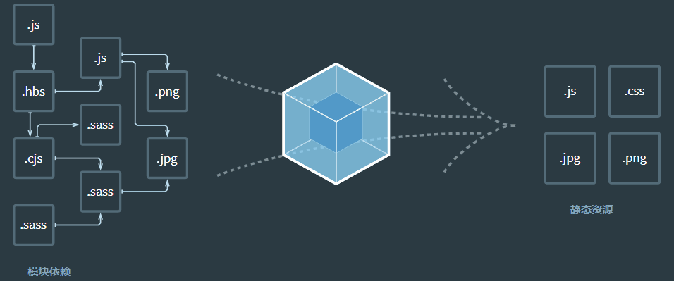](https://user-images.githubusercontent.com/8554143/129482805-ea8d1d4f-3db8-4bff-8d36-d14827dfe264.gif)

以其中一个正方体而言，实现它其实非常容易：

1. 一个正方体由 6 个面组成，所以首先设定一个父元素 div，然后这个 div 再包含 6 个子 div，同时，父元素设置 `transform-style: preserve-3d`；
2. 6 个子元素，依次首先旋转不同角度，再通过 `translateZ` 位移正方体长度的一半距离即可
3. 父元素可以通过 `transform` 和 `perspective` 调整视觉角度

以一个正方体为例子，简单的伪代码如下：

```html
<ul class="cube-inner">
  <li class="top"></li>
  <li class="bottom"></li>
  <li class="front"></li>
  <li class="back"></li>
  <li class="right"></li>
  <li class="left"></li>
</ul>
```

```scss
.cube {
  width: 100px;
  height: 100px;
  transform-style: preserve-3d;
  transform-origin: 50px 50px;
  transform: rotateX(-33.5deg) rotateY(45deg);

  li {
    position: absolute;
    top: 0;
    left: 0;
    width: 100px;
    height: 100px;
    background: rgba(141, 214, 249);
    border: 1px solid #fff;
  }
  .top {
    transform: rotateX(90deg) translateZ(50px);
  }
  .bottom {
    transform: rotateX(-90deg) translateZ(50px);
  }
  .front {
    transform: translateZ(50px);
  }
  .back {
    transform: rotateX(-180deg) translateZ(50px);
  }
  .left {
    transform: rotateY(-90deg) translateZ(50px);
  }
  .right {
    transform: rotateY(90deg) translateZ(50px);
  }
}
```

叠加两个，调整颜色和透明度，我们可以非常轻松的实现 Webpack 的 LOGO：

[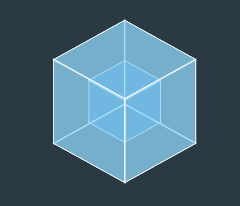](https://user-images.githubusercontent.com/8554143/129483233-cc7eda2b-ab9c-49ed-9888-9a69ec58a005.gif)

当然，这里的 LOGO 为了保证每条线条视觉上的一致性，其实是没有设置景深效果 `perspective` 的，我们可以尝试给顶层父容器添加一下如下代码，通过 `transform` 和 `perspective` 调整视觉角度，设置景深效果：

```css
.father {
  transform-style: preserve-3d;
  perspective: 200px;
  transform: rotateX(10deg);
}
```

就可以得到真正的 3D 效果，感受很不一样：

<iframe height="300" style="width: 100%;" scrolling="no" title="Webpack logo" src="https://codepen.io/mafqla/embed/RwdmXKZ?default-tab=html%2Cresult&editable=true&theme-id=light" frameborder="no" loading="lazy" allowtransparency="true" allowfullscreen="true">
  See the Pen <a href="https://codepen.io/mafqla/pen/RwdmXKZ">
  Webpack logo</a> by mafqla (<a href="https://codepen.io/mafqla">@mafqla</a>)
  on <a href="https://codepen.io">CodePen</a>.
</iframe>

---

## 实现文字的 3D 效果

首先，看看一些有意思的 CSS 3D 文字特效。

要实现文字的 3D 效果，看起来是立体的，通常的方式就是叠加多层。

下面有一些实现一个文字的 3D 效果的方式。

假设我们有如下结构：

```html
<div class="g-container">
  <p>Lorem ipsum</p>
</div>
```

如果什么都不加，文字的展示可能是这样的：

[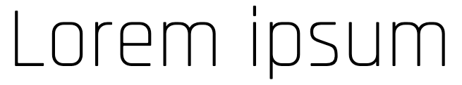](https://user-images.githubusercontent.com/8554143/129896052-5dc4a345-dc8d-44ee-b024-fbbf9c910627.png)

我们可以通过叠加阴影多层，营造 3D 的感觉，主要是合理控制阴影的距离及颜色，核心 CSS 代码如下：

```css
p {
  text-shadow: 4px 4px 0 rgba(0, 0, 0, 0.8), 8px 8px 0 rgba(0, 0, 0, 0.6),
    12px 12px 0 rgba(0, 0, 0, 0.4), 16px 16px 0 rgba(0, 0, 0, 0.2),
    20px 20px 0 rgba(0, 0, 0, 0.05);
}
```

[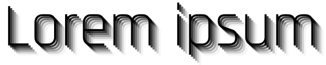](https://user-images.githubusercontent.com/8554143/129896286-a07a33ea-ac39-434b-882b-3bd570de87aa.png)

这样，就有了基础的 3D 视觉效果。

### 3D 氖灯文字效果

基于此，我们可以实现一些 3D 文字效果，来看一个 3D 氖灯文字效果，核心就是：

- 利用 `text-shadow` 叠加多层文字阴影
- 利用 animation 动态改变阴影颜色

```html
<div class="container">
  <p class="a">CSS 3D</p>
  <p class="b">NEON</p>
  <p class="a">EFFECT</p>
</div>
```

核心 CSS 代码：

```css
.container {
  transform: rotateX(25deg) rotateY(-25deg);
}
.a {
  color: #88e;
  text-shadow: 0 0 0.3em rgba(200, 200, 255, 0.3), 0.04em 0.04em 0 #112,
    0.045em 0.045em 0 #88e, 0.09em 0.09em 0 #112, 0.095em 0.095em 0 #66c, 0.14em
      0.14em 0 #112, 0.145em 0.145em 0 #44a;
  animation: pulsea 300ms ease infinite alternate;
}
.b {
  color: #f99;
  text-shadow: 0 0 0.3em rgba(255, 100, 200, 0.3), 0.04em 0.04em 0 #112,
    0.045em 0.045em 0 #f99, 0.09em 0.09em 0 #112, 0.095em 0.095em 0 #b66, 0.14em
      0.14em 0 #112, 0.145em 0.145em 0 #a44;
  animation: pulseb 300ms ease infinite alternate;
}
@keyframes pulsea {
  // ... 阴影颜色变化
}
@keyframes pulseb {
  // ... 阴影颜色变化
}
```

可以得到如下效果：

<iframe height="300" style="width: 100%;" scrolling="no" title="Neon Effect 3D TEXT" src="https://codepen.io/mafqla/embed/KKELOaJ?default-tab=html%2Cresult&editable=true&theme-id=light" frameborder="no" loading="lazy" allowtransparency="true" allowfullscreen="true">
  See the Pen <a href="https://codepen.io/mafqla/pen/KKELOaJ">
  Neon Effect 3D TEXT</a> by mafqla (<a href="https://codepen.io/mafqla">@mafqla</a>)
  on <a href="https://codepen.io">CodePen</a>.
</iframe>

### 利用 CSS 3D 配合 translateZ 实现真正的文字 3D 效果

当然，上述第一种技巧其实没有运用 CSS 3D。下面我们使用 CSS 3D 配合 translateZ 再进一步。

假设有如下结构：

```html
<div>
  <h1>Glowing 3D TEXT</h1>
  <h1>Glowing 3D TEXT</h1>
  <h1>Glowing 3D TEXT</h1>
  <h1>Glowing 3D TEXT</h1>
  <h1>Glowing 3D TEXT</h1>
  <h1>Glowing 3D TEXT</h1>
  <h1>Glowing 3D TEXT</h1>
  <h1>Glowing 3D TEXT</h1>
  <h1>Glowing 3D TEXT</h1>
  <h1>Glowing 3D TEXT</h1>
</div>
```

我们通过给父元素 `div` 设置 `transform-style: preserve-3d`，给每个 `<h1>` 设定不同的 `translateZ()` 来达到文字的 3D 效果:

```css
div {
  transform-style: preserve-3d;
}
h1:nth-child(2) {
  transform: translateZ(5px);
}
h1:nth-child(3) {
  transform: translateZ(10px);
}
h1:nth-child(4) {
  transform: translateZ(15px);
}
h1:nth-child(5) {
  transform: translateZ(20px);
}
h1:nth-child(6) {
  transform: translateZ(25px);
}
h1:nth-child(7) {
  transform: translateZ(30px);
}
h1:nth-child(8) {
  transform: translateZ(35px);
}
h1:nth-child(9) {
  transform: translateZ(40px);
}
h1:nth-child(10) {
  transform: translateZ(45px);
}
```

当然，辅助一些旋转，色彩变化，就可以得到更纯粹一些 3D 文字效果：

<iframe height="300" style="width: 100%;" scrolling="no" title="Glowing 3D  TEXT" src="https://codepen.io/mafqla/embed/MWxdNJM?default-tab=html%2Cresult&editable=true&theme-id=light" frameborder="no" loading="lazy" allowtransparency="true" allowfullscreen="true">
  See the Pen <a href="https://codepen.io/mafqla/pen/MWxdNJM">
  Glowing 3D  TEXT</a> by mafqla (<a href="https://codepen.io/mafqla">@mafqla</a>)
  on <a href="https://codepen.io">CodePen</a>.
</iframe>

### 利用距离、角度及光影构建不一样的 3D 效果

还有一种很有意思的技巧，制作的过程需要比较多的调试。

合理的利用距离、角度及光影构建出不一样的 3D 效果。看看下面这个例子，只是简单是设置了三层字符，让它们在 Z 轴上相距一定的距离。

简单的伪代码如下：

```html
<div>
  <span class="C">C</span>
  <span class="S">S</span>
  <span class="S">S</span>
  <span></span>
  <span class="3">3</span>
  <span class="D">D</span>
</div>
```

```scss
$bright: #afa695;
$gold: #867862;
$dark: #746853;
$duration: 10s;
div {
  perspective: 2000px;
  transform-style: preserve-3d;
  animation: fade $duration infinite;
}
span {
  transform-style: preserve-3d;
  transform: rotateY(25deg);
  animation: rotate $duration infinite ease-in;

  &:after,
  &:before {
    content: attr(class);
    color: $gold;
    z-index: -1;
    animation: shadow $duration infinite;
  }
  &:after {
    transform: translateZ(-16px);
  }
  &:before {
    transform: translateZ(-8px);
  }
}
@keyframes fade {
  // 透明度变化
}
@keyframes rotate {
  // 字体旋转
}
@keyframes shadow {
  // 字体颜色变化
}
```

简单捋一下，上述代码的核心就是：

1. 父元素、子元素设置 `transform-style: preserve-3d`
2. 用 `span` 元素的两个伪元素复制两个相同的字，利用 `translateZ()` 让它们在 Z 轴间隔一定距离
3. 添加简单的旋转、透明度、字体颜色变化

可以得到这样一种类似电影开片的标题 3D 动画，其实只有 3 层元素，但是由于角度恰当，视觉上的衔接比较完美，看上去就非常的 3D。

[](https://user-images.githubusercontent.com/8554143/129924158-e393ea7d-5642-4528-9be7-26e68becd660.gif)

为什么上面说需要合理的利用距离、角度及光影呢？

还是同一个动画效果，如果动画的初始旋转角度设置的稍微大一点，整个效果就会穿帮：

[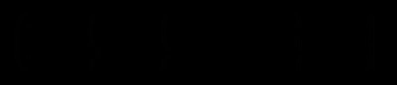](https://user-images.githubusercontent.com/8554143/129924828-144a5faf-1aca-432c-a11f-ad0b34470f42.gif)

可以看到，在前几帧，能看出来简单的分层结构。又或者，简单调整一下 `perspective`，设置父容器的 `perspective` 由 `2000px` 改为 `500px`，穿帮效果更为明显：

[](https://user-images.githubusercontent.com/8554143/129925324-717d8916-f243-4255-9a34-3a9ccd867381.gif)

也就是说，在恰当的距离，合适的角度，我们仅仅通过很少的元素，就能在视觉上形成比较不错的 3D 效果。

<iframe height="300" style="width: 100%;" scrolling="no" title="CSS 3D TEXT" src="https://codepen.io/mafqla/embed/NWJVQgO?default-tab=html%2Cresult&editable=true&theme-id=light" frameborder="no" loading="lazy" allowtransparency="true" allowfullscreen="true">
  See the Pen <a href="https://codepen.io/mafqla/pen/NWJVQgO">
  CSS 3D TEXT</a> by mafqla (<a href="https://codepen.io/mafqla">@mafqla</a>)
  on <a href="https://codepen.io">CodePen</a>.
</iframe>

### 3D 计数器

当然，发挥想象，我们还可以利用 3D 文字效果，制作出非常多有意思的效果。

譬如这个，我之前运用在我们业务的可视化看板项目中的 3D 计数器：

[](https://user-images.githubusercontent.com/8554143/129929228-fb39300b-a9ea-48e5-a9ae-ba2e77b70d43.gif)

代码比较长，就不贴出来了，但是也是使用纯 CSS 可以实现的效果。

完整的代码，你可以猛击这里 [CSS 灵感 -- 3D 数字计数动画](https://csscoco.com/inspiration/#/./3d/3d-count-number)

## 空间效果

嗯，上述章节主要是关于文字的 3D 效果，下面我们继续探寻 3D 在营造空间效果上的神奇之处。

优秀的 3D 效果，能让人有一种身临其境的感觉，都说 CSS 3D 其实作用有限，能做的不多，但是不代表它不能实现酷炫逼真的效果。

要营造逼真的 3D 效果，关键是恰当好处的运用 `perspective` 属性。

简单掌握原理，我们也可以很轻松的利用 CSS 3D 绘制一些非常有空间美感的效果。

这里我带领大家快速绘制一副具有空间美感的 CSS 3D 作品。

### 空间 3D 效果热身

首先，我们借助 Grid/Flex 等布局，在屏幕上布满格子（item），随意点就好：

```html
<ul class="g-container">
  <li></li>
  <li></li>
  // ... 很多子 li
  <li></li>
</ul>
```

> 初始背景色为黑色，每个 item 填充为白色

[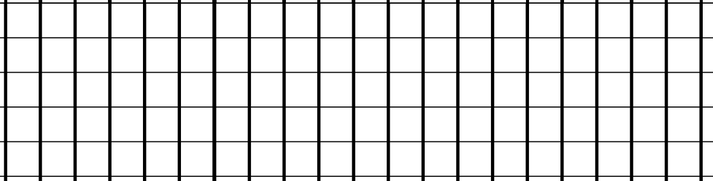](https://user-images.githubusercontent.com/8554143/130071221-523eb632-0be7-4a81-b3a7-00d38a2817af.png)

接着，改变下每个 item 的形状，让他变成长条形的，可以改变通过改变 item 宽度，使用渐变填充部分等等方式：

[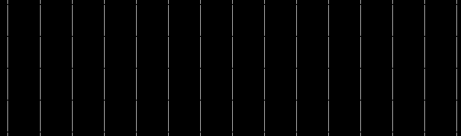](https://user-images.githubusercontent.com/8554143/130071967-d1cfbdb5-41c1-485f-86eb-e6c269173aff.png)

接下来，父容器设置 `transform-style: preserve-3d` 和 `perspective`，子元素设置 `transform: rotateX(45deg)`，神奇的事情就发生了：

[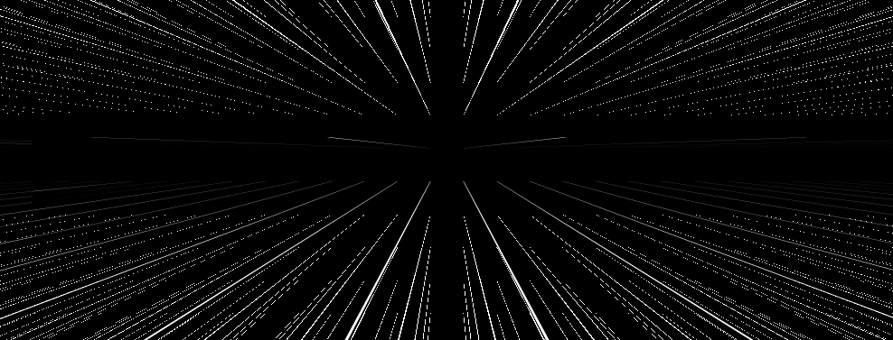](https://user-images.githubusercontent.com/8554143/130072606-db0e6aea-8d26-4ebe-a966-55bf79b23431.png)

Wow，仅仅 3 步，我们就初步得到了一副具有空间美感的图形，让我们再回到每个子 item 的颜色设置，给它们随机填充不同的颜色，并且加上一个 `transform: translate3d()` 的动画，一个简单的 CSS 3D 作品就绘制完成了：

[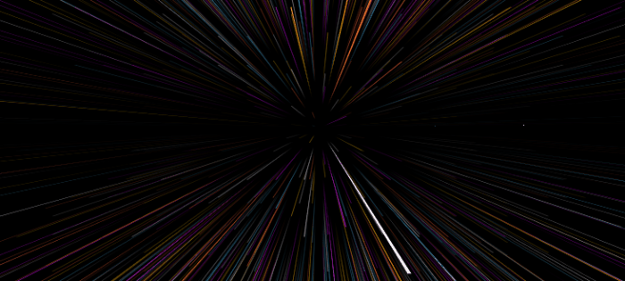](https://user-images.githubusercontent.com/8554143/130097323-3907beaa-97e3-4c18-96c7-15d31e3807cb.gif)

基于这个技巧的变形和延伸，我们就可以绘制非常多类似的效果。

在这里，我再次推荐 [CSS-Doodle](https://css-doodle.com/) 这个工具，它可以帮助我们快速的创造复杂 CSS 效果。

> CSS-doodle 是一个基于 Web-Component 的库。允许我们快速的创建基于 CSS Grid 布局的页面，以实现各种 CSS 效果（或许可以称之为 CSS 艺术）。

我们可以把上述的线条切换成圆弧：

[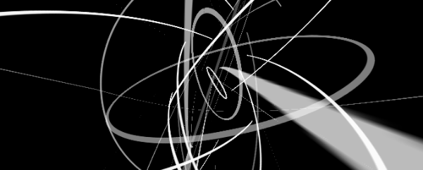](https://user-images.githubusercontent.com/8554143/130098863-6501683a-9e21-4b0f-bcca-228f153fed56.gif)

完整的代码可以戳这里，利用 CSS-Doodle 也就几十行：[CodePen Demo - CSS-Doodle Random Circle](https://codepen.io/Chokcoco/pen/MWyJZQY)

又譬如袁川老师创作的 [Seeding](https://codepen.io/yuanchuan/pen/ZqbVVL)：

[](https://user-images.githubusercontent.com/8554143/130098300-8579ca1c-8f9e-47ca-beb9-4bfdd9ee2c22.gif)

### 利用图片素材

当然，基于上述技巧，有的时候会认为利用 CSS 绘制一些线条、圆弧、方块比较麻烦。可以进一步尝试利用现有的素材基于 CSS 3D 进行二次创作，这里有一个非常有意思的技巧。

假设我们有这样一张图形：

[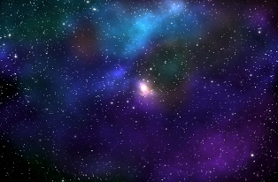](https://user-images.githubusercontent.com/8554143/130310578-30627cb7-77d7-4333-a27a-7f7aa911d6c5.png)

这张图先放着备用。在使用这张图之前，我们会先绘制这样一个图形：

```html
<div class="g-container">
  <div class="g-group">
    <div class="item item-right"></div>
    <div class="item item-left"></div>
    <div class="item item-top"></div>
    <div class="item item-bottom"></div>
    <div class="item item-middle"></div>
  </div>
</div>
```

```css
body {
  background: #000;
}
.g-container {
  position: relative;
}
.g-group {
  position: absolute;
  width: 100px;
  height: 100px;
  left: -50px;
  top: -50px;
  transform-style: preserve-3d;
}
.item {
  position: absolute;
  width: 100%;
  height: 100%;
  background: rgba(255, 255, 255, 0.5);
}
.item-right {
  background: red;
  transform: rotateY(90deg) translateZ(50px);
}
.item-left {
  background: green;
  transform: rotateY(-90deg) translateZ(50px);
}
.item-top {
  background: blue;
  transform: rotateX(90deg) translateZ(50px);
}
.item-bottom {
  background: deeppink;
  transform: rotateX(-90deg) translateZ(50px);
}
.item-middle {
  background: rgba(255, 255, 255, 0.5);
  transform: rotateX(180deg) translateZ(50px);
}
```

一共设置了 5 个子元素，不过仔细看 CSS 代码，其中 4 个子元素都设置了 `rotateX/Y(90deg/-90deg)`，也就是绕 X 轴或者 Y 轴旋转了 90°，在视觉上是垂直屏幕的一张平面，所以直观视觉上我们是不到的，只能看到一个平面 `.item-middle`。

我将 5 个子 item 设置了不同的背景色，结果如下：

[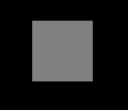](https://user-images.githubusercontent.com/8554143/130310541-d9205a5c-cd7f-40d4-891c-55f284242eff.png)

现在看来，好像平平无奇，确实也是。

不过，见证奇迹的时候来了，此时，我们给父元素 `.g-container` 设置一个极小的 `perspective`，譬如，设置一个 `perspective: 4px`，看看效果：

```css
.g-container {
  position: relative;
+ perspective: 4px;
}
// ...其余样式保持不变
```

此时，画风骤变，整个效果就变成了这样：

[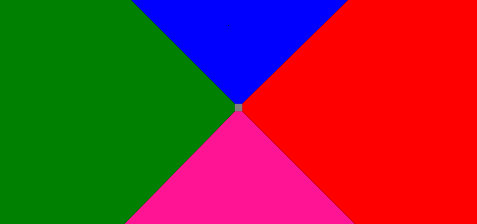](https://user-images.githubusercontent.com/8554143/130310721-677e23df-61a1-4169-b0cc-427e26497159.png)

由于 `perspective` 生效，原本的平面效果变成了 3D 的效果。接下来，我们使用上面准备好的星空图，替换一下上面的背景颜色，全部都换成同一张图，神奇的事情发生了：

[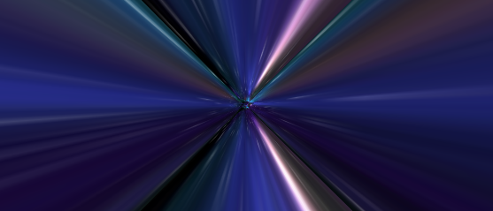](https://user-images.githubusercontent.com/8554143/130324531-73948c83-aa87-4d4f-87e1-fe2bb055dc74.png)

由于设置的 `perspective` 非常之下，而每个 item 的 `transform: translateZ(50px)` 设置的又比较大，所以图片在视觉上被拉伸的非常厉害。但是整体是充满整个屏幕的。

接下来，我们只需要让视角动起来，给父元素增加一个动画，通过控制父元素的 `translateZ()` 进行变化即可：

```css
.g-container{
  position: relative;
  perspective: 4px;
  perspective-origin: 50% 50%;
}

.g-group{
  position: absolute;
  // ... 一些定位高宽代码
  transform-style: preserve-3d;
  + animation: move 8s infinite linear;
}

@keyframes move {
  0%{
    transform: translateZ(-50px) rotate(0deg);
  }
  100%{
    transform: translateZ(50px) rotate(0deg);
  }
}
```

看看，神奇美妙的星空穿梭的效果就出来了，Amazing：

[](https://user-images.githubusercontent.com/8554143/130324868-f895a45e-a74d-44e4-8f1f-043e258507c7.gif)

美中不足之处在于，动画没能无限衔接上，开头和结尾都有很大的问题。

当然，这难不倒我们，我们可以：

1. 通过叠加两组同样的效果，一组比另一组通过负的 `animation-delay` 提前行进，使两组动画衔接起来（一组结束的时候另外一组还在行进中）
2. 再通过透明度的变化，隐藏掉 `item-middle` 迎面飞来的突兀感
3. 最后，可以通过父元素的滤镜 `hue-rotate` 控制图片的颜色变化

我们尝试修改 HTML 结构如下：

```html
<div class="g-container">
  <div class="g-group">
    <div class="item item-right"></div>
    <div class="item item-left"></div>
    <div class="item item-top"></div>
    <div class="item item-bottom"></div>
    <div class="item item-middle"></div>
  </div>
  <!-- 增加一组动画 -->
  <div class="g-group">
    <div class="item item-right"></div>
    <div class="item item-left"></div>
    <div class="item item-top"></div>
    <div class="item item-bottom"></div>
    <div class="item item-middle"></div>
  </div>
</div>
```

修改后的核心 CSS 如下：

```css
.g-container {
  perspective: 4px;
  position: relative;
  // hue-rotate 变化动画，可以让图片颜色一直变换
  animation: hueRotate 21s infinite linear;
}

.g-group {
  transform-style: preserve-3d;
  animation: move 12s infinite linear;
}
// 设置负的 animation-delay，让第二组动画提前进行
.g-group:nth-child(2) {
  animation: move 12s infinite linear;
  animation-delay: -6s;
}
.item {
  background: url(https://z3.ax1x.com/2021/08/20/fLwuMd.jpg);
  background-size: cover;
  opacity: 1;
  // 子元素的透明度变化，减少动画衔接时候的突兀感
  animation: fade 12s infinite linear;
  animation-delay: 0;
}
.g-group:nth-child(2) .item {
  animation-delay: -6s;
}
@keyframes move {
  0% {
    transform: translateZ(-500px) rotate(0deg);
  }
  100% {
    transform: translateZ(500px) rotate(0deg);
  }
}
@keyframes fade {
  0% {
    opacity: 0;
  }
  25%,
  60% {
    opacity: 1;
  }
  100% {
    opacity: 0;
  }
}
@keyframes hueRotate {
  0% {
    filter: hue-rotate(0);
  }
  100% {
    filter: hue-rotate(360deg);
  }
}
```

最终完整的效果如下，星空穿梭的效果，整个动画首尾相连，可以一直无限下去，几乎没有破绽，非常的赞：

[](https://user-images.githubusercontent.com/8554143/130325052-c98c7552-c4eb-496d-84bc-6dd1c6f887e0.gif)

<iframe height="300" style="width: 100%;" scrolling="no" title="Pure CSS Galaxy  Shuttle" src="https://codepen.io/mafqla/embed/Yzgbmxx?default-tab=html%2Cresult&editable=true&theme-id=light" frameborder="no" loading="lazy" allowtransparency="true" allowfullscreen="true">
  See the Pen <a href="https://codepen.io/mafqla/pen/Yzgbmxx">
  Pure CSS Galaxy  Shuttle</a> by mafqla (<a href="https://codepen.io/mafqla">@mafqla</a>)
  on <a href="https://codepen.io">CodePen</a>.
</iframe>

### 3D 无限延伸视角动画

OK，当掌握了上述技巧之后，我们可以很容易的对其继续变形发散，实现各种各样的无限延伸的 3D 视角动画。

这里还有一个非常有意思的运用了类似技巧的动画：

[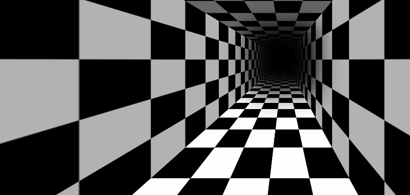](https://user-images.githubusercontent.com/8554143/130341829-93bee21c-c7bd-46fd-9abc-f6198d1b1d39.gif)

原理与上述的星空穿梭大致相同，4 面墙的背景图使用 CSS 渐变可以很轻松的绘制出来，接下来就只是需要考虑如何让动画能无限循环下去，控制好首尾的衔接。

该效果最早见于 [jkantner](https://codepen.io/jkantner/pen/zXwyGr) 的 CodePen，在此基础上我对其进行了完善和丰富，

<iframe height="300" style="width: 100%;" scrolling="no" title="Perspective Origin Tunnel Animation" src="https://codepen.io/mafqla/embed/OJqYKjE?default-tab=html%2Cresult&editable=true&theme-id=light" frameborder="no" loading="lazy" allowtransparency="true" allowfullscreen="true">
  See the Pen <a href="https://codepen.io/mafqla/pen/OJqYKjE">
  Perspective Origin Tunnel Animation</a> by mafqla (<a href="https://codepen.io/mafqla">@mafqla</a>)
  on <a href="https://codepen.io">CodePen</a>.
</iframe>

## 视差效果

由于 CSS 3D 的特性，它天生就非常适合拿来制作一些视差效果。

本章节的内容之前在我的另外一篇文章，也有过一些讨论 -- [CSS 实现视差效果](https://github.com/chokcoco/iCSS/issues/37)

原理就是：

1. 我们给容器设置上 `transform-style: preserve-3d` 和 `perspective: [x]px`，那么处于这个容器的子元素就将位于 3D 空间中，
2. 再给子元素设置不同的 `transform: translateZ()`，这个时候，不同元素在 3D Z 轴方向距离屏幕（我们的眼睛）的距离也就不一样
3. 滚动滚动条，由于子元素设置了不同的 `transform: translateZ()`，那么他们滚动的上下距离 `translateY` 相对屏幕（我们的眼睛），也是不一样的，这就达到了滚动视差的效果。

核心代码表示就是：

```html
<div class="g-container">
  <div class="section-one">translateZ(-1)</div>
  <div class="section-two">translateZ(-2)</div>
  <div class="section-three">translateZ(-3)</div>
</div>
```

```css
html {
  height: 100%;
  overflow: hidden;
}

body {
  perspective: 1px;
  transform-style: preserve-3d;
  height: 100%;
  overflow-y: scroll;
  overflow-x: hidden;
}

.g-container {
  height: 150%;

  .section-one {
    transform: translateZ(-1px);
  }
  .section-two {
    transform: translateZ(-2px);
  }
  .section-three {
    transform: translateZ(-3px);
  }
}
```

总结就是父元素设置 `transform-style: preserve-3d` 和 `perspective: 1px`，子元素设置不同的 `transform: translateZ`，滚动滚动条，效果如下：

<iframe height="300" style="width: 100%;" scrolling="no" title="CSS 3D parallax" src="https://codepen.io/mafqla/embed/ZEPNgXz?default-tab=html%2Cresult&editable=true&theme-id=light" frameborder="no" loading="lazy" allowtransparency="true" allowfullscreen="true">
  See the Pen <a href="https://codepen.io/mafqla/pen/ZEPNgXz">
  CSS 3D parallax</a> by mafqla (<a href="https://codepen.io/mafqla">@mafqla</a>)
  on <a href="https://codepen.io">CodePen</a>.
</iframe>

很明显，当滚动滚动条时，不同子元素的位移程度从视觉上看是不一样的，也就达到了所谓的滚动视差效果。

### 滚动视差文字阴影/虚影效果/多图展示

那么，运用 translate3d 的视差效果，又能有一些什么好玩的效果呢？下面这个滚动视差文字阴影/虚影效果很有意思：

<iframe height="300" style="width: 100%;" scrolling="no" title="CSS translate3d Parallax" src="https://codepen.io/mafqla/embed/XWGwveb?default-tab=html%2Cresult&editable=true&theme-id=light" frameborder="no" loading="lazy" allowtransparency="true" allowfullscreen="true">
  See the Pen <a href="https://codepen.io/mafqla/pen/XWGwveb">
  CSS translate3d Parallax</a> by mafqla (<a href="https://codepen.io/mafqla">@mafqla</a>)
  on <a href="https://codepen.io">CodePen</a>.
</iframe>

另外一种就是我们可以把这个技巧运用到类似个人主页，图片展示等一些大屏场景下。

核心就是给每张图片设置不同的 `translateZ`，给父元素设置一个 `persepective` 即可，这样，在上下滚动的过程中，就能出现简单的视差效果：

<iframe height="300" style="width: 100%;" scrolling="no" title="CSS Scroll Parallax Effect " src="https://codepen.io/mafqla/embed/abMreLN?default-tab=html%2Cresult&editable=true&theme-id=light" frameborder="no" loading="lazy" allowtransparency="true" allowfullscreen="true">
  See the Pen <a href="https://codepen.io/mafqla/pen/abMreLN">
  CSS Scroll Parallax Effect </a> by mafqla (<a href="https://codepen.io/mafqla">@mafqla</a>)
  on <a href="https://codepen.io">CodePen</a>.
</iframe>

同理，这个滚动视差不仅仅可以作用于上下的滚动，对于左右方向的滚动也是同样生效的：

<iframe height="300" style="width: 100%;" scrolling="no" title="CSS-Only Horizontal Parallax Gallery" src="https://codepen.io/mafqla/embed/JjzqgrR?default-tab=html%2Cresult&editable=true&theme-id=light" frameborder="no" loading="lazy" allowtransparency="true" allowfullscreen="true">
  See the Pen <a href="https://codepen.io/mafqla/pen/JjzqgrR">
  CSS-Only Horizontal Parallax Gallery</a> by mafqla (<a href="https://codepen.io/mafqla">@mafqla</a>)
  on <a href="https://codepen.io">CodePen</a>.
</iframe>

## 其他实用场景介绍

在这一章节，会介绍一些有趣的，可以落地的 3D 效果或者动画。

### 404 Rolling Box

其核心就在于在一个 CSS 3D 立方体的基础上：

1. 添加立方体的滚动动画
2. 控制下落的缓动函数，及落地的震荡动画（为了效果更为逼真，运用了设计动画中的预备动作、跟随和重叠动画等技巧）
3. 控制立方体及地面数字画面的平移
4. 控制动画的无限循环

整体制作还是非常有难度的，但是用在自己的 404 页面，确实也是非常的酷炫。这个效果，我最早见于 [Yusuke Nakaya](https://codepen.io/YusukeNakaya) 大神，完整的代码你可以戳这里

<iframe height="300" style="width: 100%;" scrolling="no" title="Only CSS: 404 Rolling Box" src="https://codepen.io/mafqla/embed/dyrExVW?default-tab=html%2Cresult&editable=true&theme-id=light" frameborder="no" loading="lazy" allowtransparency="true" allowfullscreen="true">
  See the Pen <a href="https://codepen.io/mafqla/pen/dyrExVW">
  Only CSS: 404 Rolling Box</a> by mafqla (<a href="https://codepen.io/mafqla">@mafqla</a>)
  on <a href="https://codepen.io">CodePen</a>.
</iframe>

### 立方体进度条

嗯，下面这个还是借助了立方体。我们来实现一个立方体进度条~

首先，实现一个立方体，结构如下：

```html
<div class="demo-cube perspective">
  <ul class="cube">
    <li class="top"></li>
    <li class="bottom"></li>
    <li class="front"></li>
    <li class="back"></li>
    <li class="right"></li>
    <li class="left"></li>
  </ul>
</div>
```

[](https://user-images.githubusercontent.com/8554143/130393683-7b457377-7e38-4b82-ba39-1625b5f1418e.png)

我们可以把这个立方体想象成一个立体的进度条容器，通过控制 6 面的颜色，我们可以巧妙的得到一种 3D 进度条效果。

当然，其实我们不需要那么多面，4 个面即可，去掉左右，然后利用渐变修改一下立方体各个面的颜色，去掉 border，核心的 CSS 代码如下：

```scss
.demo-cube {
  position: relative;

  .cube {
    position: absolute;
    top: 50%;
    left: 50%;
    width: 300px;
    height: 100px;
    transform-style: preserve-3d;
    transform: translate(-50%, -50%) rotateX(-33.5deg);

    li {
      position: absolute;
      width: 300px;
      height: 100px;
      background: linear-gradient(
        90deg,
        rgba(156, 39, 176, 0.3),
        rgba(255, 34, 109, 0.8) 70%,
        rgba(255, 255, 255, 0.6) 70%,
        rgba(255, 255, 255, 0.6)
      );
    }
    .top {
      transform: rotateX(90deg) translateZ(50px);
    }
    .bottom {
      transform: rotateX(-90deg) translateZ(50px);
    }
    .front {
      transform: translateZ(50px);
    }
    .back {
      transform: rotateX(-180deg) translateZ(50px);
    }
  }
}
```

我们就可以得到一个非常酷炫的 3D 进度条效果：

[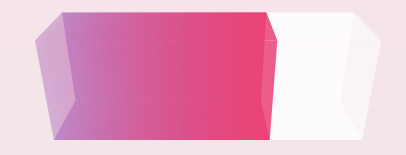](https://user-images.githubusercontent.com/8554143/130445668-eb817128-d055-4dcb-a73e-37376cc7a48f.png)

#### 利用 CSS Property 给 3D 进度条加上动画

当然，进度条嘛，它需要一个填充动画。由于我们使用的是渐变实现的进度条的进度，需要去控制其中的颜色百分比变化。

而正常而言，CSS 是不支持渐变的动画的，不过这也难不倒我们，因为我们可以使用 CSS [@Property](https://github.com/Property) 。

简单改造一下代码：

```css
@property --per {
  syntax: '<percentage>';
  inherits: false;
  initial-value: 0%;
}

.demo-cube .cube {
  .top,
  .front,
  .bottom,
  .back {
    background: linear-gradient(
      90deg,
      rgba(255, 217, 34, 0.6),
      rgba(255, 34, 109, 0.8) var(--per),
      rgba(255, 34, 109, 0.1) var(--per),
      rgba(255, 34, 109, 0.1)
    );
    animation: perChange 6s infinite;
  }
}

@keyframes perChange {
  0% {
    --per: 0%;
  }
  90%,
  to {
    --per: 80%;
  }
}
```

这样，我们就实现了一个会动的 3D 进度条，只需要控制 `--per` CSS 自定义属性即可，效果如下：

<iframe height="300" style="width: 100%;" scrolling="no" title="Pure CSS 3D Progress Bar" src="https://codepen.io/mafqla/embed/xxBNvPO?default-tab=html%2Cresult&editable=true&theme-id=light" frameborder="no" loading="lazy" allowtransparency="true" allowfullscreen="true">
  See the Pen <a href="https://codepen.io/mafqla/pen/xxBNvPO">
  Pure CSS 3D Progress Bar</a> by mafqla (<a href="https://codepen.io/mafqla">@mafqla</a>)
  on <a href="https://codepen.io">CodePen</a>.
</iframe>

> 对于 CSS [@Property](https://github.com/Property) 不算很了解的，可以看看作者的这篇文章 -- [CSS @property，让不可能变可能](https://github.com/chokcoco/iCSS/issues/109)，它的出现，让 CSS 极大的提升了制作各种动画的能力。
