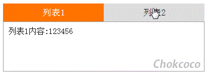

## 8、纯 CSS 的导航栏 Tab 切换方案

不用 `Javascript`，使用纯 `CSS` 方案，实现类似下图的导航栏切换：



CSS 的强大之处有的时候超乎我们的想象，Tab 切换，常规而言确实需要用到一定的脚本才能实现。下面看看如何使用 CSS 完成同样的事情。

实现 Tab 切换的难点在于如何使用 CSS 接收到用户的点击事情并对相关的节点进行操作。即是：

1. 如何接收点击事件
2. 如何操作相关 DOM

下面看看如何使用两种不同的方法实现需求：

### 法一：`:target` 伪类选择器

首先，我们要解决的问题是`如何接收点击事件`，这里第一种方法我们采用 `:target` 伪类接收。

> `:target` 是 CSS3 新增的一个伪类，可用于选取当前活动的目标元素。当然 URL 末尾带有锚名称 #，就可以指向文档内某个具体的元素。这个被链接的元素就是目标元素(target element)。它需要一个 id 去匹配文档中的 target 。

解释很难理解，看看实际的使用情况，假设我们的 `HTML` 代码如下：

```
<ul class='nav'>
    <li>列表1</li>
    <li>列表2</li>
</ul>
<div>列表1内容:123456</div>
<div>列表2内容:abcdefgkijkl</div>
```

由于要使用 `:target`，需要 HTML 锚点，以及锚点对应的 HTML 片段。所以上面的结构要变成：

```
<ul class='nav'>
    <li><a href="#content1">列表1</a></li>
    <li><a href="#content2">列表2</a></li>
</ul>
<div id="content1">列表1内容:123456</div>
<div id="content2">列表2内容:abcdefgkijkl</div>
```

这样，上面 `<a href="#content1">` 中的锚点 `#content1` 就对应了列表 1 `<div id="content1">` 。锚点 2 与之相同对应列表 2。

接下来，我们就可以使用 `:target` 接受到点击事件，并操作对应的 DOM 了：

```
#content1,
#content2{
    display:none;
}

#content1:target,
#content2:target{
    display:block;
}
```

上面的 CSS 代码，一开始页面中的 `#content1` 与 `#content2` 都是隐藏的，当点击列表 1 触发 `href="#content1"` 时，页面的 URL 会发生变化：

1. 由 `www.example.com` 变成 `www.example.com#content1`
2. 接下来会触发 `#content1:target{ }` 这条 CSS 规则，`#content1` 元素由 `display:none` 变成 `display:block` ，点击列表 2 亦是如此。

如此即达到了 Tab 切换。当然除了 `content1 content2` 的切换，我们的 `li` 元素样式也要不断变化，这个时候，就需要我们在 DOM 结构布局的时候多留心，在 `#content1:target` 触发的时候可以同时去修改 `li` 的样式。

在上面 `HTML` 的基础上，再修改一下，变成如下结构：

```
<div id="content1">列表1内容:123456</div>
<div id="content2">列表2内容:abcdefgkijkl</div>
<ul class='nav'>
    <li><a href="#content1">列表1</a></li>
    <li><a href="#content2">列表2</a></li>
</ul>
```

仔细对比一下与上面结构的异同，这里我只是将 `ul` 从两个 `content` 上面挪到了下面，为什么要这样做呢？

因为这里需要使用兄弟选择符 ~ 。

> E~~F{ cssRules } ，CSS3 兄弟选择符(E~~F) ，选择 E 元素后面的所有兄弟元素 F。
>
> 注意这里，最重要的一句话是 E~F 只能选择 E 元素 **之后** 的 F 元素，所以顺序就显得很重要了。

在这样调换位置之后，通过兄弟选择符 ~ 可以操作整个 `.nav` 的样式。

```
#content1:target ~ .nav li{
    // 改变li元素的背景色和字体颜色
    &:first-child{
        background:#ff7300;
        color:#fff;
    }
}

#content2:target ~ .nav li{
    // 改变li元素的背景色和字体颜色
    &:last-child{
        background:#ff7300;
        color:#fff;
    }
}
```

上面的 CSS 规则中，我们使用 ~ 选择符，在 `#content1:target` 和 `#content2:target` 触发的时候分别去控制两个导航 `li` 元素的样式。

至此两个问题，`1. 如何接收点击事件` 与 `2. 如何操作相关DOM` 都已经解决，剩下的是一些小样式的修补工作。

[Demo 戳我：纯 CSS 导航切换(:target 伪类实现)](http://codepen.io/Chokcoco/pen/mAxQBv)

### 法二：`<input type="radio">` && `<label for="">`

上面的方法通过添加 `<a>` 标签添加页面锚点的方式接收点击事件。

这里还有一种方式能够接收到点击事件，就是拥有 `checked` 属性的表单元素， `<input type="radio">` 或者 `<input type="checkbox">` 。

假设有这样的结构：

```
<input class="nav1" type="radio">

<ul class='nav'>
    <li>列表1</li>
</ul>
```

对于上面的结构，当我们点击 `<input class="nav1" type="radio">` 单选框表单元素的时候，使用 `:checked` 是可以捕获到点击事件的。

```
.nav1:checked ~ .nav li {
  // 进行样式操作
}
```

> 同样用到了兄弟选择符 ~

这样，当接收到表单元素的点击事件时，可以通过兄弟选择符 ~ 操作它的兄弟元素的样式。

但是，这里有个问题 **我们的 Tab 切换，要点击的是`<li>`元素，而不是表单元素**，所以这里很重要的一点是，使用 `<label for="">` 绑定表单元素。看看如下结构：

```
<input class="nav1" id="li1" type="radio">

<ul class='nav'>
    <li><label for="li1">列表1</label></li>
</ul>
```

通过使用 `<label>` 包裹一个 `<li>` 元素，而 `<label>` 有一个属性 `for` 可以绑定一个表单元素。

上面的 `<li>` 中，有一层 `<label for="li">` ，里面的 **`for="li1"`** 意思是绑定 id 为 li1 的表单元素。

> label 标签中的 for 定义：for 属性规定 label 与哪个表单元素绑定。

这样改造之后，当我们点击 `<li>` 元素的时候，相当于点击了 `<input class="nav1" id="li1" type="radio">` 这个单选框表单元素，而这个表单元素被点击选中的时候，又可以被 `:checked` 伪类捕获到。

这个时候，我们就可以将页面上的表单元素隐藏，做到点击 `<li>` 相当于点击表单：

```
input {
    display:none;
}
```

这样，应用到本题目，我们应该建立如下 DOM 结构及核心 CSS 样式：

```
<div class="container">
    <input class="nav1" id="li1" type="radio" name="nav">
    <input class="nav2" id="li2" type="radio" name="nav">
    <ul class='nav'>
        <li class='active'><label for="li1">列表1</label></li>
        <li><label for="li2">列表2</label></li>
    </ul>
    <div class="content">
        <div class="content1">列表1内容:123456</div>
        <div class="content1">列表2内容:abcdefgkijkl</div>
    </div>
</div>
```

```
input {
	display: none;
}

.nav1:checked ~ .content > div {
	display: none;

	&:first-child {
		display: block;
	}
}
.nav2:checked ~ .content > div {
	display: none;

	&:last-child {
		display: block;
	}
}
```

使用两个单选框，分别对应两个导航选项，运用上面介绍的 label 绑定表单，`:checked` 接收点击事件，可以得到第二解法。

看看最后的结果：


:::code-group

```html[html]
<div class="container">
	<input class="nav1" id="li1" type="radio" name="nav">
	<input class="nav2" id="li2" type="radio" name="nav">
	<ul class='nav'>
		<li class='active'><label for="li1">列表1</label></li>
		<li><label for="li2">列表2</label></li>
	</ul>
	<div class="content">
		<div class="content1 default">列表1内容:123456</div>
		<div class="content2">列表2内容:abcdefgkijkl</div>
	</div>
</div>

```

```scss[scss]
.container {
	position: relative;
	width: 400px;
	margin: 50px auto;
}

input {
	display: none;
}

.nav {
	position: relative;
	overflow: hidden;
}

li {
	width: 200px;
	float: left;
	text-align: center;
	background: #ddd;
}

li label {
	display: block;
	width: 200px;
	line-height: 36px;
	font-size: 18px;
	cursor: pointer;
}

.content {
	position: relative;
	overflow: hidden;
	width: 400px;
	height: 100px;
	border: 1px solid #999;
	box-sizing: border-box;
	padding: 10px;
}

.content1,
.content2 {
	display: none;
	width: 100%;
	height: 100%;
}

.nav1:checked ~ .nav li {
	background: #ddd;
	color: #000;

	&:first-child {
		background: #ff7300;
		color: #fff;
	}
}
.nav2:checked ~ .nav li {
	background: #ddd;
	color: #000;

	&:last-child {
		background: #ff7300;
		color: #fff;
	}
}

.nav1:checked ~ .content > div {
	display: none;

	&:first-child {
		display: block;
	}
}
.nav2:checked ~ .content > div {
	display: none;

	&:last-child {
		display: block;
	}
}

.active {
	background: #ff7300;
	color: #fff;
}

.default {
	display: block;
}

```
:::
