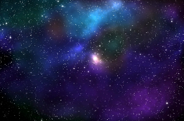
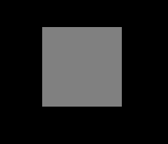
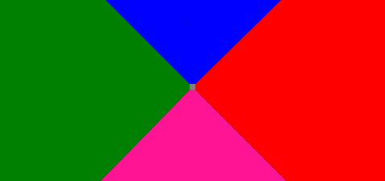
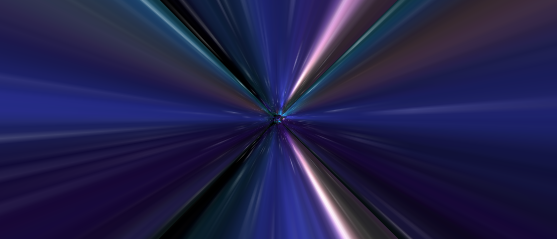
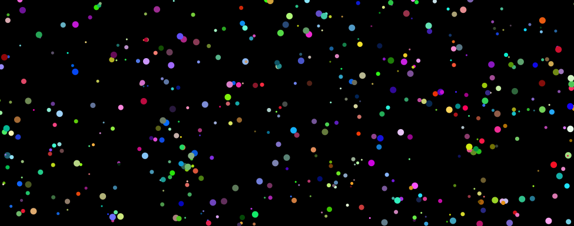

## 使用 CSS 3D 实现星际 3D 穿梭效果

假设我们有这样一张图形：

[](./img/130310578-30627cb7-77d7-4333-a27a-7f7aa911d6c5.png)

这张图先放着备用。在使用这张图之前，我们会先绘制这样一个图形：

```html
<div class="g-container">
  <div class="g-group">
    <div class="item item-right"></div>
    <div class="item item-left"></div>
    <div class="item item-top"></div>
    <div class="item item-bottom"></div>
    <div class="item item-middle"></div>
  </div>
</div>
```

```css
body {
  background: #000;
}
.g-container {
  position: relative;
}
.g-group {
  position: absolute;
  width: 100px;
  height: 100px;
  left: -50px;
  top: -50px;
  transform-style: preserve-3d;
}
.item {
  position: absolute;
  width: 100%;
  height: 100%;
  background: rgba(255, 255, 255, 0.5);
}
.item-right {
  background: red;
  transform: rotateY(90deg) translateZ(50px);
}
.item-left {
  background: green;
  transform: rotateY(-90deg) translateZ(50px);
}
.item-top {
  background: blue;
  transform: rotateX(90deg) translateZ(50px);
}
.item-bottom {
  background: deeppink;
  transform: rotateX(-90deg) translateZ(50px);
}
.item-middle {
  background: rgba(255, 255, 255, 0.5);
  transform: rotateX(180deg) translateZ(50px);
}
```

一共设置了 5 个子元素，不过仔细看 CSS 代码，其中 4 个子元素都设置了 `rotateX/Y(90deg/-90deg)`，也就是绕 X 轴或者 Y 轴旋转了 90°，在视觉上是垂直屏幕的一张平面，所以直观视觉上我们是不到的，只能看到一个平面 `.item-middle`。

我将 5 个子 item 设置了不同的背景色，结果如下：

[](./img/130310541-d9205a5c-cd7f-40d4-891c-55f284242eff.png)

现在看来，好像平平无奇，确实也是。

不过，见证奇迹的时候来了，此时，我们给父元素 `.g-container` 设置一个极小的 `perspective`，譬如，设置一个 `perspective: 4px`，看看效果：

```css
.g-container {
  position: relative;
+ perspective: 4px;
}
// ...其余样式保持不变
```

此时，画风骤变，整个效果就变成了这样：

[](./img/130310721-677e23df-61a1-4169-b0cc-427e26497159.png)

由于 `perspective` 生效，原本的平面效果变成了 3D 的效果。接下来，我们使用上面准备好的星空图，替换一下上面的背景颜色，全部都换成同一张图，神奇的事情发生了：

[](./img/130324531-73948c83-aa87-4d4f-87e1-fe2bb055dc74.png)

由于设置的 `perspective` 非常之下，而每个 item 的 `transform: translateZ(50px)` 设置的又比较大，所以图片在视觉上被拉伸的非常厉害。但是整体是充满整个屏幕的。

接下来，我们只需要让视角动起来，给父元素增加一个动画，通过控制父元素的 `translateZ()` 进行变化即可：

```css
.g-container{
  position: relative;
  perspective: 4px;
  perspective-origin: 50% 50%;
}

.g-group{
  position: absolute;
  // ... 一些定位高宽代码
  transform-style: preserve-3d;
  + animation: move 8s infinite linear;
}

@keyframes move {
  0%{
    transform: translateZ(-50px) rotate(0deg);
  }
  100%{
    transform: translateZ(50px) rotate(0deg);
  }
}
```

看看，神奇美妙的星空穿梭的效果就出来了，Amazing：

[](./img/130324868-f895a45e-a74d-44e4-8f1f-043e258507c7.gif)

美中不足之处在于，动画没能无限衔接上，开头和结尾都有很大的问题。

当然，这难不倒我们，我们可以：

1. 通过叠加两组同样的效果，一组比另一组通过负的 `animation-delay` 提前行进，使两组动画衔接起来（一组结束的时候另外一组还在行进中）
2. 再通过透明度的变化，隐藏掉 `item-middle` 迎面飞来的突兀感
3. 最后，可以通过父元素的滤镜 `hue-rotate` 控制图片的颜色变化

我们尝试修改 HTML 结构如下：

```html
<div class="g-container">
  <div class="g-group">
    <div class="item item-right"></div>
    <div class="item item-left"></div>
    <div class="item item-top"></div>
    <div class="item item-bottom"></div>
    <div class="item item-middle"></div>
  </div>
  <!-- 增加一组动画 -->
  <div class="g-group">
    <div class="item item-right"></div>
    <div class="item item-left"></div>
    <div class="item item-top"></div>
    <div class="item item-bottom"></div>
    <div class="item item-middle"></div>
  </div>
</div>
```

修改后的核心 CSS 如下：

```css
.g-container {
  perspective: 4px;
  position: relative;
  // hue-rotate 变化动画，可以让图片颜色一直变换
  animation: hueRotate 21s infinite linear;
}

.g-group {
  transform-style: preserve-3d;
  animation: move 12s infinite linear;
}
// 设置负的 animation-delay，让第二组动画提前进行
.g-group:nth-child(2) {
  animation: move 12s infinite linear;
  animation-delay: -6s;
}
.item {
  background: url(https://z3.ax1x.com/2021/08/20/fLwuMd.jpg);
  background-size: cover;
  opacity: 1;
  // 子元素的透明度变化，减少动画衔接时候的突兀感
  animation: fade 12s infinite linear;
  animation-delay: 0;
}
.g-group:nth-child(2) .item {
  animation-delay: -6s;
}
@keyframes move {
  0% {
    transform: translateZ(-500px) rotate(0deg);
  }
  100% {
    transform: translateZ(500px) rotate(0deg);
  }
}
@keyframes fade {
  0% {
    opacity: 0;
  }
  25%,
  60% {
    opacity: 1;
  }
  100% {
    opacity: 0;
  }
}
@keyframes hueRotate {
  0% {
    filter: hue-rotate(0);
  }
  100% {
    filter: hue-rotate(360deg);
  }
}
```

最终完整的效果如下，星空穿梭的效果，整个动画首尾相连，可以一直无限下去，几乎没有破绽，非常的赞：

[](./img/130325052-c98c7552-c4eb-496d-84bc-6dd1c6f887e0.gif)

<iframe height="300" style="width: 100%;" scrolling="no" title="Pure CSS Galaxy  Shuttle" src="https://codepen.io/mafqla/embed/qBveREy?default-tab=html%2Cresult&editable=true&theme-id=light" frameborder="no" loading="lazy" allowtransparency="true" allowfullscreen="true">
  See the Pen <a href="https://codepen.io/mafqla/pen/qBveREy">
  Pure CSS Galaxy  Shuttle</a> by mafqla (<a href="https://codepen.io/mafqla">@mafqla</a>)
  on <a href="https://codepen.io">CodePen</a>.
</iframe>

这样，我们就基本还原了上述见到的**网易 UU 加速器**首页的动图背景。

## 更进一步，一个图片我都不想用

当然，这里还是会有读者吐槽，你这里不也用了一张图片资源么？没有那张星空图行不行？这张图我也懒得去找。

当然可以，CSS YYDS。这里我们尝试使用 `box-shadow`，去替换实际的星空图，也是在一个 `div` 标签内实现，借助了 SASS 的循环函数：

```html
<div></div>
```

```scss
@function randomNum($max, $min: 0, $u: 1) {
  @return ($min + random($max)) * $u;
}

@function randomColor() {
  @return rgb(randomNum(255), randomNum(255), randomNum(255));
}

@function shadowSet($maxWidth, $maxHeight, $count) {
  $shadow: 0 0 0 0 randomColor();

  @for $i from 0 through $count {
    $x: #{random(10000) / 10000 * $maxWidth};
    $y: #{random(10000) / 10000 * $maxHeight};

    $shadow: $shadow, #{$x} #{$y} 0 #{random(5)}px randomColor();
  }

  @return $shadow;
}

body {
  background: #000;
}

div {
  width: 1px;
  height: 1px;
  border-radius: 50%;
  box-shadow: shadowSet(100vw, 100vh, 500);
}
```

这里，我们用 SASS 封装了一个函数，利用多重 `box-shadow` 的特性，在传入的大小的高宽内，生成传入个数的点。

这样，我们可以得到这样一幅图，用于替换实际的星空图：

[](./img/140636977-4747ce9c-2592-49f8-902a-5663c52c083c.png)

我们再把上述这个图，替换实际的星空图，主要是替换 `.item` 这个 class，只列出修改的部分：

```scss
// 原 CSS，使用了一张星空图
.item {
  position: absolute;
  width: 100%;
  height: 100%;
  background: url(https://z3.ax1x.com/2021/08/20/fLwuMd.jpg);
  background-size: cover;
  animation: fade 12s infinite linear;
}

// 修改后的 CSS 代码
.item {
  position: absolute;
  width: 100%;
  height: 100%;
  background: #000;
  animation: fade 12s infinite linear;
}
.item::after {
  content: '';
  position: absolute;
  top: 0;
  left: 0;
  right: 0;
  bottom: 0;
  width: 1px;
  height: 1px;
  border-radius: 50%;
  box-shadow: shadowSet(100vw, 100vh, 500);
}
```

这样，我们就实现了这样一个效果，在不借助额外资源的情况下，使用纯 CSS 实现上述效果：

<iframe height="300" style="width: 100%;" scrolling="no" title="Pure CSS Galaxy  Shuttle 2" src="https://codepen.io/mafqla/embed/yLwmgyM?default-tab=html%2Cresult&editable=true&theme-id=light" frameborder="no" loading="lazy" allowtransparency="true" allowfullscreen="true">
  See the Pen <a href="https://codepen.io/mafqla/pen/yLwmgyM">
  Pure CSS Galaxy  Shuttle 2</a> by mafqla (<a href="https://codepen.io/mafqla">@mafqla</a>)
  on <a href="https://codepen.io">CodePen</a>.
</iframe>

通过调整动画的时间，`perspective` 的值，每组元素的 `translateZ()` 变化距离，可以得到各种不一样的观感和效果，感兴趣的读者可以基于我上述给的 DEMO 自己尝试尝试。
