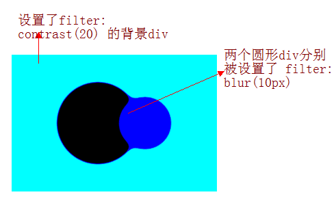
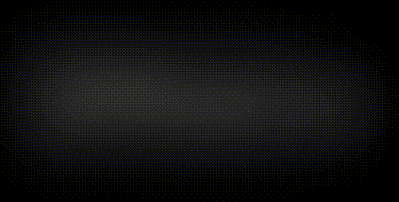

## lur 滤镜混合 contrast 滤镜产生融合效果

本文的重点，**模糊滤镜叠加对比度滤镜产生的融合效果**。单独将两个滤镜拿出来，它们的作用分别是：

1. `filter: blur()`： 给图像设置高斯模糊效果。
2. `filter: contrast()`： 调整图像的对比度。

但是，当他们“合体”的时候，产生了奇妙的融合现象。

先来看一个简单的例子：

<iframe height="300" style="width: 100%;" scrolling="no" title="filter mix between blur and contrast" src="https://codepen.io/mafqla/embed/xxBveVN?default-tab=html%2Cresult&editable=true&theme-id=light" frameborder="no" loading="lazy" allowtransparency="true" allowfullscreen="true">
  See the Pen <a href="https://codepen.io/mafqla/pen/xxBveVN">
  filter mix between blur and contrast</a> by mafqla (<a href="https://codepen.io/mafqla">@mafqla</a>)
  on <a href="https://codepen.io">CodePen</a>.
</iframe>

仔细看两圆相交的过程，在边与边接触的时候，会产生一种边界融合的效果，通过对比度滤镜把高斯模糊的模糊边缘给干掉，利用高斯模糊实现融合效果。

上述效果的实现基于两点：

1. 图形是在被设置了 `filter: contrast()` 的画布背景上进行动画的
2. 进行动画的图形被设置了 `filter: blur()`（ 进行动画的图形的父元素需要是被设置了 `filter: contrast()` 的画布）

当然，背景色不一定是白色，我们稍稍修改上面的 Demo，简单的示意图如下：


## 使用 blur/contrast 滤镜实现文字的切换

利用上述的技巧，我们可以实现文字的融合效果，像是这样：

<iframe height="300" style="width: 100%;" scrolling="no" title="word animation | word filter" src="https://codepen.io/mafqla/embed/VwRoNjL?default-tab=html%2Cresult&editable=true&theme-id=light" frameborder="no" loading="lazy" allowtransparency="true" allowfullscreen="true">
  See the Pen <a href="https://codepen.io/mafqla/pen/VwRoNjL">
  word animation | word filter</a> by mafqla (<a href="https://codepen.io/mafqla">@mafqla</a>)
  on <a href="https://codepen.io">CodePen</a>.
</iframe>

这样，利用这个技巧，我们可以巧妙构思一下动画：

1. 多个文字按顺序依次出现（利用 `animation-delay` 进行控制处理）
2. 做到上一个文字消失的同时，下一个文字出现
3. 叠加上上述的滤镜即可

核心代码如下：

```html
<div class="g-container">
  <div class="word">iPhone</div>
  <div class="word">13</div>
  <div class="word">Pro</div>
  <div class="word">强得很！</div>
</div>
```

```scss
@import url('https://fonts.googleapis.com/css2?family=Montserrat&display=swap');

$speed: 8s;
$wordCount: 4;

.g-container {
  position: relative;
  width: 100vw;
  height: 100vh;
  background: #000;
  font-family: 'Montserrat', sans-serif;
  color: #fff;
  font-size: 120px;
  filter: contrast(15);
}
.word {
  position: absolute;
  top: 50%;
  left: 50%;
  transform: translate(-50%, -50%);
  animation: change $speed infinite ease-in-out;

  @for $i from 0 to $wordCount {
    &:nth-child(#{$i + 1}) {
      animation-delay: ($speed / ($wordCount + 1) * $i) - $speed;
    }
  }
}

@keyframes change {
  0%,
  5%,
  100% {
    filter: blur(0px);
    opacity: 1;
  }
  50%,
  80% {
    filter: blur(80px);
    opacity: 0;
  }
}
```

整段代码，核心需要关注 `@keyframes change` 这个动画，我们通过顺序给文字添加上这个动画（也就是利用 `animation-delay` 顺序添加了延时）实现了上一个文字消失的过程下一个文字显示的效果。

上述的 `.g-container` 添加了这样一句代码 -- `filter: contrast(15)`，去掉这句的话，效果是这样的：



加上这句关键的代码 -- `filter: contrast(15)`，整个效果就如一开始的题图所示：

<iframe height="300" style="width: 100%;" scrolling="no" title="纯 CSS 实现文字融合快闪切换效果" src="https://codepen.io/mafqla/embed/wvOVZWe?default-tab=html%2Cresult&editable=true&theme-id=light" frameborder="no" loading="lazy" allowtransparency="true" allowfullscreen="true">
  See the Pen <a href="https://codepen.io/mafqla/pen/wvOVZWe">
  纯 CSS 实现文字融合快闪切换效果</a> by mafqla (<a href="https://codepen.io/mafqla">@mafqla</a>)
  on <a href="https://codepen.io">CodePen</a>.
</iframe>

整个动画的两个核心关键点：

1. 利用了 `blur` 滤镜混合 `contrast` 滤镜产生融合效果
2. 在上一个文字消失的过程中，显示下一个文字，以此产生当前展示文字是由上个文字演变而来的效果

由此，你可以通过 HTML 控制文字的条数、改变 SASS 变量中表示动画时长的 `$speed` 和文字条数的 `$wordCount` 以及最终 `@keyframes change` 里面的参数，不断去调整优化你要的效果。演变出各种文字快闪效果。
