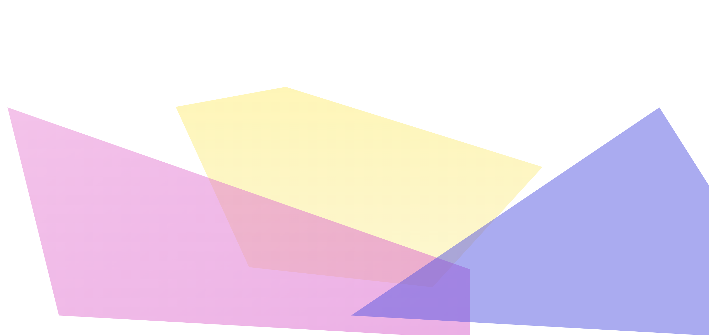
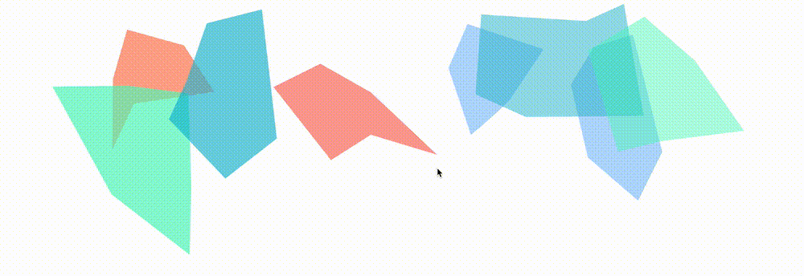
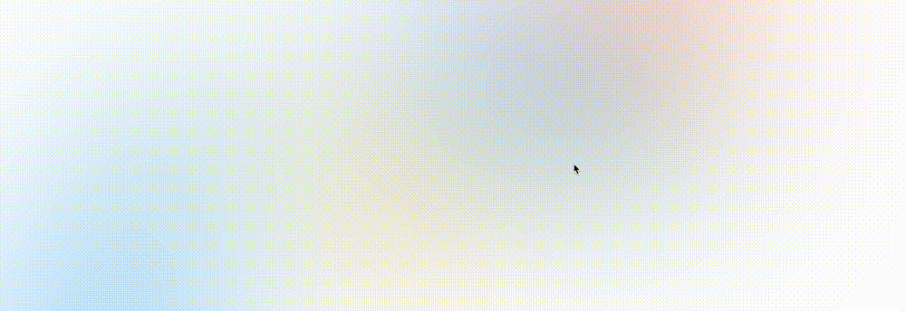

## 实现渐变图

上述背景效果看似复杂，其实非常的简单。它就是：

**多块不规则渐变背景** + **高斯模糊蒙版**

在 CSS 中，也就是借助 `background` + `backdrop-filter: blur()` 即可实现。

去掉叠在上方的 **高斯模糊蒙版**，背后的元素其实非常简单明了。可能就是只是这样：

[](https://user-images.githubusercontent.com/8554143/148382783-56f530a1-77f2-4a74-b68e-7ab4a94cc74f.png)

这里简单列下代码，我们使用了 3 个 div 实现了 3 个渐变图，每个图形再使用 `clip-path` 随机裁剪成不规则的多边形：

```html
<div class="g-bg">
  <div class="g-polygon g-polygon-1"></div>
  <div class="g-polygon g-polygon-2"></div>
  <div class="g-polygon g-polygon-3"></div>
</div>
```

```css
.g-polygon {
  position: absolute;
  opacity: 0.5;
}
.g-polygon-1 {
  // 定位代码，容器高宽随意
  background: #ffee55;
  clip-path: polygon(0 10%, 30% 0, 100% 40%, 70% 100%, 20% 90%);
}

.g-polygon-2 {
  // 定位代码，容器高宽随意
  background: #e950d1;
  clip-path: polygon(10% 0, 100% 70%, 100% 100%, 20% 90%);
}

.g-polygon-3 {
  // 定位代码，容器高宽随意
  background: rgba(87, 80, 233);
  clip-path: polygon(80% 0, 100% 70%, 100% 100%, 20% 90%);
}
```

## 使用 `backdrop-filter` 实现高斯模糊蒙版

接下来，这一步最为关键，就是使用 `backdrop-filter` 实现高斯模糊蒙版。叠在上述几个元素上方即可，最关键的一行代码 `backdrop-filter: blur(150px)`

```css
.g-bg::before {
        content: "";
        position: fixed;
        top: 0; left: 0; bottom: 0; right: 0;
        backdrop-filter: blur(150px);
        z-index: 1;
    }
}
```

这样，我们就实现了如上图所示的毛玻璃质感效果的渐变背景图：

<iframe height="300" style="width: 100%;" scrolling="no" title="Frosted glass background effect" src="https://codepen.io/mafqla/embed/XWQWPmE?default-tab=html%2Cresult&editable=true&theme-id=light" frameborder="no" loading="lazy" allowtransparency="true" allowfullscreen="true">
  See the Pen <a href="https://codepen.io/mafqla/pen/XWQWPmE">
  Frosted glass background effect</a> by mafqla (<a href="https://codepen.io/mafqla">@mafqla</a>)
  on <a href="https://codepen.io">CodePen</a>.
</iframe>

## 借助 CSS-doodle 工具，批量产生该效果

简单了解了原理之后，我们就可以借助 CSS-doodle 尝试批量来生成这个效果了。

> CSS-doodle 它是一个基于 Web-Component 的库。允许我们快速的创建基于 CSS Grid 布局的页面，并且提供各种便捷的指令及函数（随机、循环等等），让我们能通过一套规则，得到不同 CSS 效果。感兴趣的可以猛击官网了解 -- [CSS-doodle](https://css-doodle.com/)

代码非常简单，也非常好理解，就是随机场景不同尺寸、不同定位、不同颜色、不同形式的几个图形：

```css
<css-doodle>
    :doodle {
        @grid: 1x8 / 100vmin;
    }
    @place-cell: center;
    width: @rand(40vmin, 80vmin);
    height: @rand(40vmin, 80vmin);
    transform: translate(@rand(-200%, 200%), @rand(-60%, 60%)) scale(@rand(.8, 1.8)) skew(@rand(45deg));
    clip-path: polygon(
      @r(0, 30%) @r(0, 50%),
      @r(30%, 60%) @r(0%, 30%),
      @r(60%, 100%) @r(0%, 50%),
      @r(60%, 100%) @r(50%, 100%),
      @r(30%, 60%) @r(60%, 100%),
      @r(0, 30%) @r(60%, 100%)
    );
    background: @pick(#f44336, #e91e63, #9c27b0, #673ab7, #3f51b5, #60569e, #e6437d, #ebbf4d, #00bcd4, #03a9f4, #2196f3, #009688, #5ee463, #f8e645, #ffc107, #ff5722, #43f8bf);
    opacity: @rand(.3, .8);
</css-doodle>
```

上述代码会随机生成这样的图案（GIF 看不出鼠标的点击效果，每次切换是我点击页面进行的手动切换）：

[](https://user-images.githubusercontent.com/8554143/148385057-b6704fdc-779b-43a7-9508-2b9e9e412a46.gif)

好，配合上蒙版，再看看效果，我们已经能够批量的去生成上述的背景效果了：

[](https://user-images.githubusercontent.com/8554143/148385294-0d0a0635-6557-4c99-a50b-873e9efe75fa.gif)

如果需求，配合上 `hue-rotate` 及简单的位移，我们甚至可以让这个渐变背景动画动起来，更加生动些：

```css
<css-doodle>
    // 同上...
    position: relative;
    top: @rand(-80%, 80%);
    left: @rand(-80%, 80%);
    animation: colorChange @rand(6.1s, 16.1s) infinite @rand(-.5s, -2.5s) linear alternate;

  @keyframes colorChange {
    100% {
      left: 0;
      top: 0;
      filter: hue-rotate(360deg);
    }
  }
</css-doodle>
```

这样，我们就得到了带动画的毛玻璃渐变背景：

<iframe height="300" style="width: 100%;" scrolling="no" title="CSS-doodle Pure CSS Background Effect  2" src="https://codepen.io/mafqla/embed/KKYKxdm?default-tab=html%2Cresult&editable=true&theme-id=light" frameborder="no" loading="lazy" allowtransparency="true" allowfullscreen="true">
  See the Pen <a href="https://codepen.io/mafqla/pen/KKYKxdm">
  CSS-doodle Pure CSS Background Effect  2</a> by mafqla (<a href="https://codepen.io/mafqla">@mafqla</a>)
  on <a href="https://codepen.io">CodePen</a>.
</iframe>
