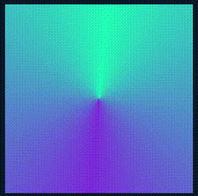
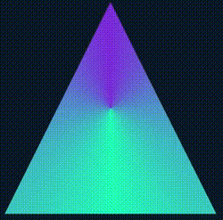
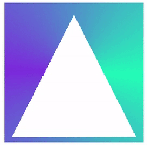
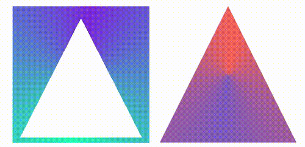
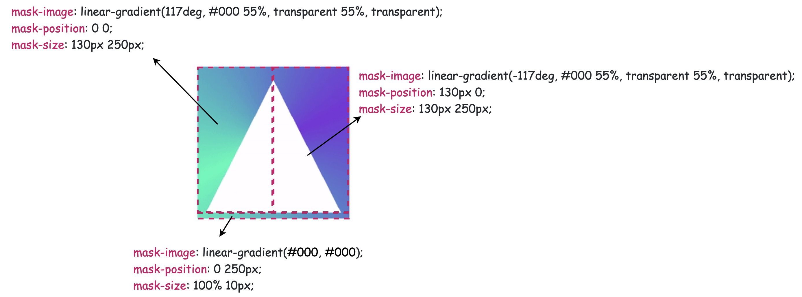
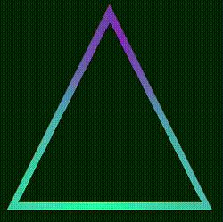
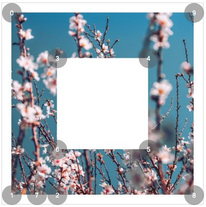
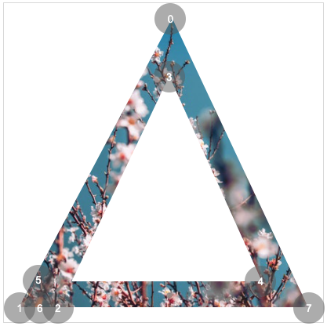

在[某个网站](https://fffuel.co/nnneon/)看到一个使用 SVG 实现的炫彩三角边框动画，问能否使用 CSS 实现：

其核心就是利用了角向渐变（`conic-gradient`），然后将图案的中心区域通过覆盖遮罩一个小号的图形实现。

然而，这个三角形动画里有两个难点：

1. **整个图形是个三角形**

在 CSS 中，我们可比较轻松的实现矩形与圆形，但是三角形这里无疑会棘手很多。

1. **整个边框还附带阴影，并且阴影还是在边框的两侧**

这里看似不复杂，实则困难重重，如果采用上述的方法，将图案的中心区域通过覆盖遮罩一个小号的图形实现镂空，那么另外一侧的阴影如何产生？即便使用 `drop-shadow`，也会被覆盖的内侧图形给遮挡住。

当然，CSS 还是可以实现这个图形的，本文就将讲解如何使用 CSS 实现上述炫彩三角边框动画。

## 通过角向渐变实现主体动画

首先，我们还是需要借助角向渐变 `conic-gradient` 实现整个动画的主体。

```html
<div></div>
```

```css
@property --angle {
  syntax: '<angle>';
  inherits: false;
  initial-value: 0deg;
}

div {
  width: 260px;
  height: 260px;
  background: conic-gradient(
    from var(--angle),
    hsl(162, 100%, 58%),
    hsl(270, 73%, 53%),
    hsl(162, 100%, 58%)
  );
  animation: rotate 3s infinite linear;
}

@keyframes rotate {
  to {
    --angle: 360deg;
  }
}
```

核心就仅仅只是一个角向渐变图案，配合 CSS [@Property](https://github.com/Property)，让整个效果旋转起来：

[](https://user-images.githubusercontent.com/8554143/153804505-ac45045b-bfe9-4017-adb6-b2a878aa578f.gif)

当然，如果这里觉得 CSS [@Property](https://github.com/Property) 不好理解或者担心兼容性问题，可以替换成利用伪元素实现同样的图形，然后进行 `transform: rotate()` 旋转，效果一样。

## 基于矩形图形得到三角形

OK，接下来，我们需要基于矩形图形得到三角形图形，对于外圈的三角形，我们可以通过 `clip-path` 切割得到，也非常的简单：

```css
div {
    width: 260px;
    height: 260px;
    background: conic-gradient(from var(--angle), hsl(162, 100%, 58%), hsl(270, 73%, 53%), hsl(162, 100%, 58%));
    animation: rotate 3s infinite linear;
  + clip-path: polygon(0 100%, 100% 100%, 50% 0);
}
```

即可得到如下效果：

[](https://user-images.githubusercontent.com/8554143/153804910-f7ecb787-7bef-4dc5-b5d6-e92a18b1bbcf.gif)

这样，我们就得到了一个实心的三角形。接下来需要先办法把内部给掏空。

最简单的思路就是，通过叠加一个小一号的图形在中间，颜色和背景色一致即可：

<iframe height="300" style="width: 100%;" scrolling="no" title="Pure CSS Linear Triangle" src="https://codepen.io/mafqla/embed/yLrYNqq?default-tab=html%2Cresult&editable=true&theme-id=light" frameborder="no" loading="lazy" allowtransparency="true" allowfullscreen="true">
  See the Pen <a href="https://codepen.io/mafqla/pen/yLrYNqq">
  Pure CSS Linear Triangle</a> by mafqla (<a href="https://codepen.io/mafqla">@mafqla</a>)
  on <a href="https://codepen.io">CodePen</a>.
</iframe>

但是，这样做有两个致命问题：

1. 如果背景色不是实色而是渐变色，这个方法就失效了
2. 这个方法实现的三角形边框内侧无法添加阴影效果

这两个缺陷都是不可接受的，所以我们必须寻找真正能够镂空中间的方式，镂空完成后，它的中心得是透明的。

因此，这里我们得使用 mask。

不过使用 mask 基于这样一个图形再实现一个小一号的三角形是比较麻烦的，我们相当于要实现这样一个镂空三角形图形，示意图如下：

[](https://user-images.githubusercontent.com/8554143/153805987-f4d39264-28fa-47b9-966a-7e264d106613.gif)

这样一个图形，配合 `clip-path`，就能得到一个三角形边框图形，啥意思呢，我这里制作了一个动图示意：

[](https://user-images.githubusercontent.com/8554143/153806660-cb4923db-6fa3-41d5-86a8-ad28e172e476.gif)

左边是利用 `mask` 实现遮罩后的图形，右边是利用 `clip-path` 切割后的图形，它们的效果叠加在一起，就能实现一个边框三角形。

当然，这里需要对 mask 掌握的比较深入，要使用 mask 切割一个内部镂空的三角形示意图如下：

[](https://user-images.githubusercontent.com/8554143/154028267-d808ddae-bcdb-46c8-849f-425aa797a6d3.png)

OK，完整的代码是这样：

```css
@property --angle {
  syntax: '<angle>';
  inherits: false;
  initial-value: 0deg;
}

div {
  width: 260px;
  height: 260px;
  background: conic-gradient(
    from var(--angle),
    hsl(162, 100%, 58%),
    hsl(270, 73%, 53%),
    hsl(162, 100%, 58%)
  );
  clip-path: polygon(0 100%, 100% 100%, 50% 0);
  mask: linear-gradient(117deg, #000 55%, transparent 55%, transparent),
    linear-gradient(-117deg, #000 55%, transparent 55%, transparent),
    linear-gradient(#000, #000);
  mask-position: 0 0, 130px 0, 0 250px;
  mask-size: 130px 250px, 130px 250px, 100% 10px;
  mask-repeat: no-repeat;
  animation: rotate 3s infinite linear;
}

@keyframes rotate {
  to {
    --angle: 360deg;
  }
}
```

我们就得到了一个内部镂空的三角形边框了：

[](https://user-images.githubusercontent.com/8554143/153807202-944a5107-592f-499f-99ec-d5557cae5e9e.gif)

## 利用 drop-shadow 添加上光影

最后一步就比较简单了，由于上述三角形已经是一个镂空图形，这里直接使用 `drop-shadow` 给元素加上一层光影效果即可，不过由于使用了 `clip-path`，直接在原元素上添加的 `drop-shadow` 无法展示，这个好解决，我们只需要多套一层结构，将 `drop-shadow` 添加到父元素上即可：

```html
<div class="g-container">
  <div class="g-triangle"></div>
</div>
```

```css
@property --angle {
  syntax: '<angle>';
  inherits: false;
  initial-value: 0deg;
}
.g-container {
  width: 260px;
  height: 260px;
  filter: drop-shadow(0 0 5px hsl(162, 100%, 58%)) drop-shadow(
      0 0 10px hsl(270, 73%, 53%)
    );
}
.g-triangle {
  width: 260px;
  height: 260px;
  background: conic-gradient(
    from var(--angle),
    hsl(162, 100%, 58%),
    hsl(270, 73%, 53%),
    hsl(162, 100%, 58%)
  );
  clip-path: polygon(0 100%, 100% 100%, 50% 0);
  mask: linear-gradient(117deg, #000 55%, transparent 55%, transparent),
    linear-gradient(-117deg, #000 55%, transparent 55%, transparent),
    linear-gradient(#000, #000);
  mask-position: 0 0, 130px 0, 0 250px;
  mask-size: 130px 250px, 130px 250px, 100% 10px;
  mask-repeat: no-repeat;
  animation: rotate 3s infinite linear;
}
@keyframes rotate {
  to {
    --angle: 360deg;
  }
}
```

这里又是一个小技巧，`drop-shadow` 是可以重复添加多个的，这里添加的两个阴影颜色就是 `conic-gradient()` 里设置的颜色，最终，我们就得到了题图所示效果：

<iframe height="300" style="width: 100%;" scrolling="no" title="Pure CSS Glowing Triangle" src="https://codepen.io/mafqla/embed/qBwOdMW?default-tab=html%2Cresult&editable=true&theme-id=light" frameborder="no" loading="lazy" allowtransparency="true" allowfullscreen="true">
  See the Pen <a href="https://codepen.io/mafqla/pen/qBwOdMW">
  Pure CSS Glowing Triangle</a> by mafqla (<a href="https://codepen.io/mafqla">@mafqla</a>)
  on <a href="https://codepen.io">CodePen</a>.
</iframe>

## 使用 clip-path 剪切环形三角形(更新于 2022/02/16)

上面利用了 `clip-path` 剪切外三角形，`mask` 镂空内三角形，经提醒，其实 `clip-path` 可以独自裁剪出一个环形三角形。

上述代码也可以简化成：

```html
<div class="g-container">
  <div class="g-triangle"></div>
</div>
```

```css
@property --angle {
  syntax: '<angle>';
  inherits: false;
  initial-value: 0deg;
}
.g-container {
  width: 260px;
  height: 260px;
  filter: drop-shadow(0 0 5px hsl(162, 100%, 58%)) drop-shadow(
      0 0 10px hsl(270, 73%, 53%)
    );
}
.g-triangle {
  width: 200px;
  height: 200px;
  clip-path: polygon(
    50% 0%,
    0% 100%,
    8% 100%,
    50% 15%,
    88% 93%,
    7% 93%,
    7% 100%,
    100% 100%
  );
  background: conic-gradient(
    from var(--angle),
    hsl(162, 100%, 58%),
    hsl(270, 73%, 53%),
    hsl(162, 100%, 58%)
  );
  animation: rotate 3s infinite linear;
}
@keyframes rotate {
  to {
    --angle: 360deg;
  }
}
```

效果一样：

<iframe height="300" style="width: 100%;" scrolling="no" title="Pure CSS Glowing Triangle 2" src="https://codepen.io/mafqla/embed/PogPqdp?default-tab=html%2Cresult&editable=true&theme-id=light" frameborder="no" loading="lazy" allowtransparency="true" allowfullscreen="true">
  See the Pen <a href="https://codepen.io/mafqla/pen/PogPqdp">
  Pure CSS Glowing Triangle 2</a> by mafqla (<a href="https://codepen.io/mafqla">@mafqla</a>)
  on <a href="https://codepen.io">CodePen</a>.
</iframe>

这里有必要讲解一下，使用 `clip-path` 切割一个环形图案，是可以做到的。假设，我们需要一个正方形环形，其点顺序如下：

[](https://user-images.githubusercontent.com/8554143/154185557-61627314-d29f-4fcf-956c-6a45058fa7f9.png)

```css
{
    clip-path: polygon(0% 0%,0% 100%,25% 100%,25% 25%,75% 25%,75% 75%,25% 75%,14% 100%,100% 100%,100% 0%);
}
```

即可得到：

[](https://user-images.githubusercontent.com/8554143/154185668-bc232cf1-f306-4205-87be-19731ac817aa.png)

同理，需要得到一个三角形环形，只需要 7 个点即可：

```css
 {
  clip-path: polygon(
    50% 0%,
    0% 100%,
    13% 100%,
    50% 20%,
    85% 90%,
    8% 90%,
    8% 100%,
    100% 100%
  );
}
```

效果如下：

[](https://user-images.githubusercontent.com/8554143/154186020-d9ef91e9-7d02-4e39-ba5d-45092b0da25a.png)

这里有个很好用的工具，辅助制作 `clip-path` 图形， 感兴趣可以试下：[CSS clip-path Editor](https://codepen.io/stoumann/pen/abZxoOM)
