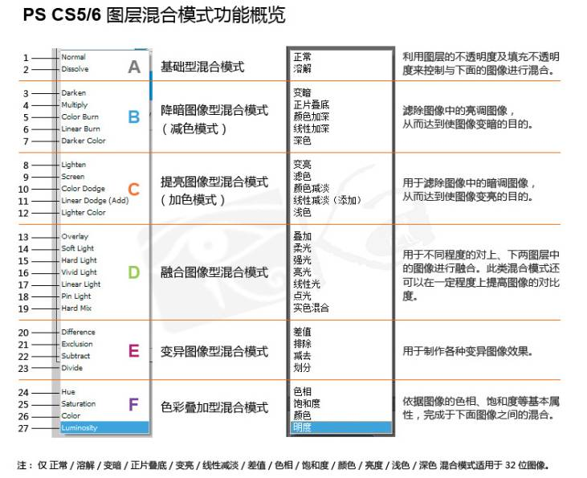

## 合模式 mix-blend-mode: difference

CSS3 新增了一个很有意思的属性 -- mix-blend-mode ，其中 mix 和 blend 的中文意译均为混合，那么这个属性的作用直译过来就是混合混合模式，当然，我们我们通常称之为混合模式。一共有下图所示的一些混合模式：

[]

其中，本文的主角是 `mix-blend-mode: difference`，意为差值模式。该混合模式会查看每个通道中的颜色信息，比较底色和绘图色，用较亮的像素点的像素值减去较暗的像素点的像素值。

与白色混合将使底色反相；与黑色混合则不产生变化。

通俗一点就是上方图层的亮区将下方图层的颜色进行反相，暗区则将颜色正常显示出来，**效果与原图像是完全相反的颜色**。

该混合模式最常见的应用场景就是文章开头描述的场景，实现文本在不同背景色下展示不同的颜色。

最适合于黑白场景，非常简单的一个 DEMO：

```html
<div></div>
```

```scss
div {
  height: 100vh;
  background: linear-gradient(45deg, #000 0, #000 50%, #fff 50%);

  &::before {
    content: 'LOREM IPSUM';
    position: absolute;
    top: 50%;
    left: 50%;
    transform: translate(-50%, -50%);
    color: #fff;
    mix-blend-mode: difference;
    animation: move 3s infinite linear alternate;
  }
}
@keyframes move {
  0% {
    transform: translate(-30%, -50%);
  }
  100% {
    transform: translate(-70%, -50%);
  }
}
```

效果如下：

<iframe height="300" style="width: 100%;" scrolling="no" title="linear-gradient + Mix-blend-mode" src="https://codepen.io/mafqla/embed/yLrJvXO?default-tab=html%2Cresult&editable=true&theme-id=light" frameborder="no" loading="lazy" allowtransparency="true" allowfullscreen="true">
  See the Pen <a href="https://codepen.io/mafqla/pen/yLrJvXO">
  linear-gradient + Mix-blend-mode</a> by mafqla (<a href="https://codepen.io/mafqla">@mafqla</a>)
  on <a href="https://codepen.io">CodePen</a>.
</iframe>

当然，不一定是黑色或者白色，看看下面这个例子，有这样一种场景，有的时候我们不太确定背景颜色的最终表现值（可能是后台配置，传给前端），但是又需要让文字能够在任何背景颜色下都正常展出，此时，也可以尝试使用 `mix-blend-mode: difference`。

```html
<ul class="flex-box">
  <div class="box">
    <p>开通会员查看我的VIP等级</p>
  </div>
  // .....
</ul>
```

```scss
div {
  // 不确定的背景色
}
p {
  color: #fff;
  mix-blend-mode: difference;
}
```

无论背景色是什么颜色，设置了 `mix-blend-mode: difference` 的 `<p>` 元素都可以正常展示出文本：

<iframe height="300" style="width: 100%;" scrolling="no" title="mix-blend-mode:difference实现文字颜色自适应底色" src="https://codepen.io/mafqla/embed/rNbLJwy?default-tab=html%2Cresult&editable=true&theme-id=light" frameborder="no" loading="lazy" allowtransparency="true" allowfullscreen="true">
  See the Pen <a href="https://codepen.io/mafqla/pen/rNbLJwy">
  mix-blend-mode:difference实现文字颜色自适应底色</a> by mafqla (<a href="https://codepen.io/mafqla">@mafqla</a>)
  on <a href="https://codepen.io">CodePen</a>.
</iframe>

## mix-blend-mode:difference 的缺点

当然，这个方法不是完美的，因为通过 `mix-blend-mode:difference` 与底色叠加之后的颜色，虽然能够正常展示，但是不一定是最适合的颜色，展示效果的最好的颜色。

这里实际使用的时候，在非黑白场景下，还需要多加实验加以取舍。
