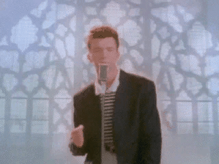
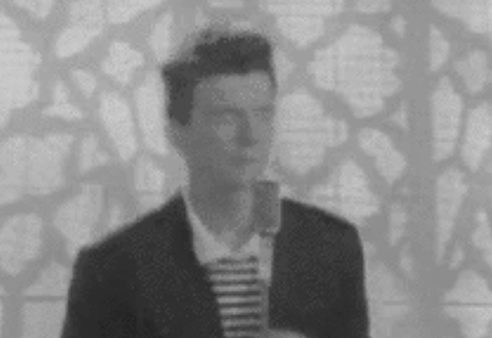
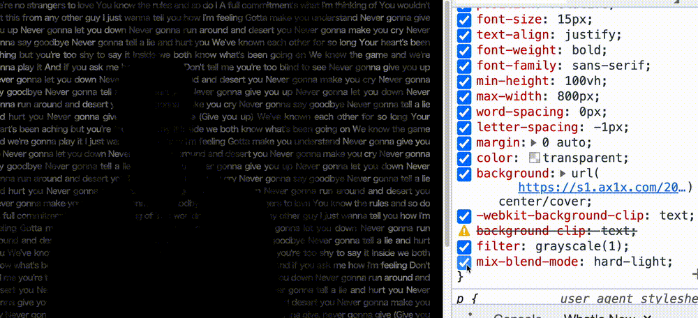

## 有意思的 background-clip: text

`background-clip: text` 之前也提到多很多次。其核心就在于以区块内的文字作为裁剪区域向外裁剪，文字的背景即为区块的背景，文字之外的区域都将被裁剪掉。

简单而言，就是运用了 `background-clip: text` 的元素，其背景内容只保留文字所在区域部分，配合透明文字 `color: transparent`，就能够利用文字透出背景。

利用 `background-clip: text`，能够得到很多非常有意思的文字效果。

假设，我们有这样一个 Gif 图：


我们可以利用这张动图和文字，实现一版，文字版的动图：

```html
<p>Lorem ......</p>
```

```css
p {
  color: transparent;
  background: url(https://media.giphy.com/media/Ju7l5y9osyymQ/giphy.gif)
    center/cover;
  background-clip: text;
}
```

我们就实现了这样一个效果：

<iframe height="300" style="width: 100%;" scrolling="no" title="Rick Roll Knockout Text" src="https://codepen.io/mafqla/embed/ExJgpWL?default-tab=html%2Cresult&editable=true&theme-id=light" frameborder="no" loading="lazy" allowtransparency="true" allowfullscreen="true">
  See the Pen <a href="https://codepen.io/mafqla/pen/ExJgpWL">
  Rick Roll Knockout Text</a> by mafqla (<a href="https://codepen.io/mafqla">@mafqla</a>)
  on <a href="https://codepen.io">CodePen</a>.
</iframe>

上述效果及思路作用于一开始的效果即可：

1. 实现一个背景动画
2. 当 hover 到文字的时候，让文字透明
3. 让动画开始

我们首先需要实现一个会动的条纹背景动画，方法有很多，我这里利用了 `repeating-radial-gradient` 配合 CSS [@Property](https://github.com/Property)：

```html
<p></p>
```

```css
@property --offset {
  syntax: '<length>';
  inherits: false;
  initial-value: 5px;
}
p {
  background: repeating-radial-gradient(
    circle at 0 0,
    #000 calc(var(--offset) - 5px),
    #000 var(--offset),
    #fff var(--offset),
    #fff calc(var(--offset) + 5px)
  );
  animation: move 0.5s infinite linear;
}
@keyframes move {
  to {
    --offset: 15px;
  }
}
```

会得到这样一幅变幻动画的条纹图：


当然，如果觉得使用 CSS 实现一个动图比较麻烦或者会存在兼容性问题，也可以使用一些现成的 Gif 图替代，譬如这样一个 Gif 图作为 `<p>` 元素的背景：


有了会动的效果之后，我们稍微改造下代码，运用上 `background-clip: text`，并且结合 `<p>` 元素的 hover 效果，在 hover 的时候，把文字从 `#000` 设置为透明 `transparent`：

```css
...
p {
    color: #000;

    &:hover {
        color: transparent;
        background: repeating-radial-gradient(circle at 0 0 , #000 calc(var(--offset) - 5px), #000 var(--offset), #fff var(--offset), #fff calc(var(--offset) + 5px));
        background-clip: text;
        animation: move .5s infinite linear;
    }
}
...
```

这样，我们就成功的得到了题图所示的效果了：

<iframe height="300" style="width: 100%;" scrolling="no" title="Wave Text" src="https://codepen.io/mafqla/embed/RwOGBpz?default-tab=html%2Cresult&editable=true&theme-id=light" frameborder="no" loading="lazy" allowtransparency="true" allowfullscreen="true">
  See the Pen <a href="https://codepen.io/mafqla/pen/RwOGBpz">
  Wave Text</a> by mafqla (<a href="https://codepen.io/mafqla">@mafqla</a>)
  on <a href="https://codepen.io">CodePen</a>.
</iframe>

## 结合滤镜与混合模式，碰撞出不一样的火花

结束了吗？没有！

有了上述的铺垫，我们继续进一步的尝试，CSS 有两个非常有意思的属性，滤镜 `filter` 与混合模式 `mix-blend-mode`。我们考虑把它们作用于我们的效果中。

还是这张 Gif 图：



我们首先通过滤镜 `filter: grayscale(1)`，将他从彩色的，处理成黑白灰的：

```css
p {
  background: url(xxx);
  filter: grayscale(1);
}
```

处理后的图片，大概会是这样：



基于一张黑白底色的图片，我们再运用 `background-clip: text`，再通过混合模式 `mix-blend-mode: hard-light`，并且，很重要的一点，我们把这个效果放在黑色的背景之上：

```css
body {
  background: #000;
}
p {
  color: transparent;
  background: url(xxx) center/cover;
  background-clip: text;
  filter: grayscale(1);
  mix-blend-mode: hard-light;
}
```

将会得到这样一种神奇的效果，通过混合模式的叠加处理，文字的亮部将会保留，而暗部则会与黑色背景融合：


这里，混合模式 `mix-blend-mode: hard-light` 发挥了非常重要的作用，去掉的话，是这样的结果：


当然，我们更希望的是，人的部分展示保留，而 Gif 图片中的背景部分被隐藏，就完美了！

这里，我们继续优化下代码，我们希望能把被 `grayscale()` 处理过的原图的明暗部分置换，刚好，在 `filter` 中，存在一个 `invert()` 函数，能够反转输入图像的色值。

因此，在 `grayscale()` 之后，再配合一次 `invert(1)` 函数：

```css
body {
  background: #000;
}
p {
  color: transparent;
  background: url(xxx) center/cover;
  background-clip: text;
  filter: grayscale(1) invert(1);
  mix-blend-mode: hard-light;
}
```

OK，至此，我们利用纯 CSS 实现了这样一种 unbelievable 的文字效果：

]
<iframe height="300" style="width: 100%;" scrolling="no" title="Filter &amp; MixBlendMode &amp; BackgroundClip Text Animation Effect" src="https://codepen.io/mafqla/embed/jORMpmy?default-tab=html%2Cresult&editable=true&theme-id=light" frameborder="no" loading="lazy" allowtransparency="true" allowfullscreen="true">
  See the Pen <a href="https://codepen.io/mafqla/pen/jORMpmy">
  Filter &amp; MixBlendMode &amp; BackgroundClip Text Animation Effect</a> by mafqla (<a href="https://codepen.io/mafqla">@mafqla</a>)
  on <a href="https://codepen.io">CodePen</a>.
</iframe>
