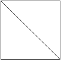
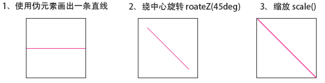
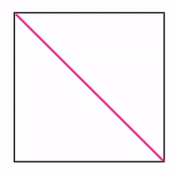
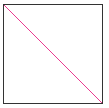
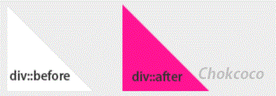
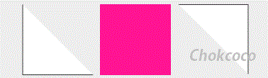

## 10、CSS 斜线的实现

如何使用单个标签，实现下图所示的斜线效果。



这种类似于表格的斜线效果，细细研究一下，还是有一些挺有趣的方法可以实现之。

我们假定我们的 `HTML` 结构如下：

```html
<div></div>
```

假定高宽各为 100px，在单个标签局限内，看看能有多少种方法实现。

### 法一、CSS3 旋转缩放

这个应该属于看到需求第一眼就可以想到的方法了。

这里我们使用 **伪元素** 画出一条直线，然后绕 div 中心旋转 45deg ，再缩放一下就可以得到。

简单的一张流程图：



示意图如下：



:::code-group

```html[html]
<div></div>
```

```scss[scss]
div{
  position:relative;
  margin:50px auto;
  width:100px;
  height:100px;
  box-sizing:border-box;
  border:1px solid #333;
  // background-color:#333;
  line-height:120px;
  text-indent:5px;
}

div::before{
  content:"";
  position:absolute;
  left:0;
  top:0;
  width:100%;
  height:50px;
  box-sizing:border-box;
  border-bottom:1px solid deeppink;
  transform-origin:bottom center;
  // transform:rotateZ(45deg) scale(1.414);
  animation:slash 5s infinite ease;
}

@keyframes slash{
  0%{
    transform:rotateZ(0deg) scale(1);
  }
  30%{
    transform:rotateZ(45deg) scale(1);
  }
  60%{
    transform:rotateZ(45deg) scale(1.414);
  }
  100%{
    transform:rotateZ(45deg) scale(1.414);
  }
}
```

:::

### 法二、线性渐变实现

这种方法使用了背景的线性渐变实现，渐变背景很重要的一点是，**虽然名字唤作渐变，但是也是可以画出实色而非渐变色**。

我们选定线性渐变的方向为 45deg，依次将渐变色值设为：`transparent` -> `deeppink` -> `deeppink` -> `transparent`。

> `transparent` 为透明色值。

就像这样简单的一句，即可实现斜线效果：

```css
background: linear-gradient(
  45deg,
  transparent 49.5%,
  deeppink 49.5%,
  deeppink 50.5%,
  transparent 50.5%
);
```



:::code-group

```html[html]
<div></div>
```

```scss[scss]
div{
  position:relative;
  margin:50px auto;
  width:100px;
  height:100px;
  box-sizing:border-box;
  border:1px solid #333;
  line-height:120px;
  text-indent:5px;
  background:
    linear-gradient(45deg, transparent 49.5%, deeppink 49.5%, deeppink 50.5%, transparent 50.5%);
}
```

:::

### 法三、伪元素+三角形

接下来两种方法就有点为了斜线而斜线的感觉。

利用 CSS border ，是可以轻松实现一个类似这样的三角形的：


CSS 代码如下：

```html
div{ border:50px solid transparent; border-left:50px solid deeppink;
border-bottom:50px solid deeppink; }
```

这里，我们使用 `div` 的两个 `伪元素` 画出两个大小不一的三角形，然后通过叠加在一起的方式，实现一条斜线。

类似这样，配合 div 的白色底色，即可得到一条斜线：



:::code-group

```html[html]
<div></div>
```

```scss[scss]
body{
  background:#eee;
}
div{
  position:relative;
  margin:50px auto;
  width:100px;
  height:100px;
  box-sizing:border-box;
  border:1px solid #333;
  background:#fff;
  line-height:120px;
  text-indent:5px;
}

div::before{
  content:"";
  position:absolute;
  left:0;
  bottom:0;
  width:0;
  height:0;
  border:49px solid transparent;
  border-left:49px solid deeppink;
  border-bottom:49px solid deeppink;
  animation:slash 6s infinite ease;
}

div::after{
  content:"";
  position:absolute;
  left:0;
  bottom:0;
  width:0;
  height:0;
  border:48px solid transparent;
  border-left:48px solid #fff;
  border-bottom:48px solid #fff;
  animation:slash2 6s infinite ease;
}

@keyframes slash{
  0%{
    transform:translate(-50px);
  }
  30%{
    transform:translate(0px);
  }
  100%{
    transform:translate(0px);
  }
}
@keyframes slash2{
  0%{
    transform:translate(-100px);
  }
  30%{
    transform:translate(-100px);
  }
  60%{
    transform:translate(0px);
  }
  100%{
    transform:translate(0px);
  }
}
```

:::

### 法四、clip-path

`clip-path` 是啥？可以算是 CSS3 的新增属性，或者准确来说是 SVG 的 的 CSS 版本。

使用 `clip-path`，我们可以定义任意想要的剪裁路径。

> 本文不深入探讨 `clip-path` ，可以先移步 [MDN](https://developer.mozilla.org/zh-CN/docs/Web/CSS/clip-path) 或者其他关于 clip-path 讲解的文章学习一下。

使用 `clip-path` 的多边形规则 `polygen`，也可以轻松制作一个三角形（本题中，我们依然借助伪元素来使用`clip-path`）：


CSS 代码如下：

```css
div {
  width: 100px;
  height: 100px;
  -webkit-clip-path: polygon(0 0, 0 100px, 100px 100px, 0 0);
  background: deeppink;
}
```

可以看到 CSS 代码，主要 `polygon(0 0, 0 100px, 100px 100px, 0 0)` 中，其实是一系列路径坐标点，整个图形就是由这些点围起来的区域。

所以使用 `clip-path` 加上两个伪元素我们可以像 `解法三` 一样制作出斜线。

当然，我们也可以换一种方法，殊途同归，解法三也可以这样做，看看下面的效果图：



:::code-group

```html[html]
<div></div>
```

```scss[scss]
body{
  background:#eee;
}
div{
  position:relative;
  margin:50px auto;
  width:100px;
  height:100px;
  box-sizing:border-box;
  // border:1px solid deeppink;
  background-color:deeppink;
  line-height:120px;
  text-indent:5px;
}

div::before{
  content:"";
  position:absolute;
  left:0px;
  top:0;
  right:0;
  bottom:0;
  -webkit-clip-path: polygon(0 0, 0 100px, 100px 100px, 0 0);
  background:#fff;
  border:1px solid #333;
  transform:translateX(-120px);
  animation:move 5s infinite linear;
}

div::after{
  content:"";
  position:absolute;
  left:0;
  top:0;
  right:0;
  bottom:0;
  -webkit-clip-path: polygon(100px 99px, 100px 0, 1px 0, 100px 99px);
  background:#fff;
  border:1px solid #333;
  transform:translateX(120px);
  animation:move 5s infinite linear;
}

@keyframes move{
  40%{
    transform:translateX(0px);
  }
  100%{
    transform:translateX(0px);
  }
}
```

:::
