## 单标签，使用 conic-gradient 实现表盘刻度

最简单便捷的方式，就是利用角向渐变的方式 `conic-gradient`，代码也非常简单，首先，我们实现一个重复角向渐变：

```html
<div></div>
```


```css
div {
    width: 300px;
    height: 300px;
    border-radius: 50%;
    background: repeating-conic-gradient(
        #000 0, #000 .8deg, transparent 1deg, transparent calc((360 / 60) * 1deg)
    );
}
```


其实比较难理解的是 `calc((360 / 60) * 1deg)`，这是因为表盘一共通常有 60 个刻度。效果大概是这样：

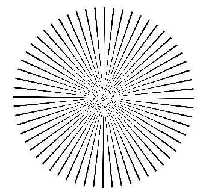

接下来，只需要将中间镂空即可。如果背景色是白色，直接叠加一个圆形即可，当然，更好的方式是通过 mask 属性进行镂空：

```css
{
    background: repeating-conic-gradient(
        #000 0, #000 .8deg, transparent 1deg, transparent calc(360 / 60 * 1deg)
    );
    mask: radial-gradient(transparent 0, transparent 140px, #000 140px)
}
```


这样，我们就得到了一个表盘刻度：

[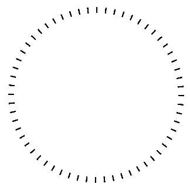](https://user-images.githubusercontent.com/8554143/164216192-49713e89-dafa-48a0-a614-db1f96dd999c.png)

这是使用一个标签就能实现的方式，当然，缺点也很明显：

1. 锯齿感严重，渐变的通病
2. 由于是使用的角向渐变，刻度存在头重脚轻的现象，越向内部，宽度越窄（刻度愈大，差异愈加明显）

[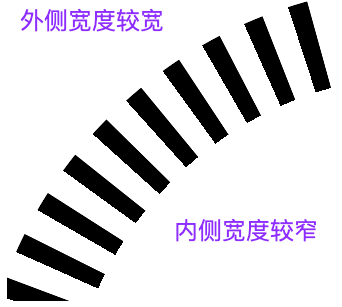](https://user-images.githubusercontent.com/8554143/164217015-fc8f0692-4238-4838-be60-e239a49e5d00.png)

## 使用多个标签实现

如果不介意使用太多的标签，那么通常而言，更容易想到的方法就是利用 60 个标签，加上旋转实现：

```html
<div class="g-container">
        <div class="g-item"></div>
        // ... 一共 60 个
        <div class="g-item"></div>
    </div>
```


```scss
.g-item {
    position: absolute;
    width: 4px;
    height: 12px;
    background: #000;
    left: 0;
    top: 0;
    transform-origin: 0 150px;
}
@for $i from 1 through 60 { 
    .g-item:nth-child(#{$i}) {
        transform: rotate(#{($i - 1) * 6deg});
    }
}
```


像是这样，我们通过 60 个 div 标签，利用 SASS 的 for 语法减少重复的代码量，批量实现每个元素逐渐绕一点旋转一定的角度，也是可以实现一个表盘刻度的：

[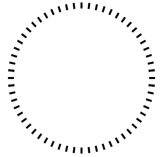](https://user-images.githubusercontent.com/8554143/164229191-beabad28-9586-45fb-9ec6-d62e2dc259c0.png)

这个方案的好处是，每个刻度粗细一致，并且，不会产生锯齿。

## 借助 -webkit-box-reflect 减少标签数

当然，上述方案的缺点就在于，使用了 60 个标签去完成这样一个简单的图形，有点太奢侈了。

我们希望尽可能的优化优化标签的个数。此时，我们很容易的想到 -- `-webkit-box-reflect`，倒影效果属性。

[`-webkit-box-reflect`](https://developer.mozilla.org/en-US/docs/Web/CSS/-webkit-box-reflect) 是一个非常有意思的属性，它让 CSS 有能力像镜子一样，反射我们元素原本绘制的内容。

`-webkit-box-reflect` 的语法非常简单，最基本的用法像是这样：

```css
div {
    -webkit-box-reflect: below;
}
```


其中，below 可以是 below | above | left | right 代表下上左右，也就是有 4 个方向可以选。

假设我们有如下一张图片：

```html
<div></div>
```


```css
div {
    background-image: url('https://images.pokemontcg.io/xy2/12_hires.png');
}
```


[](https://user-images.githubusercontent.com/8554143/108519663-d2491380-7304-11eb-9910-a48ddd5a31f0.png)

加上 `-webkit-box-reflect: right`，也就是右侧的倒影：

```css
div {
    background-image: url('https://images.pokemontcg.io/xy2/12_hires.png');
    -webkit-box-reflect: right;
}
```


效果如下，生成了一个元素右侧的镜像元素：

[](https://user-images.githubusercontent.com/8554143/108520040-31a72380-7305-11eb-8063-73839f6c991b.png)

借助 `-webkit-box-reflect: right`，我们至少可以从 60 个标签减少到 15 个标签的使用。简单的嵌套两层即可。

我们简单改变一下 HTML 结构：

```html
<div class="g-parent">
    <div class="g-container">
        <div class="g-item"></div>
        // ... 一共 16 个
        <div class="g-item"></div>
    </div>
</div>
```


这一次，我们只需要实现 1/4 圆的刻度即可：

```scss
@for $i from 1 through 16 { 
    .g-item:nth-child(#{$i}) {
        transform: rotate(#{($i - 1) * 6deg});
    }
}
```


我们可以得到这样一个图形：

[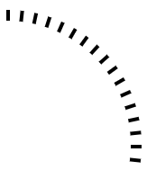](https://user-images.githubusercontent.com/8554143/164230484-e0112a3d-4ee3-4b32-a2ae-64cb480c0201.png)

基于这个图形，我们只需要先向左侧倒影一次，再向下倒影一次即可：

```css
.g-container {
    -webkit-box-reflect: below;
}
.g-parent {
    -webkit-box-reflect: left;
}
```


效果如下：

[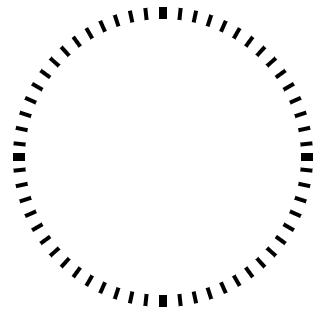](https://user-images.githubusercontent.com/8554143/164230750-f7e85bbc-cb98-47e5-b6af-650b20e8e304.png)

大致的效果就出来了，当然，0点、3点、6点、9点上左下右 4 个刻度有点问题。不过 `-webkit-box-reflect` 也提供距离调整功能，再简单修改下代码：

```css
.g-container {
    -webkit-box-reflect: below 4px;
}
.g-parent {
    -webkit-box-reflect: left -4px;
}
```


这次，效果就是我们想要的最终效果：

<iframe height="300" style="width: 100%;" scrolling="no" title="Clock ticks" src="https://codepen.io/mafqla/embed/GRLrbjY?default-tab=html%2Cresult&editable=true&theme-id=light" frameborder="no" loading="lazy" allowtransparency="true" allowfullscreen="true">
  See the Pen <a href="https://codepen.io/mafqla/pen/GRLrbjY">
  Clock ticks</a> by mafqla (<a href="https://codepen.io/mafqla">@mafqla</a>)
  on <a href="https://codepen.io">CodePen</a>.
</iframe>

我们就成功地借助 `-webkit-box-reflect` 节约了 3/4 的标签数量。

## -webkit-box-reflect 与剪纸艺术

到这里，我不由得想到，**这种对折、再对折，镜像再镜像的方式，与我们小时候的折纸艺术非常的类似**。

那么，基于这样一个模板：

```html
<div class="g-parent">
    <div class="g-container">
        <div class="g-item"></div>
    </div>
</div>
```


```css
.g-container {
    -webkit-box-reflect: below;
}
.g-parent {
    -webkit-box-reflect: left;
}
```


我只需要绘制 `.g-item` 里面的内容，将他通过 2 次 `-webkit-box-reflect` 镜像，就能得到一个**剪纸图形**。

而如何得到随机有意思的不规则图形呢？

`clip-path` 是个很不错的选择，我们通过 `clip-path` 随机对一个矩形进行裁剪：

```css
.g-item {
    width: 150px;
    height: 150px;
    background: #000;
    clip-path: polygon(25% 0%,71% 66%,59% 0%,79% 23%,95% 4%,100% 40%,77% 100%,38% 100%,47% 71%,36% 30%,23% 60%,0% 100%,5% 37%);
}
```


效果如下：

[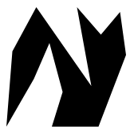](https://user-images.githubusercontent.com/8554143/164232217-4ff9437f-d7b3-4c75-9136-5fdb25b1994a.png)

经过两次镜像后的效果如下：

[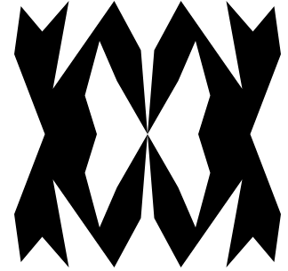](https://user-images.githubusercontent.com/8554143/164232383-7f065f34-7be2-4873-9462-d0e548169576.png)

是不是有那么点意思了？可以随机利用 `clip-path` 多尝试几次，可以得到不同的效果：

<iframe height="300" style="width: 100%;" scrolling="no" title="Pure CSS Page Cutting" src="https://codepen.io/mafqla/embed/bGJgPwy?default-tab=html%2Cresult&editable=true&theme-id=light" frameborder="no" loading="lazy" allowtransparency="true" allowfullscreen="true">
  See the Pen <a href="https://codepen.io/mafqla/pen/bGJgPwy">
  Pure CSS Page Cutting</a> by mafqla (<a href="https://codepen.io/mafqla">@mafqla</a>)
  on <a href="https://codepen.io">CodePen</a>.
</iframe>


## -webkit-box-reflect 配合 clip-path 配合 mask

但是上面的图形看着还是太简单了，几个原因，一是对折的次数和角度不够，缺少对折次数和不同角度的对折，二是图形不够负责。


再上述的基础上，还使用了 mask，将图形切割的更细。

我们再来一次，还是同样的结构，当然，为了得到更负责的图形，我们设置了 4 个 `.g-item`：

```html
<div class="g-parent">
    <div class="g-container">
        <div class="g-item"></div>
        <div class="g-item"></div>
        <div class="g-item"></div>
        <div class="g-item"></div>
    </div>
</div>
```


首先，还是设置一个 `clip-path` 切割后的图形：

```css
.g-item:nth-child(1) {
    width: 150px;
    height: 150px;
    background: #000;
    clip-path: polygon(17% 41%,6% 39%,16% 91%,18% 78%,56% 11%,28% 71%,99% 67%,25% 65%,69% 72%,46% 28%,90% 76%,67% 34%,48% 30%,79% 36%,59% 15%,23% 92%,16% 1%,32% 81%,72% 38%,50% 59%,71% 98%,66% 87%,83% 14%,36% 71%,49% 7%,9% 25%,52% 76%,10% 83%,17% 41%);
}
```


效果如下：

[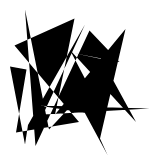](https://user-images.githubusercontent.com/8554143/164234958-5f87a016-709c-40ac-acb6-6a0e6491ae4d.png)

这个图可能它会特别的奇怪，没有问题，我们继续。

如果，我们将一个矩形，从左下角开始算，分为 4 份，那么每一个份就是 `90° / 4 = 22.5°`，我们希望切割得到其中一份：

[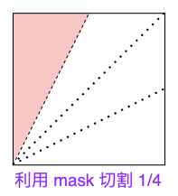](https://user-images.githubusercontent.com/8554143/164236628-cac553db-e4b9-4f78-8913-57ec8d7a51fb.png)

我们可以借助 mask 去完成这个切割：

```css
.g-item:nth-child(1) {
    width: 150px;
    height: 150px;
    background: #000;
    clip-path: polygon(.....);
    mask: conic-gradient(from 0turn at 0 100%, #000, #000 22.5deg, transparent 22.5deg, transparent);
}
```


上述的图形，就被切割成了这样：

[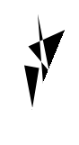](https://user-images.githubusercontent.com/8554143/164235253-d292ef7d-ad3a-478a-a0f3-fa7d56b0f2bc.png)

OK，基于此，我们可以得到同样的第二份图形，但是我们给它加一个 `rotateY(180deg)`：c

效果如下：

[](https://user-images.githubusercontent.com/8554143/164237136-037432e9-9539-405a-8446-e25283e51ba7.png)

我们再通过 `rotateZ()`，给第二图形旋转一定的角度，让他和第一个贴合在一起：

```css
.g-item:nth-child(2) {
    clip-path: polygon(.....);
    mask: conic-gradient(from 0turn at 0 100%, #000, #000 22.5deg, transparent 22.5deg, transparent);
    transform: rotateY(180deg) rotateZ(-45deg);
}
```


就得到了一个斜向角度的镜像图像：

[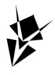](https://user-images.githubusercontent.com/8554143/164237702-0060bbc1-fbff-4b00-8ec3-0a15b88e2b57.png)

因为 `.g-item` 被切割成了 4 份，所以第 3、4 个图形如法炮制即可，这样，整个 `.g-item` 的效果如下：

[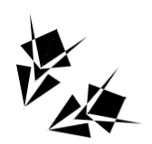](https://user-images.githubusercontent.com/8554143/164237965-f34863fe-2635-46eb-b600-f4901341de74.png)

再打开 `-webkit-box-reflect`，整个的图形效果如下：

[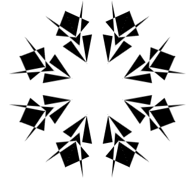](https://user-images.githubusercontent.com/8554143/164238208-6b05c483-0b2f-4839-a1f1-3ca90e13ad20.png)

这样，一个剪纸图形就诞生啦！

当然，为了得到不一样的效果，我们可以借助 JavaScript 去随机生成 CSS 中的各类参数，完整的代码，大概是这样：

```html
<div class="g-parent">
    <div class="g-container">
        <div class="g-item"></div>
        <div class="g-item"></div>
        <div class="g-item"></div>
        <div class="g-item"></div>
    </div>
</div>
```


```scss
.g-container,
.g-parent {
    position: relative;
    display: flex;
    width: 150px;
    height: 150px;
}
.g-item {
    position: absolute;
    top: 0;
    left: 0;
    bottom: 0;
    right: 0;
    background: #000;
    transform-origin: 0 100%;
    clip-path: var(--polygon, polygon(40% 0%,0% 91%,52% 100%,0% 37%,77% 23%,77% 76%,43% 22%,55% 88%,100% 100%,100% 10%));
}
.g-item {
    mask: conic-gradient(from 0turn at 0 100%, #000, #000 22.5deg, transparent 22.5deg, transparent);
}
@for $i from 1 through 5 { 
    .g-item:nth-child(#{$i}) {
        transform: rotateZ(calc(22.5deg * #{$i - 1}));
    }
}
.g-item:nth-child(2) {
    transform: rotateY(180deg) rotateZ(-60deg);
}
.g-item:nth-child(4) {
    transform: rotateY(180deg) rotateZ(-105deg);
}
.g-container {
    -webkit-box-reflect: below;
}
.g-parent {
    -webkit-box-reflect: left;
}
```


```js
const ele = document.querySelectorAll('.g-item');

document.addEventListener('click', function(e) {
    let num = Math.floor(Math.random() * 30 + 10);
    
    const maskR =  Math.floor(Math.random() * 22.5 + 22.5 ) + 'deg';
    const r1 = Math.floor(Math.random() * 100) + '%';
    const r2 = Math.floor(Math.random() * 100) + '%'; 
    
    let polygon = 'polygon(' + r1 + ' ' + r2 + ',';
    
    for (let i=0; i<num; i++) {
         const newR1 = Math.floor(Math.random() * 100) + '%';
         const newR2 = Math.floor(Math.random() * 100) + '%';

        polygon += newR1 + ' ' + newR2 + ','
    }
    
    polygon += r1 + ' ' + r2 + ')';
    
    [...ele].forEach(item => {
        item.setAttribute('style', `--polygon:${polygon};-webkit-mask:conic-gradient(from 0turn at 0 100%, #000, #000 ${maskR}, transparent ${maskR}, transparent)`);
    });
});
```


这样，每次点击鼠标，我们都能得到不同的随机剪纸图案：

[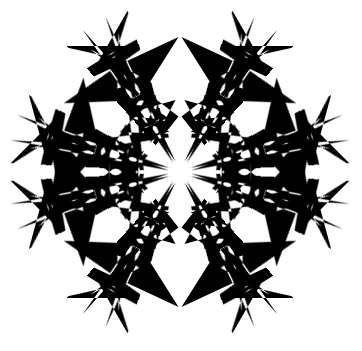](https://user-images.githubusercontent.com/8554143/164238859-f21271ef-f2d7-400e-af88-2bd5b6d7a17d.png)

看看这个简单录制的 GIF：

<iframe height="300" style="width: 100%;" scrolling="no" title="Pure CSS Art Page Cutting" src="https://codepen.io/mafqla/embed/zYXNVoN?default-tab=html%2Cresult&editable=true&theme-id=light" frameborder="no" loading="lazy" allowtransparency="true" allowfullscreen="true">
  See the Pen <a href="https://codepen.io/mafqla/pen/zYXNVoN">
  Pure CSS Art Page Cutting</a> by mafqla (<a href="https://codepen.io/mafqla">@mafqla</a>)
  on <a href="https://codepen.io">CodePen</a>.
</iframe>

