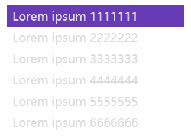
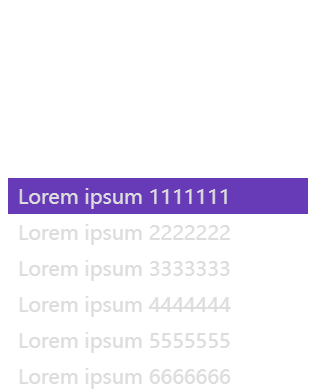
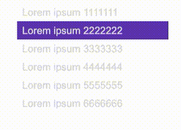
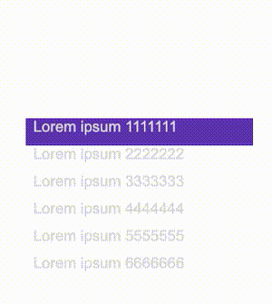
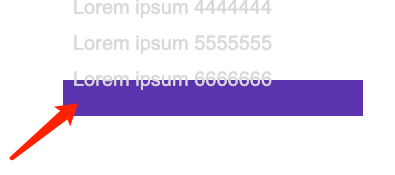
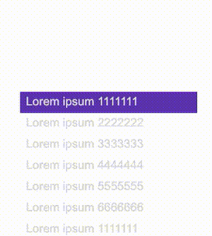

## 逐帧动画控制整体切换

首先，我需要利用到逐帧动画效果，也被称为**步骤缓动函数**，利用的是 `animation-timing-function` 中，的 steps，语法如下：

```css
{
    /* Keyword values */
    animation-timing-function: step-start;
    animation-timing-function: step-end;
    /* Function values */
    animation-timing-function: steps(6, start)
    animation-timing-function: steps(4, end);
}
```

好的，还是文章以开头的例子，假设我们存在这样 HTML 结构：

```html
<div class="g-container">
  <ul>
    <li>Lorem ipsum 1111111</li>
    <li>Lorem ipsum 2222222</li>
    <li>Lorem ipsum 3333333</li>
    <li>Lorem ipsum 4444444</li>
    <li>Lorem ipsum 5555555</li>
    <li>Lorem ipsum 6666666</li>
  </ul>
</div>
```

首先，我们实现这样一个简单的布局：

[](https://user-images.githubusercontent.com/8554143/169681177-3bcc9a3e-f32f-4892-9156-8ab38d515db9.png)

在这里，要实现轮播效果，并且是任意个数，我们可以借助 `animation-timing-function: steps()`：

```css
:root {
  // 轮播的个数
  --s: 6;
  // 单个 li 容器的高度
  --h: 36;
  // 单次动画的时长
  --speed: 1.5s;
}
.g-container {
  width: 300px;
  height: calc(var(--h) * 1px);
}
ul {
  display: flex;
  flex-direction: column;
  animation: move calc(var(--speed) * var(--s)) steps(var(--s)) infinite;
}
ul li {
  width: 100%;
}
@keyframes move {
  0% {
    transform: translate(0, 0);
  }
  100% {
    transform: translate(0, calc(var(--s) * var(--h) * -1px));
  }
}
```

别看到上述有几个 CSS 变量就慌了，其实很好理解：

1. `calc(var(--speed) * var(--s))`：单次动画的耗时 \* 轮播的个数，也就是总动画时长
2. `steps(var(--s))` 就是逐帧动画的帧数，这里也就是 `steps(6)`，很好理解
3. `calc(var(--s) * var(--h) * -1px))` 单个 li 容器的高度 \* 轮播的个数，其实就是 ul 的总体高度，用于设置逐帧动画的终点值

上述的效果，实际如下：

[](https://user-images.githubusercontent.com/8554143/169681483-f4ccced1-0d2e-475e-af60-2ca54e9402f5.gif)

如果给容器添加上 `overflow: hidden`，就是这样的效果：

[](https://user-images.githubusercontent.com/8554143/169681559-3aae3e2c-6f7e-4eac-84cc-f014d74a05c9.gif)

这样，我们就得到了整体的结构，至少，整个效果是循环的。

但是由于只是逐帧动画，所以只能看到切换，但是每一帧之间，没有过渡动画效果。所以，接下来，我们还得引入补间动画。

## 利用补间动画实现两组数据间的切换

我们需要利用补间动画，实现动态的切换效果。

这一步，其实也非常简单，我们要做的，就是将一组数据，利用 `transform`，从状态 A 位移到 状态 B。

单独拿出一个来演示的话，大致的代码如下：

```html
<div class="g-container">
  <ul style="--s: 6">
    <li>Lorem ipsum 1111111</li>
    <li>Lorem ipsum 2222222</li>
    <li>Lorem ipsum 3333333</li>
    <li>Lorem ipsum 4444444</li>
    <li>Lorem ipsum 5555555</li>
    <li>Lorem ipsum 6666666</li>
  </ul>
</div>
```

```css
:root {
  --h: 36;
  --speed: 1.5s;
}
ul li {
  height: 36px;
  animation: liMove calc(var(--speed)) infinite;
}
@keyframes liMove {
  0% {
    transform: translate(0, 0);
  }
  80%,
  100% {
    transform: translate(0, -36px);
  }
}
```

非常简单的一个动画：

[](https://user-images.githubusercontent.com/8554143/169817246-ead74236-d1a4-4629-b5a4-ca6a03ca5e68.gif)

基于上述效果，我们如果把一开始提到的 **逐帧动画** 和这里这个 **补间动画** 结合一下，ul 的整体移动，和 li 的 单个移动叠在在一起：

```css
:root {
  // 轮播的个数
  --s: 6;
  // 单个 li 容器的高度
  --h: 36;
  // 单次动画的时长
  --speed: 1.5s;
}
.g-container {
  width: 300px;
  height: calc(var(--h) * 1px);
}
ul {
  display: flex;
  flex-direction: column;
  animation: move calc(var(--speed) * var(--s)) steps(var(--s)) infinite;
}
ul li {
  width: 100%;
  animation: liMove calc(var(--speed)) infinite;
}
@keyframes move {
  0% {
    transform: translate(0, 0);
  }
  100% {
    transform: translate(0, calc(var(--s) * var(--h) * -1px));
  }
}
@keyframes liMove {
  0% {
    transform: translate(0, 0);
  }
  80%,
  100% {
    transform: translate(0, calc(var(--h) * -1px));
  }
}
```

就能得到这样一个效果：

[](https://user-images.githubusercontent.com/8554143/169817863-a4fd2e15-aeb4-4e20-85db-1be2d0d7926a.gif)

Wow，神奇的化学反应产生了！基于 **逐帧动画** 和 **补间动画** 的结合，我们几乎实现了一个轮播效果。

当然，有一点瑕疵，可以看到，最后一组数据，是从第六组数据 transform 移动向了一组空数据：

[](https://user-images.githubusercontent.com/8554143/169818210-a0229c86-55a7-460c-8828-04cee5d70c95.png)

### 末尾填充头部第一组数据

实际开发过轮播的同学肯定知道，这里，其实也很好处理，我们只需要在末尾，补一组头部的第一个数据即可：

改造下我们的 HTML：

```css
<div class="g-container">
  <ul>
    <li>Lorem ipsum 1111111</li>
    <li>Lorem ipsum 2222222</li>
    <li>Lorem ipsum 3333333</li>
    <li>Lorem ipsum 4444444</li>
    <li>Lorem ipsum 5555555</li>
    <li>Lorem ipsum 6666666</li>
    <!--末尾补一个首条数据-->
    <li>Lorem ipsum 1111111</li>
  </ul>
</div>
```

这样，我们再看看效果：

[](https://user-images.githubusercontent.com/8554143/169818781-4a1aab0f-2f69-4d79-b89c-57257f3cc9c2.gif)

Beautiful！如果你还有所疑惑，我们给容器加上 `overflow: hidden`，实际效果如下，通过额外添加的最后一组数据，我们的整个动画刚好完美的衔接上，一个完美的轮播效果：

[](https://user-images.githubusercontent.com/8554143/169294742-34a2bb8f-9129-4a7b-a11b-8d60fe6b1d26.gif)

<iframe height="300" style="width: 100%;" scrolling="no" title="Vertical Infinity Loop " src="https://codepen.io/mafqla/embed/YzMVzLL?default-tab=html%2Cresult&editable=true&theme-id=light" frameborder="no" loading="lazy" allowtransparency="true" allowfullscreen="true">
  See the Pen <a href="https://codepen.io/mafqla/pen/YzMVzLL">
  Vertical Infinity Loop </a> by mafqla (<a href="https://codepen.io/mafqla">@mafqla</a>)
  on <a href="https://codepen.io">CodePen</a>.
</iframe>

### 横向无限轮播

当然，实现了竖直方向的轮播，横向的效果也是一样的。

并且，我们可以通过在 HTML 结构中，通过 style 内填写 CSS 变量值，传入实际的 li 个数，以达到根据不同 li 个数适配不同动画：

```html
<div class="g-container">
  <ul style="--s: 6">
    <li>Lorem ipsum 1111111</li>
    <li>Lorem ipsum 2222222</li>
    <li>Lorem ipsum 3333333</li>
    <li>Lorem ipsum 4444444</li>
    <li>Lorem ipsum 5555555</li>
    <li>Lorem ipsum 6666666</li>
    <!--末尾补一个首尾数据-->
    <li>Lorem ipsum 1111111</li>
  </ul>
</div>
```

整个动画的 CSS 代码基本是一致的，我们只需要改变两个动画的 `transform` 值，从竖直位移，改成水平位移即可：

```css
:root {
  --w: 300;
  --speed: 1.5s;
}
.g-container {
  width: calc(--w * 1px);
  overflow: hidden;
}
ul {
  display: flex;
  flex-wrap: nowrap;
  animation: move calc(var(--speed) * var(--s)) steps(var(--s)) infinite;
}
ul li {
  flex-shrink: 0;
  width: 100%;
  height: 100%;
  animation: liMove calc(var(--speed)) infinite;
}
@keyframes move {
  0% {
    transform: translate(0, 0);
  }
  100% {
    transform: translate(calc(var(--s) * var(--w) * -1px), 0);
  }
}
@keyframes liMove {
  0% {
    transform: translate(0, 0);
  }
  80%,
  100% {
    transform: translate(calc(var(--w) * -1px), 0);
  }
}
```

这样，我们就轻松的转化为了横向的效果：

<iframe height="300" style="width: 100%;" scrolling="no" title="Horizontal Infinity Loop" src="https://codepen.io/mafqla/embed/gOyWOzQ?default-tab=html%2Cresult&editable=true&theme-id=light" frameborder="no" loading="lazy" allowtransparency="true" allowfullscreen="true">
  See the Pen <a href="https://codepen.io/mafqla/pen/gOyWOzQ">
  Horizontal Infinity Loop</a> by mafqla (<a href="https://codepen.io/mafqla">@mafqla</a>)
  on <a href="https://codepen.io">CodePen</a>.
</iframe>

## 轮播图？不在话下

OK，上面的只是文字版的轮播，那如果是图片呢？

没问题，方法都是一样的。基于上述的代码，我们可以轻松地将它修改一下后得到图片版的轮播效果。

代码都是一样的，就不再列出来，直接看看效果：

<iframe height="300" style="width: 100%;" scrolling="no" title="Horizontal Image Infinity Loop" src="https://codepen.io/mafqla/embed/OJGmJZd?default-tab=html%2Cresult&editable=true&theme-id=light" frameborder="no" loading="lazy" allowtransparency="true" allowfullscreen="true">
  See the Pen <a href="https://codepen.io/mafqla/pen/OJGmJZd">
  Horizontal Image Infinity Loop</a> by mafqla (<a href="https://codepen.io/mafqla">@mafqla</a>)
  on <a href="https://codepen.io">CodePen</a>.
</iframe>

掌握了这个技巧之后，你可以将它运用在非常多只需要简化版的轮播效果之上。

再简单总结一下，非常有意思的技巧：

1. 利用 **逐帧动画**，实现整体的轮播的循环效果
2. 利用 **补间动画**，实现具体的 **状态 A\* 向 **状态 B\*\* 的动画效果
3. **逐帧动画** 配合 **补间动画** 构成整体轮播的效果
4. 通过向 HTML 结构末尾补充一组头部数据，实现整体动画的衔接
5. 通过 HTML 元素的 style 标签，利用 CSS 变量，填入实际的参与循环的 DOM 个数，可以实现 JavaScript 与 CSS 的打通
