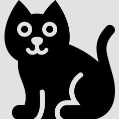
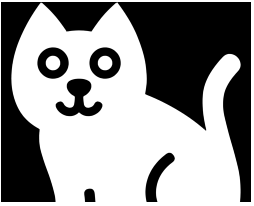
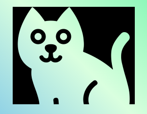
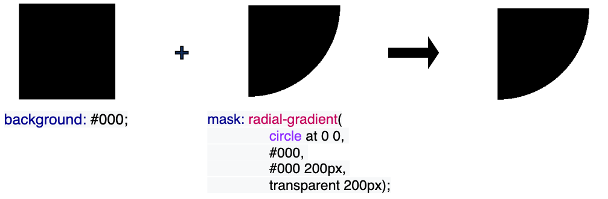
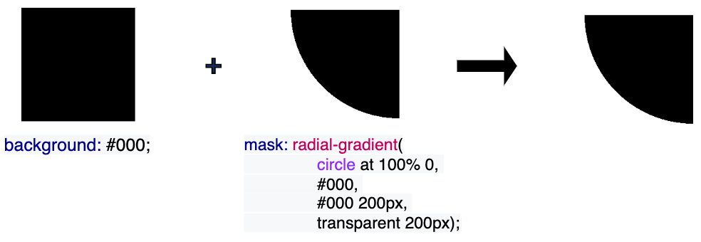
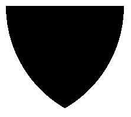
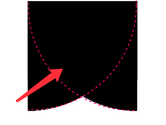
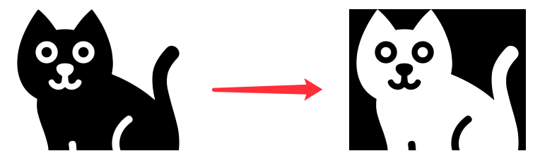

## 通过单张 PNG/SVG 得到它的反向切图

事情的经过是这样的，某天，我们拿到了这样一张 PNG/SVG 图片：

[](https://user-images.githubusercontent.com/8554143/175941292-4a7da623-aed1-4b69-843e-bb2c647c7fe6.png)

就这张图片而言，它是一张 PNG 图，灰色部分透明。

随着需求的进行，在某一处，我们需要一张基于上述图形的反向镂空图形：

[](https://user-images.githubusercontent.com/8554143/175942091-f0b0f78c-ec43-4fe0-bb18-018ada95df2e.png)

emmm，要注意，这里白色处是需要透明的，要能透出不同的背景色，像是这样：

[](https://user-images.githubusercontent.com/8554143/175942638-deba154e-de1d-4383-ac21-60d4bce5eeba.png)

怎么办呢，通常而言，只能是找 UI 再出一张镂空图。

当然，在今天，只需要一张 PNG/SVG，我们就可以使用 CSS 轻松完成上述的转换。这里我们需要用到 `mask-composite`。

## 何为 `mask-composite`？

那么，何为 `mask-composite`，当然，现阶段还需要加上浏览器前缀，`-webkit-mask-composite`。

首先，要学会使用 `mask-composite`，得先知道 CSS 中另外一个非常重要且有用的属性 -- `mask`。

> 如果，你对 `mask` 还比较陌生，建议你先看看这篇 -- [奇妙的 CSS MASK](https://github.com/chokcoco/iCSS/issues/80)

在运用 mask 对图片进行遮罩切割处理的同时，我们可以同时再运用到 `mask-composite` 属性。这个是非常有意思的元素。

[-webkit-mask-composite](https://developer.mozilla.org/en-US/docs/Web/CSS/-webkit-mask-composite): 属性指定了将应用于同一元素的多个蒙版图像相互合成的方式。

通俗点来说，他的作用就是，当一个元素存在多重 mask 时，我们就可以运用 -webkit-mask-composite 进行效果叠加。

举个栗子：

```html
<div class="original"></div>
```

```css
.original {
  background: #000;
  mask: radial-gradient(circle at 0 0, #000, #000 200px, transparent 200px);
}
```

我们用一个 `radial-gradient` 作为 mask，切割原本的矩形，得到一个新的图形。

[](https://user-images.githubusercontent.com/8554143/175945896-8bb38de2-5e54-4f7f-ae95-43abfd725d66.png)

如果再换一个方向：

```html
<div class="original"></div>
```

```css
.original {
  background: #000;
  mask: radial-gradient(circle at 100% 0, #000, #000 200px, transparent 200px);
}
```

[](https://user-images.githubusercontent.com/8554143/175946282-f8f10567-9f29-49d3-9454-5a567c8f10d8.png)

如果我想得到这样一个效果：

[](https://user-images.githubusercontent.com/8554143/175946549-5956617d-7b57-45b7-a031-b2937730823c.png)

该怎么做呢？

我们尝试合并上述两个 mask 的效果：

```css
.mask {
  background: #000;
  mask: radial-gradient(circle at 100% 0, #000, #000 200px, transparent 200px),
    radial-gradient(circle at 0 0, #000, #000 200px, transparent 200px);
}
```

效果如下：

[](https://user-images.githubusercontent.com/8554143/175946763-49eb4188-7094-4a77-8642-4464241ffb3f.png)

与我们想象的不太一样，这是因为，两个 mask 的图形叠加，就是上述图形的效果，所以上述效果是没有问题的。

只是，我们想得到的是两个 mask 图形的重叠部分：

[](https://user-images.githubusercontent.com/8554143/175948022-bd0dc807-97a5-43d6-a92d-5c8d24050b5b.png)

这时，我们就可以使用 `mask-composite`：

```css
.mask {
  background: #000;
  mask: radial-gradient(circle at 100% 0, #000, #000 200px, transparent 200px),
    radial-gradient(circle at 0 0, #000, #000 200px, transparent 200px);
  -webkit-mask-composite: source-in;
}
```

添加了 `-webkit-mask-composite: source-in` 后，我们就可以得到两个 mask 图形的重叠部分，再基于这个重叠部分作用到整个 mask 遮罩：

<iframe height="300" style="width: 100%;" scrolling="no" title="mask-composite Demo" src="https://codepen.io/mafqla/embed/bGJReMQ?default-tab=html%2Cresult&editable=true&theme-id=light" frameborder="no" loading="lazy" allowtransparency="true" allowfullscreen="true">
  See the Pen <a href="https://codepen.io/mafqla/pen/bGJReMQ">
  mask-composite Demo</a> by mafqla (<a href="https://codepen.io/mafqla">@mafqla</a>)
  on <a href="https://codepen.io">CodePen</a>.
</iframe>

`-webkit-mask-composite` 还可以实现非常多不同的功能，包括但不限于：

```css
-webkit-mask-composite: clear; /*清除，不显示任何遮罩*/
-webkit-mask-composite: copy; /*只显示上方遮罩，不显示下方遮罩*/
-webkit-mask-composite: source-over;
-webkit-mask-composite: source-in; /*只显示重合的地方*/
-webkit-mask-composite: source-out; /*只显示上方遮罩，重合的地方不显示*/
-webkit-mask-composite: source-atop;
-webkit-mask-composite: destination-over;
-webkit-mask-composite: destination-in; /*只显示重合的地方*/
-webkit-mask-composite: destination-out; /*只显示下方遮罩，重合的地方不显示*/
-webkit-mask-composite: destination-atop;
-webkit-mask-composite: xor; /*只显示不重合的地方*/
```

## 使用 `-webkit-mask-composite` 实现图片的扩展

基于上述的知识铺垫，回到我们的主题，在我们有了一张透明图片（PNG/SVG）之后，我们可以轻松的利用 `-webkit-mask-composite` 得到它的反向镂空图：

```css
.mask {
  background: #000;
  mask: url($img), linear-gradient(#fff, #000);
  mask-composite: exclude;
}
```

[](https://user-images.githubusercontent.com/8554143/175950342-e9e2a933-d0ed-463d-b3ba-0781ad518f6f.png)

不仅如此，我们还可以利用这个技巧，使用图片本身作为 mask 遮罩，配合 `-webkit-mask-composite`，从而将一张纯色图片，扩展到各类不同颜色，甚至是渐变色！

```html
<div class="original"></div>
<div class="mask"></div>
<div class="mask-color"></div>
<div class="mask-gradient"></div>
```

```css
.original {
  background: url($img);
  background-size: cover;
}
.mask {
  background: #000;
  mask: url($img), linear-gradient(#fff, #000);
  mask-composite: exclude;
}
.mask-color {
  background: green;
  mask: url($img), linear-gradient(#fff, #000);
  mask-composite: source-in;
}
.mask-gradient {
  background: linear-gradient(blue, yellowgreen);
  mask: url($img), linear-gradient(#fff, #000);
  mask-composite: source-in;
}
```

<iframe height="300" style="width: 100%;" scrolling="no" title="power of mask-composite" src="https://codepen.io/mafqla/embed/yLrXJjm?default-tab=html%2Cresult&editable=true&theme-id=light" frameborder="no" loading="lazy" allowtransparency="true" allowfullscreen="true">
  See the Pen <a href="https://codepen.io/mafqla/pen/yLrXJjm">
  power of mask-composite</a> by mafqla (<a href="https://codepen.io/mafqla">@mafqla</a>)
  on <a href="https://codepen.io">CodePen</a>.
</iframe>

这样，仅仅是利用一张 PNG/SVG 原图，我们就可以得到它的

1. 反向镂空图
2. 其他纯色图
3. 渐变色图

可以有效的节省图片资源，起到一定的优化效果！

当然，唯一的缺点，目前会受限于 `mask-composite` 和 `-webkit-mask-composite` 的兼容性，而且两者的语法存在一定的差异，实际使用的话需要注意。根据业务场景灵活选择。
