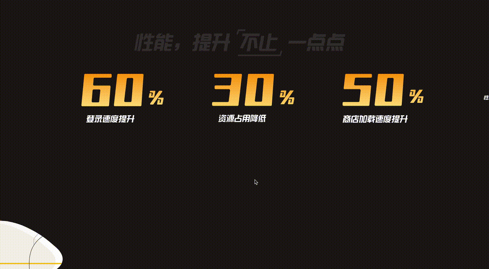
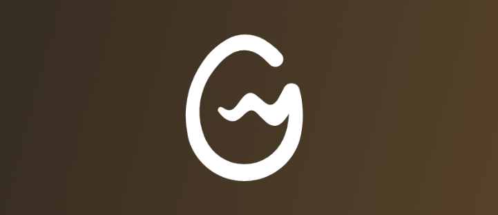
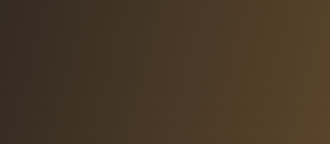
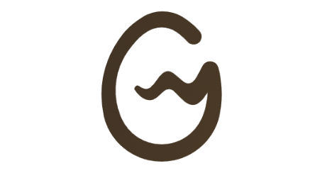
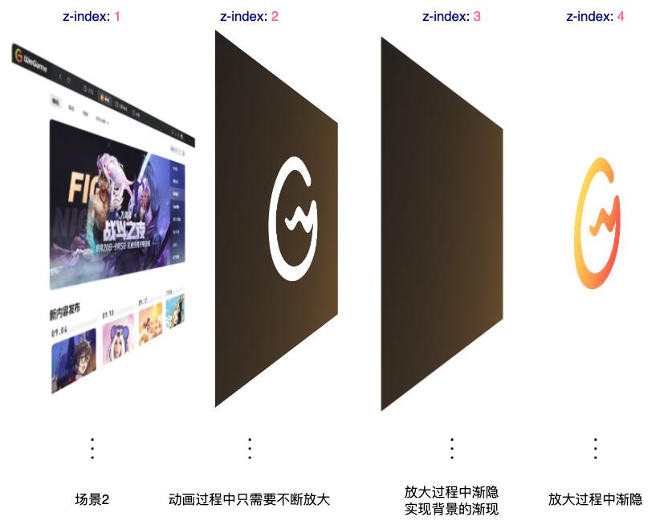
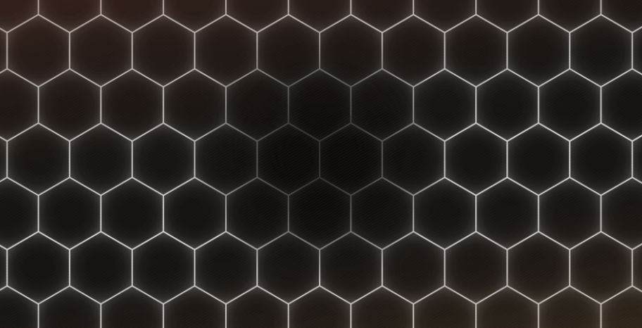
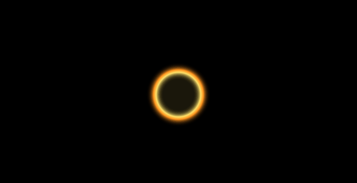

在 [WeGame](https://www.wegame.com.cn/client/) 的 PC 端官网首页，有着非常多制作精良的**基于滚动**的动画效果。

这里我简单截取其中 2 个比较有意思的转场动画，大家感受感受。转场动画 1：

[](https://user-images.githubusercontent.com/8554143/177775014-c6e3cf23-dc5b-4678-80bb-40a0d3521749.gif)

转场动画 2：

[](https://user-images.githubusercontent.com/8554143/177775093-f25e0264-5e74-4516-9068-9a537344e865.gif)

是不是挺有意思的，整个动画的衔接是基于滚轮的滚动触发的。我猜测是使用了类似 [TweenMaxJS](https://www.tweenmax.com.cn/index.html) 的动画库实现。

当然，这两处酷炫有意思的转场动画，基于最新的 CSS @scroll-timeline 规范，也是可以大致实现的。本文就将尝试使用纯 CSS，模拟上述的两个转场动画。

## 转场动画一

首先，我们来看看这个动画：

[](https://user-images.githubusercontent.com/8554143/177775014-c6e3cf23-dc5b-4678-80bb-40a0d3521749.gif)

核心步骤拆解一下：

1. 处于场景 1，接着借助 WeGame 的 LOGO，LOGO 开始放大
2. LOGO 放大到一定程度，开始渐隐，LOGO 背后的场景 2 逐渐渐现
3. LOGO 放大且渐隐消失，场景 2 完全出现

这里，要实现整个动画，有一个非常重要的场景，就是能够利用 LOGO 元素，切割背景，只看到 LOGO 背后的元素，像是得到一张这样的图片：

[](https://user-images.githubusercontent.com/8554143/177778421-c2be7b08-6bd0-4c23-86d0-b492246285c8.png)

注意，**图片的白色部分，不是白色，而是需要透明，能够透出背后的元素**。

当然，我们可以让 UI 切一张这样的图出来，但是毕竟太麻烦了。

假设我们只有一张 LOGO 元素：

[](https://user-images.githubusercontent.com/8554143/177778774-1a36aeaf-26be-4983-85da-67875d29f28c.png)

我们如何能够借助这个 LOGO，切割背景呢？

### 借助 mask 及 mask-composite 切割背景

是的，这里我们可以使用 `mask`。我们来尝试一下：

```html
<div></div>
```

```css
div {
  background: linear-gradient(-75deg, #715633, #2b2522);
}
```

假设我们有这样一张背景：

[](https://user-images.githubusercontent.com/8554143/177779450-baf6ac67-3357-4e14-8946-8ec0d01fe702.png)

我们使用 LOGO 图作为 MASK，对该背景进行切割：

```css
div {
  background: linear-gradient(-75deg, #715633, #2b2522);
  mask: url(WeGame-LOGO图.png);
  mask-repeat: no-repeat;
  mask-position: center center;
}
```

我们会得到这样一张图：

[](https://user-images.githubusercontent.com/8554143/177779866-0d9a5f21-d1bc-4171-8b39-6dfcee9606fb.png)

Oh No，这与我们想象的刚好相反，**我们要的是 LOGO 处透明，背景的其他处保留**。

我们简单改造一下代码：

```css
div {
  background: linear-gradient(-75deg, #715633, #2b2522);
  mask: url(//wegame.gtimg.com/g.55555-r.c4663/wegame-home/sc01-logo.52fe03c4.svg),
    linear-gradient(#fff, #fff);
  mask-repeat: no-repeat;
  mask-position: center center;
  -webkit-mask-composite: xor;
}
```

这样，我们能就顺利的得到了这样一张图形：

[](https://user-images.githubusercontent.com/8554143/177780601-2bd1c89f-665a-45bc-99d2-aaf4961af1d1.png)

当然这里需要注意的是，白色区域并非白色，而是透明的，可以透出背后的内容。

### 配合 @scroll-timeline

好，如此一来，基于上述的剪切层，再配合 `@scroll-timeline`，我们来模拟一个最基本的动画效果：

```html
<div class="g-scroll" id="g-scroll"></div>
<div class="g-wrap">
  <div class="g-bg"></div>
  <div class="g-container">
    <div class="g-wegame"></div>
  </div>
</div>
```

```css
.g-scroll {
  position: relative;
  width: 100vw;
  height: 500vh;
}
.g-wrap {
  position: fixed;
  top: 0;
  left: 0;
  width: 100vw;
  height: 100vh;
  overflow: hidden;
}
.g-container {
  position: absolute;
  top: 0;
  left: 0;
  width: 100vw;
  height: 100vh;
  animation-name: scale;
  animation-duration: 10s;
  animation-timeline: box-move;
}
.g-bg {
  position: fixed;
  width: 100vw;
  height: 100vh;
  background: url(LOGO背后的图层);
}
.g-wegame {
  position: absolute;
  width: 100vw;
  height: 100vh;
  background: linear-gradient(-75deg, #715633, #2b2522);
  mask: url(//wegame.gtimg.com/g.55555-r.c4663/wegame-home/sc01-logo.52fe03c4.svg),
    linear-gradient(#fff, #fff);
  mask-repeat: no-repeat;
  mask-position: center center;
  -webkit-mask-composite: xor;
}
@scroll-timeline box-move {
  source: selector('#g-scroll');
  orientation: 'vertical';
}
@keyframes scale {
  0% {
    transform: scale(1);
  }
  100% {
    transform: scale(60);
  }
}
```

这里，想要看懂上述代码，你必须已经掌握了基本的 CSS @scroll-timeline 语法。其余的内容，简单解释下：

1. 我们在 LOGO 后面的图层，用 `.g-bg` 使用一张图片表示了场景 2
2. `#g-scroll` 用于基于滚动条的滚动，实现滚动动画
3. `.g-wegame` 里面就是上述使用 `mask` 和 `mask-composite` 实现的图层

好，此时，我们向下滚动动画，就会触发 `.g-container` 的动画，也就是从 `transform: scale(1)` 到 `transform: scale(60)`，我们来看看效果：

[](https://user-images.githubusercontent.com/8554143/177782927-aca85a97-8d86-4546-97a7-cfa4a5c9f356.gif)

有点那个意思了。**但是，这里还缺少了一些细节**。

首先我们需要有一个 LOGO，它的透明度从 1 逐渐渐隐到 0，这个比较简单，加完之后，我们看看效果：

[](https://user-images.githubusercontent.com/8554143/177783588-a0ed4e04-ff3b-46b8-bb19-b6cc2716c990.gif)

离目标又近了一步，但是，仔细观察原效果，我们还少了一层：

[](https://user-images.githubusercontent.com/8554143/177783902-86a4391b-7a45-4390-a770-19409f3bd7b1.png)

在 LOGO 渐隐的过程中，背后的背景不是直接呈现的，而是有一个渐现的过程。所以，完整而言，在动画过程从，一共会有 4 层：

[](https://user-images.githubusercontent.com/8554143/177787499-200c3a6a-c08b-423d-80ee-e95678539b2b.png)

所以，完整的代码，大概是这样的：

```html
<div class="g-scroll" id="g-scroll"></div>
<div class="g-wrap">
  <div class="g-bg"></div>
  <div class="g-container">
    <div class="g-wegame"></div>
    <div class="g-mask"></div>
    <div class="g-logo"></div>
  </div>
</div>
```

```css
.g-scroll {
  position: relative;
  width: 100vw;
  height: 500vh;
}
.g-wrap {
  position: fixed;
  top: 0;
  left: 0;
  width: 100vw;
  height: 100vh;
  overflow: hidden;
}
.g-container {
  position: absolute;
  top: 0;
  left: 0;
  width: 100vw;
  height: 100vh;
  animation-name: scale;
  animation-duration: 10s;
  animation-timeline: box-move;
}
.g-bg {
  position: fixed;
  width: 100vw;
  height: 100vh;
  background: url(//背景图片，场景2);
}
.g-wegame {
  position: absolute;
  width: 100vw;
  height: 100vh;
  background: linear-gradient(-75deg, #715633, #2b2522);
  mask: url(//WeGame-Logo.png), linear-gradient(#fff, #fff);
  mask-repeat: no-repeat;
  mask-position: center center;
  -webkit-mask-composite: xor;
  z-index: 1;
}
.g-mask {
  position: aboslute;
  width: 100vw;
  height: 100vh;
  background: linear-gradient(-75deg, #715633, #2b2522);
  z-index: 2;
  animation-name: reOpacityChange;
  animation-duration: 10s;
  animation-timeline: box-move;
  animation-function-timing: linear;
}
.g-logo {
  position: absolute;
  background: url(//WeGame-Logo.png);
  background-repeat: no-repeat;
  background-position: center center;
  z-index: 3;
  animation-name: reOpacityChange;
  animation-duration: 10s;
  animation-timeline: box-move;
}
@scroll-timeline box-move {
  source: selector('#g-scroll');
  orientation: 'vertical';
}
@keyframes reOpacityChange {
  0%,
  50% {
    opacity: 1;
  }
  100% {
    opacity: 0;
  }
}
@keyframes scale {
  0% {
    transform: scale(1);
  }
  100% {
    transform: scale(60);
  }
}
```

这样，我们就基本能够还原原效果了：

<iframe height="300" style="width: 100%;" scrolling="no" title="WeGame Animation Demo" src="https://codepen.io/mafqla/embed/QWPMNJq?default-tab=html%2Cresult&editable=true&theme-id=light" frameborder="no" loading="lazy" allowtransparency="true" allowfullscreen="true">
  See the Pen <a href="https://codepen.io/mafqla/pen/QWPMNJq">
  WeGame Animation Demo</a> by mafqla (<a href="https://codepen.io/mafqla">@mafqla</a>)
  on <a href="https://codepen.io">CodePen</a>.
</iframe>

## 转场动画二

好，搞定了一个，我们继续来看下一个:

[](https://user-images.githubusercontent.com/8554143/177775093-f25e0264-5e74-4516-9068-9a537344e865.gif)

这里，我们也简单拆解下动画：

1. 数字放大，逐渐带出场景 2
2. 场景 2 有一个非常酷炫的光影收缩效果

这里的数字放大与第一个转场动画其实非常类似，就不详细讲了。

**我们来看看，在场景 2 这里，光影的收缩效果如何实现**。

这里看似负责，但是，其实非常的简单。这里，核心在于这两张图片：

图片素材 1：

[](https://user-images.githubusercontent.com/8554143/177790087-e78cd346-4199-440e-8549-7dbf78082b7f.png)

注意，这里最为核心的在于，图片中的白色不是白色，是透明的，可以透出背景的内容。

这样，我们只需要在这张图片的背后，放置另外这样一张图片：

[](https://user-images.githubusercontent.com/8554143/177790421-8b79729a-febf-4f23-8231-5ef8cfd83cac.png)

想到了吗？没错，就是让这张图片从一个较大的 `transform: scale()` 值，变化到一个较小的 `transform: scale()` 值即可！

什么意思呢？看看这张图你就懂了：

[](https://user-images.githubusercontent.com/8554143/177819164-54a8bb3b-30b5-4c5b-9700-81225e864dbd.gif)

知道了解到这一点，整个动画也就比较简单了。当然，这里我们也同样借助了 CSS @scroll-timeline 完成整个动画：

```html
<div class="g-scroll" id="g-scroll"></div>
<div class="g-container">
  <div class="g-bg"></div>
  <div class="g-circle"></div>
  <div class="g-word">30</div>
</div>
```

```css
.g-scroll {
  position: relative;
  width: 100vw;
  height: 500vh;
}
.g-container {
  position: fixed;
  top: 0;
  left: 0;
  width: 100vw;
  height: 100vh;
  overflow: hidden;
}
.g-bg {
  position: absolute;
  top: 0;
  left: 0;
  width: 100%;
  height: 100%;
  background: url(//蜂巢图片.png);
  z-index: 1;
}
.g-circle {
  position: absolute;
  top: 50%;
  left: 50%;
  transform: translate(-50%, -50%) scale(0.5);
  width: 400px;
  height: 400px;
  background: url(//光圈图片.png);
  animation-name: scale;
  animation-duration: 10s;
  animation-timeline: box-move;
}
.g-word {
  position: absolute;
  top: 50%;
  left: 50%;
  transform: translate(-50%, -50%);
  font-size: 12vw;
  z-index: 10;
  color: transparent;
  background: linear-gradient(#f8a011, #ffd973);
  background-clip: text;
  animation-name: scaleWord;
  animation-duration: 10s;
  animation-timeline: box-move;
}
@scroll-timeline box-move {
  source: selector('#g-scroll');
  orientation: 'vertical';
}
@keyframes scale {
  0% {
    transform: translate(-50%, -50%) scale(10);
  }
  100% {
    transform: translate(-50%, -50%) scale(0.5);
  }
}
@keyframes scaleWord {
  0% {
    transform: translate(-50%, -50%) scale(0.5);
  }
  100% {
    transform: translate(calc(-50% - 5000px), -50%) scale(100);
  }
}
```

整个动画需要看懂，其实还是要有一定的功底的。上效果：

<iframe height="300" style="width: 100%;" scrolling="no" title="WeGame Animation Demo" src="https://codepen.io/mafqla/embed/QWPMNJq?default-tab=html%2Cresult&editable=true&theme-id=light" frameborder="no" loading="lazy" allowtransparency="true" allowfullscreen="true">
  See the Pen <a href="https://codepen.io/mafqla/pen/QWPMNJq">
  WeGame Animation Demo</a> by mafqla (<a href="https://codepen.io/mafqla">@mafqla</a>)
  on <a href="https://codepen.io">CodePen</a>.
</iframe>
