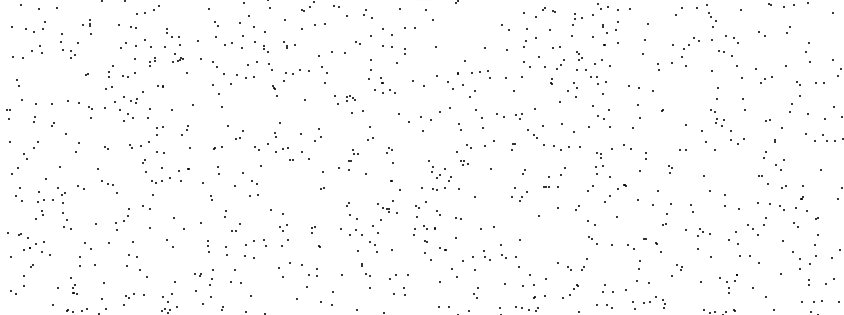
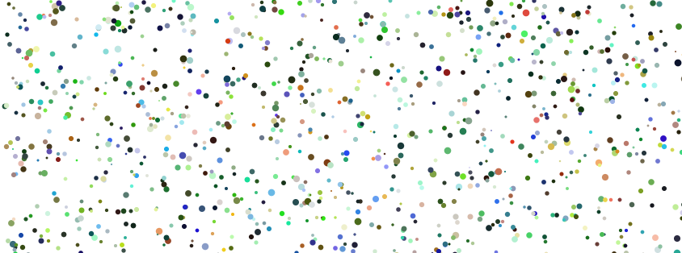
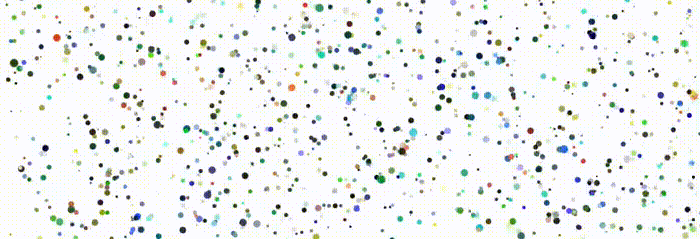
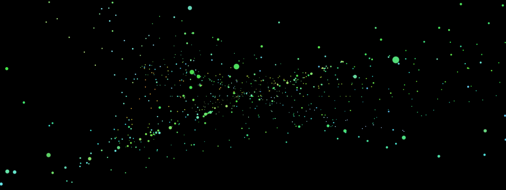

## 使用 CSS-Doodle 构建粒子

要实现粒子动画，那么第一步，我们需要得到大量的粒子。使用 CSS 实现的话，也就是我们需要大量的 DOM。

借助，CSS-Doodle 的 Grid 布局语法，我们可以快速得到大量的 DOM，当然方式有非常多。

现在我们假设我们需要 10000 个粒子，我们只需要实现一个 100x100 的 Grid 布局即可，使用 CSS-Doodle 的话，语法如下：

```html
<css-doodle grid="100x100">
  :doodle { @size: 100vw 100vmin; } position: absolute; top: 50%; left: 50%;
  width: 2px; height: 2px; background: #000; border-radius: 50%;
</css-doodle>
```

简单解释下上面的代码：

1. `grid="100x100"`表示实现一个 100x100 的 Grid 布局
2. `@size: 100vw 100vmin`表示 Grid 布局的高宽分别为 100vw 和 100vh，也就是占满整个屏幕
3. 剩下的代码比较好理解，它会赋值给每一个 Grid item，相当于 10000 个 Grid item 都是一个 2x2 的圆球，并且定位在页面中间

整个效果如下：

[](https://user-images.githubusercontent.com/8554143/179983096-0a3798d6-2955-45b0-a277-bbcc12c5c50c.png)

你没有看错，因为所有的粒子都叠在一个点了，所以确实只有一个点。

至此，我们就得到了 10000 个聚集在一起的粒子。

## 实现 2D 粒子效果

有了 10000 个聚集在一起的粒子，我们给每个粒子添加任意不同的属性，就可以得到各种不同的粒子效果了。

为了让粒子看得清，第一步，我们让粒子散开，这里只需要改变上面代码中的 、 定位即可（利用 transform 也可以）：` top``left `

```html
<css-doodle grid="100x100">
  // ...其他与上述保持一致 top: @r(1%, 100%); left: @r(1%, 100%); //
  ...其他与上述保持一致
</css-doodle>
```

> CSS-Doodle 中， 方法可以用于获取随机数，这里就是表示获取 1% ~ 100% 内的随机数`@r()`

这里，我们做的事情只是让每一个粒子的 top、left 随机落在 ~ ，这样我们就能看清不同的粒子分布了：` 1%``100% `

[](https://user-images.githubusercontent.com/8554143/179983990-0a6829f4-4ccd-4dd1-954f-86916a10a40d.png)

好吧，到这里，**美感**还没体现出来。

别着急，我们尝试随机放大缩小每个粒子，并且，给它们赋予不同的颜色：

```html
<css-doodle grid="100x100">
  // ...其他与上述保持一致 background: hsl(@r(1, 255, 3), @r(10%, 90%), @r(10%,
  90%)); transform: scale(@rn(.1, 5, 3));
</css-doodle>
```

这样，我们的粒子就变成了这样：

[](https://user-images.githubusercontent.com/8554143/179984739-fe9d947b-efb8-41f7-8729-ab27cc640570.png)

好，看着像那么回事了。当然，粒子动画怎么能少了动画，接下来的一步，我们需要让粒子动起来，由于动画需要用到 ，但是我们上面又用到了 ，为了减少代码量，这里我会把缩放的操作交给 属性来实现，这样一来，完整的代码如下：` transform: translate()``scale()``zoom `

```html
<css-doodle grid="100x100">
  :doodle { @size: 100vw 100vmin; perspective: 10px; } position: absolute; top:
  @r(1%, 100%); left: @r(1%, 100%); width: 2px; height: 2px; background: #000;
  border-radius: 50%; background: hsl(@r(1, 255, 3), @r(10%, 90%), @r(10%,
  90%)); transform: rotate(@r(360deg)) translate(@r(-50, 50)vmin, @r(-50,
  50)vmin); animation: move 3s infinite linear alternate; zoom: @rn(.1, 5, 3);
  @keyframes move { 100% { transform: rotate(0) translate(0, 0); } }
</css-doodle>
```

效果如下：

[](https://user-images.githubusercontent.com/8554143/179985920-a13161df-42a5-4ebe-b650-e41241ccaa03.gif)

看着还挺不错，但是由于所有粒子的动画时间都是一样的，所以动画起始帧和结束帧非常明显，我们再改造下 ：`animation`

```html
<css-doodle grid="100x100">
  - animation: move 3s infinite linear alternate; + animation: move @r(5, 15)s
  infinite @r(-10, 0)s @p(linear, ease-in, ease-in-out) alternate;
</css-doodle>
```

这样，动画时间，负延迟时间（提前开始），以及动画缓动都设置成了对每个粒子都随机，这样，整体效果将会好上不少，不会出现明显的停顿或者破绽：

<iframe height="300" style="width: 100%;" scrolling="no" title="CSS Doodle - CSS Pattern " src="https://codepen.io/mafqla/embed/JjVrKJP?default-tab=html%2Cresult&editable=true&theme-id=light" frameborder="no" loading="lazy" allowtransparency="true" allowfullscreen="true">
  See the Pen <a href="https://codepen.io/mafqla/pen/JjVrKJP">
  CSS Doodle - CSS Pattern </a> by mafqla (<a href="https://codepen.io/mafqla">@mafqla</a>)
  on <a href="https://codepen.io">CodePen</a>.
</iframe>

当然，我们完全可以换一个配色，黑色底色配合上 ，让每一个元素发光发亮，这样，我们就得到了这样一个效果：`box-shadow()`

<iframe height="300" style="width: 100%;" scrolling="no" title="CSS Doodle - CSS Pattern " src="https://codepen.io/mafqla/embed/dyLVXRY?default-tab=html%2Cresult&editable=true&theme-id=light" frameborder="no" loading="lazy" allowtransparency="true" allowfullscreen="true">
  See the Pen <a href="https://codepen.io/mafqla/pen/dyLVXRY">
  CSS Doodle - CSS Pattern </a> by mafqla (<a href="https://codepen.io/mafqla">@mafqla</a>)
  on <a href="https://codepen.io">CodePen</a>.
</iframe>

## 柏林噪声配合 3D 实现粒子动效

**柏林噪声**基于随机，并在此基础上利用缓动曲线进行平滑插值，使得最终得到噪声效果更加趋于自然。

它的作用在于，让我们产生的随机是不是完全随机的，而是能够像木头纹理、山脉起伏的变化般，存在一定的规律性！

基于柏林噪声，我们再在 2D 粒子动画的基础上，引入 CSS 3D，实现 3D 粒子动效。

我们来看看，此时，我们不再随机定位每一个粒子，而是利用柏林噪声去分布我们的粒子：

> 是的，在 CSS Doodle 中，我们使用 替代 ，即可让随机的结果基于 Grid item 的位置关系产生关联。` @rn()``@r() `

```html
<css-doodle grid="100x100">
  :doodle { @size: 100vw 100vmin; perspective: 10px; } :container { perspective:
  100px; transform-style: preserve-3d; } position: absolute; top: 0; left: 0;
  width: 2px; height: 2px; border-radius: 50%; left: 50%; top: 50%; background:
  hsl(@rn(1, 255, 3), @rn(50%, 90%), @rn(50%, 90%)); transform: scale(@rn(1, 10,
  3)) translate3d(@rn(-50, 50, 3)vw, @rn(-50, 50, 3)vh, @rn(-100, 20)px);
</css-doodle>
```

[](https://user-images.githubusercontent.com/8554143/179989073-d67c6a40-d247-4e57-8117-bb9dec62f823.png)

我们在 3D 场景下，利用柏林噪声布局我们的粒子系统，让它们相邻之间的颜色，定位都是存在一定的关联性。本身，每一次随机，都是一副美妙的画作，感受下：

[](https://user-images.githubusercontent.com/8554143/179989673-99e73ee1-f15b-4916-8359-863990e3ae86.gif)

当然，这还没完，我们要让它们动起来。添加什么好呢？其实加什么都非常 NICE，这里，我们尝试让他们有规律的上下律动，当然，也需要用到**柏林噪声**，这样完整的代码就会变成：

```html
<css-doodle grid="100x100">
  :doodle { @size: 100vw 100vmin; perspective: 10px; } :container { perspective:
  50px; transform-style: preserve-3d; } position: absolute; top: 0; left: 0;
  width: 2px; height: 2px; border-radius: 50%; left: 50%; top: 50%; background:
  hsl(@rn(1, 255, 3), @rn(50%, 90%), @rn(50%, 90%)); transform: scale(@rn(1, 10,
  3)) translate3d(@rn(-50, 50, 3)vw, @rn(-50, 50, 3)vh, @rn(-100, 20)px);
  animation: move @rn(5, 15, 3)s infinite @rn(-20, -10, 3)s linear alternate;
  box-shadow: 0 0 1px #fff, 0 0 5px #fff; @keyframes move { 100% { margin-top:
  500px; } }
</css-doodle>
```

OK，会是什么样一副景象呢？让我们来看看：

<iframe height="300" style="width: 100%;" scrolling="no" title="CSS Doodle - CSS Pattern Effect" src="https://codepen.io/mafqla/embed/GRLMqEr?default-tab=html%2Cresult&editable=true&theme-id=light" frameborder="no" loading="lazy" allowtransparency="true" allowfullscreen="true">
  See the Pen <a href="https://codepen.io/mafqla/pen/GRLMqEr">
  CSS Doodle - CSS Pattern Effect</a> by mafqla (<a href="https://codepen.io/mafqla">@mafqla</a>)
  on <a href="https://codepen.io">CodePen</a>.
</iframe>

可以看到，利用**柏林噪声**生成的粒子效果，更加的真实，看上去更加的带感。

当然，掌握了这个技巧之后，我们可以尝试其他添加其他属性的动画，那么可能我们会得到这样的动画：

<iframe height="300" style="width: 100%;" scrolling="no" title="CSS Doodle - CSS Pattern " src="https://codepen.io/mafqla/embed/yLrzJXx?default-tab=html%2Cresult&editable=true&theme-id=light" frameborder="no" loading="lazy" allowtransparency="true" allowfullscreen="true">
  See the Pen <a href="https://codepen.io/mafqla/pen/yLrzJXx">
  CSS Doodle - CSS Pattern </a> by mafqla (<a href="https://codepen.io/mafqla">@mafqla</a>)
  on <a href="https://codepen.io">CodePen</a>.
</iframe>

亦或，我们尝试实现另外一种时空穿梭的感觉：

```html
<css-doodle grid="30x30">
  :doodle { @size: 100vw 100vmin; } :container { perspective: 500px;
  transform-style: preserve-3d; transform: rotate3d(@r(-1.5, 1.5), @r(-1.5,
  1.5), @r(-1.5, 1.5), @r(0, 30)deg); } position: absolute; top: 0; left: 0;
  width: 2px; height: 2px; border-radius: 50%; top: @r(50, 50)%; left: @r(50,
  50)%; background: hsl(@rn(160, 170, 3), @r(90%, 99%), @rn(50%, 70%));
  animation: move @r(5, 30)s infinite @r(-30, -15)s @p(linear, ease-in,
  ease-in-out); transform: scale(@rn(.1, 1)) rotate(0) translate3d(@r(-60vmin,
  60vmin), @r(-60vmin, 60vmin), @r(-1500, -2000)px); box-shadow: 0 0 0.5px #fff,
  0 0 2px #fff, 0 0 5px #fff; @keyframes move { 100% { transform: scale(10)
  rotate(1080deg) translate3d(0, 0, @r(710, 850)px); } }
</css-doodle>
```

效果如下：

<iframe height="300" style="width: 100%;" scrolling="no" title="CSS Doodle - CSS Pattern " src="https://codepen.io/mafqla/embed/XWQeKgG?default-tab=html%2Cresult&editable=true&theme-id=light" frameborder="no" loading="lazy" allowtransparency="true" allowfullscreen="true">
  See the Pen <a href="https://codepen.io/mafqla/pen/XWQeKgG">
  CSS Doodle - CSS Pattern </a> by mafqla (<a href="https://codepen.io/mafqla">@mafqla</a>)
  on <a href="https://codepen.io">CodePen</a>.
</iframe>

CSS-Doodle 库的作者，袁川老师，也有非常多 3D 粒子动画，其中一幅：

<iframe height="300" style="width: 100%;" scrolling="no" title="Seeding" src="https://codepen.io/mafqla/embed/qBwPNXB?default-tab=html%2Cresult&editable=true&theme-id=light" frameborder="no" loading="lazy" allowtransparency="true" allowfullscreen="true">
  See the Pen <a href="https://codepen.io/mafqla/pen/qBwPNXB">
  Seeding</a> by mafqla (<a href="https://codepen.io/mafqla">@mafqla</a>)
  on <a href="https://codepen.io">CodePen</a>.
</iframe>
