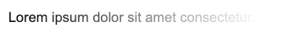
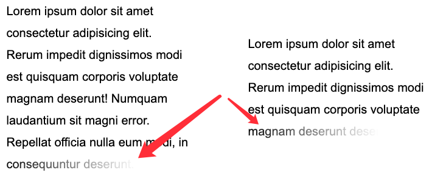
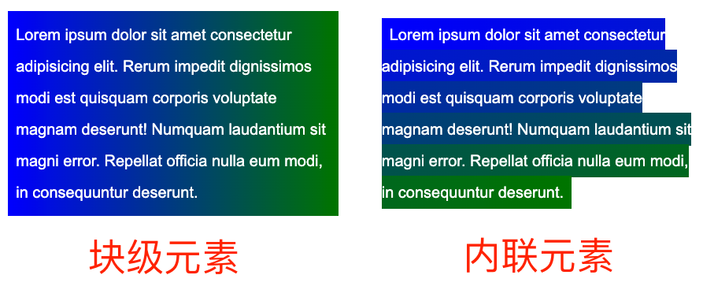
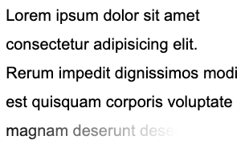
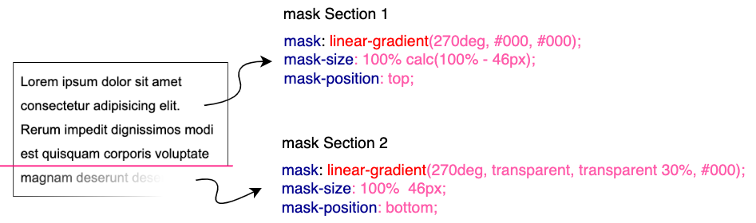

## 单行与多行文本的渐隐

首先，我们来看这样一个例子，我们要实现这样一个单行文本的渐隐：

[](https://user-images.githubusercontent.com/8554143/180781795-c06cf7fb-e3ec-4106-a1ea-3e47ef97fc7b.png)

使用 `mask`，可以轻松实现这样的效果，只需要：

```html
<p>Lorem ipsum dolor sit amet consectetur.</p>
```

```css
p {
  mask: linear-gradient(90deg, #fff, transparent);
}
```

但是，如果，场景变成了多行呢？我们需要将多行文本最后一行，实现渐隐消失，并且适配不同的多行场景：

[](https://user-images.githubusercontent.com/8554143/180783056-4dd4e5ad-7404-46ee-a2af-6bb1a1e9c368.png)

这个就会稍微复杂一点点，但是也是有多种方式可以实现的。

首先我们来看一下使用 `background` 的方式。

### 使用 `background` 实现

这里会运用到一个技巧，就是 `display: inline` 内联元素的 `background` 展现形式与 `display: block` 块级元素（或者 `inline-block`、`flex`、`grid`）不一致。

简单看个例子：

```html
<p>Lorem .....</p>
<a>Lorem .....</a>
```

这里需要注意，`<p>` 元素是**块级元素**，而 `<a>` 是**内联元素**。

我们给它们统一添加上一个从绿色到蓝色的渐变背景色：

```
p, a {
  background: linear-gradient(90deg, blue, green);
}
```

看看效果：

[](https://user-images.githubusercontent.com/8554143/181505676-91095d61-7f32-4744-928d-83de0a4ab72a.png)

什么意思呢？区别很明显，块级元素的背景整体是一个渐变整体，而内联元素的每一行都是会有不一样的效果，整体连起来串联成一个整体。

基于这个特性，我们可以构造这样一种布局：

```html
<p>
  <a
    >Mollitia nostrum placeat consequatur deserunt velit ducimus possimus
    commodi temporibus debitis quam</a
  >
</p>
```

```scss
p {
  position: relative;
  width: 400px;
}

a {
  background: linear-gradient(90deg, transparent, transparent 70%, #fff);
  background-repeat: no-repeat;
  cursor: pointer;
  color: transparent;

  &::before {
    content: 'Mollitia nostrum placeat consequatur deserunt velit ducimus possimus commodi temporibus debitis quam';
    position: absolute;
    top: 0;
    left: 0;
    color: #000;
    z-index: -1;
  }
}
```

这里需要解释一下：

1. 为了利用到实际的内联元素的 `background` 的特性，我们需要将实际的文本包裹在内联元素 `<a>` 内
2. 实际的文本，利用了 `opacity: 0` 进行隐藏，实际展示的文本使用了 `<a>` 元素的伪元素，并且将它的层级设置为 `-1`，目的是让父元素的背景可以盖过它
3. `<a>` 元素的渐变为从透明到白色，利用它去遮住下面的实际用伪元素展示的文字，实现文字的渐隐

这样，我们就能得到这样一种效果：

[](https://user-images.githubusercontent.com/8554143/181508059-09c1b43d-48bd-49e3-b90e-459285978067.png)

这里，`<a>` 元素的渐变为从透明到白色，利用后面的白色逐渐遮住文字。

如果我将渐变改为从黑色到白色（为了方便理解，渐变的黑色和白色都带上了一些透明），你能很快的明白这是怎么回事：

```css
a {
  background: linear-gradient(
    90deg,
    rgba(0, 0, 0, 0.8),
    rgba(0, 0, 0, 0.9) 70%,
    rgba(255, 255, 255, 0.9)
  );
}
```

<iframe height="300" style="width: 100%;" scrolling="no" title="Text fades away" src="https://codepen.io/mafqla/embed/VwNrKzb?default-tab=html%2Cresult&editable=true&theme-id=light" frameborder="no" loading="lazy" allowtransparency="true" allowfullscreen="true">
  See the Pen <a href="https://codepen.io/mafqla/pen/VwNrKzb">
  Text fades away</a> by mafqla (<a href="https://codepen.io/mafqla">@mafqla</a>)
  on <a href="https://codepen.io">CodePen</a>.
</iframe>

当然，这个方案有很多问题，譬如利用了 `z-index: -1`，如果父容器设置了背景色，则会失效，同时不容易准确定位最后一行。因此，更好的方式是使用 `mask` 来解决。

### 使用 `mask` 实现

那么，如果使用 `mask` 的话，问题，就会变得简单一些，我们只需要在一个 `mask` 中，实现两块 `mask` 区域，一块用于准确控制最后一行，一块用于控制剩余部分的透明。

也不需要特殊构造 HTML：

```html
<p>Lorem ipsum dolor sit amet ....</p>
```

```css
p {
  width: 300px;
  padding: 10px;
  line-height: 36px;
  mask: linear-gradient(270deg, transparent, transparent 30%, #000),
    linear-gradient(270deg, #000, #000);
  mask-size: 100% 46px, 100% calc(100% - 46px);
  mask-position: bottom, top;
  mask-repeat: no-repeat;
}
```

效果如下：

[](https://user-images.githubusercontent.com/8554143/181510185-b662fd62-33c3-4d73-a5d7-277632d1478a.png)

核心在于整个 `mask` 相关的代码，正如上面而言的，mask 将整个区域分成了两块进行控制：

[](https://user-images.githubusercontent.com/8554143/181512636-17c15e36-7317-425b-981a-40788727b5d3.png)

在下部分这块，我们利用 `mask` 做了从右向左的渐隐效果。并且利用了 `mask-position` 定位，以及 calc 的计算，无论文本都多少行，都是适用的！需要说明的是，这里的 `46px` 的意思是**单行文本**的行高加上 `padding-bottom` 的距离。可以适配任意行数的文本：

<iframe height="300" style="width: 100%;" scrolling="no" title="Text - Fade Away" src="https://codepen.io/mafqla/embed/MWROjvN?default-tab=html%2Cresult&editable=true&theme-id=light" frameborder="no" loading="lazy" allowtransparency="true" allowfullscreen="true">
  See the Pen <a href="https://codepen.io/mafqla/pen/MWROjvN">
  Text - Fade Away</a> by mafqla (<a href="https://codepen.io/mafqla">@mafqla</a>)
  on <a href="https://codepen.io">CodePen</a>.
</iframe>

## 添加动画效果

好，看完静态的，我们再来实现一种\*\*动态的文字渐隐消失。

整体的效果是当鼠标 Hover 到文字的时候，整个文本逐行逐渐消失。像是这样：

这里的核心在于，需要去适配不同的行数，不同的宽度，而且文字是一行一行的进行消失。

**实现整段文字的渐现，从一种颜色到另外一种颜色**：

```html
<div class="button">Button</div>
<p>
  <a
    >Lorem ipsum dolor sit amet consectetur adipisicing elit. Mollitia nostrum
    placeat consequatur deserunt velit ducimus possimus commodi temporibus
    debitis quam, molestiae laboriosam sit repellendus sed sapiente quidem quod
    accusantium vero.</a
  >
</p>
```

```css
a {
  background: linear-gradient(90deg, #999, #999), linear-gradient(90deg, #fc0, #fc0);
  background-size: 100% 100%, 0 100px;
  background-repeat: no-repeat;
  background-position: 100% 100%, 0 100%;
  color: transparent;
  background-clip: text;
}
.button:hover ~ p a {
  transition: 0.8s all linear;
  background-size: 0 100px, 100% 100%;
}
```

这里需要解释一下，虽然设置了 `color: transparent`，但是文字默认还是有颜色的，默认的文字颜色，是由第一层渐变赋予的 `background: linear-gradient(90deg, #999, #999), linear-gradient(90deg, #fc0, #fc0)`，也就是这一层：`linear-gradient(90deg, #999, #999)`。

当 hover 触发时，`linear-gradient(90deg, #999, #999)` 这一层渐变逐渐消失，而另外一层 linear-gradient(90deg, #fc0, #fc0)` 逐渐出现，借此实现上述效果。

<iframe height="300" style="width: 100%;" scrolling="no" title="background underline animation 4" src="https://codepen.io/mafqla/embed/LYvORzx?default-tab=html%2Cresult&editable=true&theme-id=light" frameborder="no" loading="lazy" allowtransparency="true" allowfullscreen="true">
  See the Pen <a href="https://codepen.io/mafqla/pen/LYvORzx">
  background underline animation 4</a> by mafqla (<a href="https://codepen.io/mafqla">@mafqla</a>)
  on <a href="https://codepen.io">CodePen</a>.
</iframe>

好，我们可以借鉴这个技巧，去实现文字的渐隐消失。一层为实际的文本，而另外一层是进行动画的遮罩，进行动画的这一层，本身的文字设置为 `color: transparent`，这样，我们就只能看到背景颜色的变化。

大致的代码如下：

```html
<p>
  <a class="word">Mollitia nostrum placeat consequatur deserunt.</a>
  <a class="pesudo">Mollitia nostrum placeat consequatur deserunt.</a>
</p>
```

```css
p {
  width: 500px;
}
.word {
  position: absolute;
  top: 0;
  left: 0;
  color: #000;
}
.pesudo {
  position: relative;
  background: linear-gradient(90deg, transparent, #fff 20%, #fff);
  background-size: 0 100%;
  background-repeat: no-repeat;
  background-position: 100% 100%;
  transition: all 3s linear;
  color: transparent;
}
p:hover .pesudo,
p:active .pesudo {
  background-size: 500% 100%;
}
```

其中，`.word` 为实际在底部，展示的文字层，而 `pesudo` 为叠在上方的背景层，hover 的时候，触发上方元素的背景变化，逐渐遮挡住下方的文字，并且，能适用于不同长度的文本。

<iframe height="300" style="width: 100%;" scrolling="no" title="Text fades away Animation" src="https://codepen.io/mafqla/embed/jORaMGJ?default-tab=html%2Cresult&editable=true&theme-id=light" frameborder="no" loading="lazy" allowtransparency="true" allowfullscreen="true">
  See the Pen <a href="https://codepen.io/mafqla/pen/jORaMGJ">
  Text fades away Animation</a> by mafqla (<a href="https://codepen.io/mafqla">@mafqla</a>)
  on <a href="https://codepen.io">CodePen</a>.
</iframe>

当然，上述方案会有一点瑕疵，我们无法让不同长度的文本整体的动画时间一致。当文案数量相差不大时，整体可以接受，文案相差数量较大时，需要分别设定下 `transition-duration` 的时长。
