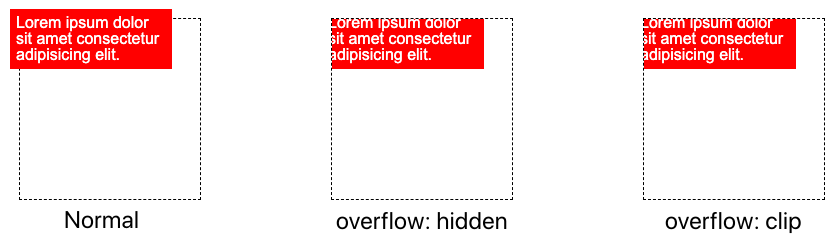

## overflow: clip 为何

首先，简单介绍下 `overflow: clip` 的用法。

`overflow: clip`: 与 `overflow: hidden` 的表现形式极为类似，也是对元素的 `padding-box` 进行裁剪。

但是，它们有两点不同：

1. 也就是 `overflow: clip` 内部完全禁止任何形式的滚动。当然，这个不是今天的重点，暂且略过不谈。

> MDN 原文：The difference between clip and hidden is that the clip keyword also forbids all scrolling, including programmatic scrolling.

1. `overflow: clip` 可以从 x，y 轴方向上对裁剪进行，控制，而 `overflow: hidden` 不行。

重点在于这一点。我们来简单示意一下：

### overflow: clip && overflow: hidden 的表现

我们来看对于不区分方向，`overflow: clip` 与 `overflow: hidden` 的表现形式：

```html
<div>
  <p>Lorem ipsum dolor sit amet consectetur adipisicing elit.</p>
</div>
<div class="hidden">
  <p>Lorem ipsum dolor sit amet consectetur adipisicing elit.</p>
</div>
<div class="clip">
  <p>Lorem ipsum dolor sit amet consectetur adipisicing elit.</p>
</div>
```

```css
.hidden {
  overflow: hidden;
}
.clip {
  overflow: clip;
}
```

我们设置了 3 个 DIV 容器，其中一个不设置 overflow，另外两个分别设置 `overflow: clip` 与 `overflow: hidden`。效果如下：

[](https://user-images.githubusercontent.com/8554143/184637404-4708dda0-ed73-4884-a1bf-81e80d15e4e0.png)

此时，`overflow: clip` 与 `overflow: hidden` 的表现是一致的。

### `overflow: clip` 在 x/y 轴上可单独设置

然而，`overflow: clip` 的与众不同之处在于，它可以单独设置给 x 轴或者 y 轴，使得容器拥有某一个方向上的裁剪能力，而相对的另外一个方向，允许溢出。

这里的现象值得注意：

1. 单单设置 `overflow-x: hidden` 或者 `overflow-y: hidden`，表现形式都和 `overflow: hidden` 一致，是全方位的裁剪
2. 而水平 x 或竖直 y 方向的 `overflow-x: clip`/ `overflow-y: clip` 配合另一个方向的 `overflow-x: visible`，却能够实现一个方向允许溢出，一个方向实现裁剪！

需要解释一下上面两点：

1. 设置 `overflow: hidden` 就会创建 BFC，因此没法只限制一个方向；而 `overflow: clip` 不会创建 BFC，因此它们在很多表现上会产生不一致的现象（譬如）
2. overflow-x/y 设置为 hidden 时, overflow-y/x 会变成 auto, 即使设置为 visible

<iframe height="300" style="width: 100%;" scrolling="no" title="overflow: hidden &amp; overflow: clip" src="https://codepen.io/mafqla/embed/QWPmybv?default-tab=html%2Cresult&editable=true&theme-id=light" frameborder="no" loading="lazy" allowtransparency="true" allowfullscreen="true">
  See the Pen <a href="https://codepen.io/mafqla/pen/QWPmybv">
  overflow: hidden &amp; overflow: clip</a> by mafqla (<a href="https://codepen.io/mafqla">@mafqla</a>)
  on <a href="https://codepen.io">CodePen</a>.
</iframe>

至此，我们就实现了这样一种效果，允许元素在 x/y 方向上的单向裁剪，像是这样：

(上图允许 x 轴方向上的溢出，而 y 轴方向进行了裁剪)
