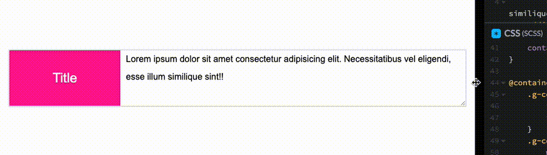
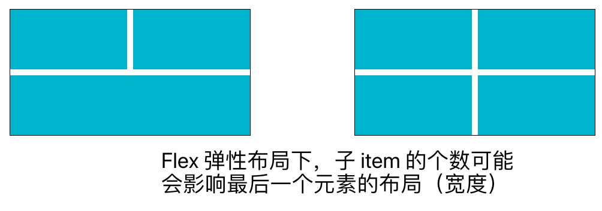
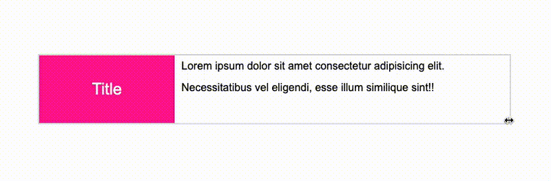
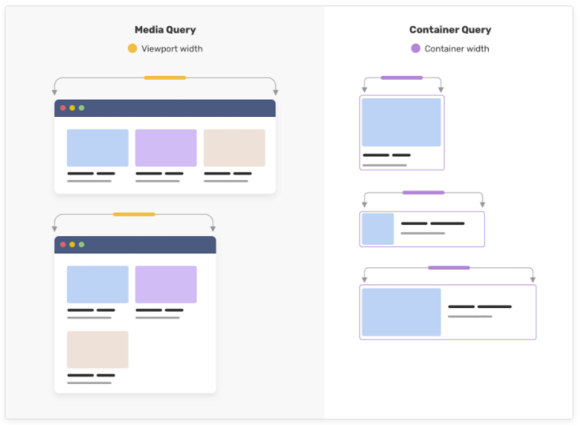

## 响应式过往的痛点

在之前，响应式有这么个掣肘。同一 DOM 的不同布局形态如果想要变化，需要依赖诸如**媒体查询**来实现。

像是这样：

[](https://user-images.githubusercontent.com/8554143/186666296-054ce41c-672c-40c2-a285-d6560b990f41.gif)

通过浏览器视窗大小的变化，借助媒体查询，实现不一样的布局。

但是，在现如今，大部分 PC 端页面使用的是基于 Flex/Grid 的弹性布局。

很多时候，当内容数不确定的时候，即便是相同的浏览器视窗宽度下，元素的布局及宽度可能也是不一致的。

考虑下面这种情况：

```html
<!-- 情况一  -->
<ul class="wrap">
  <li></li>
  <li></li>
  <li></li>
</ul>
<!-- 情况二  -->
<ul class="wrap">
  <li></li>
  <li></li>
  <li></li>
  <li></li>
</ul>
```

```css
.wrap {
  display: flex;
  flex-wrap: wrap;
  gap: 10px;
}
li {
  width: 190px;
  height: 100px;
  flex-grow: 1;
  flex-shrink: 0;
}
```

[](https://user-images.githubusercontent.com/8554143/186668221-53f7b868-e326-4fbe-b217-588304378117.png)

这种情况下，如果需要在不同宽度下对最后一个元素做一下处理，传统方式还是比较麻烦的。

在这种情况下，容器查询（CSS Container Queries）就应运而生了！

## 容器查询的能力

容器查询它给予了 CSS，在不改变浏览器视口宽度的前提下，只是根据容器的宽度变化，对布局做成调整的能力。

还是上面的例子，简单的代码示意：

```html
<div class="wrap">
  <div class="g-container">
    <div class="child">Title</div>
    <p>
      Lorem ipsum dolor sit amet consectetur adipisicing elit. Necessitatibus
      vel eligendi, esse illum similique sint!!
    </p>
  </div>
</div>
```

```css
.wrap {
  width: 500px;
  resize: horizontal;
  overflow: auto;
}
.g-container {
  display: flex;
  flex-wrap: nowrap;
}
.wrap {
  /* CSS CONTAINER */
  container-name: wrap;
  container-type: inline-size;
}
@container wrap (max-width: 400px) {
  .g-container {
    flex-wrap: wrap;
    flex-direction: column;
  }
}
```

像是这样，我们通过 `resize: horizontal` 来模拟单个容器的宽度变化，在这种情况下，容器查询能够做到在不同宽度下，改变容器内部的布局。

这样，就简单实现了一个容器查询功能：

[](https://user-images.githubusercontent.com/8554143/186670759-5b1f3485-32ba-490e-965f-00b56dfcd97e.gif)

注意，仔细和上面的例子作对比，这里，**浏览器的视口宽度是没有变化的，变化的只是容器的宽度！**

媒体查询与容器查询的异同，通过一张简单的图看看，核心的点在于容器的宽度发生变化时，视口的宽度不一定会发生变化：

[](https://user-images.githubusercontent.com/8554143/186675881-7106cb6f-1121-40a7-9633-bf0f630ad07c.png)

我们简单拆解下上述的代码，非常好理解。

1. 在 `.warp` 的样式中，通过 `container-name: wrap` 注册一个容器
2. 注册完容器之后，便可以通过 `@container wrap ()` 容器查询语法，在内部写入不同情况下的另外一套样式
3. 这里 `@container wrap (max-width: 400px) {}` 的意思便是，当 `.wrap` 容器的宽度小于 400 px 时，采用内部定义的样式，否则，使用外部默认的样式

关于容器查询更为具体的语法，我建议还是上 MDN 或者规范详细看看 -- [MDN -- CSS Container Queries](https://developer.mozilla.org/en-US/docs/Web/CSS/CSS_Container_Queries)

## 关于容器查询的一些思考

在第一次看到这个语法之后，我最先想到的场景便是字体的自适应大小。

我们来看这样一个场景，很多时候，我们无法预估文案内容的多少。因此，会希望当内容较多时，字体较小，而当内容不足一行或者非常少的时候，字体较大：

<iframe height="300" style="width: 100%;" scrolling="no" title="Container Quries Demo" src="https://codepen.io/mafqla/embed/vYMjRzV?default-tab=html%2Cresult&editable=true&theme-id=light" frameborder="no" loading="lazy" allowtransparency="true" allowfullscreen="true">
  See the Pen <a href="https://codepen.io/mafqla/pen/vYMjRzV">
  Container Quries Demo</a> by mafqla (<a href="https://codepen.io/mafqla">@mafqla</a>)
  on <a href="https://codepen.io">CodePen</a>.
</iframe>

> 当然，现阶段我暂时没有试出来在容器查询中，容器的宽度能够随着输入的变化动态改变容器大小，这里目前有点瑕疵，是个需要继续钻研的点。

当然，在那些能够事先知道不同宽度，预设不同布局的场景下，容器查询的用武之地是非常之大的。

我们可以**利用它快速构建在容器不同宽度下的不同表现**。

譬如这样一个 DEMO：

<iframe height="300" style="width: 100%;" scrolling="no" title="CSS Container Queries" src="https://codepen.io/mafqla/embed/BaExrOg?default-tab=html%2Cresult&editable=true&theme-id=light" frameborder="no" loading="lazy" allowtransparency="true" allowfullscreen="true">
  See the Pen <a href="https://codepen.io/mafqla/pen/BaExrOg">
  CSS Container Queries</a> by mafqla (<a href="https://codepen.io/mafqla">@mafqla</a>)
  on <a href="https://codepen.io">CodePen</a>.
</iframe>

总得来说，容器查询，还是处于比较早期的发展之中，许多有意思的用法还有待挖掘。但它确实算得上是 CSS 今年比较大的一个革新。
