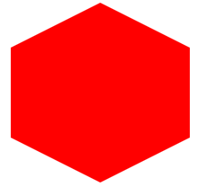
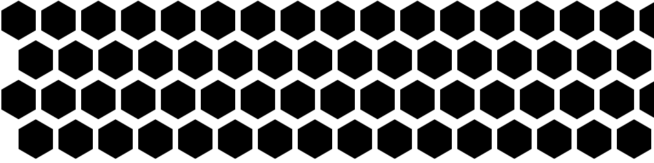
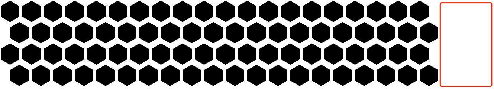
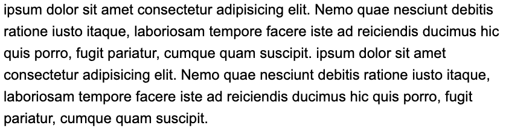
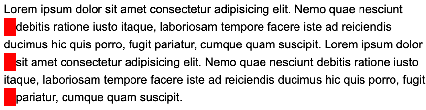
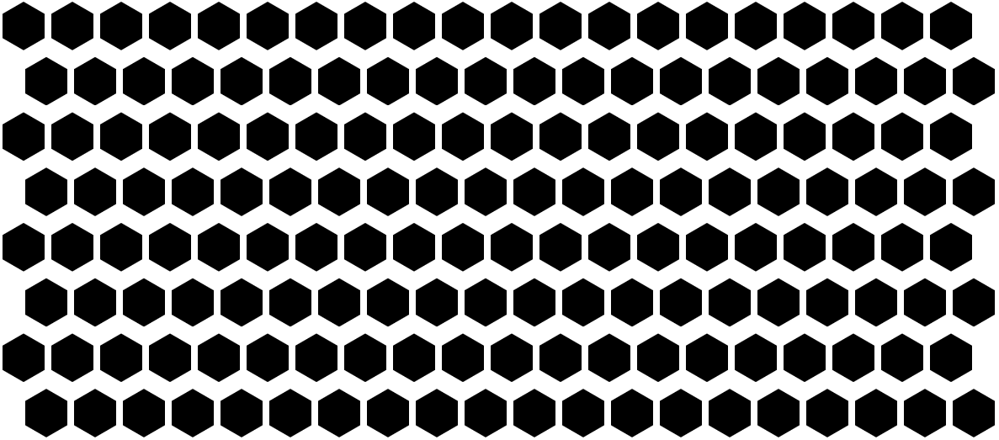
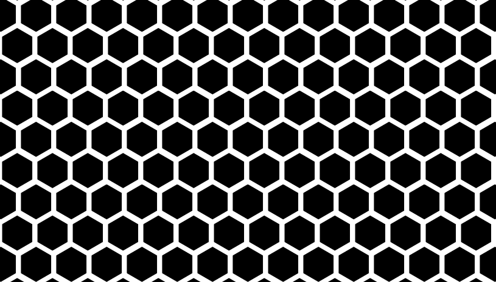
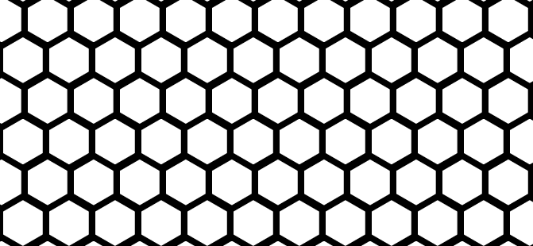
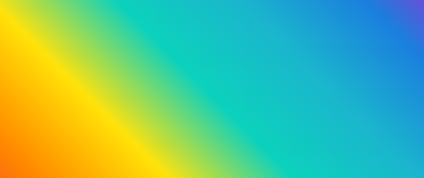
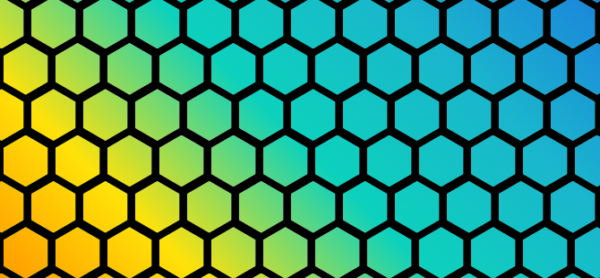

## 如何绘制六边形？


首先，看到这样一个图形，如果想要使用一个标签完成整个背景，最先想到的肯定是使用背景 background 实现，不过可惜的是，尽管 CSS 中的 background 非常之强大，但是没有特别好的方式让它足以批量生成重复的六边形背景。

因此，在这个需求中，我们可能不得不退而求其次，一个六边形实现使用一个标签完成。

那么，就拿 1 个 DIV 来说，我们有多少实现六边形的方式呢？这里简单介绍 2 种方式：

- 使用 border 实现六边形
- 使用 clip-path 实现六边形

### 使用 border 或者 clip-path 实现六边形

首先，使用 border 实现六边形。这里的核心在于上下两个三角形叠加中间一个矩形。这里，利用元素的两个伪元素实现上下两个三角形，从而让这个元素看起来像一个六边形。

思路比较简单，直接上代码：

```css
.hexagon {
  position: relative;
  width: 200px;
  height: 100px;
  background-color: red;
}

.hexagon:before,
.hexagon:after {
  content: "";
  position: absolute;
  width: 0;
  height: 0;
  border-left: 100px solid transparent;
  border-right: 100px solid transparent;
}

.hexagon:before {
  bottom: 100%;
  border-bottom: 50px solid red;
}

.hexagon:after {
  top: 100%;
  border-top: 50px solid red;
}
```


上面的代码会创建一个宽度为 200 像素，高度为 100 像素的六边形，其中由两个三角形和一个矩形组成。使用伪元素的优点是可以很方便地控制六边形的大小、颜色等样式。



当然，上述的代码不是一个正六边形，这是因为正六边形中，**元素的高是元素的宽的 1.1547 倍**。

并且，上述的方式也稍微复杂了点，因此，在今天，我们更推荐使用 `clip-path` 的方式去实现一个六边形：

```css
.clippath {
    --w: 100px;
    width: var(--w);
    height: calc(var(--w) * 1.1547);
    clip-path: polygon(0% 25%, 0% 75%, 50% 100%, 100% 75%, 100% 25%, 50% 0%);
    background: deeppink;
    margin: auto;
}
```


这样，基于 `clip-path`，也能快速得到一个六边形图形：

[](https://user-images.githubusercontent.com/8554143/206114526-ec3daf01-c2a9-4231-b843-acc7bb02036f.png)


<iframe height="300" style="width: 100%;" scrolling="no" title="Untitled" src="https://codepen.io/mafqla/embed/PogdzWJ?default-tab=html%2Cresult&editable=true&theme-id=light" frameborder="no" loading="lazy" allowtransparency="true" allowfullscreen="true">
  See the Pen <a href="https://codepen.io/mafqla/pen/PogdzWJ">
  Untitled</a> by mafqla (<a href="https://codepen.io/mafqla">@mafqla</a>)
  on <a href="https://codepen.io">CodePen</a>.
</iframe>


## 绘制多个六边形背景

好了，有了上一步的铺垫之后，接下来我们要做的，就是绘制多个六边形，组成背景。

但是我们仔细观察一下由多个六边形组成的背景，会发现每双数行的的六边形，需要向右侧有一个明显的缩进，宽度大概为单个六边形的宽度的一半：

[](https://user-images.githubusercontent.com/8554143/206116346-26c001df-fdca-45be-a11b-e2aa68c50fba.png)

这里其实是一个非常棘手的问题。首先，我们会想到这样一种解决方案：

1. 每一行为一组，设置一个父 div 容器，填满六边形元素，设置元素不换行
2. 给偶数行设置一个固定的 `margin-left`

基于这个策略，我们的代码，大概会是这样：

```html
<div class="container">
    <div class="wrap">
    // ... 填满六边形
    </div>
    <div class="wrap" style="margin-left: 25px">
    // ... 填满六边形
    </div>
    <div class="wrap">
    // ... 填满六边形
    </div>
    <div class="wrap" style="margin-left: 25px">
    // ... 填满六边形
    </div>
</div>
```


可以看到，我们给偶数行，都添加了一个 `margin-left`。

但是这个代码，会有几个问题：

1. 我们的页面宽度不一定是固定的，那么每一行设置多少个子六边形元素比较合适呢？设置多了势必会带来浪费，少了又无法满足需求
2. 多了一层嵌套，代码逻辑更为复杂

什么意思呢？也就是效果可能在屏幕非常宽的情况下，失效。

看看，正常情况，我们设置了每行 20 个六边形，下图是正常的

[](https://user-images.githubusercontent.com/8554143/206118569-7560eed9-09dd-4bc5-b034-ea4efc579385.png)

但是如果我们的屏幕特别宽，那么，可能会得到这样一种效果：

[](https://user-images.githubusercontent.com/8554143/206118781-9ac3a2c2-d2e1-4820-b3aa-5fe378167925.png)

因此，这种方式存在非常大的弊端，我们希望能有一整布局方式，能够满足我们如下两个诉求：

1. 所有六边形代码写在一个父容器下
2. 这个弹性布局中，第二行的元素最左边，能够实现固定一个缩进

仔细思考一下，CSS 中有能够实现类似布局的方法么？

## 妙用 shape-outside 实现隔行错位布局

有的！在 CSS 中，有一个神奇的元素能够让元素以非直线形式排布。它就是 `shape-outside`！

> 如果你对 `shape-outside` 不太了解，也可以先看看我的这篇文章 -- [奇妙的 CSS shapes](https://github.com/chokcoco/iCSS/issues/18)

`shape-outside` 是 CSS 中的一个属性，用于控制元素的浮动方式。它允许你定义一个元素浮动时周围元素的形状。例如，你可以使用 `shape-outside` 属性来定义一个元素浮动时周围元素的形状为圆形、六边形等。

它和 `clip-path` 的语法非常类似，很容易触类旁通。看看实例，更易理解：

假设我们有下面这样的结构存在：

```html
<div class="container">
    <div class="shape-outside">
      
    </div>
    xxxxxxxxxxx，文字描述，xxxxxxxxx
</div>
```


定义如下 CSS：

```css
.shape-outside {
    width: 160px;
    height: 160px;
    shape-outside: circle(80px at 80px 80px);
    float: left;
}
```


注意，上面 `.shape-outside` 使用了浮动，并且定义了 `shape-outside: circle(80px at 80px 80px)` ，表示在元素的 (80px, 80px) 坐标处，生成一个 80px 半径的圆。

如此，将会产生一种图文混排的效果：

<iframe height="300" style="width: 100%;" scrolling="no" title="shape-outside" src="https://codepen.io/mafqla/embed/KKYxMWG?default-tab=html%2Cresult&editable=true&theme-id=light" frameborder="no" loading="lazy" allowtransparency="true" allowfullscreen="true">
  See the Pen <a href="https://codepen.io/mafqla/pen/KKYxMWG">
  shape-outside</a> by mafqla (<a href="https://codepen.io/mafqla">@mafqla</a>)
  on <a href="https://codepen.io">CodePen</a>.
</iframe>


总得来说，`shape-outside` 有两个核心特点：

1. `shape-outside` 属性仅在元素定义了 `float` 属性且不为 `none` 时才会生效
2. 它能够实现了文字根据图形的轮廓，在其周围排列

[](https://user-images.githubusercontent.com/8554143/27017212-62cf3e62-4f59-11e7-861f-5441736c9614.png)

### `shape-outside` 的本质

划重点，划重点，划重点。

所以，`shape-outside` 的本质其实是生成几何图形，**并且裁剪掉其几何图形之外周围的区域，让内容能排列在这些被裁剪区域之内**。

所以，了解了这个本质之后，我们再将他运用在上面的六边形布局之中。

为了方便理解，我们首先使用文字代替上面的六边形，假设我们有这样一段文本内容：

```html
<p>
Lorem ipsum dolor sit amet conse...
</p>
```


```css
p {
    line-height: 36px;
    font-size: 24px;
}
```


非常平平无奇的一段代码，效果如下：

[](https://user-images.githubusercontent.com/8554143/206131387-2630307b-9939-46fe-98b5-3c5452a4e556.png)

现在，我们想利用 `shape-outside`，让文本内容的偶数行，向内缩进 `24px`，怎么实现呢？非常简单：

```scss
p {
    position: relative;
    line-height: 36px;
    font-size: 24px;

    &::before {
        content: "";
        height: 100%;
        width: 24px;
        shape-outside: repeating-linear-gradient(
            transparent 0,
            transparent 36px,
            #000 36px,
            #000 72px
        );
        float: left;
    }
}
```


这样，我们就实现了文字隔行缩进 `24px` 的效果：

[](https://user-images.githubusercontent.com/8554143/206135548-839a1d2b-a94f-429d-8ee8-bf9b1ba565cf.png)

一定有小伙伴会很好奇，为什么呢？核心在于我们利用元素的伪元素实现了一个 `shape-outside` 图形，如果我们把这个图形用 `background` 绘制出来，其实它长这样：

```scss
p {
    position: relative;
    line-height: 36px;
    font-size: 24px;

    &::before {
        content: "";
        height: 100%;
        width: 24px;
        shape-outside: repeating-linear-gradient(
            transparent 0,
            transparent 36px,
            #000 36px,
            #000 72px
        );
        float: left;
        background: repeating-linear-gradient(
            transparent 0,
            transparent 36px,
            #f00 36px,
            #f00 72px
        );
    }
}
```


效果如下：

[](https://user-images.githubusercontent.com/8554143/206135948-10a9c3fc-6431-4365-b73b-79b905e79ab9.png)

因为文本的行高是 `36px`，这样我们以 72 为一段，每 36px 绘制一段透明，另外 36px 绘制一段宽为 24px 的内容，这样，结合 `shape-outside` 的特性，我们就实现了隔行将内容向里面挤 `24px` 的效果！

非常的 Amazing 的技巧！完整的代码你可以戳这里：

<iframe height="300" style="width: 100%;" scrolling="no" title="Shape-outside achieves even line indentation" src="https://codepen.io/mafqla/embed/VwNGjbK?default-tab=html%2Cresult&editable=true&theme-id=light" frameborder="no" loading="lazy" allowtransparency="true" allowfullscreen="true">
  See the Pen <a href="https://codepen.io/mafqla/pen/VwNGjbK">
  Shape-outside achieves even line indentation</a> by mafqla (<a href="https://codepen.io/mafqla">@mafqla</a>)
  on <a href="https://codepen.io">CodePen</a>.
</iframe>


基于这个技巧，我们就可以实现上述我们想要的效果了。我们回到正题，重新实现一个充满六边形的背景：

```html
<ul class="wrap">
  <li></li>
  //... 非常多个 li
<ul>
```


```scss
:root {
  --s: 50px;  /* size  */
  --m: 4px;    /* margin */
  --perHeight: calc(calc(var(--s) * 2 * 1.1547) + calc(var(--m) * 4) - 0.4px)
}

.wrap {
    position: relative;
    height: 100%;
    font-size: 0;

    &::before {
        content: "";
        height: 100%;
        width: 27px;
        shape-outside: repeating-linear-gradient(
            transparent 0,
            transparent 70px,
            #000 70px,
            #000 var(--perHeight)
        );
        float: left;
    }
}

li {
    width: var(--s);
    height: calc(var(--s) * 1.1547); 
    background: #000;
    clip-path: polygon(0% 25%, 0% 75%, 50% 100%, 100% 75%, 100% 25%, 50% 0%);
    margin: var(--m);
    display: inline-block;
}
```


借助 `shape-outside`，我们就实现了隔行让我们的六边形向内缩进的诉求！效果如下：

[](https://user-images.githubusercontent.com/8554143/206141983-f014d1a4-0ae4-4deb-9e75-37b5a98ef104.png)

当然，有一些优化点：

1. 为了让两边不那么空，我们可以让整个容器更宽一点，譬如宽度为父元素的 `120%`，然后水平居中，这样，两侧的留白就解决了
2. 让两行直接贴紧，可以设置一个 `margin-bottom`

做完这两点优化之后，效果如下：

[](https://user-images.githubusercontent.com/8554143/206142727-be748758-fca6-49df-bd08-112ec86a651e.png)

可以做到任意屏幕宽度下的六边形完美平铺布局：


<iframe height="300" style="width: 100%;" scrolling="no" title="Hexagon Layout" src="https://codepen.io/mafqla/embed/mdgGEmm?default-tab=html%2Cresult&editable=true&theme-id=light" frameborder="no" loading="lazy" allowtransparency="true" allowfullscreen="true">
  See the Pen <a href="https://codepen.io/mafqla/pen/mdgGEmm">
  Hexagon Layout</a> by mafqla (<a href="https://codepen.io/mafqla">@mafqla</a>)
  on <a href="https://codepen.io">CodePen</a>.
</iframe>


## 配置上色彩变换

有了上述的铺垫后，要实现文章一开头的效果就不难了。

是的，我们要实现这样一个效果：


如何让它们动态的实现颜色变换呢？是给每一个六边形一个单独的颜色，然后进行动画吗？不，借助混合模式，我们可以非常快速的实现不同的颜色值。

首先，我们将上述效果，改成白底黑色六边形色块：

[](https://user-images.githubusercontent.com/8554143/206172963-f2081d1c-9d01-4b48-a036-1e7d7e246950.png)

然后，利用父容器剩余的一个伪元素，我们叠加一层渐变层上去：

```scss
.wrap {
    position: relative;
    // 代码与上述保持一致

    &::before {
        content: "";
        // ... 实现 shape-outside 功能，代码与上述保持一致
    }
    
    &::after {
        content: "";
        position: absolute;
        inset: 0;
        background: linear-gradient(45deg, #f44336, #ff9800, #ffe607, #09d7c4, #1cbed3, #1d8ae2, #bc24d6);
    }
}
```


这样，我们就叠加了一层渐变色彩层在原本的六边形背景之上：

[](https://user-images.githubusercontent.com/8554143/206173405-46d8bb7c-3273-45fd-b69c-e520a20dc75f.png)

接着，只需要一个混合模式 `mix-blend-mode: darken`，就能实现六边形色块与上层渐变颜色的融合效果：

```scss
.wrap {
    position: relative;
    // 代码与上述保持一致

    &::before {
        content: "";
        // ... 实现 shape-outside 功能，代码与上述保持一致
    }
    
    &::after {
        content: "";
        position: absolute;
        inset: 0;
        background: linear-gradient(45deg, #f44336, #ff9800, #ffe607, #09d7c4, #1cbed3, #1d8ae2, #bc24d6);
        z-index: 1;
      + mix-blend-mode: darken;
    }
}
```


效果如下：

[](https://user-images.githubusercontent.com/8554143/206173695-2afcab5d-ffe8-41f2-a6f0-035293b278ce.png)

好， 我们再给上层的渐变色块，添加一个 `filter: hue-rotate()` 动画，实现色彩的渐变动画：

```scss
.wrap {
    position: relative;
    // 代码与上述保持一致

    &::before {
        content: "";
        // ... 实现 shape-outside 功能，代码与上述保持一致
    }
    
    &::after {
        content: "";
        position: absolute;
        inset: 0;
        background: linear-gradient(45deg, #f44336, #ff9800, #ffe607, #09d7c4, #1cbed3, #1d8ae2, #bc24d6);
        z-index: 1;
        mix-blend-mode: darken;
      + animation: change 10s infinite linear;
    }
}
@keyframes change {
    100% {
        filter: hue-rotate(360deg);
    }
}
```


## 扩展延伸

当然，有了这个基础图形之后，其实我们可以基于这个图形，去做非常多有意思的效果。

下面我是尝试的一些效果示意，譬如，我们可以将颜色放置在六边形背景的下方，制作这样一种效果：


<iframe height="300" style="width: 100%;" scrolling="no" title="Hexagon Gradient Layout" src="https://codepen.io/mafqla/embed/NWmLrjM?default-tab=html%2Cresult&editable=true&theme-id=light" frameborder="no" loading="lazy" allowtransparency="true" allowfullscreen="true">
  See the Pen <a href="https://codepen.io/mafqla/pen/NWmLrjM">
  Hexagon Gradient Layout</a> by mafqla (<a href="https://codepen.io/mafqla">@mafqla</a>)
  on <a href="https://codepen.io">CodePen</a>.
</iframe>

配合 mask 的蒙版效果及鼠标定位，我们还能实现这样一种有趣的交互效果：


<iframe height="300" style="width: 100%;" scrolling="no" title="Hexagon Gradient Layout 3" src="https://codepen.io/mafqla/embed/poBObPQ?default-tab=html%2Cresult&editable=true&theme-id=light" frameborder="no" loading="lazy" allowtransparency="true" allowfullscreen="true">
  See the Pen <a href="https://codepen.io/mafqla/pen/poBObPQ">
  Hexagon Gradient Layout 3</a> by mafqla (<a href="https://codepen.io/mafqla">@mafqla</a>)
  on <a href="https://codepen.io">CodePen</a>.
</iframe>

当然，3D 效果也不在话下：

<iframe height="300" style="width: 100%;" scrolling="no" title="Hexagon Gradient Layout 4" src="https://codepen.io/mafqla/embed/ZEZMOKZ?default-tab=html%2Cresult&editable=true&theme-id=light" frameborder="no" loading="lazy" allowtransparency="true" allowfullscreen="true">
  See the Pen <a href="https://codepen.io/mafqla/pen/ZEZMOKZ">
  Hexagon Gradient Layout 4</a> by mafqla (<a href="https://codepen.io/mafqla">@mafqla</a>)
  on <a href="https://codepen.io">CodePen</a>.
</iframe>

