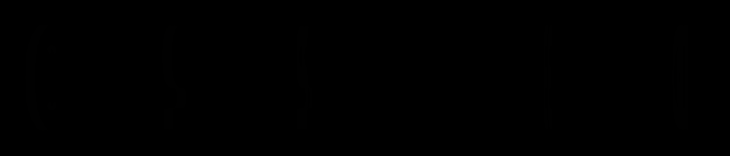
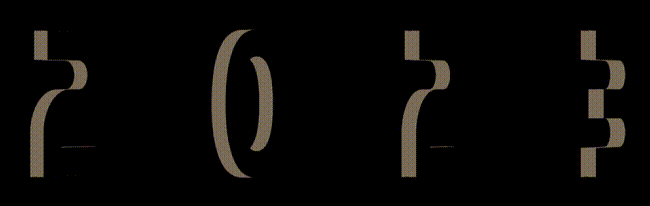
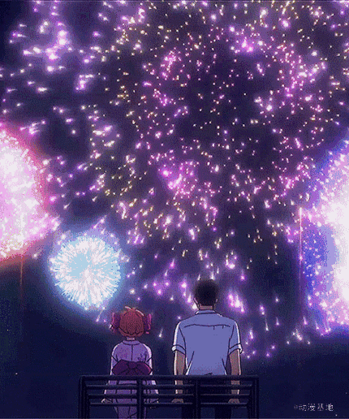
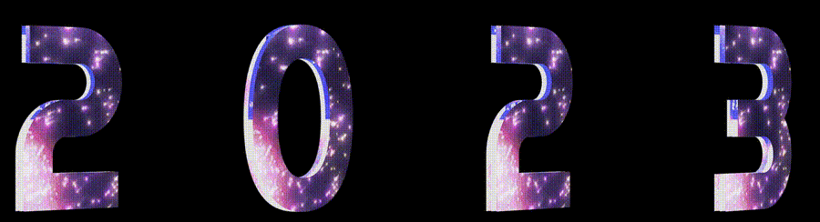

## 利用距离、角度及光影构建不一样的 3D 效果

合理的利用距离、角度及光影构建出不一样的 3D 效果。看看下面这个例子，只是简单是设置了三层字符，让它们在 Z 轴上相距一定的距离。

简单的伪代码如下：

```html
<div>
  <span class="C">C</span>
  <span class="S">S</span>
  <span class="S">S</span>
  <span></span>
  <span class="3">3</span>
  <span class="D">D</span>
</div>
```

```scss
$bright: #afa695;
$gold: #867862;
$dark: #746853;
$duration: 10s;
div {
  perspective: 2000px;
  transform-style: preserve-3d;
  animation: fade $duration infinite;
}
span {
  transform-style: preserve-3d;
  transform: rotateY(25deg);
  animation: rotate $duration infinite ease-in;

  &:after,
  &:before {
    content: attr(class);
    color: $gold;
    z-index: -1;
    animation: shadow $duration infinite;
  }
  &:after {
    transform: translateZ(-16px);
  }
  &:before {
    transform: translateZ(-8px);
  }
}
@keyframes fade {
  // 透明度变化
}
@keyframes rotate {
  // 字体旋转
}
@keyframes shadow {
  // 字体颜色变化
}
```

简单捋一下，上述代码的核心就是：

1. 父元素、子元素设置 `transform-style: preserve-3d`
2. 用 `span` 元素的两个伪元素复制两个相同的字，利用 `translateZ()` 让它们在 Z 轴间隔一定距离
3. 添加简单的旋转、透明度、字体颜色变化

可以得到这样一种类似电影开片的标题 3D 动画，其实只有 3 层元素，但是由于角度恰当，视觉上的衔接比较完美，看上去就非常的 3D。


为什么上面说需要合理的利用距离、角度及光影呢？

还是同一个动画效果，如果动画的初始旋转角度设置的稍微大一点，整个效果就会穿帮：



在前几帧，能看出来简单的分层结构。又或者，简单调整一下 `perspective`，设置父容器的 `perspective` 由 `2000px` 改为 `500px`，穿帮效果更为明显：


也就是说，在恰当的距离，合适的角度，我们仅仅通过很少的元素，就能在视觉上形成比较不错的 3D 效果。

基于，这个技巧，我们简单的改造一下，我们首先替换一下文字效果：

```html
<div>
  <span class="2">2</span>
  <span class="0">0</span>
  <span class="2">2</span>
  <span class="3">3</span>
</div>
```

这样，我们就可以得到这样一种效果：

[](https://user-images.githubusercontent.com/8554143/208047643-6600e3cc-0b07-4d84-8507-56976c27542a.gif)

Wow，有点那个意思了。接下来，我们需要换上喜庆的文字效果。首先，随便在网上找一找烟花 Gif 图，也许是这样：

[](https://user-images.githubusercontent.com/8554143/208048028-5125dcb4-c5d1-4379-9fcc-664d7d281cfb.gif)

我们通过 `background-clip: text`，给 3 层文字都加上类似这个效果，核心伪代码如下：

```scss
span {
  position: relative;
  transform-style: preserve-3d;
  color: transparent;
  background: url(xxx.gif);
  background-clip: text;

  &:after,
  &:before {
    position: absolute;
    content: attr(class);
    color: transparent;
    background: url(xxx.gif);
    background-clip: text;
  }

  &:before {
    transform: translateZ(-12px);
  }
  &:after {
    transform: translateZ(-6px);
  }
}
```

这样，我们就得到了带有烟花效果的文字，以及，一点 3D 效果：

[](https://user-images.githubusercontent.com/8554143/208049156-017b6594-c4fd-4139-936a-5fc7e669b2b7.gif)

还剩下最后一步，倒影效果怎么制作呢？

方法有很多种，比较便捷的是使用 `webkit-box-reflect` 元素。只需要一行代码即可：

```css
div {
  //...
  -webkit-box-reflect: below -6vw linear-gradient(transparent 20%, rgba(255, 255, 255, 0.6));
}
```

当然，如果对两个伪元素生成的字形成的 3D 文字视觉上的厚度不满意，也可以同步去调整两个伪元素的 `transform: translateZ(-6px)` 的值，经过一番调整后，我们就简单的复刻了如题图所示的 2023 3D 文字动画效果：

<iframe height="300" style="width: 100%;" scrolling="no" title="CSS 3D 2023" src="https://codepen.io/mafqla/embed/vYMzbOb?default-tab=html%2Cresult&editable=true&theme-id=light" frameborder="no" loading="lazy" allowtransparency="true" allowfullscreen="true">
  See the Pen <a href="https://codepen.io/mafqla/pen/vYMzbOb">
  CSS 3D 2023</a> by mafqla (<a href="https://codepen.io/mafqla">@mafqla</a>)
  on <a href="https://codepen.io">CodePen</a>.
</iframe>
