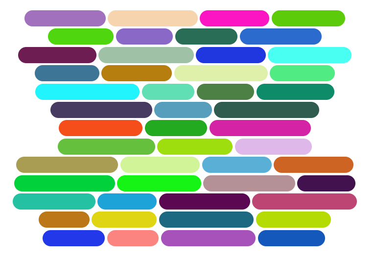

## 还原布局结构

首先，我们需要大致还原布局结构，这个并非整个动画的核心。

整个动画的核心在于**元素按顺序（又带点随机的效果）从高处下落渐次进行下落加载填充动画**。

当然，还原这个布局也非常简单，这里我们借助 flex 布局快速实现，几个关键点：

1. 每个 flex-item 宽度不固定：这一点可以使用 SASS 函数进行模拟，随机生成不同宽度的 flex-item
2. 每个 flex-item 背景色随机：这一点同样也可以借助 SASS 函数 实现
3. 整体水平居中：这个也简单，父容器添加 `justify-content: center;` 即可

这样，整个布局的大致代码如下：

```html
<ul>
  <li></li>
  <li></li>
  // ... 假设一共 50 个 li
  <li></li>
</ul>
```

```scss
$count: 51;
@function randomNum($max, $min: 0, $u: 1) {
  @return ($min + random($max)) * $u;
}
@function randomColor() {
  @return rgb(randomNum(255), randomNum(255), randomNum(255));
}

ul {
  display: flex;
  gap: 4px;
  flex-direction: row;
  flex-wrap: wrap;
  justify-content: center;
  width: 640px;
  height: 420px;
}
li {
  flex-shrink: 0;
  height: 30px;
  border-radius: 30px;
}

@for $i from 1 to $count {
  li:nth-child(#{$i}) {
    width: #{randomNum(110, 90)}px;
    background: randomColor();
  }
}
```

简单解释一下：

1. 利用了 SASS 的循环函数简化代码量
2. 实现了两个 SASS 函数，利用这两个函数随机生成不同宽度不同颜色的 li

- `randomNum()`： 用于生成范围内的随机数
- `randomColor()`： 用于生成随机颜色值

这样，我们就可以快速得到这样一个布局效果：



## 下落动画

接下来，我们来实现元素的下落动画。

首先，我们撇开多元素的按顺序又带点随机的延迟下落，值聚焦于单个 item 的下落动画，它其实是这么个动画效果：


整个动画的核心步骤大致是：

1. 默认是状态下，元素是在最终的 flex 布局状态下，且是可见状态
2. 动画开始时，元素将消失，然后从上方，在一个缩小状态下，有一个小幅度向上运动
3. 接着元素向下运动到目标位置（终止状态）
4. 元素从缩小状态，放大为正常状态
5. 并且，动画结束后，需要维持在最后一帧，因此需要使用（`animation-fill-mode: forwards`）

完成上面的拆解后，单个动画实现起来就非常轻松了：

```scss
li {
  opacity: 0;

  &hover {
    animation: falldown 1s forwards;
  }
}

@keyframes falldown {
  0% {
    transform: translateY(-180px) scaleX(0.1) scaleY(0.3);
    opacity: 1;
  }
  20% {
    transform: translateY(-200px) scaleX(0.6) scaleY(0.3);
  }
  75% {
    transform: translateY(0) scaleX(0.6) scaleY(0.3);
  }
  100% {
    transform: translateY(0) scaleX(1) scaleY(1);
    opacity: 1;
  }
}
```

这样，我们就轻松的实现了单个的动画效果：


## 实现延迟随机下落

当然，到这里，**整个动画都还是平平无奇的**。

我们需要最后的点睛之笔，实现按顺序又带点随机的延迟下落效果，以及让整体的动画更加自然。

这里的核心就在于：

1. 利用 `animation-delay` 制造延迟效果，但是不能是顺序延迟，需要带点随机效果
2. 利用 `animation-timing-function` 缓动函数，控制动画的速度曲线，使动画变化更为平滑
3. 控制缩短每一个 item 的动画时长

方法明确了，剩下的就是调试动画效果了，最终，经过一番调试，完整的动画效果的代码就完成啦。

代码量真的不多：

```css
$count: 51;
@function randomNum($max, $min: 0, $u: 1) {
  @return ($min + random($max)) * $u;
}
@function randomColor() {
  @return rgb(randomNum(255), randomNum(255), randomNum(255));
}

ul {
  display: flex;
  gap: 4px;
  flex-direction: row;
  flex-wrap: wrap;
  justify-content: center;
  width: 660px;
  height: 420px;
}
li {
  flex-shrink: 0;
  height: 30px;
  border-radius: 30px;
}

@for $i from 1 to $count {
  li:nth-child(#{$i}) {
    width: #{randomNum(110, 90)}px;
    background: randomColor();
  }
}

ul:hover {
  li {
    opacity: 0;
  }
  @for $i from 1 to $count {
    li:nth-child(#{$i}) {
      animation: falldown
        0.3s
        cubic-bezier(0.44, 0.02, 0.65, 1.3)
        #{50 *
        ($count - $i) +
        (random(150) - random(300))}ms
        forwards;
    }
  }
}
@keyframes falldown {
  0% {
    transform: translateY(-180px) scaleX(0.1) scaleY(0.3);
    opacity: 1;
  }
  20% {
    transform: translateY(-200px) scaleX(0.6) scaleY(0.3);
  }
  75% {
    transform: translateY(0) scaleX(0.6) scaleY(0.3);
  }
  100% {
    transform: translateY(0) scaleX(1) scaleY(1);
    opacity: 1;
  }
}
```

核心，就在于这一句，`animation: falldown .3s cubic-bezier(.44,.02,.65,1.3) #{50 * ($count - $i) + (random(150) - random(300))}ms forwards`，需要好好的消化理解。

这样，我们就基本完美的复刻了原效果：

<iframe height="300" style="width: 100%;" scrolling="no" title="Flex Item Fall Down" src="https://codepen.io/mafqla/embed/MWRxbvN?default-tab=html%2Cresult&editable=true&theme-id=light" frameborder="no" loading="lazy" allowtransparency="true" allowfullscreen="true">
  See the Pen <a href="https://codepen.io/mafqla/pen/MWRxbvN">
  Flex Item Fall Down</a> by mafqla (<a href="https://codepen.io/mafqla">@mafqla</a>)
  on <a href="https://codepen.io">CodePen</a>.
</iframe>
