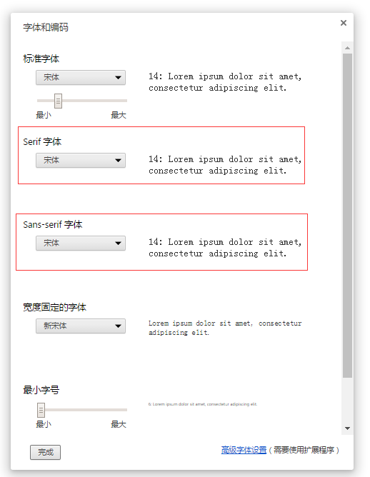

## 17、再探究字体的渲染规则及 fallback 机制

上一篇文章讲到了字体相关的一些基础知识，后续我又深入了解了下，觉得还不够深入，再开此篇继续谈谈字体的渲染规则及 fallback 机制。

下面会慢慢说到。

### 字体是如何渲染的

具体的可以看看这篇文章：[浏览器如何渲染文本](http://blog.jjgod.org/2011/04/09/how-do-browsers-render-text/)，截取部分关键信息如下：

#### 解码

1. Web 服务器返回的 HTTP 头中的 Content-Type: text/html; charset= 信息，这一般有最高的优先级；
2. 网页本身 `meta header` 中的 Content-Type 信息的 charset 部分，对于 HTTP 头未指定编码或者本地文件，一般是这么判断；
3. 假如前两条都没有找到，浏览器菜单里一般允许用户强制指定编码；

#### 分段

编码确定后，网页就被解码成了 Unicode 字符流。因为我们得到的文本可能是很多种语言混杂的，里面可能有中文、有英文，它们可能要用不同的字体显示；

为了统一处理所有这些复杂的情况，我们要将文本分为由不同语言组成的小段，在有的文本布局引擎里，这个步骤称为“itemize”，分解后的文本段常被称作“text run”，但是具体划分的规则可能根据不同的引擎有所区别。

#### 字体匹配

分段之后，则要根据设置的不同 `font-family` 对每一段文字进行字体匹配。这里遵循字体的 fallback 机制。

> fallback 机制：在操作系统介面和网页等现代排版环境下，如果指定用字体  A  来显示某字符  x  但该字体并不支持这个字符（甚至该字体当前不可用），排版引擎通常不会直接放弃，它会根据一个预先记好的列表来尝试寻找能显示字符  x  的字体，如果找到字体  B  能行，那就用字体  B  来显示字符  x。字体  B  就是当前这个情况的 fallback。

以 `font-family: Helvetica, Arial;` 为例，Arial 字体就是一种 fallback ，当指定的第一选择字体 Helvetica 不可用时，则尝试去寻找 Arial 是否可用。

系统所包含哪些字体跟什么有关呢？当我们想用一种字体，但不确认这个字体是否是系统已有的，怎么去确认呢？

首先系统所包含字体不只和系统预装的字体有关，还和系统上安装哪些软件有关，

- 微软操作系统下，详细的系统和一些软件包含的字体可以查看这个索引：[Microsoft typography](http://www.microsoft.com/typography/fonts/product.aspx)，
- Mac 系统可以查看这个索引：[List of typefaces included with OS X](https://en.wikipedia.org/wiki/List_of_Mac_OS_X_fonts)

再让我们回到网页中，CSS 里如果 font-family 未设置中文字体时，我们知道是根据浏览器默认的字体来显示，找到浏览器对应的设置，你也可以手动修改这些。

#### 渲染

当确定了字体以后，就可以将文本、字体等等参数一起交给具体的排版引擎，生成字形和位置，然后根据不同的平台调用不同的字体 rasterizer 将字形转换成最后显示在屏幕上的图案，一般浏览器都会选择平台原生的 rasterizer，比如 Mac OS X 下用 Core Graphics，Linux/X11 下用 FreeType，Windows 下用 GDI/DirectWrite 等等。

### 影响字体渲染的因素

影响字体的渲染是因素有很多，总的来说：

- Web 页面的 `lang`, `charset` 和浏览器设置都会对默认字体产生影响
- 不同操作系统、不同浏览器都默认中文、英文字体的设置都有区别

#### serif 和 sans-serif 不总是生效

serif 和 sans-serif 不总是生效，这个受到很多因素的影响。

Web 页面的 `lang`, `charset` 和浏览器设置都会对默认字体产生影响。

以 `font-family: sans-serif` 为例，希望浏览器选择一款非衬线字体展示文字。但是我们可以通过修改浏览器的默认配置来使得 sans-serif 展示一款 serif 字体。

在 Chrome 的高级设置，自定义字体中，可以进行设置。

设置了这个，此时用户代理，也就是浏览器会以用户设置的字体为准。
