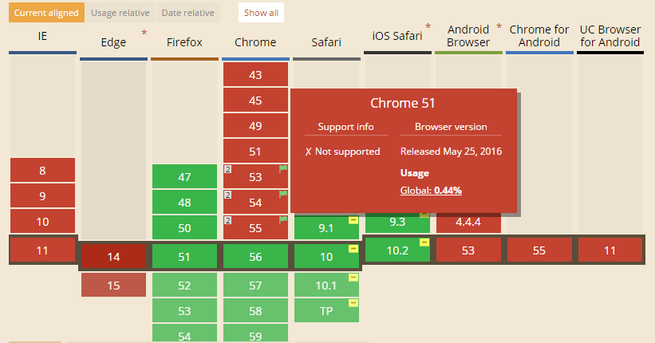
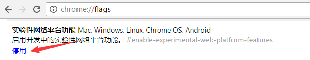
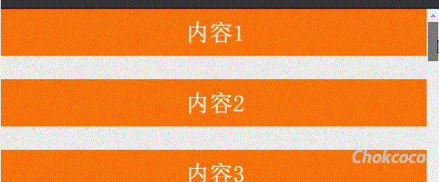
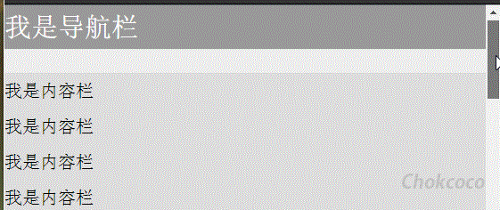

问，CSS 中 position 属性的取值有几个？
大部分人的回答是，大概是下面这几个吧？

```css
{
    position: static;
    position: relative;
    position: absolute;
    position: fixed;
}
```


额，其实，我们还可以有这 3 个取值：

```css
{
    /* 全局值 */
    position: inherit;
    position: initial;
    position: unset;
}
```


没了吗？偶然发现其实还有一个处于实验性的取值，`position:sticky`（[戳我查看MDN解释](https://developer.mozilla.org/zh-CN/docs/Web/CSS/position)）：

```
{
    position: sticky;
}
```


## 初窥 `position:sticky`

sticky 英文字面意思是**粘，粘贴**，所以姑且称之为粘性定位。下面就来了解下这个处于实验性的取值的具体功能及实用场景。

这是一个结合了 `position:relative` 和 `position:fixed` 两种定位功能于一体的特殊定位，适用于一些特殊场景。

什么是结合两种定位功能于一体呢？

元素先按照普通文档流定位，然后相对于该元素在流中的 flow root（BFC）和 containing block（最近的块级祖先元素）定位。

而后，元素定位表现为在跨越特定阈值前为相对定位，之后为固定定位。

这个特定阈值指的是 top, right, bottom 或 left 之一，换言之，指定 top, right, bottom 或 left 四个阈值其中之一，才可使粘性定位生效。否则其行为与相对定位相同。

## 不乐观的兼容性

在讲述具体示例之前，还是很有必要了解一下 `position:sticky` 的兼容性，嗯，不乐观的兼容性。

看看 [CANIUSE](http://caniuse.com/#feat=css-sticky) 下的截图：




IOS 家族（SAFARI && IOS SAFARI）和 Firefox 很早开始就支持 `position:sticky` 了。而 Chrome53~55 则需要启用实验性网络平台功能才行。其中 webkit 内核的要添加上私有前缀 `-webkit-`。

### Chrome 53~55 开启 #enable-experimental-web-platform-features

地址栏输入 `chrome://flags/` ，找到 `enable-experimental-web-platform-features` ，选择启用：



所以下面的 CodePen 示例，需要上述几个浏览器下观看。

## `position:sticky` 示例

嗯，上面的文字描述估计还是很难理解，看看下面这张 GIF 图，想想要实现的话，使用 JS + CSS 的方式该如何做：


按照常规做法，大概是监听页面 scroll 事件，判断每一区块距离视口顶部距离，超过了则设定该区块 `position:fixed`，反之去掉。

而使用 `position:sticky` ，则可以非常方便的实现（请在 SAFARI 或者 CHROME53+ 下观看）：

<iframe height='265' scrolling='no' title='positionSticky' src='//codepen.io/Chokcoco/embed/XpGjJg/?height=265&theme-id=0&default-tab=css,result&embed-version=2' frameborder='no' allowtransparency='true' allowfullscreen='true' style='width: 100%;'>See the Pen positionSticky by Chokcoco (@Chokcoco) on CodePen. </iframe>

嗯，看看上面的 CSS 代码，只需要给每个内容区块加上

```css
{
    position: -webkit-sticky;
    position: sticky;
    top: 0;
}
```


就可以轻松实现了。

简单描述下生效过程，因为设定的阈值是 `top:0` ，这个值表示当元素距离页面视口（Viewport，也就是fixed定位的参照）顶部距离大于 0px 时，元素以 relative 定位表现，而当元素距离页面视口小于 0px 时，元素表现为 fixed 定位，也就会固定在顶部。

不理解可以再看看下面这两张示意图（top:20px 的情况，取自开源项目[fixed-sticky](https://github.com/filamentgroup/fixed-sticky)）：

#### 距离页面顶部大于20px，表现为 `position:relative`;


#### 距离页面顶部小于20px，表现为 `position:fixed`;


### 运用 `position:sticky` 实现头部导航栏固定

运用 `position:sticky` 实现导航栏固定，也是最常见的用法：




<iframe height='265' scrolling='no' title='stickyNav' src='//codepen.io/Chokcoco/embed/OWqpjJ/?height=265&theme-id=0&default-tab=css,result&embed-version=2' frameborder='no' allowtransparency='true' allowfullscreen='true' style='width: 100%;'>See the Pen stickyNav by Chokcoco (@Chokcoco) on CodePen. </iframe>

同理，也可以实现侧边导航栏的超出固定。

## 生效规则

`position:sticky` 的生效是有一定的限制的，总结如下：

1. 须指定 top, right, bottom 或 left 四个阈值其中之一，才可使粘性定位生效。否则其行为与相对定位相同。
   - 并且 `top` 和 `bottom` 同时设置时，`top` 生效的优先级高，`left` 和 `right` 同时设置时，`left` 的优先级高。
2. 设定为 `position:sticky` 元素的任意父节点的 overflow 属性必须是 visible，否则 `position:sticky` 不会生效。这里需要解释一下：
   - 如果 `position:sticky` 元素的任意父节点定位设置为 `position:overflow`，则父容器无法进行滚动，所以 `position:sticky` 元素也不会有滚动然后固定的情况。
   - 如果 `position:sticky` 元素的任意父节点定位设置为 `position:relative | absolute | fixed`，则元素相对父元素进行定位，而不会相对 viewprot 定位。
3. 达到设定的阀值。这个还算好理解，也就是设定了 `position:sticky` 的元素表现为 `relative` 还是 `fixed` 是根据元素是否达到设定了的阈值决定的。

## 开始使用？

上面从兼容性也看到了，情况不容乐观，但是用于某些布局还是能省很多力的，如果真的希望用上这个属性，可以采用一些开源库来实现兼容。

推荐 [fixed-sticky](https://github.com/filamentgroup/fixed-sticky) 。