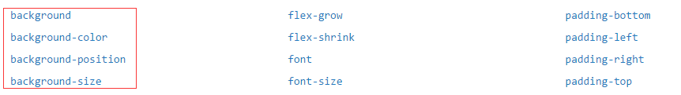

通过本文，你能了解到 4 种不一样的，使用纯 CSS 制作的渐变背景的过渡动画的方式。

有的时候，我们可能需要下面这样的动画效果，渐变背景色的过渡动画：

假设我们渐变的写法如下：

```css
div {
  background: linear-gradient(90deg, #ffc700 0%, #e91e1e 100%);
}
```

按照常规想法，配合 `animation` ，我们首先会想到在 `animation` 的步骤中通过改变颜色实现颜色渐变动画，那么我们的 CSS 代码可能是：

```css
div {
  background: linear-gradient(90deg, #ffc700 0%, #e91e1e 100%);
  animation: gradientChange 2s infinite;
}

@keyframes gradientChange {
  100% {
    // 渐变中的颜色发生了变化
    background: linear-gradient(90deg, #e91e1e 0%, #6f27b0 100%);
  }
}
```

上面我们用到了三种颜色：

- `#ffc700` 黄色
- `#e91e1e` 红色
- `#6f27b0` 紫色

最后，并没有我们预期的结果，而是这样的：

<GradientChange :one="true"/>

我们预期的过渡动画，变成了逐帧动画。

也就是说，线性渐变是不支持动画 `animation` 的。

那单纯的由一个颜色，变化到另外一个颜色呢？像下面这样：

```css
div {
  background: #ffc700;
  animation: gradientChange 3s infinite alternate;
}

@keyframes gradientChange {
  100% {
    background: #e91e1e;
  }
}
```

我们发现，单纯的单色值之间的变化是可以发生渐变的：


### 部分属性是不支持直接整个进行过渡动画的

总结一下，线性渐变（径向渐变、角向渐变）是不支持 `animation` 的，单色的 background 是支持的。

查找了下文档，在 `background` 附近区域截图如下：



**[哪些 CSS 属性可以动画?](https://developer.mozilla.org/en-US/docs/Web/CSS/CSS_animated_properties)**，上面的截图是不完整的支持 CSS 动画的属性，完整的可以戳左边。

对于 `background` 相关的，文档里写的是支持 `background` 但是没有细说不支持 `background: linear-gradient()/radial-gradient()` 。

那么是否我们想要的背景色渐变动画就无法实现了呢？下面我们就发散下思维看看有没有其他方式可以达到我们的目标。

## 通过 background-position 模拟渐变动画

上面*哪些 CSS 属性可以动画*的截图中，列出了与 `background` 相关还有 `background-position` ，也就是 `background-position` 是支持动画的，通过改变 `background-position` 的方式，可以实现渐变动画：

```css
div {
  background: linear-gradient(90deg, #ffc700 0%, #e91e1e 50%, #6f27b0 100%);
  background-size: 200% 100%;
  background-position: 0 0;
  animation: bgposition 2s infinite linear alternate;
}

@keyframes bgposition {
  0% {
    background-position: 0 0;
  }
  100% {
    background-position: 100% 0;
  }
}
```

这里我们还配合了 `background-size`。首先了解下：

> `background-position`：指定图片的初始位置。这个初始位置是相对于以 `background-origin` 定义的背景位置图层来说的。

> `background-size`：设置背景图片大小。当取值为百分比时，表示指定背景图片相对背景区的百分比大小。当设置两个参数时，第一个值指定图片的宽度，第二个值指定图片的高度。

通过 `background-size: 200% 100%` 将图片的宽度设置为两倍背景区的宽度，再通过改变 `background-position` 的 x 轴初始位置来移动图片，由于背景图设置的大小是背景区的两倍，所以 `background-position` 的移动是由 `0 0` -> `100% 0` 。

## 通过 background-size 模拟渐变动画

既然 `background-position` 可以，那么另一个 `background-size` 当然也是不遑多让。与上面的方法类似，只是这次 `background-position` 辅助 `background-size` ，CSS 代码如下：

```css
div {
  background: linear-gradient(
    90deg,
    #ffc700 0%,
    #e91e1e 33%,
    #6f27b0 66%,
    #00ff88 100%
  );
  background-position: 100% 0;
  animation: bgSize 5s infinite ease-in-out alternate;
}

@keyframes bgSize {
  0% {
    background-size: 300% 100%;
  }
  100% {
    background-size: 100% 100%;
  }
}
```

通过改变 `background-size` 的第一个值，我将背景图的大小由 3 倍背景区大小向 1 倍背景区大小过渡，在背景图变换的过程中，就有了一种动画的效果。

而至于为什么要配合 `background-position: 100% 0` 。是由于如果不设置 `background-position` ，默认情况下的值为 `0% 0%`，会导致动画最左侧的颜色不变，像下面这样，不大自然：

<GradientChange :two="true"/>

## 通过 transform 模拟渐变动画

上面两种方式虽然都可以实现，但是总感觉不够自由，或者随机性不够大。

不仅如此，上述两种方式，由于使用了 `background-position` 和 `background-size`，并且在渐变中改变这两个属性，导致页面不断地进行大量的重绘（repaint），对页面性能消耗非常严重，所以我们还可以试试 `transfrom` 的方法：

下面这种方式，使用**伪元素**配合 `transform` 进行渐变动画，通过元素的伪元素 `before` 或者 `after` ，在元素内部画出一个大背景，再通过 `transform` 对伪元素进行变换：

```css
div {
  position: relative;
  overflow: hidden;
  width: 100px;
  height: 100px;
  margin: 100px auto;
  border: 2px solid #000;

  &::before {
    content: '';
    position: absolute;
    top: -100%;
    left: -100%;
    bottom: -100%;
    right: -100%;
    background: linear-gradient(45deg, #ffc700 0%, #e91e1e 50%, #6f27b0 100%);
    background-size: 100% 100%;
    animation: bgposition 5s infinite linear alternate;
    z-index: -1;
  }
}

@keyframes bgposition {
  0% {
    transform: translate(30%, 30%);
  }
  25% {
    transform: translate(30%, -30%);
  }
  50% {
    transform: translate(-30%, -30%);
  }
  75% {
    transform: translate(-30%, 30%);
  }
  100% {
    transform: translate(30%, 30%);
  }
}
```

<GradientChange :three="true"/>

上面列出来的只是部分方法，理论而言，伪元素配合能够产生位移或者形变的属性都可以完成上面的效果。我们甚至可以运用不同的缓动函数或者借鉴蝉原则，制作出随机性十分强的效果。

当然，本文罗列出来的都是纯 CSS 方法，使用 SVG 或者 Canvas 同样可以制作出来，而且性能更佳。感兴趣的读者可以自行往下研究。

## 通过滤镜 hue-rotate 实现渐变动画（更新于 2019/04/06）

下面这个方法，可谓是新时代的利器。

通过滤镜 hue-rotate，可以非常方便的实现背景色渐变动画，过渡效果也非常的自然，代码量也少，可以称得上是黑科技了：

```css
div {
  background: linear-gradient(45deg, #ffc107, deeppink, #9c27b0);
  animation: hueRotate 10s infinite alternate;
}

@keyframes hueRotate {
  0 {
    filter: hue-rotate(0);
  }
  100% {
    filter: hue-rotate(360deg);
  }
}
```

<GradientChange :four="true"/>

## 使用 CSS [@Property](https://github.com/Property) 实现背景色渐变动画（更新于 2021/04/15）

到今天（2021/04/15），我们还可以使用 `CSS @property` 实现背景色渐变动画，它的出现，极大的增强的 CSS 的能力！

根据 [MDN -- CSS Property](https://developer.mozilla.org/zh-CN/docs/Web/CSS/@property)，[@Property](https://github.com/Property) CSS at-rule 是 CSS Houdini API 的一部分, 它允许开发者显式地定义他们的 CSS 自定义属性，允许进行属性类型检查、设定默认值以及定义该自定义属性是否可以被继承。

```css
@property --colorA {
  syntax: '<color>';
  inherits: false;
  initial-value: fuchsia;
}
@property --colorC {
  syntax: '<color>';
  inherits: false;
  initial-value: #f79188;
}
@property --colorF {
  syntax: '<color>';
  inherits: false;
  initial-value: red;
}
div {
  background: linear-gradient(
    45deg,
    var(--colorA),
    var(--colorC),
    var(--colorF)
  );
  animation: change 10s infinite linear;
}

@keyframes change {
  20% {
    --colorA: red;
    --colorC: #a93ee0;
    --colorF: fuchsia;
  }
  40% {
    --colorA: #ff3c41;
    --colorC: #e228a0;
    --colorF: #2e4c96;
  }
  60% {
    --colorA: orange;
    --colorC: green;
    --colorF: teal;
  }
  80% {
    --colorA: #ae63e4;
    --colorC: #0ebeff;
    --colorF: #efc371;
  }
}
```


简单解读下，CSS [@Property](https://github.com/Property) 其实就是灵活度更高的，CSS 自定义属性，我们也可以称其为 CSS Houdini 自定义属性。其中：

- `@property --property-name` 中的 `--property-name` 就是自定义属性的名称，定义后可在 CSS 中通过 `var(--property-name)` 进行引用
- syntax：该自定义属性的语法规则，也可以理解为表示定义的自定义属性的类型
- inherits：是否允许继承
- initial-value：初始值

在上述的 DEMO 中，我们利用了 CSS Houdini 自定义属性，将原本定义在 `background` 的过渡效果嫁接到了 `color` 之上，而 CSS 是支持一个颜色变换到另外一个颜色的，这样，我们巧妙的实现了渐变背景色的过渡动画。

> 关于更多 `CSS @property` 相关的内容，你可以戳这篇文章详细了解 -- [CSS @property，让不可能变可能](https://juejin.cn/post/6951201528543707150)

<GradientChange :five="true"/>

至此，我们就得到了 **4** 种不一样的，使用纯 CSS 制作的渐变背景的过渡动画的方式。

## 运用背景色渐变动画

背景色渐变动画具体可以运用在什么地方呢，稍微举个例子。

### 背景色渐变过渡实现按钮的明暗变化

<GradientChange :six="true"/>

除此之外，在背景板凸显文字，让一些静态底图动起来吸引眼球等地方都有用武之地。
