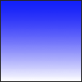
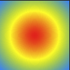
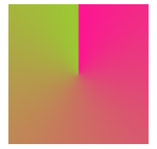
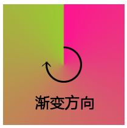
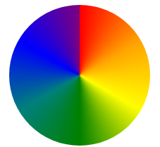
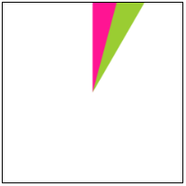
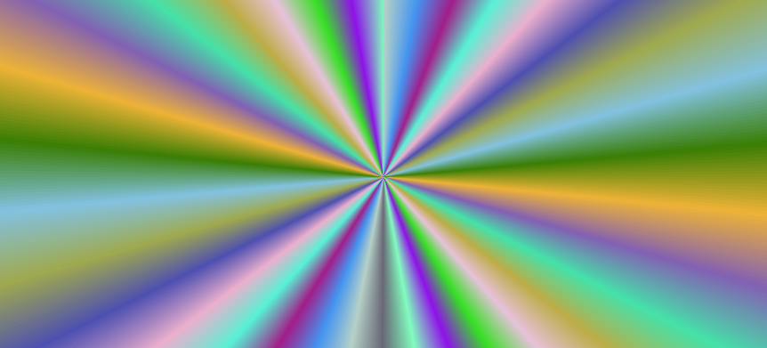
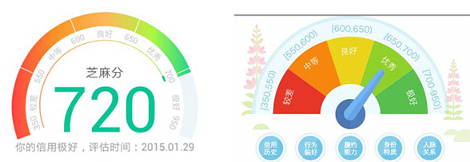

## 开始使用 conic-gradient 角向渐变

感谢 [LeaVerou](https://github.com/leaverou/conic-gradient) 大神，让我们可以提前使用上这么美妙的属性。

`conic-gradient` 是个什么？说到 `conic-gradient` ，就不得不提的它的另外两个兄弟：

- `linear-gradient` : 线性渐变
  
- `radial-gradient` : 径向渐变
  

说这两个应该还是有很多人了解并且使用过的。CSS3 新增的线性渐变及径向渐变给 CSS 世界带来了很大的变化。

而 `conic-gradient` ，表示角向渐变，另外一种渐变方式，给 CSS 世界带来了更多可能。

下面进入正文，**本文中所有示例，请在高版本 Chrome 内核下预览**。

### API

看看它最简单的 API：

```css
{
    /* Basic example */ 
    background: conic-gradient(deeppink, yellowgreen);
}
```




### 与**线性渐变**及**径向渐变**的异同

那么它和另外两个渐变的区别在哪里呢？

- `linear-gradient` 线性渐变的方向是一条直线，可以是任何角度
- `radial-gradient`径向渐变是从圆心点以椭圆形状向外扩散

而从方向上来说，角向渐变的方向是这样的：


**划重点**：

从图中可以看到，角向渐变的渐变方向和起始点。**起始点**是图形中心，然后以**顺时针方向**绕中心实现渐变效果。

## 使用 `conic-gradient` 实现颜色表盘

从上面了解了 `conic-gradient` 最简单的用法，我们使用它实现一个最简单的**颜色表盘**。

`conic-gradient` 不仅仅只是从一种颜色渐变到另一种颜色，与另外两个渐变一样，可以实现多颜色的过渡渐变。

由此，想到了彩虹，我们可以依次列出 `赤橙黄绿青蓝紫` 七种颜色：

- `conic-gradient: (red, orange, yellow, green, teal, blue, purple)`

上面表示，在角向渐变的过程中，颜色从设定的第一个 `red` 开始，渐变到 `orange` ，再到 `yellow` ，一直到最后设定的 `purple` 。并且每一个区间是等分的。

我们再给加上 `border-radius: 50%` ，假设我们的 CSS 如下，

```css
{
    width: 200px;
    height: 200px;
    border-radius: 50%;
    background: conic-gradient(red, orange, yellow, green, teal, blue, purple);
}
```


看看效果：




嗯？问题出在哪里呢？一是颜色不够丰富不够明亮，二是起始处与结尾处衔接不够自然。让我再稍微调整一下。

我们知道，表示颜色的方法，除了 `rgb()` 颜色表示法之外，还有 `hsl()` 表示法。

> `hsl()` 被定义为色相-饱和度-明度（Hue-saturation-lightness）

- 色相（H）是色彩的基本属性，就是平常所说的颜色名称，如红色、黄色等。
- 饱和度（S）是指色彩的纯度，越高色彩越纯，低则逐渐变灰，取0-100%的数值。
- 明度（V），亮度（L），取0-100%。

这里，我们通过改变色相得到一个较为明亮完整的颜色色系。

也就是采用这样一个过渡 `hsl(0%, 100%, 50%)` --> `hsl(100%, 100%, 50%)`，中间只改变色相，生成 20 个过渡状态。借助 SCSS ，CSS 语法如下:

```scss
$colors: ();
$totalStops:20;

@for $i from 0 through $totalStops{
    $colors: append($colors, hsl($i *(360deg/$totalStops), 100%, 50%), comma);
}

.colors {
    width: 200px;
    height: 200px;
    background: conic-gradient($colors);
    border-radius: 50%;
}
```


得到如下效果图，这次的效果很好：

<iframe height="300" style="width: 100%;" scrolling="no" title="conic-gradinet colors" src="https://codepen.io/mafqla/embed/MWxyrwQ?default-tab=html%2Cresult&editable=true&theme-id=light" frameborder="no" loading="lazy" allowtransparency="true" allowfullscreen="true">
  See the Pen <a href="https://codepen.io/mafqla/pen/MWxyrwQ">
  conic-gradinet colors</a> by mafqla (<a href="https://codepen.io/mafqla">@mafqla</a>)
  on <a href="https://codepen.io">CodePen</a>.
</iframe>

## 配合百分比使用

当然，我们可以更加具体的指定角向渐变每一段的比例，**配合百分比**，可以很轻松的实现饼图。

假设我们有如下 CSS：

```css
{
    width: 200px;
    height: 200px;
    background: conic-gradient(deeppink 0, deeppink 30%, yellowgreen 30%, yellowgreen 70%, teal 70%, teal 100%);
    border-radius: 50%;
}
```


上图，我们分别指定了 0~30%，30%~70%，70%~100% 三个区间的颜色分别为 `deeppink(深红)`，`yellowgreen(黄绿)` 以及 `teal(青)` ，可以得到如下饼图：


当然，上面只是百分比的第一种写法，还有另一种写法也能实现：

```css
{
    background: conic-gradient(deeppink 0 30%, yellowgreen 0 70%, teal 0 100%);
}
```


这里表示 ：

1. 0-30% 的区间使用 `deeppink`
2. 0-70% 的区间使用 `yellowgreen `
3. 0-100% 的区间使用 `teal`

而且，先定义的颜色的层叠在后定义的颜色之上。

<iframe height="300" style="width: 100%;" scrolling="no" title="use proportion in conic-gradient" src="https://codepen.io/mafqla/embed/ExMKojd?default-tab=html%2Cresult&editable=true&theme-id=light" frameborder="no" loading="lazy" allowtransparency="true" allowfullscreen="true">
  See the Pen <a href="https://codepen.io/mafqla/pen/ExMKojd">
  use proportion in conic-gradient</a> by mafqla (<a href="https://codepen.io/mafqla">@mafqla</a>)
  on <a href="https://codepen.io">CodePen</a>.
</iframe>

## 配合 `background-size` 使用

使用了百分比控制了区间，再配合使用 `background-size` 就可以实现各种贴图啦。

我们首先实现一个基础角向渐变图形如下：

```css
{
    width: 250px;
    height: 250px;
    margin: 50px auto;
    background: conic-gradient(#000 12.5%, #fff 0 37.5%, #000 0 62.5%, #fff 0 87.5%, #000 0);
}
```


效果图：


再加上 `background-size: 50px 50px;`，也就是：

```css
{
    width: 250px;
    height: 250px;
    margin: 50px auto;
    background: conic-gradient(#000 12.5%, #fff 0 37.5%, #000 0 62.5%, #fff 0 87.5%, #000 0);
    background-size: 50px 50px;
}
```


得到：

<iframe height="600" style="width: 100%;" scrolling="no" title="conic-gradient wallpaper" src="https://codepen.io/mafqla/embed/VwRayLo?default-tab=html%2Cresult&editable=true&theme-id=light" frameborder="no" loading="lazy" allowtransparency="true" allowfullscreen="true">
  See the Pen <a href="https://codepen.io/mafqla/pen/VwRayLo">
  conic-gradient wallpaper</a> by mafqla (<a href="https://codepen.io/mafqla">@mafqla</a>)
  on <a href="https://codepen.io">CodePen</a>.
</iframe>

## 重复角向渐变 `repeating-conic-gradient`

与线性渐变及径向渐变一样，角向渐变也是存在重复角向渐变 `repaet-conic-gradient` 的。

我们假设希望不断重复的片段是 0~30° 的一个片段，它的 CSS 代码是 `conic-gradient(deeppink 0 15deg, yellowgreen 0 30deg)` 。



那么，使用了 `repeating-conic-gradient` 之后，会自动填充满整个区域，CSS 代码如下：

```css
{
    width: 200px;
    height: 200px;
    background: repeating-conic-gradient(deeppink 0 15deg, yellowgreen 0 30deg);
    border: 1px solid #000;
}
```


<iframe height="300" style="width: 100%;" scrolling="no" title="repeating-conic-gradient" src="https://codepen.io/mafqla/embed/gOEroaP?default-tab=html%2Cresult&editable=true&theme-id=light" frameborder="no" loading="lazy" allowtransparency="true" allowfullscreen="true">
  See the Pen <a href="https://codepen.io/mafqla/pen/gOEroaP">
  repeating-conic-gradient</a> by mafqla (<a href="https://codepen.io/mafqla">@mafqla</a>)
  on <a href="https://codepen.io">CodePen</a>.
</iframe>

## 角向渐变动画

基本的一些用法了解完了，看看使用角向渐变可以玩出什么花来。

借助 `SCSS` 的强大，我们可以制作出一些非常酷炫的背景展板。

使用 SCSS ，我们随机生成一个多颜色的角向渐变图案：

假设我们的 HTML 结构如下：

```html
<div></div>
```


CSS/SCSS 代码如下：

```scss
@function randomNum($max, $min: 0, $u: 1) {
	@return ($min + random($max)) * $u;
}

@function randomConicGradient() {
    $n: random(30) + 10;
	$list: ();
    
	@for $i from 0 to $n {
		$list: $list, rgb(randomNum(255), randomNum(255), randomNum(255));
	}
		
	@return conic-gradient($list, nth($list, 1));
}

div {
    width: 100vw;
    height: 100vh;
    background: randomConicGradient();
}
```


简单解释下上面的 SCSS 代码，

- `randomNum()` 用于生成随机数，`randomNum(255)` 相当于随机生成 1~255 的随机数；
- `randomConicGradient()` 用于生成整个 `conic-gradient()` 内的参数，也就是每一区间的颜色；
- `vw` 和 `vh` 是比较新的 CSS 单位，一个页面而言，它的视窗的高度就是 100vh，宽度就是 100vw 。

OK，刷新页面，得到如下效果图：




还没完，接下来给它加上旋转动画，蹬蹬蹬，旋转起来大概是这样：

<iframe height="300" style="width: 100%;" scrolling="no" title="conic-gradient background" src="https://codepen.io/mafqla/embed/QWoNajg?default-tab=html%2Cresult&editable=true&theme-id=light" frameborder="no" loading="lazy" allowtransparency="true" allowfullscreen="true">
  See the Pen <a href="https://codepen.io/mafqla/pen/QWoNajg">
  conic-gradient background</a> by mafqla (<a href="https://codepen.io/mafqla">@mafqla</a>)
  on <a href="https://codepen.io">CodePen</a>.
</iframe>
## 脑洞时刻

到这里我还是不是很满足。想到了之前的 `mix-blend-mode` 属性。

> 想了解 `mix-blend-mode` 这个属性，可以戳我看看：[不可思议的颜色混合模式 mix-blend-mode](http://www.cnblogs.com/coco1s/p/6829372.html)

如果多个角向渐变层级叠加，并且运用上 `mix-blend-mode` 会发生什么？

最终捣鼓出这种非常科幻的效果：


使用了 2 个半透明的角向渐变，相对反向进行旋转，并且在底层使用 `mix-blend-mode: overlay` 叠加了一个白黑径向渐变图层。可以看看代码及效果：

<iframe height="300" style="width: 100%;" scrolling="no" title="animation conic-gradient" src="https://codepen.io/mafqla/embed/poYypjd?default-tab=html%2Cresult&editable=true&theme-id=light" frameborder="no" loading="lazy" allowtransparency="true" allowfullscreen="true">
  See the Pen <a href="https://codepen.io/mafqla/pen/poYypjd">
  animation conic-gradient</a> by mafqla (<a href="https://codepen.io/mafqla">@mafqla</a>)
  on <a href="https://codepen.io">CodePen</a>.
</iframe>


## 在项目中使用 `conic-gradient`

上面的例子酷炫归酷炫，但是在项目中实用性不强。那么角向渐变是否能用于业务中的？答案是肯定的。

看看下面这个图，芝麻信用分背景渐变颜色条，不使用 JS，纯 CSS 借助 `conic-gradient` 如何画出来。

假设我们的结构如下：

```html
<div class="bg">
    <div class="point"></div>
</div>
```


```css
.bg {
    position: relative;
    margin: 50px auto;
    width: 400px;
    height: 400px;
    border-radius: 50%;
    background: conic-gradient(#f1462c 0%, #fc5d2c 12.4%, #fff 12.5%, #fff 12.5%, #fc5d2c 12.5%, #fba73e 24.9%, #fff 24.9%, #fff 25%, #fba73e 25%, #e0fa4e 37.4%, #fff 37.4%, #fff 37.5%, #e0fa4e 37.5%, #12dd7e 49.9%, #fff 49.9%, #fff 50%, #12dd7e 50%, #0a6e3f 62.4%, #fff 62.4%, #fff 62.5%);
    transform: rotate(-112.5deg);
    transform-origin: 50% 50%;
}

.bg::before {
    content: "";
    position: absolute;
    top: 50%;
    left: 50%;
    transform: translate(-50%, -50%);
    width: 370px;
    height: 370px;
    border-radius: 50%;
    background: #fff;
}

.bg::after {
    content: "";
    position: absolute;
    top: 50%;
    left: 50%;
    transform: translate(-50%, -50%);
    width: 320px;
    height: 320px;
    border-radius: 50%;
    background: 
        radial-gradient(#fff 0%, #fff 25%, transparent 25%, transparent 100%),
        conic-gradient(#f1462c 0 12.5%, #fba73e 0 25%, #e0fa4e 0 37.5%, #12dd7e 0 50%, #0a6e3f 0 62.5%, #fff 0 100%);
        
}

.point {
    position: absolute;
    width: 30px;
    height: 30px;
    transform: translate(-50%, -50%);
    left: 50%;
    top: 50%;
    background: radial-gradient(#467dc6 0%, #a4c6f3 100%);
    border-radius: 50%;
    z-index: 999;
}

.point::before {
    content: "";
    position: absolute;
    width: 5px;
    height: 350px;
    left: 50%;
    top: 50%;
    transform: translate(-50%, -50%) rotate(0);
    border-radius: 100% 100% 5% 5%;
    background: linear-gradient(
        180deg,
        #9bc7f6 0,
        #467dc6 50%,
        transparent 50%,
        transparent 100%
    );
    animation: rotate 3s cubic-bezier(.93, 1.32, .89, 1.15) infinite;
}

@keyframes rotate {
	50% {
		transform: translate(-50%, -50%) rotate(150deg);
	}
	100% {
		transform: translate(-50%, -50%) rotate(150deg);
	}
}
```


为了凸显 `conic-gradient` 的实用性，简单将二者合二为一，模拟了一下。看看效果，大功告成，所以说 `conic-gradient` 还是有用武之地的：

<iframe height="300" style="width: 100%;" scrolling="no" title="conic-gradient 表盘信用分示例" src="https://codepen.io/mafqla/embed/ExMKoVd?default-tab=html%2Cresult&editable=true&theme-id=light" frameborder="no" loading="lazy" allowtransparency="true" allowfullscreen="true">
  See the Pen <a href="https://codepen.io/mafqla/pen/ExMKoVd">
  conic-gradient 表盘信用分示例</a> by mafqla (<a href="https://codepen.io/mafqla">@mafqla</a>)
  on <a href="https://codepen.io">CodePen</a>.
</iframe>

## 角向渐变 `conic-gradient` polyfill 垫片库

看到这里，想必读者们都跃跃欲试这么神奇的属性。

但是，按照惯例，这种 “高科技” 通常兼容性都不怎么滴。`conic-gradient` 兼容性又如何呢？

非常惨烈，CSS 官方对其的描述是：

- **处于修正阶段的模块(Modules in the revising phase)**

> 处于修正阶段的模块没有处于改善阶段的模块稳定。通常它们的语法还需要详细审查，说不定还会有很大的变化，而且不保证和之前的兼容。替代的语法通常经过测试并已经实现。

万幸的是，在文章开头我也提到了，感谢 [LeaVerou](https://github.com/leaverou/conic-gradient) 大神，让我们可以提前使用上这么美妙的属性。

LeaVerou 提供了一个垫片库，按照本文上述的语法，添加这个垫片库，就可以开心的使用起来啦。

> polyfill 是一个开发术语，在 Web 开发中，polyfill 垫片库的准确意思为：用于实现浏览器并不支持的原生API的代码。现在引申为实现浏览器并不支持的某些功能的兼容库。

你需要添加如下的 JS ，垫片库会按照 CSS 语法，生成对应的角向渐变图案，并且转化为 BASE64 代码：

```html
<script src="//cdnjs.cloudflare.com/ajax/libs/prefixfree/1.0.7/prefixfree.min.js"></script>
<script src="//leaverou.github.io/conic-gradient/conic-gradient.js"></script>
```


> 因为垫片库的作用是将我们的 CSS 语法转化成为 BASE64 代码替换 `background-image: url()` 中的内容，所以，上线后是不需要再添加这两个库的。


## 参考文献

[CSS conic-gradient() polyfill](http://leaverou.github.io/conic-gradient/)