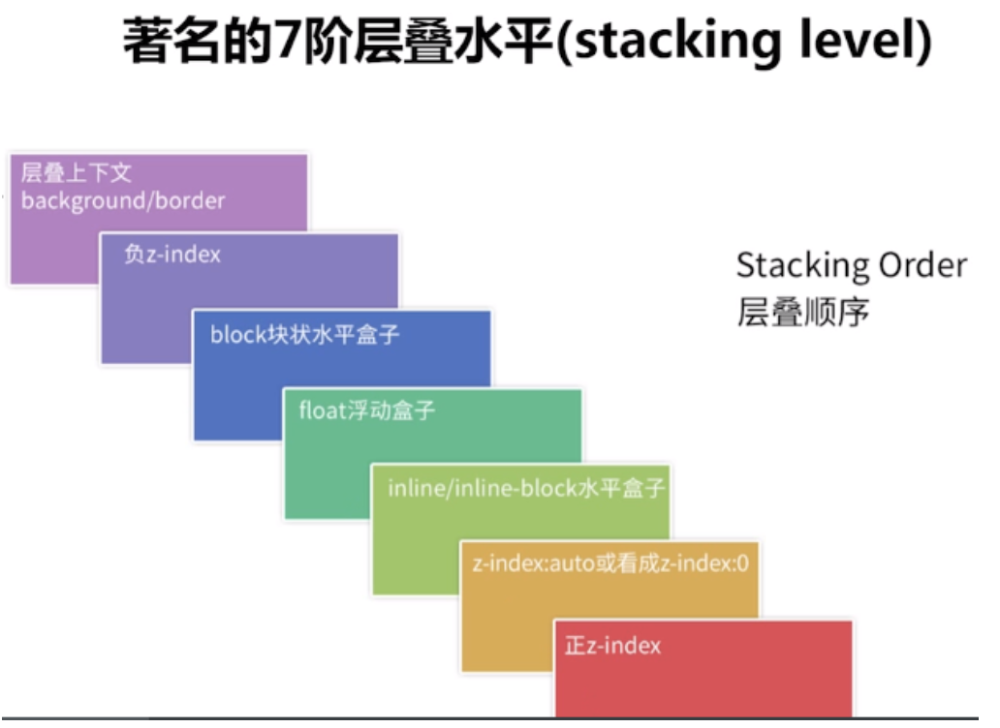
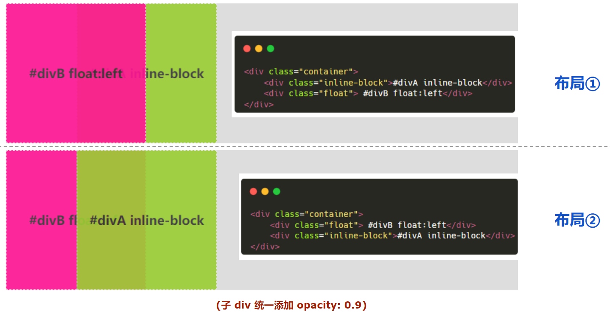

## 3、层叠顺序（stacking level）与堆栈上下文（stacking context）知多少？

`z-index `看上去其实很简单，根据 `z-index` 的高低决定层叠的优先级，实则深入进去，会发现内有乾坤。

看看下面这题，定义两个 div A 和 B，被包括在同一个父 div 标签下。HTML 结构如下：

```html
<div class="container">
  <div class="inline-block">#divA display:inline-block</div>
  <div class="float">#divB float:left</div>
</div>
```

它们的 CSS 定义如下：

```css
.container {
  position: relative;
  background: #ddd;
}
.container > div {
  width: 200px;
  height: 200px;
}
.float {
  float: left;
  background-color: deeppink;
}
.inline-block {
  display: inline-block;
  background-color: yellowgreen;
  margin-left: -100px;
}
```

大概描述起来，意思就是拥有共同父容器的两个 DIV 重叠在一起，是 `display:inline-block` 叠在上面，还是 `float:left` 叠在上面？

注意这里 DOM 的顺序，是先生成 `display:inline-block` ，再生成 `float:left` 。当然也可以把两个的 DOM 顺序调转如下：

```html
<div class="container">
  <div class="float">#divB float:left</div>
  <div class="inline-block">#divA display:inline-block</div>
</div>
```

会发现，无论顺序如何，始终是 `display:inline-block` 的 div 叠在上方，像是这样：

<div style="position: relative; background: #ddd; margin-top: 10px;">
      <div style="display: inline-block; background-color: yellowgreen; margin-left: -100px;">
      #divA inline-block
      </div>
      <div style="float: left; background-color: deeppink;"> #divB float:left</div>
</div>

<div style="position: relative; background: #ddd; margin-top: 10px;">
      <div style="float: left; background-color: deeppink;"> #divB float:left</div>
      <div  style="display: inline-block; background-color: yellowgreen; margin-left: -100px;">#divA inline-block</div>
</div>

这里其实是涉及了所谓的层叠水平（stacking level)，有一张图可以很好的诠释：


运用上图的逻辑，上面的题目就迎刃而解，`inline-blcok` 的 `stacking level `比之` float` 要高，所以无论 DOM 的先后顺序都堆叠在上面。

不过上面图示的说法有一些不准确，按照 W3 官方 的说法，准确的 7 层为：
1、形成堆叠上下文环境的元素的背景与边框
2、拥有负 `z-index` 的子堆叠上下文元素 （负的越高越堆叠层级越低）
3、正常流式布局，非 `inline-block`，无 `position` 定位（static 除外）的子元素
4、无 position 定位（static 除外）的 float 浮动元素
5、正常流式布局， `inline-block` 元素，无 `position` 定位（static 除外）的子元素（包括 `display:table` 和 `display:inline` ）
6、拥有 `z-index:0` 的子堆叠上下文元素
7、拥有正` z-index:` 的子堆叠上下文元素（正的越低越堆叠层级越低）
所以我们的两个` div` 的比较是基于上面所列出来的 4 和 5 。5 的 `stacking level` 更高，所以叠得更高。

不过！不过！不过！重点来了，请注意，上面的比较是基于两个 `div` 都没有形成 堆叠上下文 这个为基础的。下面我们修改一下题目，给两个 `div` ，增加一个 `opacity`:

```css
.container {
  position: relative;
  background: #ddd;
}
.container > div {
  width: 200px;
  height: 200px;
  opacity: 0.9; // 注意这里，增加一个 opacity
}
.float {
  float: left;
  background-color: deeppink;
}
.inline-block {
  display: inline-block;
  background-color: yellowgreen;
  margin-left: -100px;
}
```

此时会看到，`inline-block` 的 div 不再一定叠在 `float` 的 `div` 之上，而是和 `HTML` 代码中 `DOM` 的堆放顺序有关，后添加的 `div` 会 叠在先添加的 `div` 之上：



这里的关键点在于，添加的 `opacity:0.9` 这个让两个 div 都生成了 `stacking context（堆叠上下文）` 的概念。此时，要对两者进行层叠排列，就需要 z-index ，z-index 越高的层叠层级越高。

但是由于两个元素的 `z-index` 都为 0，此时的层叠顺序都属于上述第 6 种情况（ `z-index: 0`）， 在根据[文档](https://www.w3.org/TR/CSS2/visuren.html#propdef-z-index)里面的这段话

**Boxes with the same stack level in a stacking context are stacked back-to-front according to document tree order.**

即拥有相同 Stack Level 的 box，层叠顺序由 DOM 树顺序决定。

堆叠上下文是 HTML 元素的三维概念，这些 HTML 元素在一条假想的相对于面向（电脑屏幕的）视窗或者网页的用户的 z 轴上延伸，HTML 元素依据其自身属性按照优先级顺序占用层叠上下文的空间。

那么，如何触发一个元素形成 `堆叠上下文` ？方法如下，摘自 [MDN](https://developer.mozilla.org/zh-CN/docs/Web/Guide/CSS/Understanding_z_index/The_stacking_context)：

- 根元素 (HTML),
- z-index 值不为 "auto"的 绝对/相对定位，
- 一个 z-index 值不为 "auto"的 flex 项目 (flex item)，即：父元素 display: flex|inline-flex，
- opacity 属性值小于 1 的元素（参考 the specification for opacity），
- transform 属性值不为 "none"的元素，
- mix-blend-mode 属性值不为 "normal"的元素，
- filter 值不为“none”的元素，
- perspective 值不为“none”的元素，
- isolation 属性被设置为 "isolate"的元素，
- position: fixed
- 在 will-change 中指定了任意 CSS 属性，即便你没有直接指定这些属性的值
- -webkit-overflow-scrolling 属性被设置 "touch"的元素

所以，上面我们给两个 `div` 添加 `opacity` 属性的目的就是为了形成 `stacking context`。也就是说添加 opacity 替换成上面列出来这些属性都是可以达到同样的效果。

在层叠上下文中，其子元素同样也按照上面解释的规则进行层叠。 特别值得一提的是，其子元素的 z-index 值只在父级层叠上下文中有意义。意思就是父元素的 `z-index` 低于父元素另一个同级元素，子元素 `z-index` 再高也没用。

理解上面的 `stacking-level` 与 `stacking-context` 是理解 CSS 的层叠顺序的关键。

CSS 的层叠上下文（Stacking Context）是一种特定的 HTML 元素堆叠顺序，用于决定元素在垂直方向上的显示顺序。每个层叠上下文都有一个独立的绘制顺序，并且它的子元素也会相对于该层叠上下文进行层叠。

了解层叠上下文对于处理复杂布局和层叠效果非常重要。

正确使用层叠上下文可以避免元素之间的冲突和覆盖问题，并有效控制元素的显示和层叠顺序，从而实现更灵活、更复杂的页面布局和视觉效果。
