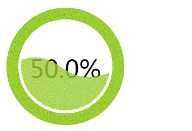
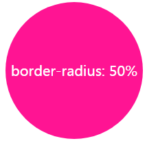
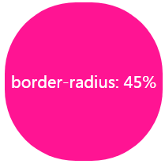
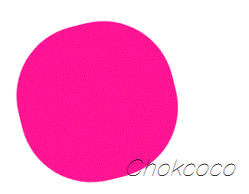
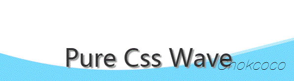
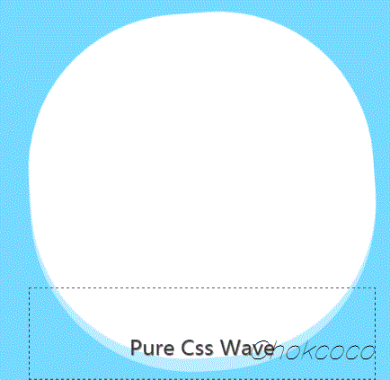

一直以来，使用纯 CSS 实现波浪效果都是十分困难的。

因为实现波浪的曲线需要借助贝塞尔曲线。


而使用纯 CSS 的方式，实现贝塞尔曲线，额，暂时是没有很好的方法。


当然，借助其他力量（SVG、CANVAS），是可以很轻松的完成所谓的波浪效果的，先看看，非 CSS 方式实现的波浪效果。

## 使用 SVG 实现波浪效果

借助 SVG ，是很容易画出三次贝塞尔曲线的。

看看效果：



代码如下：

```html
<svg width="200px" height="200px" version="1.1" xmlns="http://www.w3.org/2000/svg">
    <text class="liquidFillGaugeText" text-anchor="middle" font-size="42px" transform="translate(100,120)" style="fill: #000">50.0%</text>
    <!-- Wave -->
    <g id="wave">
        <path id="wave-2" fill="rgba(154, 205, 50, .8)" d="M 0 100 C 133.633 85.12 51.54 116.327 200 100 A 95 95 0 0 1 0 100 Z">
        <animate dur="5s" repeatCount="indefinite" attributeName="d" attributeType="XML" values="M0 100 C90 28, 92 179, 200 100 A95 95 0 0 1 0 100 Z;
                                    M0 100 C145 100, 41 100, 200 100 A95 95 0 0 1 0 100 Z;
                                    M0 100 C90 28, 92 179, 200 100 A95 95 0 0 1 0 100 Z"></animate>
        </path>
    </g>
    <circle cx="100" cy="100" r="80" stroke-width="10" stroke="white" fill="transparent"></circle>
    <circle cx="100" cy="100" r="90" stroke-width="20" stroke="yellowgreen" fill="none" class="percentage-pie-svg"></circle>
</svg>
```


<iframe height="300" style="width: 100%;" scrolling="no" title="SVG WAVE" src="https://codepen.io/mafqla/embed/OJqNBqa?default-tab=html%2Cresult&editable=true&theme-id=light" frameborder="no" loading="lazy" allowtransparency="true" allowfullscreen="true">
  See the Pen <a href="https://codepen.io/mafqla/pen/OJqNBqa">
  SVG WAVE</a> by mafqla (<a href="https://codepen.io/mafqla">@mafqla</a>)
  on <a href="https://codepen.io">CodePen</a>.
</iframe>


画出三次贝塞尔曲线的核心在于 `<path id="wave-2" fill="rgba(154, 205, 50, .8)" d="M 0 100 C 133.633 85.12 51.54 116.327 200 100 A 95 95 0 0 1 0 100 Z">` 这一段。感兴趣的可以自行去研究研究。

## 使用 canvas 实现波浪效果

使用 canvas 实现波浪效果的原理与 SVG 一样，都是利用路径绘制出三次贝塞尔曲线并赋予动画效果。


使用 canvas 的话，代码如下：

```js
$(function() {
    let canvas = $("canvas");
    let ctx = canvas[0].getContext('2d');
    let radians = (Math.PI / 180) * 180;
    let startTime = Date.now();
    let time = 2000;
    let clockwise = 1;
    let cp1x, cp1y, cp2x, cp2y;
    
    // 初始状态
    // ctx.bezierCurveTo(90, 28, 92, 179, 200, 100);
    // 末尾状态
    // ctx.bezierCurveTo(145, 100, 41, 100, 200, 100);
    
    requestAnimationFrame(function waveDraw() {  
        let t = Math.min(1.0, (Date.now() - startTime) / time);
          
        if(clockwise) {
            cp1x = 90 + (55 * t);
            cp1y = 28 + (72 * t);
            cp2x = 92 - (51 * t);
            cp2y = 179 - (79 * t);
        } else {
            cp1x = 145 - (55 * t);
            cp1y = 100 - (72 * t);
            cp2x = 41 + (51 * t);
            cp2y = 100 + (79 * t);
        }
        
        ctx.clearRect(0, 0, 200, 200); 
        ctx.beginPath();
        ctx.moveTo(0, 100);
        // 绘制三次贝塞尔曲线
        ctx.bezierCurveTo(cp1x, cp1y, cp2x, cp2y, 200, 100);
        // 绘制圆弧
        ctx.arc(100, 100, 100, 0, radians, 0);
        ctx.fillStyle = "rgba(154, 205, 50, .8)";
        ctx.fill();
        ctx.save();  
        
        if( t == 1 ) {
            startTime = Date.now();
            clockwise = !clockwise;
        } 

        requestAnimationFrame(waveDraw);
    });
})
```


<iframe height="300" style="width: 100%;" scrolling="no" title="Canvas Wave" src="https://codepen.io/mafqla/embed/PoLNyvx?default-tab=html%2Cresult&editable=true&theme-id=light" frameborder="no" loading="lazy" allowtransparency="true" allowfullscreen="true">
  See the Pen <a href="https://codepen.io/mafqla/pen/PoLNyvx">
  Canvas Wave</a> by mafqla (<a href="https://codepen.io/mafqla">@mafqla</a>)
  on <a href="https://codepen.io">CodePen</a>.
</iframe>


主要是利用了动态绘制 `ctx.bezierCurveTo()` 三次贝塞尔曲线实现波浪的运动效果，感兴趣的可以自行研究。

## 纯 CSS 实现波浪效果

使用纯 CSS 的方式，实现波浪的效果。

是，我们没有办法直接绘制出三次贝塞尔曲线，但是我们可以利用一些讨巧的方法，模拟达到波浪运动时的效果，姑且把下面这种方法看作一种奇技淫巧。

### 原理

原理十分简单，我们都知道，一个正方形，给它添加 `border-radius: 50%`，将会得到一个圆形。


> `border-radius`：用来设置边框圆角，当使用一个半径时确定一个圆形。

好的，如果 `border-radius` 没到 50%，但是接近 50% ，我们会得到一个这样的图形：



注意边角，整个图形给人的感觉是有点圆，却不是很圆。

好的，那整这么个图形又有什么用？还能变出波浪来不成？

没错！就是这么神奇。我们让上面这个图形滚动起来(rotate) ，看看效果：



可能很多人看到这里还没懂旋转起来的意图，仔细盯着一边看，是会有**类似波浪的起伏效果**的。

而我们的目的，就是要借助这个动态变换的起伏动画，模拟制造出类似波浪的效果。

## 实现

当然，这里看到是全景实现图，所以感觉并不明显，OK，让我们用一个个例子看看具体实现起来能达到什么样的效果。

我们利用上面原理可以做到的一种波浪运动背景效果图：



后面漂浮的波浪效果，其实就是利用了上面的 `border-radius: 45%` 的椭圆形，只是放大了很多倍，视野之外的图形都 `overflow: hidden` ，只留下了一条边的视野，并且增加了一些相应的 `transform` 变换。

> 注意，这里背景是蓝色静止的，运动是白色的椭圆形。

代码也很简单，SCSS 代码如下：

```scss
body {
    position: relative;
    align-items: center;
    min-height: 100vh;
    background-color: rgb(118, 218, 255);
    overflow: hidden;

    &:before, &:after {
        content: "";
        position: absolute;
        left: 50%;
        min-width: 300vw;
        min-height: 300vw;
        background-color: #fff;
        animation-name: rotate;
        animation-iteration-count: infinite;
        animation-timing-function: linear;
    }

    &:before {
        bottom: 15vh;
        border-radius: 45%;
        animation-duration: 10s;
    }

    &:after {
        bottom: 12vh;
        opacity: .5;
        border-radius: 47%;
        animation-duration: 10s;
    }
}

@keyframes rotate {
    0% {
        transform: translate(-50%, 0) rotateZ(0deg);
    }
    50% {
        transform: translate(-50%, -2%) rotateZ(180deg);
    }
    100% {
        transform: translate(-50%, 0%) rotateZ(360deg);
    }
}
```


<iframe height="300" style="width: 100%;" scrolling="no" title="Pure Css Wave" src="https://codepen.io/mafqla/embed/JjzXmQJ?default-tab=html%2Cresult&editable=true&theme-id=light" frameborder="no" loading="lazy" allowtransparency="true" allowfullscreen="true">
  See the Pen <a href="https://codepen.io/mafqla/pen/JjzXmQJ">
  Pure Css Wave</a> by mafqla (<a href="https://codepen.io/mafqla">@mafqla</a>)
  on <a href="https://codepen.io">CodePen</a>.
</iframe>


可能有部分同学，还存在疑问，OK，那我们把上面的效果缩小 10 倍，将视野之外的动画也补齐，那么其实生成波浪的原理是这样的：



图中的虚线框就是我们实际的视野范围。


### 值得探讨的点

值得注意的是，要看到，这里我们生成波浪，并不是利用旋转的椭圆本身，而是利用它去**切割**背景，产生波浪的效果。那为什么不直接使用旋转的椭圆本身模拟波浪效果呢？因为

- 中间高，两边低的效果不符合物理学原理，看上去十分别扭；

可以点进去看看下面这个例子：

<iframe height="300" style="width: 100%;" scrolling="no" title="pure css wave" src="https://codepen.io/mafqla/embed/LYaNgKz?default-tab=html%2Cresult&editable=true&theme-id=light" frameborder="no" loading="lazy" allowtransparency="true" allowfullscreen="true">
  See the Pen <a href="https://codepen.io/mafqla/pen/LYaNgKz">
  pure css wave</a> by mafqla (<a href="https://codepen.io/mafqla">@mafqla</a>)
  on <a href="https://codepen.io">CodePen</a>.
</iframe>


## 使用纯 CSS 实现波浪进度图

好，既然掌握了这种方法，下面我们就使用纯 CSS 实现上面最开始使用 SVG 或者 CANVAS 才能实现的波浪进度图。

HTML 结构如下：

```html
<div class="container">
    <div class="wave"></div>
</div>
```


CSS 代码如下：

```css
.wave {
    position: relative;
    width: 200px;
    height: 200px;
    background-color: rgb(118, 218, 255);
    border-radius: 50%;
 
    &::before,
    &::after{
        content: "";
        position: absolute;
        width: 400px;
        height: 400px;
        top: 0;
        left: 50%;
        background-color: rgba(255, 255, 255, .4);
        border-radius: 45%;
        transform: translate(-50%, -70%) rotate(0);
        animation: rotate 6s linear infinite;
        z-index: 10;
    }
    
    &::after {
        border-radius: 47%;
        background-color: rgba(255, 255, 255, .9);
        transform: translate(-50%, -70%) rotate(0);
        animation: rotate 10s linear -5s infinite;
        z-index: 20;
    }
}

@keyframes rotate {
    50% {
        transform: translate(-50%, -73%) rotate(180deg);
    } 100% {
        transform: translate(-50%, -70%) rotate(360deg);
    }
}
```


效果图：


<iframe height="300" style="width: 100%;" scrolling="no" title="Pure Css Wave Progress bar" src="https://codepen.io/mafqla/embed/RwdaezJ?default-tab=html%2Cresult&editable=true&theme-id=light" frameborder="no" loading="lazy" allowtransparency="true" allowfullscreen="true">
  See the Pen <a href="https://codepen.io/mafqla/pen/RwdaezJ">
  Pure Css Wave Progress bar</a> by mafqla (<a href="https://codepen.io/mafqla">@mafqla</a>)
  on <a href="https://codepen.io">CodePen</a>.
</iframe>


虽然效果差了一点点，但是相较于要使用学习成本更高的 SVG 或者 CANVAS，这种纯 CSS 方法无疑可使用的场景更多，学习成本更低！

## 一些小技巧

单纯的让一个 `border-radius` 接近 50 的椭圆形旋转，动画效果可能不是那么逼真，我们可以适当的添加一些其他变换因素，让动画效果看上去更真实：

- 在动画过程中，动态的改变 `border-radius` 的值；
- 在动画过程中，利用 transform 对旋转椭圆进行轻微的位移、变形；
- 上面也演示到了，多个椭圆同时转动，赋予不同时长的动画，并且添加轻微的透明度，让整个效果更佳逼真。