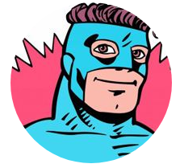
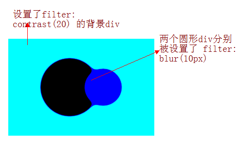
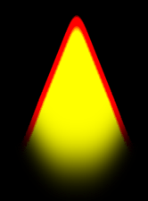
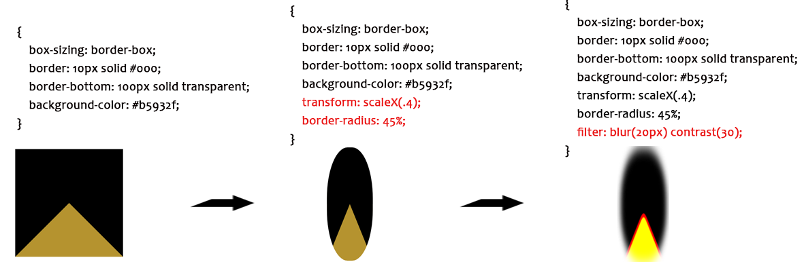

本文所描述的滤镜，指的是 CSS3 出来后的滤镜，不是 IE 系列时代的滤镜，语法如下，还未接触过这个属性的可以先简单到 [MDN -- filter](https://developer.mozilla.org/zh-CN/docs/Web/CSS/filter) 了解下：

```
{
    filter: blur(5px);
    filter: brightness(0.4);
    filter: contrast(200%);
    filter: drop-shadow(16px 16px 20px blue);
    filter: grayscale(50%);
    filter: hue-rotate(90deg);
    filter: invert(75%);
    filter: opacity(25%);
    filter: saturate(30%);
    filter: sepia(60%);

    /* Apply multiple filters */
    filter: contrast(175%) brightness(3%);

    /* Global values */
    filter: inherit;
    filter: initial;
    filter: unset;
}
```

## 基本用法

先简单看看几种滤镜的效果：

<iframe height="600" style="width: 100%;" scrolling="no" title="CSS3 filter (cancle filter by hover)" src="https://codepen.io/mafqla/embed/QWoNYKZ?default-tab=html%2Cresult&editable=true&theme-id=light" frameborder="no" loading="lazy" allowtransparency="true" allowfullscreen="true">
  See the Pen <a href="https://codepen.io/mafqla/pen/QWoNYKZ">
  CSS3 filter (cancle filter by hover)</a> by mafqla (<a href="https://codepen.io/mafqla">@mafqla</a>)
  on <a href="https://codepen.io">CodePen</a>.
</iframe>

你可以通过 hover 取消滤镜，观察该滤镜的效果。

简单来说，CSS 滤镜就是提供类似 PS 的图形特效，像模糊，锐化或元素变色等功能。通常被用于调整图片，背景和边界的渲染。本文就会围绕这些滤镜展开，看看具体能怎么使用或者玩出什么花活。

### 常用用法

既然是标题是你所不知道的技巧与细节，那么比较常用的一些用法就不再赘述，通常我们见得比较多的 CSS 滤镜用法有：

1. 使用 `filter: blur()` 生成毛玻璃效果
2. 使用 `filter: drop-shadow()` 生成整体阴影效果
3. 使用 `filter: opacity()` 生成透明度

如果对上面的技巧不是很了解，可以稍稍百度谷歌一下，下文将由浅及深，介绍一些不大常见的滤镜的具体用法及一些小细节：

## `contrast/brightness` -- hover 增亮图片

通常页面上的按钮，都会有 hover/active 的颜色变化，以增强与用户的交互。但是一些图片展示，则很少有 hover 的交互，运用 `filter: contrast()` 或者 `filter: brightness()` 可以在 hover 图片的时候，调整图片的对比图或者亮度，达到聚焦用户视野的目的。

> brightness 表示亮度，contrast 表示对比度。

当然，这个方法同样适用于按钮，简单的 CSS 代码如下：

```css
.btn:hover,
.img:hover {
  transition: filter 0.3s;
  filter: brightness(1.1) contrast(110%);
}
```

<iframe height="300" style="width: 100%;" scrolling="no" title="CSS3 filter hover IMG" src="https://codepen.io/mafqla/embed/OJqNdbv?default-tab=html%2Cresult&editable=true&theme-id=light" frameborder="no" loading="lazy" allowtransparency="true" allowfullscreen="true">
  See the Pen <a href="https://codepen.io/mafqla/pen/OJqNdbv">
  CSS3 filter hover IMG</a> by mafqla (<a href="https://codepen.io/mafqla">@mafqla</a>)
  on <a href="https://codepen.io">CodePen</a>.
</iframe>

## `blur` -- 生成图像阴影

通常而言，我们生成阴影的方式大多是 `box-shadow` 、`filter: drop-shadow()` 、`text-shadow` 。但是，使用它们生成阴影是阴影只能是单色的。

这个真不行，但是通过巧妙的利用 `filter: blur` 模糊滤镜，我们可以假装生成渐变色或者说是颜色丰富的阴影效果。

假设我们有下述这样一张头像图片：



下面就利用滤镜，给它添加一层与原图颜色相仿的阴影效果，核心 CSS 代码如下：

```scss
.avator {
  position: relative;
  background: url($img) no-repeat center center;
  background-size: 100% 100%;

  &::after {
    content: '';
    position: absolute;
    top: 10%;
    width: 100%;
    height: 100%;
    background: inherit;
    background-size: 100% 100%;
    filter: blur(10px) brightness(80%) opacity(0.8);
    z-index: -1;
  }
}
```

看看效果：

其简单的原理就是，利用伪元素，生成一个与原图一样大小的新图叠加在原图之下，然后利用滤镜模糊 `filter: blur()` 配合其他的亮度/对比度，透明度等滤镜，制作出一个虚幻的影子，伪装成原图的阴影效果。

嗯，最重要的就是这一句 `filter: blur(10px) brightness(80%) opacity(.8);` 。

<iframe height="300" style="width: 100%;" scrolling="no" title="使用 filter:blur 生成彩色阴影" src="https://codepen.io/mafqla/embed/XWGdOpW?default-tab=html%2Cresult&editable=true&theme-id=light" frameborder="no" loading="lazy" allowtransparency="true" allowfullscreen="true">
  See the Pen <a href="https://codepen.io/mafqla/pen/XWGdOpW">
  使用 filter:blur 生成彩色阴影</a> by mafqla (<a href="https://codepen.io/mafqla">@mafqla</a>)
  on <a href="https://codepen.io">CodePen</a>.
</iframe>

## `blur` 混合 `contrast` 产生融合效果

接下来介绍的这个，是本文的重点，**模糊滤镜叠加对比度滤镜产生的融合效果**。让你知道什么是 CSS 黑科技！

单独将两个滤镜拿出来，它们的作用分别是：

1. `filter: blur()`： 给图像设置高斯模糊效果。
2. `filter: contrast()`： 调整图像的对比度。

但是，当他们“合体”的时候，产生了奇妙的融合现象。

先来看一个简单的例子：

<iframe height="300" style="width: 100%;" scrolling="no" title="filter mix between blur and contrast" src="https://codepen.io/mafqla/embed/oNVxmBY?default-tab=html%2Cresult&editable=true&theme-id=light" frameborder="no" loading="lazy" allowtransparency="true" allowfullscreen="true">
  See the Pen <a href="https://codepen.io/mafqla/pen/oNVxmBY">
  filter mix between blur and contrast</a> by mafqla (<a href="https://codepen.io/mafqla">@mafqla</a>)
  on <a href="https://codepen.io">CodePen</a>.
</iframe>

仔细看两圆相交的过程，在边与边接触的时候，会产生一种边界融合的效果，通过对比度滤镜把高斯模糊的模糊边缘给干掉，利用高斯模糊实现融合效果。

上述效果的实现基于两点：

1. 图形是在被设置了 `filter: contrast()` 的画布背景上进行动画的
2. 进行动画的图形被设置了 `filter: blur()`（ 进行动画的图形的父元素需要是被设置了 `filter: contrast()` 的画布）

意思是，上面两圆运动的背后，其实是叠加了一张设置了 `filter: contrast()` 的大**白色**背景，而两个圆形则被设置了 `filter: blur()` ，两个条件缺一不可。

当然，背景色不一定是白色，我们稍稍修改上面的 Demo，简单的示意图如下：



### 燃烧的火焰

好，上面介绍完原理，下面看看使用这个效果制作的一些强大 CSS 效果，其中最为惊艳的就是使用融合效果制作生成火焰，这个效果我最早是见于 [Yusuke Nakaya](https://codepen.io/YusukeNakaya/pens/public/) 这位作者：

核心还是 `filter: contrast()` 与 `filter: blur()` 配合使用，不过实现的过程也非常有趣，我们需要使用 CSS 画出一个火焰形状。

火焰形状 CSS 核心代码如下：

```css
.fire {
  width: 0;
  height: 0;
  border-radius: 45%;
  box-sizing: border-box;
  border: 100px solid #000;
  border-bottom: 100pxsolid transparent;
  background-color: #b5932f;
  transform: scaleX(0.4);
  filter: blur(20px) contrast(30);
}
```

大概是长这样：



分解一下过程：



放在纯黑的背景下，就得到了上述图片的效果。

> 这里会有个很大的疑问，增加了 `filter: blur(20px) contrast(30);` 之后，为什么纯色黑色和黄色的中间，生成了一条红色的边框？

> 这里我咨询了几个设计师、前端同事，得到的答复大概是**两个不同滤镜的色值处理算法在边界处叠加作用得到了另外一种颜色**。（不一定准确，求赐教），在 PS 里尝试还原这个效果，但是 PS 没有 contrast() 滤镜，得到的效果偏差挺大的。

OK，继续正文，接下来，我们只需要在火焰 `.fire` 这个 div 内部，用大量的黑色圆形，由下至上，无规律穿过火焰即可。由于滤镜的融合效果，火焰效果随之产生，这里为了方便理解，我把背景色切换成白色，火焰动画原理一看即懂：

<iframe height="300" style="width: 100%;" scrolling="no" title="CSS fire| CSS filter mix" src="https://codepen.io/mafqla/embed/RwdavpZ?default-tab=html%2Cresult&editable=true&theme-id=light" frameborder="no" loading="lazy" allowtransparency="true" allowfullscreen="true">
  See the Pen <a href="https://codepen.io/mafqla/pen/RwdavpZ">
  CSS fire| CSS filter mix</a> by mafqla (<a href="https://codepen.io/mafqla">@mafqla</a>)
  on <a href="https://codepen.io">CodePen</a>.
</iframe>

## 文字融合动画

另外，我们可以在动画的过程中，动态改变元素滤镜的 `filter: blur()` 的值。

利用这个方法，我们还可以设计一些文字融合的效果：

<iframe height="300" style="width: 100%;" scrolling="no" title="word animation | word filter" src="https://codepen.io/mafqla/embed/wvOGNJX?default-tab=html%2Cresult&editable=true&theme-id=light" frameborder="no" loading="lazy" allowtransparency="true" allowfullscreen="true">
  See the Pen <a href="https://codepen.io/mafqla/pen/wvOGNJX">
  word animation | word filter</a> by mafqla (<a href="https://codepen.io/mafqla">@mafqla</a>)
  on <a href="https://codepen.io">CodePen</a>.
</iframe>

## 值得注意的细节点

动画虽然美好，但是具体使用的过程中，仍然有一些需要注意的地方：

1. CSS 滤镜可以给同个元素同时定义多个，例如 `filter: contrast(150%) brightness(1.5)` ，但是滤镜的先后顺序不同产生的效果也是不一样的；

> 也就是说，使用 `filter: contrast(150%) brightness(1.5)` 和 `filter:  brightness(1.5) contrast(150%)` 处理同一张图片，得到的效果是不一样的，原因在于滤镜的色值处理算法对图片处理的先后顺序。

1. 滤镜动画需要大量的计算，不断的重绘页面，属于非常消耗性能的动画，使用时要注意使用场景。记得开启硬件加速及合理使用分层技术；
2. `blur()` 混合 `contrast()` 滤镜效果，设置不同的颜色会产生不同的效果，这个颜色叠加的具体算法本文作者暂时也不是很清楚，使用时比较好的方法是多尝试不同颜色，观察取最好的效果；
3. CSS3 filter 兼容性不算太好，但是在移动端已经可以比较正常的使用，更为精确的兼容性列表，查询 [Can i Use](http://caniuse.com/#search=filter)。
