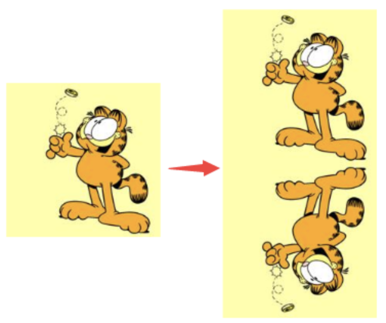
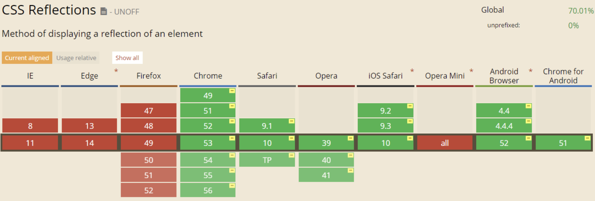

给定一张有如下背景图的 div：


制作如下的倒影效果：



方法很多，但是我们当然要寻找最快最便捷的方法，至少得是无论图片怎么变化，`div` 大小怎么变化，我们都不用去改我们的代码。

### 法一：-webkit-box-reflect

这是一个十分新的 CSS 属性，使用起来十分简单，可以从各个方向反射我们内容。不过兼容性过于惨淡：

> 基本上是只有 -webkit- 内核的浏览器才支持。



不过使用起来真的是方便，解题如下：

```html
div{ -webkit-box-reflect: below; }
```

`box-reflect` 有四个方向可以选，`below | above | left | right` 代表下上左右。

### 法二：inherit，使用继承

本题主要还是为了介绍这种方法，兼容性好。

`inherit` 是啥，每个 CSS 属性定义的概述都指出了这个属性是默认继承的 ("Inherited: Yes") 还是默认不继承的 ("Inherited: no")。这决定了当你没有为元素的属性指定值时该如何计算值。

灵活使用 `inherit` 继承父值，可以解决许多看似复杂的问题。对于本题，我们对图片容器添加一个伪元素，使用 `background-image:inherit` 继承父值的背景图值，就可以做到无论图片如何变，我们的 CSS 代码都无需改动：

```css
div::after {
  content: '';
  position: absolute;
  top: 100%;
  left: 0;
  right: 0;
  bottom: -100%;
  background-image: inherit;
  transform: rotateX(180deg);
}
```

我们使用伪元素 `background-image: inherit;` 继承父元素的背景图，再使用 transform 旋转容器达到反射的效果。

说到底，CSS 属性的取值就是由默认值（initial），继承（inherit）与加权系统构成的（其实还有 `unset(未设置)`、`revert(还原)`），厘清它们的关系及使用方法对熟练使用 CSS 大有裨益。
