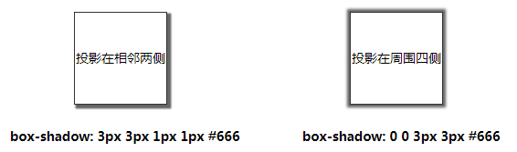
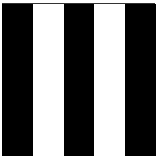
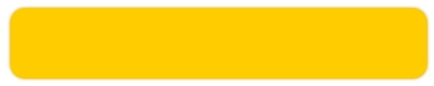
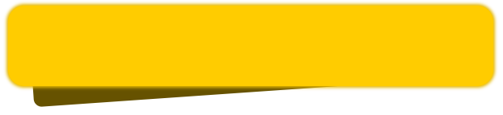
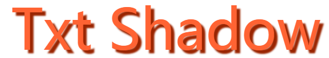
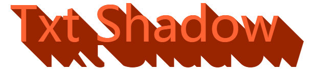
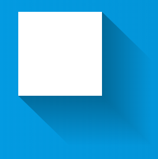
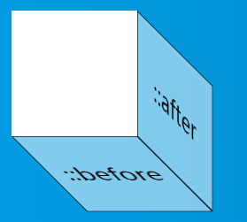
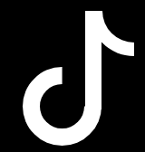

## 单侧投影

先说单侧投影，关于 `box-shadow`，大部分时候，我们使用它都是用来生成一个两侧的投影，或者一个四侧的投影。如下：



OK，那如果要生成一个单侧的投影呢？

我们来看看 box-shadow 的用法定义：

```css
 {
  box-shadow: none | [inset? && [ <offset-x> <offset-y> <blur-radius>?
    <spread-radius>? <color>?]]#;
}
```

以 `box-shadow: 1px 2px 3px 4px #333` 为例，4 个数值的含义分别是，x 方向偏移值、y 方向偏移值 、模糊半径、扩张半径。

这里有一个小技巧，**扩张半径可以为负值**。

继续，如果阴影的模糊半径，与**负的**扩张半径一致，那么我们将看不到任何阴影，因为生成的阴影将被包含在原来的元素之下，除非给它设定一个方向的偏移量。所以这个时候，我们给定一个方向的偏移值，即可实现单侧投影：

<iframe height="300" style="width: 100%;" scrolling="no" title="CSS 单侧阴影" src="https://codepen.io/mafqla/embed/KKEgmpo?default-tab=html%2Cresult&editable=true&theme-id=light" frameborder="no" loading="lazy" allowtransparency="true" allowfullscreen="true">
  See the Pen <a href="https://codepen.io/mafqla/pen/KKEgmpo">
  CSS 单侧阴影</a> by mafqla (<a href="https://codepen.io/mafqla">@mafqla</a>)
  on <a href="https://codepen.io">CodePen</a>.
</iframe>

## 投影背景 / 背景动画

接着上面的说。

很明显，`0 = -0`，所以当 `box-shadow` 的模糊半径和扩张半径都为 0 的时候，我们也可以得到一个和元素大小一样的阴影，只不过被元素本身遮挡住了，我们尝试将其偏移出来。

CSS 代码如下：

```css
div {
  width: 80px;
  height: 80px;
  border: 1px solid #333;
  box-sizing: border-box;
  box-shadow: 80px 80px 0 0 #000;
}
```

得到如下结果：


有什么用呢？好像没什么意义啊。

额，确实好像没什么用。不过我们注意到，`box-shadow` 是可以设置多层的，也就是多层阴影，而且可以进行过渡变换动画（补间动画）。但是 `background-image: linear-gradient()`，也就是渐变背景是不能进行补间动画的。

这又扯到哪里去了。好我们回来，利用上面的特性，我们可以利用 `box-shadow` 实现原本只能利用渐变才能实现的背景图：



用 `box-shadow`，实现它的 CSS 代码如下（可以更简化）：

```css
.shadow {
  position: relative;
  width: 250px;
  height: 250px;
}

.shadow::before {
  content: '';
  position: absolute;
  width: 50px;
  height: 50px;
  top: -50px;
  left: -50px;
  box-shadow: 50px 50px #000, 150px 50px #000, 250px 50px #000, 50px 100px #000,
    150px 100px #000, 250px 100px #000, 50px 150px #000, 150px 150px #000,
    250px 150px #000, 50px 200px #000, 150px 200px #000, 250px 200px #000,
    50px 250px #000, 150px 250px #000, 250px 250px #000;
}
```

用渐变来实现的话，只需要这样：

```css
.gradient {
  width: 250px;
  height: 250px;
  background-image: linear-gradient(
    90deg,
    #000 0%,
    #000 50%,
    #fff 50%,
    #fff 100%
  );
  background-size: 100px 100px;
}
```

为什么选择更为复杂的 `box-shadow` 呢？因为它可以进行补间动画，像这样，这是使用渐变做不到的：

<iframe height="300" style="width: 100%;" scrolling="no" title="box-shadow实现背景动画 " src="https://codepen.io/mafqla/embed/BabLRoR?default-tab=html%2Cresult&editable=true&theme-id=light" frameborder="no" loading="lazy" allowtransparency="true" allowfullscreen="true">
  See the Pen <a href="https://codepen.io/mafqla/pen/BabLRoR">
  box-shadow实现背景动画 </a> by mafqla (<a href="https://codepen.io/mafqla">@mafqla</a>)
  on <a href="https://codepen.io">CodePen</a>.
</iframe>

当然，这只是个示例 Demo，运用点想象力还有很多有意思的效果，再贴一个：

<iframe height="300" style="width: 100%;" scrolling="no" title="CSS Checker Illusion" src="https://codepen.io/mafqla/embed/MWxjmaq?default-tab=html%2Cresult&editable=true&theme-id=light" frameborder="no" loading="lazy" allowtransparency="true" allowfullscreen="true">
  See the Pen <a href="https://codepen.io/mafqla/pen/MWxjmaq">
  CSS Checker Illusion</a> by mafqla (<a href="https://codepen.io/mafqla">@mafqla</a>)
  on <a href="https://codepen.io">CodePen</a>.
</iframe>

## 立体投影

好，我们继续。下一个主题是**立体投影**。

这个说法很奇怪，阴影的出现，本就是为了让原本的元素看起来更加的立体，那这里所谓的立体投影，是个怎么立体法？

这里所谓的立体投影，并不一定是使用了 `box-shadow`、`text-shadow` 或者 `drop-shadow`，而是我们使用其他元素或者属性模拟元素的阴影。而这样做的目的，是为了能够突破 `box-shadow` 这类元素的一些定位局限。**让阴影的位置、大小、模糊度可以更加的灵活**。

OK，让我们来看看，这样一个元素，我们希望通过自定义阴影的位置，让它更加立体：



上图 div 只是带了一个非常浅的 `box-shadow` ，看上去和立体没什么关系，接下来，我们通过 div 的伪元素，给它生成一个和原图边角形状类似的图形，再通过 transform 位移一下，可能是这样：



OK，最后对这个用伪元素生成的元素进行一些虚化效果（filter 或者 box-shadow 都可以），就可以实现一个边角看起来像被撕开的立体效果：


代码非常简单，伪 CSS 代码示意如下：

```css
div {
  position: relative;
  width: 600px;
  height: 100px;
  background: hsl(48, 100%, 50%);
  border-radius: 20px;
}

div::before {
  content: '';
  position: absolute;
  top: 50%;
  left: 5%;
  right: 5%;
  bottom: 0;
  border-radius: 10px;
  background: hsl(48, 100%, 20%);
  transform: translate(0, -15%) rotate(-4deg);
  transform-origin: center center;
  box-shadow: 0 0 20px 15px hsl(48, 100%, 20%);
}
```

所以总结一下：

- 立体投影的关键点在于利于伪元素生成一个大小与父元素相近的元素，然后对其进行 rotate 以及定位到合适位置，再赋于阴影操作
- 颜色的运用也很重要，阴影的颜色通常比本身颜色要更深，这里使用 hsl 表示颜色更容易操作，l 控制颜色的明暗度

还有其他很多场景：

<iframe height="300" style="width: 100%;" scrolling="no" title="立体投影" src="https://codepen.io/mafqla/embed/YzgGVww?default-tab=html%2Cresult&editable=true&theme-id=light" frameborder="no" loading="lazy" allowtransparency="true" allowfullscreen="true">
  See the Pen <a href="https://codepen.io/mafqla/pen/YzgGVww">
  立体投影</a> by mafqla (<a href="https://codepen.io/mafqla">@mafqla</a>)
  on <a href="https://codepen.io">CodePen</a>.
</iframe>

### 文字立体投影 / 文字长阴影

上面的立体效果在文字上就完全不适用了，所以对待文字的立体阴影效果，还需要另辟蹊径。

正常而言，我们使用 text-shadow 来生成文字阴影，像这样：

```html
<div>Txt Shadow</div>
----- div { text-shadow: 6px 6px 3px hsla(14, 100%, 30%, 1); }
```



嗯，挺好的，就是不够立体。那么要做到立体文字阴影，最常见的方法就是使用多层文字阴影叠加。

> Tips：和 `box-shadow` 一样，`text-shadow` 是可以叠加多层的！但是对于单个元素而言， `drop-shadow` 的话就只能是一层。

好，上面的文字，我们试着叠加个 50 层文字阴影试一下。额，50 层手写，其实很快的~

好吧，手写真的太慢了，还容易出错，所以这里我们需要借助一下 SASS/LESS 帮忙，写一个生成 50 层阴影的 `function` 就好，我们每向右和向下偏移 1px，生成一层 text-shadow：

```scss
@function makeLongShadow($color) {
  $val: 0px 0px $color;

  @for $i from 1 through 50 {
    $val: #{$val}, #{$i}px #{$i}px #{$color};
  }

  @return $val;
}

div {
  text-shadow: makeLongShadow(hsl(14, 100%, 30%));
}
```

上面的 SCSS 代码。经过编译后，就会生成如下 CSS：

```css
div {
  text-shadow: 0px 0px #992400, 1px 1px #992400, 2px 2px #992400, 3px 3px
      #992400, 4px 4px #992400, 5px 5px #992400, 6px 6px #992400, 7px 7px
      #992400, 8px 8px #992400, 9px 9px #992400, 10px 10px #992400, 11px 11px
      #992400, 12px 12px #992400, 13px 13px #992400, 14px 14px #992400, 15px
      15px #992400, 16px 16px #992400, 17px 17px #992400, 18px 18px #992400, 19px
      19px #992400, 20px 20px #992400, 21px 21px #992400, 22px 22px #992400, 23px
      23px #992400, 24px 24px #992400, 25px 25px #992400, 26px 26px #992400, 27px
      27px #992400, 28px 28px #992400, 29px 29px #992400, 30px 30px #992400, 31px
      31px #992400, 32px 32px #992400, 33px 33px #992400, 34px 34px #992400, 35px
      35px #992400, 36px 36px #992400, 37px 37px #992400, 38px 38px #992400, 39px
      39px #992400, 40px 40px #992400, 41px 41px #992400, 42px 42px #992400, 43px
      43px #992400, 44px 44px #992400, 45px 45px #992400, 46px 46px #992400, 47px
      47px #992400, 48px 48px #992400, 49px 49px #992400, 50px 50px #992400;
}
```

看看效果：


额，很不错，很立体。但是，就是丑，而且说不上来的奇怪。

问题出在哪里呢，阴影其实是存在明暗度和透明度的变化的，所以，对于渐进的每一层文字阴影，明暗度和透明度应该都是不断变化的。这个需求，SASS 可以很好的实现，下面是两个 SASS 颜色函数：

- `fade-out` 改变颜色的透明度，让颜色更加透明
- `desaturate` 改变颜色的饱和度值，让颜色更少的饱和

> 关于 SASS 颜色函数，可以看看这里：[Sass 基础—颜色函数](https://www.w3cplus.com/preprocessor/sass-color-function.html)

我们使用上面两个 SASS 颜色函数修改一下我们的 CSS 代码，主要是修改上面的 `makeLongShadow` function 函数：

```scss
@function makelongrightshadow($color) {
  $val: 0px 0px $color;

  @for $i from 1 through 50 {
    $color: fade-out(desaturate($color, 1%), 0.02);
    $val: #{$val}, #{$i}px #{$i}px #{$color};
  }

  @return $val;
}
```

好，看看最终效果：

<iframe height="300" style="width: 100%;" scrolling="no" title="立体文字阴影" src="https://codepen.io/Chokcoco/embed/JmgNNa?default-tab=html%2Cresult&editable=true&theme-id=light" frameborder="no" loading="lazy" allowtransparency="true" allowfullscreen="true">
  See the Pen <a href="https://codepen.io/Chokcoco/pen/JmgNNa">
  立体文字阴影</a> by Chokcoco (<a href="https://codepen.io/Chokcoco">@Chokcoco</a>)
  on <a href="https://codepen.io">CodePen</a>.
</iframe>

当然，使用 CSS 生成立体文字阴影的方法还有很多，下面再贴出一例，使用了**透明色叠加底色的多重线性渐变**实现的文字立体阴影，感兴趣的同学可以去看看具体实现：

<iframe height="300" style="width: 100%;" scrolling="no" title="线性渐变配合阴影实现条纹立体阴影条纹字" src="https://codepen.io/mafqla/embed/rNRMmxo?default-tab=html%2Cresult&editable=true&theme-id=light" frameborder="no" loading="lazy" allowtransparency="true" allowfullscreen="true">
  See the Pen <a href="https://codepen.io/mafqla/pen/rNRMmxo">
  线性渐变配合阴影实现条纹立体阴影条纹字</a> by mafqla (<a href="https://codepen.io/mafqla">@mafqla</a>)
  on <a href="https://codepen.io">CodePen</a>.
</iframe>

## 长投影

上面提到了通过多层阴影叠加实现文字的立体阴影。运用在 div 这些容器上也是可以的。当然这里还有一种挺有意思的方法。假设我们，有一个矩形元素，希望给他添加一个长投影，像下面这样：



要生成这种长投影，刚刚说的叠加多层阴影可以，再就是借助元素的两个伪元素，其实上面的图是这样的：



关键点在于，我们通过对两个伪元素的 `transform: skew()` 变换以及从实色到透明色的背景色变化，实现了长投影的效果：

<iframe height="300" style="width: 100%;" scrolling="no" title="线性渐变模拟长阴影" src="https://codepen.io/mafqla/embed/YzgGVqw?default-tab=html%2Cresult&editable=true&theme-id=light" frameborder="no" loading="lazy" allowtransparency="true" allowfullscreen="true">
  See the Pen <a href="https://codepen.io/mafqla/pen/YzgGVqw">
  线性渐变模拟长阴影</a> by mafqla (<a href="https://codepen.io/mafqla">@mafqla</a>)
  on <a href="https://codepen.io">CodePen</a>.
</iframe>

## 彩色投影

通常而言，我们生成阴影的方式大多是 `box-shadow` 、`filter: drop-shadow()` 、`text-shadow` 。但是，使用它们生成的阴影通常只能是单色或者同色系的。

这个真不行，但是通过巧妙的利用 `filter: blur` 模糊滤镜，我们可以假装生成渐变色或者说是颜色丰富的阴影效果。

下面就利用滤镜，给它添加一层与原图颜色相仿的阴影效果，核心 CSS 代码如下：

```css
.avator {
  position: relative;
  background: url($img) no-repeat center center;
  background-size: 100% 100%;

  &::after {
    content: '';
    position: absolute;
    top: 10%;
    width: 100%;
    height: 100%;
    background: inherit;
    background-size: 100% 100%;
    filter: blur(10px) brightness(80%) opacity(0.8);
    z-index: -1;
  }
}
```

其简单的原理就是，利用伪元素，生成一个与原图一样大小的新图叠加在原图之下，然后利用滤镜模糊 `filter: blur()` 配合其他的亮度/对比度，透明度等滤镜，制作出一个虚幻的影子，伪装成原图的阴影效果。

嗯，最重要的就是这一句 `filter: blur(10px) brightness(80%) opacity(.8);` 。

<iframe height="300" style="width: 100%;" scrolling="no" title="使用 filter:blur 生成彩色阴影" src="https://codepen.io/mafqla/embed/gOEwWrg?default-tab=html%2Cresult&editable=true&theme-id=light" frameborder="no" loading="lazy" allowtransparency="true" allowfullscreen="true">
  See the Pen <a href="https://codepen.io/mafqla/pen/gOEwWrg">
  使用 filter:blur 生成彩色阴影</a> by mafqla (<a href="https://codepen.io/mafqla">@mafqla</a>)
  on <a href="https://codepen.io">CodePen</a>.
</iframe>

## 使用 box-shadow 实现的灯光效果

好，上文主要是一些实现各种阴影的方法，接下来是效果篇。先来看看使用 `box-shadow`实现的一些灯光效果。

### box-shadow 实现霓虹氖灯文字效果

这个效果也叫 Neon，Codepen 上有很多类似的效果，本质上都是大范围的 `box-shadow` 过渡效果与白色文字的叠加：

<iframe height="300" style="width: 100%;" scrolling="no" title="box-shadow实现霓虹氖灯文字效果" src="https://codepen.io/mafqla/embed/NWJRjNw?default-tab=html%2Cresult&editable=true&theme-id=light" frameborder="no" loading="lazy" allowtransparency="true" allowfullscreen="true">
  See the Pen <a href="https://codepen.io/mafqla/pen/NWJRjNw">
  box-shadow实现霓虹氖灯文字效果</a> by mafqla (<a href="https://codepen.io/mafqla">@mafqla</a>)
  on <a href="https://codepen.io">CodePen</a>.
</iframe>

### 使用 box-shadow 实现阴影灯光 show

和上面的效果类似，本质上都是多重阴影的过渡效果，或许再来点 3D 效果？

合理搭配，效果更佳：

## 使用 drop-shadow | box-shadow 实现单标签抖音 LOGO

我们先来看看抖音的 LOGO：


其实很简单，主体其实是由 3 个颜色不同类似 J 的形状组成。而单独拎出一个，又可以把它分成**四分之三圆**、**|以及㇏**组成。

正好，一个元素加上它的两个伪元素，刚好可以凑成这三个形状，我们试着实现以下，简单 CSS 代码如下：

```css
<div > </div > --- div {
  position: relative;
  width: 37px;
  height: 218px;
  background: #fff;

  &::before {
    content: '';
    position: absolute;
    width: 100px;
    height: 100px;
    border: 37px solid #fff;
    border-top: 37px solid transparent;
    border-radius: 50%;
    top: 123px;
    left: -137px;
    transform: rotate(45deg);
  }

  &::after {
    content: '';
    position: absolute;
    width: 140px;
    height: 140px;
    border: 30px solid #fff;
    border-right: 30px solid transparent;
    border-top: 30px solid transparent;
    border-left: 30px solid transparent;
    top: -100px;
    right: -172px;
    border-radius: 100%;
    transform: rotate(45deg);
  }
}
```

上面的代码就可以生成整个形状的主体：


接下来就是轮到 `filter: drop-shadow()` 登场，它可以在元素呈现之前，为元素的渲染提供一些效果，最常见的也就用它渲染整体阴影。我们通常会用它来实现对话框的小三角与整个对话框的阴影效果，像下面这样，左边是使用 `drop-shadow` 的效果，右边是使用普通 `box-shadow`的效果。

<iframe height="300" style="width: 100%;" scrolling="no" title="Drop-shadow vs box-shadow (2)" src="https://codepen.io/mafqla/embed/oNVzWLg?default-tab=html%2Cresult&editable=true&theme-id=light" frameborder="no" loading="lazy" allowtransparency="true" allowfullscreen="true">
  See the Pen <a href="https://codepen.io/mafqla/pen/oNVzWLg">
  Drop-shadow vs box-shadow (2)</a> by mafqla (<a href="https://codepen.io/mafqla">@mafqla</a>)
  on <a href="https://codepen.io">CodePen</a>.
</iframe>

OK，回到我们正文，下面我们使用 `filter: drop-shadow()` 生成它的第一层左边的蓝色阴影，添加在主体 div：

```scss
div {
    position: relative;
    width: 37px;
    height: 218px;
    background: #fff;
    filter:drop-shadow(-10px -10px 0 #24f6f0);

   &::before,
   &::after {
    ...
    }
}
```

得到如下效果：


好，接下来我们只需要再添加一层红色 `filter: drop-shadow()` 在右侧就大功告成！

等等！哪里不对，上面我也有提到过， **和 `box-shadow` 一样，`text-shadow` 是可以叠加多层的！但是对于单个元素而言， `drop-shadow` 的话就只能是一层。**

也就是说，无法在 div 上再使用 `filter: drop-shadow()` 生成另一侧的红色投影，不过还好，我们还有两个伪元素的`filter: drop-shadow()` 以及 `box-shadow` 还没有用上，经过一番尝试：

```scss
div {
    position: relative;
    width: 37px;
    height: 218px;
    background: #fff;
    filter:drop-shadow(-10px -10px 0 #24f6f0) contrast(150%) brightness(110%);
    box-shadow: 11.6px 10px 0 0 #fe2d52;

    &::before {
        ....
        filter: drop-shadow(16px 0px 0 #fe2d52);
    }

    &::after {
        ....
        filter:drop-shadow(14px 0 0 #fe2d52);
    }
}
```

我们分别再利用 div 的 `box-shadow` 以及两个伪元素的 `filter: drop-shadow()` ，在单个标签的限制下，最终结果如下：

<iframe height="300" style="width: 100%;" scrolling="no" title="TikTok Logo (Single Div) " src="https://codepen.io/mafqla/embed/bGZwWeo?default-tab=html%2Cresult&editable=true&theme-id=light" frameborder="no" loading="lazy" allowtransparency="true" allowfullscreen="true">
  See the Pen <a href="https://codepen.io/mafqla/pen/bGZwWeo">
  TikTok Logo (Single Div) </a> by mafqla (<a href="https://codepen.io/mafqla">@mafqla</a>)
  on <a href="https://codepen.io">CodePen</a>.
</iframe>

总结一下：

- 主要借助了两个伪元素实现了整体结构，借助了 drop-shadow 生成一层整体阴影
- drop-shadow 只能是单层阴影，所以另一层阴影需要多尝试
- contrast(150%) brightness(110%) 则可以增强图像的对比度和亮度，更贴近抖音 LOGO 的效果

其实应该只是两个类 J 形的形状重叠在一起，重叠部分为白色，非重叠部分为各自原色。

使用 CSS 的混合模式 `mix-blend-mode` 也是可以实现的，下面给出实现方法如下:

<iframe height="300" style="width: 100%;" scrolling="no" title="使用 mix-blend-mode 实现抖音 LOGO" src="https://codepen.io/mafqla/embed/ZEPpKOm?default-tab=html%2Cresult&editable=true&theme-id=light" frameborder="no" loading="lazy" allowtransparency="true" allowfullscreen="true">
  See the Pen <a href="https://codepen.io/mafqla/pen/ZEPpKOm">
  使用 mix-blend-mode 实现抖音 LOGO</a> by mafqla (<a href="https://codepen.io/mafqla">@mafqla</a>)
  on <a href="https://codepen.io">CodePen</a>.
</iframe>
