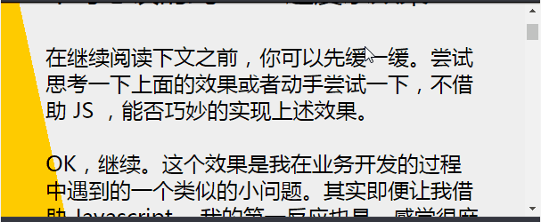
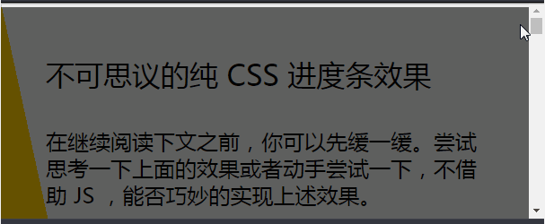
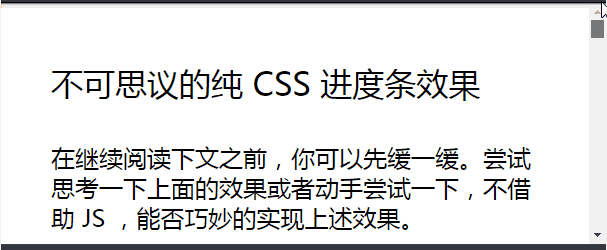
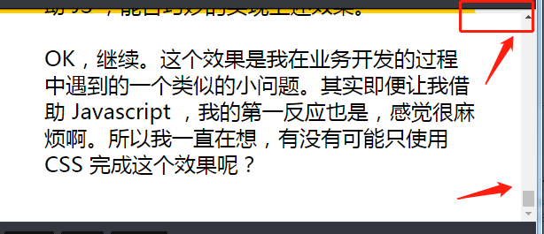

如何使用 CSS 实现下述滚动条效果？

<iframe height="300" style="width: 100%;" scrolling="no" title="使用线性渐变实现滚动进度条" src="https://codepen.io/mafqla/embed/JjzRNWj?default-tab=html%2Cresult&editable=true&theme-id=light" frameborder="no" loading="lazy" allowtransparency="true" allowfullscreen="true">
  See the Pen <a href="https://codepen.io/mafqla/pen/JjzRNWj">
  使用线性渐变实现滚动进度条</a> by mafqla (<a href="https://codepen.io/mafqla">@mafqla</a>)
  on <a href="https://codepen.io">CodePen</a>.
</iframe>

就是顶部黄色的滚动进度条，随着页面的滚动进度而变化长短。在继续阅读下文之前，你可以先缓一缓。尝试思考一下上面的效果或者动手尝试一下，不借助 JS ，能否巧妙的实现上述效果。OK，继续。这个效果是我在业务开发的过程中遇到的一个类似的小问题。其实即便让我借助 Javascript ，我的第一反应也是，感觉很麻烦啊。所以我一直在想，有没有可能只使用 CSS 完成这个效果呢？

## 分析需求

第一眼看到这个效果，感觉这个跟随滚动动画，仅靠 CSS 是不可能完成的，因为这里涉及了页面滚动距离的计算。如果想只用 CSS 实现，只能另辟蹊径，使用一些讨巧的方法。好，下面就借助一些奇技淫巧，使用 CSS 一步一步完成这个效果。分析一下难点：**如何得知用户当前滚动页面的距离并且通知顶部进度条？**正常分析应该是这样的，但是这就陷入了传统的思维。进度条就只是进度条，接收页面滚动距离，改变宽度。如果页面滚动和进度条是一个整体呢？实现需求不卖关子了，下面我们运用**线性渐变**来实现这个功能。假设我们的页面被包裹在 `<body>` 中，可以滚动的是整个 body，给它添加这样一个从左下到到右上角的线性渐变：

```css
body {
  background-image: linear-gradient(to right top, #ffcc00 50%, #eee 50%);
  background-repeat: no-repeat;
}
```

那么，我们可以得到一个这样的效果：

Wow，黄色块的颜色变化其实已经很能表达整体的进度了。其实到这里，聪明的同学应该已经知道下面该怎么做了。我们运用一个伪元素，把多出来的部分遮住：

```css
body::after {
  content: '';
  position: fixed;
  top: 5px;
  left: 0;
  bottom: 0;
  right: 0;
  background: #fff;
  z-index: -1;
}
```

为了方便演示，我把上面白色底改成了黑色透明底，：



实际效果达成了这样：



眼尖的同学可能会发现，这样之后，滑到底的时候，进度条并没有到底：



究其原因，是因为 `body` 的线性渐变高度设置了整个 body 的大小，我们调整一下渐变的高度：

```css
body {
  background-image: linear-gradient(to right top, #ffcc00 50%, #eee 50%);
  background-size: 100% calc(100% - 100vh + 5px);
  background-repeat: no-repeat;
}
```

这里使用了 `calc` 进行了运算，减去了 `100vh`，也就是减去一个屏幕的高度，这样渐变刚好在滑动到底部的时候与右上角贴合。而 `+ 5px` 则是滚动进度条的高度，预留出 `5px` 的高度。再看看效果

<iframe height="300" style="width: 100%;" scrolling="no" title="使用线性渐变实现滚动进度条" src="https://codepen.io/mafqla/embed/JjzRNWj?default-tab=html%2Cresult&editable=true&theme-id=light" frameborder="no" loading="lazy" allowtransparency="true" allowfullscreen="true">
  See the Pen <a href="https://codepen.io/mafqla/pen/JjzRNWj">
  使用线性渐变实现滚动进度条</a> by mafqla (<a href="https://codepen.io/mafqla">@mafqla</a>)
  on <a href="https://codepen.io">CodePen</a>.
</iframe>
