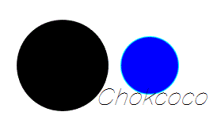

## 画个电池

### 增加阴影及颜色的变化

如果要继续优化的话，需要添加点细节。

我们知道，低电量时，电量通常表示为红色，高电量时表示为绿色。再给整个色块添加点阴影的变化，呼吸的感觉，让充电的效果看起来确实是在动。

<iframe height="300" style="width: 100%;" scrolling="no" title="Battery Animation One" src="https://codepen.io/mafqla/embed/oNVBaNQ?default-tab=html%2Cresult&editable=true&theme-id=light" frameborder="no" loading="lazy" allowtransparency="true" allowfullscreen="true">
  See the Pen <a href="https://codepen.io/mafqla/pen/oNVBaNQ">
  Battery Animation One</a> by mafqla (<a href="https://codepen.io/mafqla">@mafqla</a>)
  on <a href="https://codepen.io">CodePen</a>.
</iframe>

### 知识点

到这里，其实只有一个知识点：

- 使用 filter: hue-rotate() 对渐变色彩进行色彩过渡变换动画

我们无法对一个渐变色直接进行 animation ，这里通过滤镜对色相进行调整，从而实现了渐变色的变换动画。

## 添加波浪

ok，刚刚算一个小里程碑，接下来再进一步。电量的顶部为一条直线有点呆呆的感觉，这里我们进行改造一下，如果能将顶部直线，改为波浪滚动，效果会更为逼真一点。

改造之后的效果：

### 知识点

这里的一个知识点就是上述说的使用 CSS 实现简易的波浪效果，通过障眼法实现，看看图就明白了：

<iframe height="300" style="width: 100%;" scrolling="no" title="Battery Animation Two" src="https://codepen.io/mafqla/embed/eYXgPmG?default-tab=html%2Cresult&editable=true&theme-id=light" frameborder="no" loading="lazy" allowtransparency="true" allowfullscreen="true">
  See the Pen <a href="https://codepen.io/mafqla/pen/eYXgPmG">
  Battery Animation Two</a> by mafqla (<a href="https://codepen.io/mafqla">@mafqla</a>)
  on <a href="https://codepen.io">CodePen</a>.
</iframe>

OK，到这，上述效果加上数字变化已经算是一个比较不错的效果了。当然上面的效果看上去还是很 CSS 的，就是一眼看到就觉得用 CSS 是可以做到的。

## 使用强大的 CSS 滤镜实现安卓充电动画效果

<iframe height="300" style="width: 100%;" scrolling="no" title="HuaWei Battery Charging Animation" src="https://codepen.io/mafqla/embed/PoLWyqo?default-tab=html%2Cresult&editable=true&theme-id=light" frameborder="no" loading="lazy" allowtransparency="true" allowfullscreen="true">
  See the Pen <a href="https://codepen.io/mafqla/pen/PoLWyqo">
  HuaWei Battery Charging Animation</a> by mafqla (<a href="https://codepen.io/mafqla">@mafqla</a>)
  on <a href="https://codepen.io">CodePen</a>.
</iframe>

### 知识点

拆解一下知识点，最主要的其实是用到了 `filter: contrast()` 以及 `filter: blur()` 这两个滤镜，可以很好的实现这种融合效果。

单独将两个滤镜拿出来，它们的作用分别是：

1. `filter: blur()`： 给图像设置高斯模糊效果。
2. `filter: contrast()`： 调整图像的对比度。

但是，当他们“合体”的时候，产生了奇妙的融合现象。

先来看一个简单的例子：

仔细看两圆相交的过程，在边与边接触的时候，会产生一种边界融合的效果，通过对比度滤镜把高斯模糊的模糊边缘给干掉，利用高斯模糊实现融合效果。

当然，这里也是可以加上颜色的变换，效果也很不错：

<iframe height="300" style="width: 100%;" scrolling="no" title="HuaWei Battery Charging Animation" src="https://codepen.io/mafqla/embed/abMpROK?default-tab=html%2Cresult&editable=true&theme-id=light" frameborder="no" loading="lazy" allowtransparency="true" allowfullscreen="true">
  See the Pen <a href="https://codepen.io/mafqla/pen/abMpROK">
  HuaWei Battery Charging Animation</a> by mafqla (<a href="https://codepen.io/mafqla">@mafqla</a>)
  on <a href="https://codepen.io">CodePen</a>.
</iframe>

### 容易忽视的点

通过调节 `filter: blur()` 及 `filter: contrast()` 属性的值，动画效果其实会有很大程度的变化，好的效果需要
