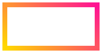
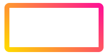

## border-image

`border-image` 是 CSS 规范 [CSS Backgrounds and Borders Module Level 3](https://drafts.csswg.org/css-backgrounds-3/#border-images) (最新一版的关于 background 和 border 的官方规范) 新增的一个属性值。

顾名思义，我们可以给 border 元素添加 image，类似于 `background-image`，可以是图片也可以是渐变，不再局限于纯色。

## 使用 border-image 实现渐变边框

有了 `border-image` 之后，实现渐变边框变得很方便

> 不过多介绍 [border-image](https://developer.mozilla.org/zh-CN/docs/Web/CSS/border-image) 的语法，读者需要自行了解一下。

实现如下：

```html
<div class="border-image"></div>
```

```css
.border-image {
  width: 200px;
  height: 100px;
  border-radius: 10px;
  border-image-source: linear-gradient(45deg, gold, deeppink);
  border-image-slice: 1;
  border-image-repeat: stretch;
}
```

上面关于 border-image 的三个属性可以简写为 `border-image: linear-gradient(45deg, gold, deeppink) 1; `

得到如下结果：



## border-radius 失效

仔细看上面的 Demo，设置了 `border-radius: 10px` 但是实际表现没有圆角。使用 `border-image` 最大的问题在于，设置的 `border-radius` 会失效。

我们无法得到一个带圆角的渐变边框。原因，查看官方规范 W3C 解释如下：

> A box's backgrounds, but not its border-image, are clipped to the appropriate curve (as determined by ‘background-clip’). Other effects that clip to the border or padding edge (such as ‘overflow’ other than ‘visible’) also must clip to the curve. The content of replaced elements is always trimmed to the content edge curve. Also, the area outside the curve of the border edge does not accept mouse events on behalf of the element.

为此，我们得另辟蹊径或者稍加改进，得到带圆角的渐变边框。

## 法一：background-image + 伪元素

第一种方法，我们不再使用 `border-image` ，而是使用 `background-image` + 伪元素 的方案，这也是在 `border-image` 规范没有出现最常用的方法。

利用 `background-image` 实现一个渐变背景，再通过叠加一个白色背景使之形成一个渐变边框。

<iframe height="300" style="width: 100%;" scrolling="no" title="bg + overflow 实现渐变边框" src="https://codepen.io/mafqla/embed/QWopNzM?default-tab=html%2Cresult&editable=true&theme-id=light" frameborder="no" loading="lazy" allowtransparency="true" allowfullscreen="true">
  See the Pen <a href="https://codepen.io/mafqla/pen/QWopNzM">
  bg + overflow 实现渐变边框</a> by mafqla (<a href="https://codepen.io/mafqla">@mafqla</a>)
  on <a href="https://codepen.io">CodePen</a>.
</iframe>

### 缺点

这个方案有两个问题，第一个是多使用了两个元素(当然在这里是 ::before 和 ::after)，其次最致命的是，如果要求边框內的背景是透明的，此方案便行不通了。

## 法二，使用 background-clip 实现

第二种方法，使用 `background-clip: content-box` 以及 `background-clip: border-box` 配合使用。

**background-clip**：background-clip 设置元素的背景（背景图片或颜色）是否延伸到边框下面。它的部分取值和 `box-sizing` 类似。其中，

- `background-clip: border-box` 表示设置的背景 `background-image` 将延伸至边框
- `background-clip: content-box` 表示设置的背景 `background-image` 被裁剪至内容区（content box）外沿

这里，我们使用设置两个 `background-image`，设置两个 `background-clip` ，并且将 border 设置为透明即可：

核心 CSS：

```css
div {
  width: 200px;
  height: 100px;
  border: solid 10px transparent;
  border-radius: 10px;
  background-image: linear-gradient(#fee, #fee), linear-gradient(to right, green, gold);
  background-origin: border-box;
  background-clip: content-box, border-box;
}
```

因为用到了 `background-clip: border-box`，所以还需要 `background-origin: border-box` 使图案完整显示，可以尝试下关掉这个属性，即可明白为什么需要这样做。

<iframe height="300" style="width: 100%;" scrolling="no" title="background-clip 实现渐变边框" src="https://codepen.io/mafqla/embed/ExMWKGG?default-tab=html%2Cresult&editable=true&theme-id=light" frameborder="no" loading="lazy" allowtransparency="true" allowfullscreen="true">
  See the Pen <a href="https://codepen.io/mafqla/pen/ExMWKGG">
  background-clip 实现渐变边框</a> by mafqla (<a href="https://codepen.io/mafqla">@mafqla</a>)
  on <a href="https://codepen.io">CodePen</a>.
</iframe>

### 缺点

与第一种方法类似，如果要求边框內的背景是透明的，此方案便行不通了。

## 法三：border-image + overflow: hidden

这个方法也很好理解，既然设置了 `background-image` 的元素的 `border-radius` 失效。那么，我们只需要给它加一个父容器，父容器设置 `overflow: hidden` + `border-radius` 即可：

```html
<div class="border-image-overflow"></div>
```

```css
.border-image-pesudo {
  position: relative;
  width: 200px;
  height: 100px;
  border-radius: 10px;
  overflow: hidden;
}

.border-image-pesudo::before {
  content: '';
  position: absolute;
  width: 200px;
  height: 100px;
  top: 50%;
  left: 50%;
  transform: translate(-50%, -50%);
  border: 10px solid;
  border-image: linear-gradient(45deg, gold, deeppink) 1;
}
```

效果如下：



当然，这里还是多借助了一个元素实现。还有一种方法，可以不使用多余元素实现：

## 法四：border-image + clip-path

设置了 `background-image` 的元素的 `border-radius` 失效。但是在 CSS 中，还有其它方法可以产生带圆角的容器，那就是借助 `clip-path`。

[clip-path](https://developer.mozilla.org/zh-CN/docs/Web/CSS/clip-path)，一个非常有意思的 CSS 属性。

clip-path CSS 属性可以创建一个只有元素的部分区域可以显示的剪切区域。区域内的部分显示，区域外的隐藏。剪切区域是被引用内嵌的 URL 定义的路径或者外部 SVG 的路径。

简而言之，这里，我们只需要在 `border-image` 的基础上，再利用 `clip-path` 裁剪出一个带圆角的矩形容器即可：

```html
<div class="border-image-clip-path"></div>
```

```css
.border-image-clip-path {
  position: relative;
  width: 200px;
  height: 100px;
  border: 10px solid;
  border-image: linear-gradient(45deg, gold, deeppink) 1;
  clip-path: inset(0 round 10px);
}
```

解释一下：`clip-path: inset(0 round 10px)` 。

- clip-path: inset() 是矩形裁剪
- inset() 的用法有多种，在这里 `inset(0 round 10px)` 可以理解为，实现一个父容器大小（完全贴合，垂直水平居中于父容器）且 `border-radius: 10px` 的容器，将这个元素之外的所有东西裁剪掉（即不可见）。

非常完美，效果如下：


当然，还可以利用 `filter: hue-rotate()`顺手再加个渐变动画
