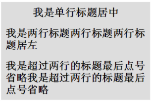
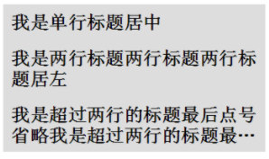

## 5、单行居中显示文字，多行居左显示，最多两行超过用省略号结尾

题目就是如上要求，使用纯 CSS，完成单行文本居中显示文字，多行居左显示，最多两行超过用省略号结尾，效果如下：

不愿看长篇大论的可以先看看效果：

<div style="width:320px; padding:0 10px; margin:10px auto; background: #ddd;">
  <h2 style="text-align: center; padding:10px 0;">
    <p style="display: inline-block; text-align: center;"><em>我是单行标题居中</em></p>
  </h2>

  <h2 style="text-align: center; padding:10px 0;">
    <p style="display: inline-block; text-align: left;"><em>我是两行标题两行标题两行标题居左</em></p>
  </h2>

  <h2 style="text-align: center; padding:10px 0;">
    <p style="display: inline-block; text-align: left; overflow: hidden; text-overflow: ellipsis; -webkit-box-orient: vertical; -webkit-line-clamp: 2; font-style: normal;">
      <em>我是超过两行的标题最后点号省略我是超过两行的标题最后点号省略我是超过两行的标题最后点号省略省略省略</em>
    </p>
  </h2>
</div>

接下来就一步一步来实现这个效果。

#### 首先是单行居中，多行居左

居中需要用到 `text-align:center`，居左是默认值也就是`text-align:left`。如合让两者结合起来达到单行居中，多行居左呢？这就需要多一个标签，假设一开始我们定义如下：

```
<h2>单行居中，多行居左</h2>
```

现在，我们在 `h2` 中间，嵌套多一层标签 `p`：

```
<h2><p>单行居中，多行居左</p></h2>
```

我们让内层 `p` 居左 `text-align:left`，外层 `h2` 居中 `text-align:center`，并且将 `p` 设置为 `display:inline-block` ，利用 `inline-block` 元素可以被父级 `text-align:center` 居中的特性，这样就可以实现单行居中，多行居左，CSS 如下：

```css
p {
  display: inline-block;
  text-align: left;
}

h2 {
  text-align: center;
}
```

得到的效果如下：

[](./img/97247706-294d4900-183b-11eb-9a07-b8e5312d0cb2.png)

#### 超出两行省略

完成了第一步，接下来要实现的是超出两行显示省略符号。

多行省略是有专门的新 CSS 属性可以实现的，但是有些兼容性不大好。主要用到如下几个：

- display: -webkit-box; // 设置 display，将对象作为弹性伸缩盒子模型显示
- -webkit-line-clamp: 2; // 限制在一个块元素显示的文本的行数
- -webkit-box-orient: vertical; // 规定框的子元素应该被水平或垂直排列

上述 3 条样式配合 `overflow : hidden` 和 `text-overflow: ellipsis` 即可实现 `webkit` 内核下的多行省略。好，我们将上述说的一共 5 条样式添加给 `p` 元素

```
p {
    display: inline-block;
    text-align: left;
    overflow : hidden;
    text-overflow: ellipsis;
    display: -webkit-box;
    -webkit-line-clamp: 2;
    -webkit-box-orient: vertical;
}

h2{
    text-align: center;
}
```

看看效果如下：

[](./img/97247737-3833fb80-183b-11eb-85c9-91237677deb1.png)

（在 -webkit- 内核浏览器下）发现，虽然超出两行的是被省略了，但是第一行也变回了居左，而没有居中。

看回上面的 CSS 中的 `p` 元素，原因在于我们第一个设置的 `display: inline-block` ，被接下来设置的 `display: -webkit-box` 给覆盖掉了，所以不再是 `inline-block` 特性的内部 `p` 元素占据了一整行，也就自然而然的不再居中，而变成了正常的居左展示。

记得上面我们解决**单行居中，多行居左**时的方法吗？上面我们添加多了一层标签解决了问题，这里我们再添加多一层标签，如下：

```html
<h2><p><em>单行居中，多行居左<em></p></h2>
```

这里，我们再添加一层 `em` 标签，接下来，

- 设置 `em` 为 `display: -webkit-box`
- 设置 `p` 为 `inline-block`
- 设置 `h2` 为 `text-align: center`

嘿！通过再设置多一层标签，解决 display 的问题，完美解决问题，再看看效果：

<div style="width:320px; padding:0 10px; margin:10px auto; background: #ddd;">
  <h2 style="text-align: center; padding:10px 0;">
    <p style="display: inline-block; text-align: center;"><em>我是单行标题居中</em></p>
  </h2>

  <h2 style="text-align: center; padding:10px 0;">
    <p style="display: inline-block; text-align: left;"><em>我是两行标题两行标题两行标题居左</em></p>
  </h2>

  <h2 style="text-align: center; padding:10px 0;">
    <p style="display: inline-block; text-align: left; overflow: hidden; text-overflow: ellipsis; -webkit-box-orient: vertical; -webkit-line-clamp: 2; font-style: normal;">
      <em>我是超过两行的标题最后点号省略我是超过两行的标题最后点号省略我是超过两行的标题最后点号省略省略省略</em>
    </p>
  </h2>
</div>

### 法二: 绝对定位障眼法

是的，还有第二种方法......

上面我们为了让第一行居中，使用了三层嵌套标签。

这次我们换一种思路，只使用两层标签，但是我们加多一行。结构如下：

```html
<div class="container">
  <h2>
    <p>我是单行标题居中</p>
    <p class="pesudo">我是单行标题居中</p>
  </h2>
</div>
```

这里，新添加了一行 class 为 `pesudo` 的 `p` 标签，标签内容与文本内容一致，但是我们限定死 `class="pesudo"` 的 `p` 标签高度 height 与上面的 `p` 的行高 `line-height`一致，并设置 `overflow:hidden` ，那么这个 `p` 标签**最多只能能展示出一行文本**，接下来使用绝对定位，定位到 `h2` 的顶部，再设置 `text-align:center` 以及背景色与 `h2` 背景色一致。

这样最多显示单行且样式为居中的 `class="pesudo"` p 标签就重叠到了原本的 `p` 标签之上。表现为单行居中，多行时第一行则铺满，解决了我们的问题。多行省略与方法一相同。CSS 如下：

```css
h2 {
  position: relative;
  line-height: 30px;
}
p {
  overflow: hidden;
  text-overflow: ellipsis;
  display: -webkit-box;
  -webkit-line-clamp: 2;
  -webkit-box-orient: vertical;
}
.pesudo {
  position: absolute;
  width: 100%;
  height: 30px;
  overflow: hidden;
  top: 0;
  background: #ddd;
  text-align: center;
}
```

`-webkit-` 内核下查看

<div style="width:320px;  margin:10px auto; background: #ddd; position:relative;">
  <h2 style="position:relative; line-height:30px; margin:10px 0;">
    <p style="overflow:hidden; text-overflow:ellipsis; display:-webkit-box; -webkit-line-clamp:2; -webkit-box-orient:vertical;">我是单行标题居中</p>
    <p  style="position:absolute; width:100%; height:30px; overflow:hidden; top:0; background:#ddd; text-align:center;">我是单行标题居中</p>
  </h2>

  <h2 style="position:relative; line-height:30px; margin:10px 0;">
    <p style="overflow:hidden; text-overflow:ellipsis; display:-webkit-box; -webkit-line-clamp:2; -webkit-box-orient:vertical;">我是两行标题两行标题两行标题居左</p>
    <p  style="position:absolute; width:100%; height:30px; overflow:hidden; top:0; background:#ddd; text-align:center;">我是两行标题两行标题两行标题居左</p>
  </h2>

  <h2 style="position:relative; line-height:30px; margin:10px 0;">
    <p style="overflow:hidden; text-overflow:ellipsis; display:-webkit-box; -webkit-line-clamp:2; -webkit-box-orient:vertical;">我是超过两行的标题最后点号省略我是超过两行的标题最后点号省略</p>
    <p  style="position:absolute; width:100%; height:30px; overflow:hidden; top:0; background:#ddd; text-align:center;">我是超过两行的标题最后点号省略我是超过两行的标题最后点号省略</p>
  </h2>
</div>

::: code-group

```html [html]
<!-- 单行居中显示文字，多行居左显示，最多两行超过用省略号结尾 -->
<div class="container">
  <h2>
    <p>我是单行标题居中</p>
    <p class="pesudo">我是单行标题居中</p>
  </h2>

  <h2>
    <p>我是两行标题两行标题两行标题居左</p>
    <p class="pesudo">我是两行标题两行标题两行标题居左</p>
  </h2>

  <h2>
    <p>我是超过两行的标题最后点号省略我是超过两行的标题最后点号省略</p>
    <p class="pesudo">
      我是超过两行的标题最后点号省略我是超过两行的标题最后点号省略
    </p>
  </h2>
</div>
```

```css [css]
* {
  margin: 0;
  padding: 0;
}
.container {
  width: 320px;
  margin: 10px auto;
  background: #ddd;
  position: relative;
}
h2 {
  position: relative;
  line-height: 30px;
  margin: 10px 0;
}
p {
  overflow: hidden;
  text-overflow: ellipsis;
  display: -webkit-box;
  -webkit-line-clamp: 2;
  -webkit-box-orient: vertical;
}
.pesudo {
  position: absolute;
  width: 100%;
  height: 30px;
  overflow: hidden;
  top: 0;
  background: #ddd;
  text-align: center;
}
```

:::
