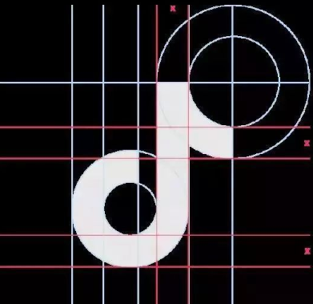
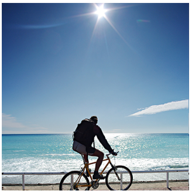
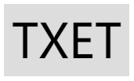
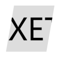
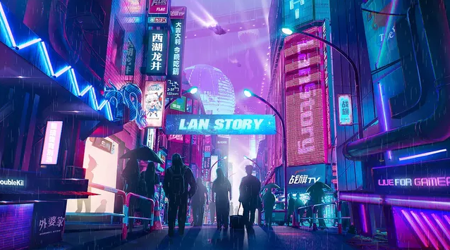

## 使用混合模式实现抖音 LOGO

首先从静态的开始，抖音的 LOGO 就是很好的一个例子。

它看着像是 3 个 J 形重叠在一起。而实际上，是两个 J 形重叠在一起，重叠部分表现为白色，这个特性，使用 CSS 的混合模式 `mix-blend-mode` 非常好实现，而单个 J 形示意图如下：



> 图片来源于知乎：[为什么抖音的标志，看起来具有“电”“闪烁”“震动”的感觉？](https://www.zhihu.com/question/68189079)

单个 J 形其实是由 3/4 圆 + 竖线 + 1/4 圆组成，使用一个标签即可完成（加上两个伪元素）。

### 关键点

- 主要借助伪元素实现了整体 J 结构，借助了 mix-blend-mode 实现融合效果
- 利用 `mix-blend-mode: lighten` 混合模式实现两个 J 形结构重叠部分为白色

所以整个效果只需要两个标签：

```html
<div class="j"></div>
<div class="j"></div>
```

简易 SASS 代码：

```css
// 实现第一个 J
.j {
  position: absolute;

  &::before {
    content: '';
    ...;
  }

  &::after {
    content: '';
    ...;
  }
}

// 实现第二个 J，加上混合模式
.j:last-child {
  position: absolute;
  mix-blend-mode: lighten;

  &::before {
    content: '';
    ...;
  }
  &::after {
    content: '';
    ...;
  }
}
```

## 图片的 Glitch Art 风

当然，上面实现的是我们实现的 J 形的叠加，理解了这种技巧之后，我们可以把它运用到图片之上。

这里我们会运用到 `background-blend-mode` 和 `mix-blend-mode` 。

假设，我们有这样一张图：



只需要一个标签即可

```html
<div class="mix"></div>
```

给两张同样的图片，叠加上 青色`#0ff` 和 红色`#f00`，并且错开一定的距离，两张图都要加上 `background-blend-mode: lighten`，其中一张再加上 `mix-blend-mode: darken`：

```css
.mix {
  width: 400px;
  height: 400px;
  background: url($img), #0ff;
  background-blend-mode: lighten;

  &::after {
    content: '';
    position: absolute;
    margin-left: 10px;
    width: 400px;
    height: 400px;
    background: url($img), #f00;
    background-blend-mode: lighten;
    mix-blend-mode: darken;
  }
}
```

得到如下效果：

这里与上述抖音 LOGO 的处理是有点不一样的，使用的混合模式也不止一种，简单解释下。

1. 因为图片本身不是红色和青色的，所以需要通过 `background-image` 叠加上这两种颜色，并通过 ` background-blend-mode: lighten` 让其表现出来
2. 为了保持中间叠加部分的原色，需要再叠加一个 `mix-blend-mode: darken` 反向处理一下。（不理解的同学可以打开调试，手动关掉几个混合模式，自己感受感受即可）

完整的 DEMO：

效果如下（点击 `HTML/SCSS` 可以对代码进行编辑）：

<iframe height="450" scrolling="no" title="使用background-blend-mode | mix-blend-mode 实现类抖音LOGO晕眩效果" src="https://codepen.io/Chokcoco/embed/VVMQgj/?height=265&amp;theme-id=0&amp;default-tab=result" frameborder="no" allowtransparency="true" allowfullscreen="true" style="-webkit-font-smoothing: antialiased; -webkit-tap-highlight-color: rgba(0, 0, 0, 0); text-size-adjust: none; box-sizing: border-box; font-size: inherit; border: 1px solid rgb(238, 238, 238); width: 1159.33px; min-width: 100%; margin: 1em 0px;"></iframe>

## 动态类抖音风格 Glitch 效果

OK，有了上面的铺垫，我们接下来可以给这种效果加上动画。

### 关键点

- 利用 mix-blend-mode: lighten 混合模式实现两段文字结构重叠部分为白色
- 利用元素位移完成错位移动动画，形成视觉上的冲击效果

看看效果：

效果如下（点击 `HTML/SCSS` 可以对代码进行编辑）：

<iframe height="350" scrolling="no" title="类抖音LOGO文字故障效果" src="https://codepen.io/Chokcoco/embed/KKwLaOV?height=350&amp;theme-id=default&amp;default-tab=result" frameborder="no" allowtransparency="true" allowfullscreen="true" style="-webkit-font-smoothing: antialiased; -webkit-tap-highlight-color: rgba(0, 0, 0, 0); text-size-adjust: none; box-sizing: border-box; font-size: 15px; border: 1px solid rgb(238, 238, 238); width: 1159.33px; min-width: 100%; margin: 1em 0px; color: rgb(52, 73, 94); font-family: &quot;lucida grande&quot;, &quot;lucida sans unicode&quot;, lucida, helvetica, &quot;Hiragino Sans GB&quot;, &quot;Microsoft YaHei&quot;, &quot;WenQuanYi Micro Hei&quot;, sans-serif; font-style: normal; font-variant-ligatures: normal; font-variant-caps: normal; font-weight: 400; letter-spacing: normal; orphans: 2; text-align: start; text-indent: 0px; text-transform: none; widows: 2; word-spacing: 0px; -webkit-text-stroke-width: 0px; white-space: normal; background-color: rgb(255, 255, 255); text-decoration-thickness: initial; text-decoration-style: initial; text-decoration-color: initial;"></iframe>

当然，我们也不是一定要使用混合模式去使得融合部分为白色，可以仅仅是使用这个配色效果，基于上面效果的另外一个版本，没有使用混合模式。

### 关键点

- 利用了伪元素生成了文字的两个副本
- 视觉效果由位移、遮罩、混合模式完成
- 配色借鉴了抖音 LOGO 的风格

效果如下（右下角 rerun 可以重复播放动画）：

<iframe height="350" scrolling="no" title="CSS文字故障效果" src="https://codepen.io/Chokcoco/embed/EMxGXV?height=350&amp;theme-id=default&amp;default-tab=result" frameborder="no" allowtransparency="true" allowfullscreen="true" style="-webkit-font-smoothing: antialiased; -webkit-tap-highlight-color: rgba(0, 0, 0, 0); text-size-adjust: none; box-sizing: border-box; font-size: 15px; border: 1px solid rgb(238, 238, 238); width: 1159.33px; min-width: 100%; margin: 1em 0px; color: rgb(52, 73, 94); font-family: &quot;lucida grande&quot;, &quot;lucida sans unicode&quot;, lucida, helvetica, &quot;Hiragino Sans GB&quot;, &quot;Microsoft YaHei&quot;, &quot;WenQuanYi Micro Hei&quot;, sans-serif; font-style: normal; font-variant-ligatures: normal; font-variant-caps: normal; font-weight: 400; letter-spacing: normal; orphans: 2; text-align: start; text-indent: 0px; text-transform: none; widows: 2; word-spacing: 0px; -webkit-text-stroke-width: 0px; white-space: normal; background-color: rgb(255, 255, 255); text-decoration-thickness: initial; text-decoration-style: initial; text-decoration-color: initial;"></iframe>

仅仅使用配色没有使用混合模式的好处在于，对于每一个文字的副本，有了更大的移动距离和可以处理的空间。

## Glitch Art 风格的 404 效果

稍微替换一下文本文案为 404，再添加上一些滤镜效果（`hue-rotate()`、`blur()`）嘿嘿，找到了一个可能实际可用的场景：

效果一：

<iframe height="300" style="width: 100%;" scrolling="no" title="CSS 404故障效果" src="https://codepen.io/mafqla/embed/jOJBXag?default-tab=html%2Cresult&editable=true&theme-id=light" frameborder="no" loading="lazy" allowtransparency="true" allowfullscreen="true">
  See the Pen <a href="https://codepen.io/mafqla/pen/jOJBXag">
  CSS 404故障效果</a> by mafqla (<a href="https://codepen.io/mafqla">@mafqla</a>)
  on <a href="https://codepen.io">CodePen</a>.
</iframe>

效果二：

<iframe height="300" style="width: 100%;" scrolling="no" title="404故障效果" src="https://codepen.io/mafqla/embed/RwdpExy?default-tab=html%2Cresult&editable=true&theme-id=light" frameborder="no" loading="lazy" allowtransparency="true" allowfullscreen="true">
  See the Pen <a href="https://codepen.io/mafqla/pen/RwdpExy">
  404故障效果</a> by mafqla (<a href="https://codepen.io/mafqla">@mafqla</a>)
  on <a href="https://codepen.io">CodePen</a>.
</iframe>

## 其他配色效果

当然，不仅仅只有这一种`红 + 青`的配色效果。还有一些其他的配色及混合模式的搭配，如 `黄 + 粉红 + 蓝`配合 `mix-blend-mode: multiply`。

然后，有的时候，效果不希望和背景混合在一起，可以使用 `isolation: isolate` 进行隔离。

---

好，上述效果可以归类为一个分类。接下来开启下一个分类

## clip-path 登场

下半篇幅的主角主要是 `clip-path` 。

`clip-path` 一个非常有意思的 CSS 属性。

clip-path CSS 属性可以创建一个只有元素的部分区域可以显示的剪切区域。区域内的部分显示，区域外的隐藏。剪切区域是被引用内嵌的 URL 定义的路径或者外部 SVG 的路径。

也就是说，使用 `clip-path` 可以将一个容器切成我们想要的样子。

例如这样：

```html
<div>TXET</div>
```

```css
div {
  margin: auto;
  padding: 10px;
  line-height: 1.2;
  font-size: 60px;
  background: #ddd;
}
```

正常是这样的：



使用 `clip-path` 剪裁为一个平行四边形：

```css
div  {
    margin: auto;
    padding: 10px;
    line-height: 1.2;
    font-size: 60px;
    background: #ddd;
+   clip-path: polygon(35% 0, 85% 0, 75% 100%, 25% 100%);
}
```

结果如下：



那么，思路就有了，我们可以将一个文字复制几个副本，重叠在一起，再分别裁剪这几个副本进行位移动画即可。

## 使用 clip-path 实现文字断裂动画

我们还是使用元素的 `::before`、`::after` 两个伪元素复制两份副本，再分别使用 `clip-path` 进行剪裁，再使用 transform 进行控制。

核心代码：

```html
<div data-text="Text Crack">
  <span>Text Crack</span>
</div>
```

```css
div {
  position: relative;
  animation: shake 2.5s linear forwards;
}

div span {
  clip-path: polygon(10% 0%, 44% 0%, 70% 100%, 55% 100%);
}

div::before,
div::after {
  content: attr(data-text);
  position: absolute;
  top: 0;
  left: 0;
}

div::before {
  animation: crack1 2.5s linear forwards;
  clip-path: polygon(0% 0%, 10% 0%, 55% 100%, 0% 100%);
}

div::after {
  animation: crack2 2.5s linear forwards;
  clip-path: polygon(44% 0%, 100% 0%, 100% 100%, 70% 100%);
}

// 元素晃动，断裂前摇
@keyframes shake {
  ...;
}

@keyframes crack1 {
  0%,
  95% {
    transform: translate(-50%, -50%);
  }

  100% {
    transform: translate(-55%, -45%);
  }
}

@keyframes crack2 {
  0%,
  95% {
    transform: translate(-50%, -50%);
  }

  100% {
    transform: translate(-45%, -55%);
  }
}
```

可以得到这样的效果：

效果如下：

<iframe height="350" scrolling="no" title="Pure Css Text Crack" src="https://codepen.io/Chokcoco/embed/NWWxryd?height=350&amp;theme-id=default&amp;default-tab=css,result" frameborder="no" allowtransparency="true" allowfullscreen="true" style="-webkit-font-smoothing: antialiased; -webkit-tap-highlight-color: rgba(0, 0, 0, 0); text-size-adjust: none; box-sizing: border-box; font-size: 15px; border: 1px solid rgb(238, 238, 238); width: 1159.33px; min-width: 100%; margin: 1em 0px; color: rgb(52, 73, 94); font-family: &quot;lucida grande&quot;, &quot;lucida sans unicode&quot;, lucida, helvetica, &quot;Hiragino Sans GB&quot;, &quot;Microsoft YaHei&quot;, &quot;WenQuanYi Micro Hei&quot;, sans-serif; font-style: normal; font-variant-ligatures: normal; font-variant-caps: normal; font-weight: 400; letter-spacing: normal; orphans: 2; text-align: start; text-indent: 0px; text-transform: none; widows: 2; word-spacing: 0px; -webkit-text-stroke-width: 0px; white-space: normal; background-color: rgb(255, 255, 255); text-decoration-thickness: initial; text-decoration-style: initial; text-decoration-color: initial;"></iframe>

这个效果，最早的版本见于这位作者：[George W. Park](https://codepen.io/GeorgePark/pens/public)

## clip-path 的 Glitch Art

OK，继续，有了上面的铺垫之后，接下来，我们把这个效果作用于图片之上，并且再添加上动画。

随便选一张图片：



哇哦，非常的赛博朋克。

实现动画的关键在于：

- 使用元素的两个伪元素，生成图片的两个副本
- 使用 `clip-path` 对两个副本图片元素进行裁剪，然后进行位移、transform 变换、添加滤镜等一系列操作。

简单贴一下伪代码：

```html
<div></div>
```

```css
$img: "https://mzz-files.oss-cn-shenzhen.aliyuncs.com///uploads/U1002433/0cb5e044a1f0f7fc15f61264ee97ac1f.png";

div {
    position: relative;
    width: 658px;
    height: 370px;
    background: url($img) no-repeat;
    animation: main-img-hide 16s infinite step-end;
}

div::before,
div::after {
    position: absolute;
    width: 658px;
    height: 370px;
    top: 0;
    left: 0;
    background: inherit;
}

div::after {
    content: "";
    animation: glitch-one 16s infinite step-end;
}

div::before {
    content: "";
    animation: glitch-two 16s infinite 1s step-end;
}

@keyframes glitch-one {
    @for $i from 20 to 30 {
        #{$i / 2}% {
            left: #{randomNum(200, -100)}px;
            clip-path: inset(#{randomNum(150, 30)}px 0 #{randomNum(150, 30)}px);
        }
    }

    15.5% {
        clip-path: inset(10px 0 320px);
        left: -20px;
    }
    16% {
        clip-path: inset(10px 0 320px);
        left: -10px;
        opacity: 0;
    }
    ....
}

@keyframes glitch-two {
    @for $i from 40 to 50 {
        #{$i / 2}% {
            left: #{randomNum(200, -100)}px;
            clip-path: inset(#{randomNum(180)}px 0 #{randomNum(180)}px);
        }
    }

    25.5% {
        clip-path: inset(10px 0 320px);
        left: -20px;
    }
    26% {
        clip-path: inset(10px 0 320px);
        left: -10px;
        opacity: 0;
    }
   ...
}

@keyframes main-img-hide {
    5% {
        filter: invert(1);
    }
    ...
}
```

由于动画部分代码量太多，所以使用了 SASS 循环函数随机生成了部分。如果手动控制，效果其实还会更好，当然，调试动画消耗的时间会更多。

看看效果，虽然 CSS 能力有限，但实际的效果也不是说那么的差：

效果如下：

<iframe height="500g" scrolling="no" title="Clip-path 的 Glitch Art" src="https://codepen.io/Chokcoco/embed/eYmaoNg?height=500g&amp;theme-id=default&amp;default-tab=result" frameborder="no" allowtransparency="true" allowfullscreen="true" style="-webkit-font-smoothing: antialiased; -webkit-tap-highlight-color: rgba(0, 0, 0, 0); text-size-adjust: none; box-sizing: border-box; font-size: 15px; border: 1px solid rgb(238, 238, 238); width: 1159.33px; min-width: 100%; margin: 1em 0px; color: rgb(52, 73, 94); font-family: &quot;lucida grande&quot;, &quot;lucida sans unicode&quot;, lucida, helvetica, &quot;Hiragino Sans GB&quot;, &quot;Microsoft YaHei&quot;, &quot;WenQuanYi Micro Hei&quot;, sans-serif; font-style: normal; font-variant-ligatures: normal; font-variant-caps: normal; font-weight: 400; letter-spacing: normal; orphans: 2; text-align: start; text-indent: 0px; text-transform: none; widows: 2; word-spacing: 0px; -webkit-text-stroke-width: 0px; white-space: normal; background-color: rgb(255, 255, 255); text-decoration-thickness: initial; text-decoration-style: initial; text-decoration-color: initial;"></iframe>
