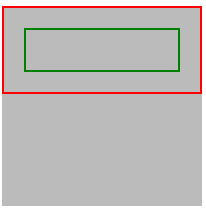
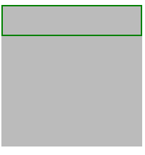
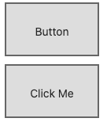

## 基本用法

根据 [W3C](https://developer.mozilla.org/zh-CN/docs/Web/CSS/display) 对 `display: contents` 的定义。

> The element itself does not generate any boxes, but its children and pseudo-elements still generate boxes and text runs as normal. For the purposes of box generation and layout, the element must be treated as if it had been replaced in the element tree by its contents (including both its source-document children and its pseudo-elements, such as ::before and ::after pseudo-elements, which are generated before/after the element’s children as normal).

简单翻译一下即是，将设置了该属性值的元素本身将不会产生任何盒子，但是它的从保留其子代元素的正常展示。

看个简单的例子。有如下简单三层结构：

```html
<div class="container">
  <div class="wrap">
    <div class="inner"></div>
  </div>
</div>
```

简单的 CSS 如下：

```css
.container {
  width: 200px;
  height: 200px;
  background: #bbb;
}

.wrap {
  border: 2px solid red;
  padding: 20px;
  box-sizing: border-box;
}

.inner {
  border: 2px solid green;
  padding: 20px;
  box-sizing: border-box;
}
```

表现如下：



这个非常好理解，但是如果，我们给中间层的容器添加上 `display: contents`，再看看效果：

```html
<div class="container">
  <div class="wrap" style="display: contents">
    <div class="inner"></div>
  </div>
</div>
```



可以看到，没有了中间层的 `border: 2px solid red` 的红色边框，整个 `.wrap` div 好像不存在一样，但是它的子元素却是正常的渲染了。

重点，**设置了`display: contents`的元素本身不会被渲染，但是其子元素能够正常被渲染**。

这个属性我一直在思考有什么非常适合的使用点。

总结来说，这个属性适用于那些充当遮罩（wrapper）的元素，这些元素本身没有什么作用，可以被忽略的一些布局场景。

## 充当无语义的包裹框

最近写 React、Vue 的时候，发现这个属性在写 JSX 的时候能有很好的作用，并且也非常符合这个属性本身的定位。

我们在写 React、RN 时，经常需要输出一段模板。

```js
return (
  <div class="wrap">
    <h2>Title</h2>
    <div>...</div>
  </div>
)
```

我们只是想输出 `.wrap` div 内的内容，但是由于框架要求，输出的 JSX 模板必须包含在一个父元素之下，所以不得已，需要添加一个 `.wrap` 进行包裹，但是这个 `.wrap` 本身是没有任何样式的。

如果输出的元素是要放在其他 `display: flex`、`display: grid` 容器之下，加了一层无意义的 `.wrap` 之后，整个布局又需要重新进行调整，麻烦。

一种方法是使用框架提供的容器 `<React.Fragment>`，它不会向页面插入任何多余节点。

> 在 Vue 中类似的是 `<template>` 元素， `<template>` 也是不会被渲染在 DOM 树中，查看页面结构也无法看到，但是 `display: contents` 是存在于页面结构中的，只是没有生成任何盒子。

这个多出来的父元素其实是没必要的。这个时候，我们也可以添加上 `display: contents`，像是这样：

```js
return (
  <div class="wrap" style="display: contents">
    <h2>Title</h2>
    <div>...</div>
  </div>
)
```

这样，它既起到了包裹的作用，但是在实际渲染中，这个 div 其实没有生成任何盒子，一举两得。并且像一些 `flex` 布局、`grid` 布局，也不会受到影响。

<iframe height="300" style="width: 100%;" scrolling="no" title="display: contents | display: flex" src="https://codepen.io/Chokcoco/embed/wvKLBVV?default-tab=html%2Cresult&editable=true&theme-id=light" frameborder="no" loading="lazy" allowtransparency="true" allowfullscreen="true">
  See the Pen <a href="https://codepen.io/Chokcoco/pen/wvKLBVV">
  display: contents | display: flex</a>
</iframe>

## 让代码更加符合语义化

考虑这个非常实际的场景，现在我们的页面上充斥了大量的可点击按钮，或者点击触发相应功能的文字等元素。但是，从语义上而言，它们应该是一个一个的 `<button>`，但是实际上，更多时候我们都是使用了 `<p>、<div>、<a>` 等标签进行了模拟，给他们加上了相应的点击事情而已。

像是下面这样，虽然没什么问题，但是相对而言不那么符合语义化：

```html
<p class="button">Button</p>
<p class="button">Click Me</p>
```

```css
.button {
  width: 120px;
  line-height: 64px;
  text-align: center;
  background-color: #ddd;
  border: 2px solid #666;
}
```



我们不使用 `<button>` 的原因有很多，`<button>` 相对 div 而言没那么好控制，且会引入很多默认样式。但是，有了 `display: contents`，我们可以让我们的代码既符合语义化，同时不需要去解决 `<button>` 带来的一些样式问题：

```html
<p class="button">
  <button style="display: contents">Button</button>
</p>
<p class="button">
  <button style="display: contents">Click Me</button>
</p>
```

添加了 `<button style="display: contents">Click Me</button>` 的包裹，不会对样式带来什么影响，button 也不会实际渲染在页面结构中，但是页面的结构语义上好了不少。

对于对页面结构、语义化有强迫症的一些同学而言，灵活运用这个属性可以解决很多问题。

> 当然，对于提升使用 div 、a 标签模拟的按钮的可访问性而言，更好的办法是是通过 [WAI-ARIA 标准](https://www.w3.org/TR/wai-aria-1.1/)定义的一系列 `ARIA-*` 属性来改善，具体的相关内容可以看看这里 -- [前端优秀实践不完全指南](https://github.com/chokcoco/cnblogsArticle/issues/26)

## 在替换元素及表单元素中一些有意思的现象

`display: contents` 并非在所有元素下的表现都一致。

对于可替换元素及大部分表单元素，使用 `display: contents` 的作用类似于 `display: none`。

也就是说对于一些常见的可替换元素、表单元素：

- `<br>`
- `<canvas>`
- `<object>`
- `<audio>`
- `<iframe>`
- ``
- `<video>`
- `<frame>`
- `<input>`
- `<textarea>`
- `<select>`

作用了 `display: contents` 相当于使用了 `display: none` ，元素的整个框和内容都没有绘制在页面上。

### `<button>` 的一些异同

与其他表单元素不一样，正常而言，添加了 `display: contents` 相当于被隐藏，不会被渲染。但是实际运用过程中发现，`<button></button>` 如果包裹了内容，其一些可继承样式还是会被子内容继承。这个实际使用的过程中需要注意一下。

## 对 A11Y 的影响

在一些外文文档中有一些讨论是关于 `display: contents` 的使用会影响到页面的可访问性。例如作用了 `display: contents` 的容器及列表，会对页面的可访问性带来一些意外结果。

- [[css-a11y\][css-display] display: contents; strips semantic role from elements](https://github.com/w3c/csswg-drafts/issues/3040)

这个我看暂时没有明确的结论，如果你的页面对可访问性的要求很高，具体使用的此属性的话也是需要注意一下这一点。

## CSS 中类似的一些影响布局的属性

CSS 本身其实也在一直在努力，增加了各种属性去让我们在布局上有更多的空间与控制权。总而言之给我的感受是让 CSS 更加的像是一个完整的工程而不仅仅只是展现样式。

类似的一些有意思的属性：

- [CSS 新特性 contain，控制页面的重绘与重排](https://github.com/chokcoco/iCSS/issues/23)

## 参考

- [How display: contents; Works](https://bitsofco.de/how-display-contents-works/)
- [CSS 的 display:contents](https://www.w3cplus.com/css/display-contents-is-coming.html)
- [Display: Contents Is Not a CSS Reset](https://adrianroselli.com/2018/05/display-contents-is-not-a-css-reset.html)
