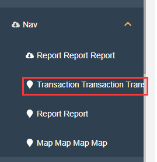
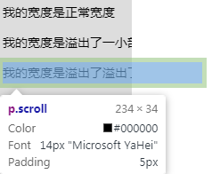

在日常布局当中，肯定经常会遇到文本内容超过容器的情况。非常常见的一种解决方案是超出省略。

但是，有的时候，由于场景的限制，可能会出现在一些无法使用超出打点省略的方法的场景，譬如在导航栏中：



这种情况下，在容器定宽但是文本又溢出且不能换行的情况下，我们就需要寻求另外的解决方案。

## hover 时弹出框提示

一种可行的方案是在 hover 的时候，弹出一个文本框展示全文，最简单的就是在文本标签下添加 title 属性，填充我们需要的内容：

```html
<nav>
  <p title="溢出文本1 溢出文本2 溢出文本3 溢出文本4">
    溢出文本1 溢出文本2 溢出文本3 溢出文本4
  </p>
</nav>
```


当然，这种方法简单但是可能缺乏点用户体验。

---

本文将简单介绍在文本长度不确定，容器长度也不确定的情况下，任意长度的文本实现 hover 状态下，从左向右，滚动到文本末端，再滚动回初始位置，如此反复，像是这样：


## 容器定宽，文本不定宽

我们先假设一下，我们的容器的宽度如果是固定的，但是不确定每条文本的宽度。

像是这样：

```html
<div class="wrap">
  <p title="我的宽度是正常宽度">我的宽度是正常宽度</p>
  <p class="scroll" title="我的宽度是溢出了一小部分">
    我的宽度是溢出了一小部分
  </p>
  <p class="scroll" title="我的宽度是溢出了溢出了很大一部分">
    我的宽度是溢出了溢出了很大一部分
  </p>
</div>
```

```css
.wrap {
    position: relative;
    width: 150px;
    overflow: hidden;
}

p {
     white-space: nowrap;
}
```

### 使用 `inline-block` 获取实际文本的宽度

由于 `<p>` 标签的宽度为父元素的 100%，如果是这样，我们很难进行下面的操作。我们首先需要拿到实际文本的宽度，这里可以借助 `inline-block` 的特性，做到这一点，我们改进下我们的 CSS：

```css
p {
 +  display: inline-block;
    white-space: nowrap;
}
```

这样，当前 `<p>` 标签的实际宽度，其实就是整个文本元素的宽度。



> Tips：这里没有使用 `display: inline` 是因为下文我们需要让 p 元素滚动起来需要用到 transform，但是 transform 是无法作用在内联元素之上的。具体可以参考规范：[transformable element](https://drafts.csswg.org/css-transforms-1/#transformable-element)

### 算出滚动距离，进行滚动

这样，我们有了父元素的宽度 `150px`，文本的宽度。那么很容易得到需要滚动的距离：

**需要滚动的距离 S = 溢出的文本元素的宽度 - 父元素的宽度**

这样，我们只需要找到一个可以表示并且当前文本宽度是变量值即可。即是 -- **transoform**。

由于在使用 transform: translate() 进行位移的时候，如果使用百分比表示，那么百分比的基准元素是元素本身，也就是如果我们 `transform: translate(100%, 0)`，其实表示的就是向右移动一个元素本身宽度的距离。

那么我们可以借助 calc 非常容易的拿到我们上述的需要滚动的距离 S -- `transform: translate(calc(-100% + 150px), 0)`，嵌入动画中：

```css
p:hover {
  animation: move 1.5s infinite alternate linear;
}

@keyframes move {
  0% {
    transform: translate(0, 0);
  }
  100% {
    transform: translate(calc(-100% + 150px), 0);
  }
}
```

至此，对于任意超出容器宽度的文本，我们都可以轻松的完成上述的效果。

<iframe height="300" style="width: 100%;" scrolling="no" title="不定长宽度文字跑马灯来回滚动展示 -- 父容器定宽，子元素不定宽" src="https://codepen.io/mafqla/embed/qBvmGJM?default-tab=html%2Cresult&editable=true&theme-id=light" frameborder="no" loading="lazy" allowtransparency="true" allowfullscreen="true">
  See the Pen <a href="https://codepen.io/mafqla/pen/qBvmGJM">
  不定长宽度文字跑马灯来回滚动展示 -- 父容器定宽，子元素不定宽</a> by mafqla (<a href="https://codepen.io/mafqla">@mafqla</a>)
  on <a href="https://codepen.io">CodePen</a>.
</iframe>

## 父容器不定宽度

当然，还没完。

如果父容器的宽度也是不固定的，或因为者 `calc` 兼容性问题无法使用上述方法。那么，我们要做的就是，在一段固定的 CSS 代码中，既能运动当前元素的宽度，也能位移父容器的宽度。

正巧，CSS 还真能完成上述要求，我们改造一下 `animation` 的代码：

```css
@keyframes move {
  0% {
    left: 0;
    transform: translate(0, 0);
  }
  100% {
    left: 100%;
    transform: translate(-100%, 0);
  }
}
```

- `transform: translate(-100%, 0)` 能够向左位移**自身宽度**的 100%
- `left: 100%` 能够实现向右位移**父容器宽度**的 100%

> 使用 `margin-left` 替换 `left` 也是一样可以实现的，使用百分比表示的 `margin-left` 位移的基准也是父元素的宽度。

这样，不论父容器宽度如何，文本元素宽度如何，都可以实现对溢出文本适配滚动展示。

<iframe height="300" style="width: 100%;" scrolling="no" title="不定宽文字跑马灯来回滚动展示 -- 父容器不定宽，子元素不定宽" src="https://codepen.io/mafqla/embed/dyrWEgw?default-tab=html%2Cresult&editable=true&theme-id=light" frameborder="no" loading="lazy" allowtransparency="true" allowfullscreen="true">
  See the Pen <a href="https://codepen.io/mafqla/pen/dyrWEgw">
  不定宽文字跑马灯来回滚动展示 -- 父容器不定宽，子元素不定宽</a> by mafqla (<a href="https://codepen.io/mafqla">@mafqla</a>)
  on <a href="https://codepen.io">CodePen</a>.
</iframe>

## 部分不足之处

1. 无法判断文本长度是否超出父元素宽度

当然，上述方案并非完美的方案，如果我们希望只针对本文长度溢出的情况，hover 的时候才进行滚动，这一点在使用纯 CSS 的情况下是无法实现的。

我们无法通过 CSS 去判断当前元素长度是否大于父元素长度再选择性的进行动画。毕竟 CSS 只是负责样式，不控制行为。所以实际使用中，可能还是需要借助 JavaScript 简单判断，然后通过一个 class 进行控制。

1. 动画闪烁

在**父容器不定宽度**的情况下，由于需要同时对两个属性进行动画，并且位移的方向是相反的，所以动画看上去会有一点闪烁。这个暂时没有找到特别好的解决方案。
