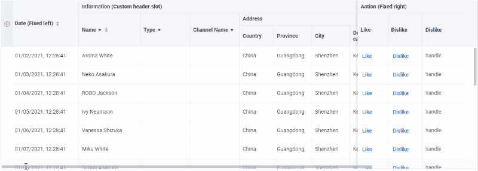
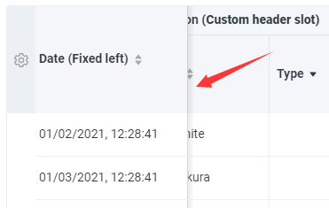
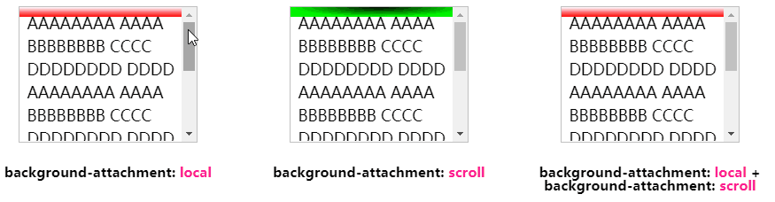

开门见山，有这样一种非常常见的情况，对于一些可滚动的元素而言。通常在滚动的时候会给垂直于滚动的一侧添加一个阴影，用于表明当前有元素被滚动给该滚出了可视区域，类似这样：



可以看到，在滚动的过程中，会出现一条阴影：


对于两侧的列在滚动的过程中，静止不动，吸附在边界的问题，通常 CSS 使用 `position: sticky` 即可解决。

但是对于滚动过程中才出现的阴影（滚动容器内的内容没有贴边，则阴影出现，贴边，则阴影消失），之前的做法一直都是需要借助 JS 完成的。

那么，有没有纯 CSS 能够实现的方案呢？嘿嘿嘿，有。有一种非常讨巧的障眼法，下面就让我们来一步一步揭开它的面纱。

## 神奇的 `background-attachment`

### `background-attachment: srcoll`

首先，介绍一下 `background-attachment`，**如果指定了 `background-image` ，那么 `background-attachment` 决定背景是在视口中固定的还是随着包含它的区块滚动的**。

简单而言，就是决定了在可滚动的容器中，背景图案是如何进行运动的。通过两个简单的 Demo，弄懂 `background-attachment: srcoll` 和 `background-attachment: local`。

`background-attachment: local`，这个就是和我们日常使用中的用法是一致的，可滚动容器的背景图案随着容器进行滚动：

`background-attachment: scroll`，这个是今天的主角，它表明背景相对于元素本身固定， 而不是随着它的内容滚动：

<iframe height="300" style="width: 100%;" scrolling="no" title="bg-attachment Demo" src="https://codepen.io/mafqla/embed/qBvXvOY?default-tab=html%2Cresult&editable=true&theme-id=light" frameborder="no" loading="lazy" allowtransparency="true" allowfullscreen="true">
  See the Pen <a href="https://codepen.io/mafqla/pen/qBvXvOY">
  bg-attachment Demo</a> by mafqla (<a href="https://codepen.io/mafqla">@mafqla</a>)
  on <a href="https://codepen.io">CodePen</a>.
</iframe>

## `srcoll` 与 `local` 同时使用，实现障眼法

到这里，可能很多同学还是懵的，我们到底要做什么呢？这个和本文的滚动阴影有什么关联呢？

别急，滚动阴影的难点在于，初始没有滚动的时候是没有阴影展现的，只有当开始滚动，阴影才会出现。

所以这里，我们借助 `background-attachment: srcoll` 和 `background-attachment: local` 两个属性，在滚动初始的时候，利用两层背景叠加在一起隐藏阴影背景，真正滚动的时候，将叠加的部分移走，只漏出阴影部分即可。

嗯？什么意思。我们用给滚动容器，加上两个渐变效果，分别运用上 `background-attachment: srcoll` 和 `background-attachment: local`，再叠加起来，像是这样：

```html
<!-- 可滚动容器 -->
<ul>
  <li>...</li>
  ...
  <li>...</li>
</ul>
```

```css
// 情形一：
.g-one {
  background: linear-gradient(#fff, #f00);
  background-size: 100% 10px;
  background-repeat: no-repeat;
  background-attachment: local;
}

// 情形二：
.g-two {
  background: radial-gradient(at 50% 0, #000, #0f0 70%);
  background-size: 100% 10px;
  background-repeat: no-repeat;
  background-attachment: scroll;
}

// 情形三：
.g-combine {
  background: linear-gradient(#fff, #f00), radial-gradient(at 50% 0%, #000, #0f0
        70%);
  background-size: 100% 10px, 100% 10px;
  background-repeat: no-repeat;
  background-attachment: local, scroll;
}
```

实际效果就是这样，一个背景是随容器滚动，一个背景是随容器固定。随容器滚动的背景充当初始的遮罩层：



OK，可以看到，当滚动的时候，最后一幅叠加的情况，其实就是我们需要的滚动的时候展示不同的颜色（阴影）的效果。我们调整一下两个渐变的颜色，遮罩层（`background-attachment: local`）为白色，再把固定不动的阴影层（`background-attachment: scroll`），利用径向渐变模拟为我们想要的阴影颜色。

CSS 代码大概是这样：

```css
.g-final {
  background: linear-gradient(#fff, transparent 100%), linear-gradient(rgba(0, 0, 0, 0.5), transparent
        100%);
  background-size: 100% 50px, 100% 10px;
  background-repeat: no-repeat;
  background-attachment: local, scroll;
}
```

利用 `linear-gradient(rgba(0, 0, 0, .5), transparent 100%)` 线性渐变模拟了一层灰色阴影：

<iframe height="300" style="width: 100%;" scrolling="no" title="Pure CSS Scroll shadow" src="https://codepen.io/mafqla/embed/wvOqOMv?default-tab=html%2Cresult&editable=true&theme-id=light" frameborder="no" loading="lazy" allowtransparency="true" allowfullscreen="true">
  See the Pen <a href="https://codepen.io/mafqla/pen/wvOqOMv">
  Pure CSS Scroll shadow</a> by mafqla (<a href="https://codepen.io/mafqla">@mafqla</a>)
  on <a href="https://codepen.io">CodePen</a>.
</iframe>

如文章开头所示，这技巧也是可以直接运用在 `table` 里面：

<iframe height="300" style="width: 100%;" scrolling="no" title="Pure CSS Table scroll shadow" src="https://codepen.io/mafqla/embed/NWJvJxq?default-tab=html%2Cresult&editable=true&theme-id=light" frameborder="no" loading="lazy" allowtransparency="true" allowfullscreen="true">
  See the Pen <a href="https://codepen.io/mafqla/pen/NWJvJxq">
  Pure CSS Table scroll shadow</a> by mafqla (<a href="https://codepen.io/mafqla">@mafqla</a>)
  on <a href="https://codepen.io">CodePen</a>.
</iframe>

## 一些问题

### 层叠顺序

当然，在上述的过程中，其实一直有个问题，就是由于是使用背景 `background` 模拟的阴影，其实最终的效果，内容是在阴影（背景之上的），但是实际效果其实没有很大的差别，如果能忍受这一点，这个方案是完全可用的。
