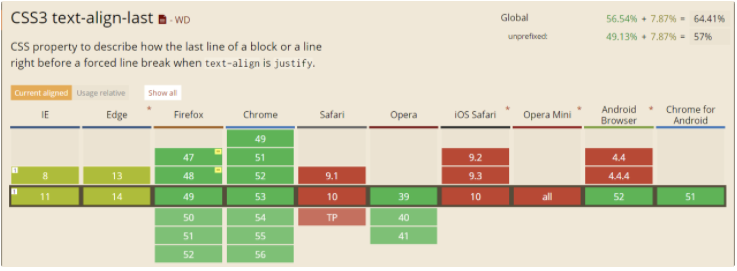

## 6、全兼容的多列均匀布局问题

如何实现下列这种多列均匀布局：


### 法一：`display:flex`

CSS3 弹性盒子(Flexible Box 或 Flexbox)，是一种布局方式，当页面需要适应不同的屏幕大小以及设备类型时，它依然能确保元素拥有更恰当的排布行为。

当然 flex 布局应用于移动端不错，PC 端需要全兼容的话，兼容性不够，此处略过不谈。

### 法二：借助伪元素及 `text-align:justify`

定义如下 `HTML` 样式：

```
<div class="container">
    <div class="justify">
        <i>1</i>
        <i>2</i>
        <i>3</i>
        <i>4</i>
        <i>5</i>
    </div>
</div>
```

我们知道，有个 text-align:justify 可以实现两端对齐文本效果。

> `text-align` CSS 属性定义行内内容（例如文字）如何相对它的块父元素对齐。text-align 并不控制块元素自己的对齐，只控制它的行内内容的对齐。
>
> `text-align:justify` 表示文字向两侧对齐。

一开始我猜测使用它可以实现，采用如下 CSS ：

```
.justify{
  text-align: justify;
}

.justify i{
  width:24px;
  line-height:24px;
  display:inline-block;
  text-align:center;
  border-radius:50%;
}
```

结果如下：


没有得到意料之中的结果，并没有实现所谓的两端对齐，查找原因，在 [W3C](http://www.w3school.com.cn/cssref/pr_text_text-align.asp) 找到这样一段解释:

最后一个水平对齐属性是 `justify`，它会带来自己的一些问题。CSS 中没有说明如何处理连字符，因为不同的语言有不同的连字符规则。规范没有尝试去调和这样一些很可能不完备的规则，而是干脆不提这个问题。

额，我看完上面一大段解释还是没明白上面意思，再继续查证，才找到原因：

虽然 `text-align:justify` 属性是全兼容的，但是要使用它实现两端对齐，需要注意在模块之间添加**[空格/换行符/制表符]**才能起作用。

也就是说每一个 _1_ 间隙，至少需要有一个空格或者换行或者制表符才行。

好的，我们尝试一下更新一下 `HTML` 结构，采用同样的 CSS：

```html
<div class="container">
  <div class="justify">
    <i>1</i>

    <i>2</i>

    <i>3</i>

    <i>4</i>

    <i>5</i>
  </div>
</div>
```

尝试给每一块中间添加一个换行符，结果如下：


::: code-group

```html [html]
<div class="container">
  <div class="justify">
    <i>1</i>
    <i>2</i>
    <i>3</i>
    <i>4</i>
    <i>5</i>
  </div>
</div>
```

```scss [scss]
.container {
  width: 400px;
  margin: 50px auto 0;
  background: #ddd;
}

.justify {
  position: relative;
  width: 100%;
  height: 24px;
  text-align: justify;
  text-align-last: justify;
  margin-bottom: 20px;
  i {
    width: 24px;
    line-height: 24px;
    display: inline-block;
    // text-align:center;
    text-indent: 9px;
    background: #333;
    color: white;
    border-radius: 50%;
    overflow: hidden;
    font-style: normal;
  }
}
```

:::

啊哦，还是不行啊。

再寻找原因，原来是出在最后一个元素上面，然后我找到了 `text-align-last` 这个属性，`text-align-last` 属性规定如何对齐文本的最后一行，并且 `text-align-last` 属性只有在 `text-align` 属性设置为 `justify` 时才起作用。

尝试给容器添加 `text-align-last:justify`：

```css
.justify {
  text-align: justify;
  text-align-last: justify; // 新增这一行
}

.justify i {
  width: 24px;
  line-height: 24px;
  display: inline-block;
  text-align: center;
  border-radius: 50%;
}
```

发现终于可以了，实现了多列均匀布局：


结束了？没有，查看一下 `text-align-last` 的兼容性：



但是一看兼容性，惨不忍睹，只有 IE8+ 和 最新的 chrome 支持 `text-align-last` 属性，也就是说，如果你不是在使用 IE8+ 或者 最新版的 chrome 观看本文，上面 Demo 里的打开的 codePen 例子还是没有均匀分布。

上面说了要使用 `text-align:justify` 实现多列布局，要配合 `text-align-last` ，但是它的兼容性又不好，真的没办法了么，其实还是有的，使用伪元素配合，不需要 `text-align-last` 属性。

我们给 `class="justify"` 的 `div` 添加一个伪元素：

```css
.justify {
  text-align: justify;
}

.justify i {
  width: 24px;
  line-height: 24px;
  display: inline-block;
  text-align: center;
  border-radius: 50%;
}

.justify:after {
  content: '';
  display: inline-block;
  position: relative;
  width: 100%;
}
```

去掉了 `text-align-last: justify` 了，增加一个伪元素，效果如下：


通过给伪元素 `:after` 设置 `inline-block` 设置宽度 `100%` ，配合容器的 `text-align: justify` 就可以轻松实现多列均匀布局了。再多配合几句 hack 代码，可以实现兼容到 IE6+ ，最重要的是代码不长，很好理解。

那么为什么使用了 :after 伪元素之后就可以实现对齐了呢？

原因在于 justify 只有在存在第二行的情况下，第一行才两端对齐，所以在这里，我们需要制造一个假的第二行，而 :after 伪元素正好再适合不过。

最终实现题目初始所示：

[](https://user-images.githubusercontent.com/8554143/87442550-03eb5500-c627-11ea-80f5-ada17a79a6d0.png)

<EqualColumnsLayout />
::: code-group

```html [html]
<div class="container">
  <div class="justify">
    <i>1</i>
    <i>2</i>
    <i>3</i>
    <i>4</i>
    <i>5</i>
    <!--[if lte IE 7]> <b></b><!
    [endif]--><!-- 兼容不支持伪元素的 ie678 -->
  </div>
  <div class="justify">
    <i>1</i>
    <i>2</i>
    <i>3</i>
    <i>4</i>
  </div>
  <div class="justify">
    <i>1</i>
    <i>2</i>
    <i>3</i>
  </div>
  <div class="justify">
    <i>1</i>
    <i>2</i>
  </div>
  <div class="justify">
    <i>1</i>
  </div>
</div>
```

```scss [scss]
.container {
  width: 400px;
  margin: 50px auto 0;
}

.justify {
  position: relative;
  width: 100%;
  height: 24px;
  text-align: justify;
  margin-bottom: 20px;
  i {
    width: 24px;
    line-height: 24px;
    display: inline-block;
    text-align: center;
    background: #333;
    color: white;
    border-radius: 50%;
    overflow: hidden;
    font-style: normal;
  }

  &:after {
    content: '';
  }

  &:after,
  & b {
    display: inline-block;
    position: relative;
    top: -28px;
    // *top: -9px;
    height: 1px;
    line-height: 0;
    width: 100%;
    background: #333;
    z-index: -1;
    // *zoom: 1;
  }
}
```

:::
