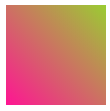
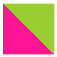
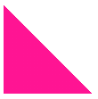
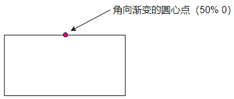
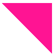
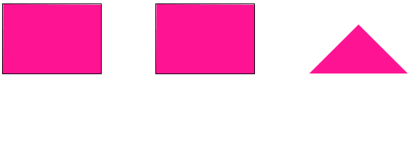
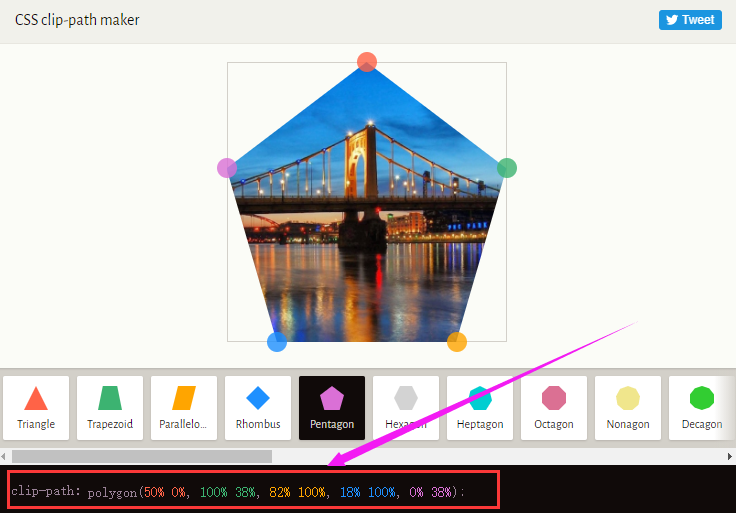
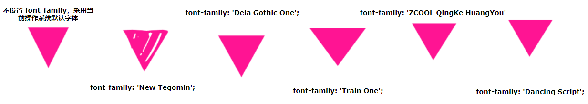

## 使用 border 绘制三角形

使用 border 实现三角形应该是大部分人都掌握的，也是各种面经中经常出现的，利用了高宽为零的容器及透明的 border 实现。

简单的代码如下：

```css
div {
  border-top: 50px solid yellowgreen;
  border-bottom: 50px solid deeppink;
  border-left: 50px solid bisque;
  border-right: 50px solid chocolate;
}
```

高宽为零的容器，设置不同颜色的 border：

[]

这样，让任何三边的边框的颜色为 `transparent`，则非常容易得到各种角度的三角形：

<iframe height="300" style="width: 100%;" scrolling="no" title="transparent border triangle" src="https://codepen.io/mafqla/embed/gOEKbXj?default-tab=html%2Cresult&editable=true&theme-id=light" frameborder="no" loading="lazy" allowtransparency="true" allowfullscreen="true">
  See the Pen <a href="https://codepen.io/mafqla/pen/gOEKbXj">
  transparent border triangle</a> by mafqla (<a href="https://codepen.io/mafqla">@mafqla</a>)
  on <a href="https://codepen.io">CodePen</a>.
</iframe>

## 使用 linear-gradient 绘制三角形

接着，我们使用线性渐变 `linear-gradient` 实现三角形。

它的原理也非常简单，我们实现一个 `45°` 的渐变：

```css
div {
  width: 100px;
  height: 100px;
  background: linear-gradient(45deg, deeppink, yellowgreen);
}
```

[]

让它的颜色从渐变色变为两种固定的颜色：

```css
div {
  width: 100px;
  height: 100px;
  background: linear-gradient(
    45deg,
    deeppink,
    deeppink 50%,
    yellowgreen 50%,
    yellowgreen 100%
  );
}
```

[]

再让其中一个颜色透明即可：

```css
div {
  background: linear-gradient(
    45deg,
    deeppink,
    deeppink 50%,
    transparent 50%,
    transparent 100%
  );
}
```

[]

通过旋转 `rotate` 或者 `scale`，我们也能得到各种角度，不同大小的三角形，完整的 Demo 可以戳这里：

<iframe height="300" style="width: 100%;" scrolling="no" title="linear-gradient triangle" src="https://codepen.io/mafqla/embed/bGZKNYz?default-tab=html%2Cresult&editable=true&theme-id=light" frameborder="no" loading="lazy" allowtransparency="true" allowfullscreen="true">
  See the Pen <a href="https://codepen.io/mafqla/pen/bGZKNYz">
  linear-gradient triangle</a> by mafqla (<a href="https://codepen.io/mafqla">@mafqla</a>)
  on <a href="https://codepen.io">CodePen</a>.
</iframe>

## 使用 conic-gradient 绘制三角形

还是渐变，上述我们使用了线性渐变实现三角形，有意思的是，在渐变家族中，角向渐变 `conic-gradient` 也可以用于实现三角形。

方法在于，**角向渐变的圆心点是可以设置的**，类似于径向渐变的圆心点也可以被设置。

我们将角向渐变的圆心点设置于 `50% 0`，也就是 `center top`，容器最上方的中间，再进行角向渐变，渐变到一定的角度范围内，都是三角形图形。

假设我们有一个 `200px x 100px` 高宽的容器，设置其角向渐变圆心点为 `50% 0`：

[]

并且，设置它从 `90°` 开始画角向渐变图，示意图如下：

[]

可以看到，在初始的时候，角向渐变图形没有到第二条边的之前，都是三角形，我们选取适合的角度，非常容易的可以得到一个三角形：

```css
div {
  background: conic-gradient(
    from 90deg at 50% 0,
    deeppink 0,
    deeppink 45deg,
    transparent 45.1deg
  );
}
```

[]

上述代码中的 ` deeppink 45deg, transparent 45.1deg` 多出来的 `0.1deg` 是为了简单消除渐变产生的锯齿的影响，这样，我们通过 `conic-gradient`，也轻松的得到了一个三角形。

同理，再配合旋转 `rotate` 或者 `scale`，我们也能得到各种角度，不同大小的三角形，完整的 Demo 可以戳这里：

<iframe height="300" style="width: 100%;" scrolling="no" title="使用 conic-gradient 实现三角形" src="https://codepen.io/mafqla/embed/XWGYJVK?default-tab=html%2Cresult&editable=true&theme-id=light" frameborder="no" loading="lazy" allowtransparency="true" allowfullscreen="true">
  See the Pen <a href="https://codepen.io/mafqla/pen/XWGYJVK">
  使用 conic-gradient 实现三角形</a> by mafqla (<a href="https://codepen.io/mafqla">@mafqla</a>)
  on <a href="https://codepen.io">CodePen</a>.
</iframe>

## transform: rotate 配合 overflow: hidden 绘制三角形

这种方法还是比较常规的，使用 `transform: rotate` 配合 `overflow: hidden`。一看就懂，一学就会，简单的动画示意图如下：

[]

设置图形的旋转中心在左下角 `left bottom`，进行旋转，配合 `overflow: hidden`。

完整的代码：

```scss
.triangle {
  width: 141px;
  height: 100px;
  position: relative;
  overflow: hidden;

  &::before {
    content: '';
    position: absolute;
    top: 0;
    left: 0;
    right: 0;
    bottom: 0;
    background: deeppink;
    transform-origin: left bottom;
    transform: rotate(45deg);
  }
}
```

<iframe height="300" style="width: 100%;" scrolling="no" title="transform: rotate 配合 overflow: hidden 实现三角形" src="https://codepen.io/mafqla/embed/abMKzEp?default-tab=html%2Cresult&editable=true&theme-id=light" frameborder="no" loading="lazy" allowtransparency="true" allowfullscreen="true">
  See the Pen <a href="https://codepen.io/mafqla/pen/abMKzEp">
  transform: rotate 配合 overflow: hidden 实现三角形</a> by mafqla (<a href="https://codepen.io/mafqla">@mafqla</a>)
  on <a href="https://codepen.io">CodePen</a>.
</iframe>

## 使用 clip-path 绘制三角形

`clip-path` 一个非常有意思的 CSS 属性。

`clip-path` CSS 属性可以创建一个只有元素的部分区域可以显示的剪切区域。区域内的部分显示，区域外的隐藏。剪切区域是被引用内嵌的 URL 定义的路径或者外部 SVG 的路径。

也就是说，使用 `clip-path` 可以将一个容器裁剪成任何我们想要的样子。

通过 3 个坐标点，实现一个多边形，多余的空间则会被裁减掉，代码也非常简单：

```css
div {
  background: deeppink;
  clip-path: polygon(0 0, 100% 0, 0 100%, 0 0);
}
```

<iframe height="300" style="width: 100%;" scrolling="no" title=" 使用 clip-path 实现三角形" src="https://codepen.io/mafqla/embed/JjzZoMN?default-tab=html%2Cresult&editable=true&theme-id=light" frameborder="no" loading="lazy" allowtransparency="true" allowfullscreen="true">
  See the Pen <a href="https://codepen.io/mafqla/pen/JjzZoMN">
   使用 clip-path 实现三角形</a> by mafqla (<a href="https://codepen.io/mafqla">@mafqla</a>)
  on <a href="https://codepen.io">CodePen</a>.
</iframe>

在这个网站中 -- [CSS clip-path maker](https://bennettfeely.com/clippy/)，你可以快捷地创建简单的 `clip-path` 图形，得到对应的 CSS 代码。

[]

## 利用字符绘制三角形

OK，最后一种，有些独特，就是使用字符表示三角形。

下面列出一些三角形形状的字符的十进制 Unicode 表示码。

```html
◄: &#9668; ►: &#9658; ▼: &#9660; ▲: &#9650; ⊿: &#8895; △: &#9651;
```

譬如，我们使用 `▼ ` 实现一个三角形 ▼，代码如下：

```html
<div class="normal">&#9660;</div>
```

```css
div {
  font-size: 100px;
  color: deeppink;
}
```

效果还是不错的：

[]

然而，需要注意的是，使用字符表示三角形与当前设定的字体是强相关的，不同的字体绘制出的同一个字符是不一样的，我在 [Google Font](https://fonts.google.com/) 上随机选取了几个不同的字体，分别表示同一个字符，得到的效果如下：

[]

可以看到，不同字体的形状、大小及基线都是不一样的，所以如果你想使用字符三角形，确保用户的浏览器安装了你指定的字体，否则，不要使用这种方式。

完整的对比 Demo，你可以戳这里：

<iframe height="300" style="width: 100%;" scrolling="no" title=" 使用字符实现三角形" src="https://codepen.io/mafqla/embed/VwRdYyy?default-tab=html%2Cresult&editable=true&theme-id=light" frameborder="no" loading="lazy" allowtransparency="true" allowfullscreen="true">
  See the Pen <a href="https://codepen.io/mafqla/pen/VwRdYyy">
   使用字符实现三角形</a> by mafqla (<a href="https://codepen.io/mafqla">@mafqla</a>)
  on <a href="https://codepen.io">CodePen</a>.
</iframe>
