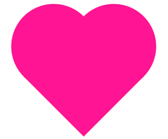
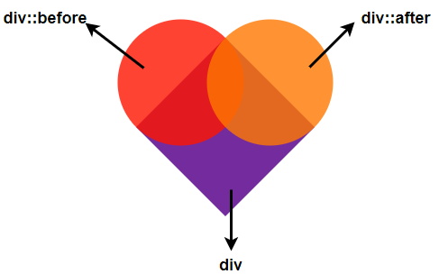
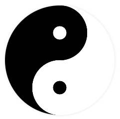
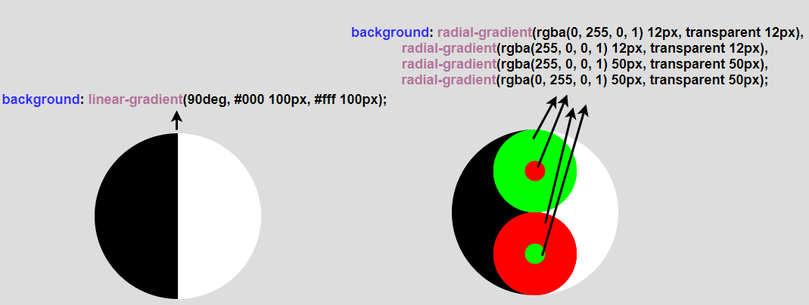
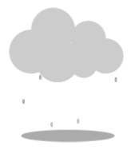
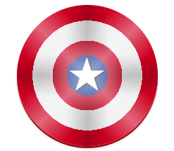
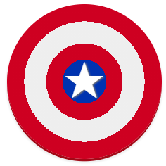

## 合理利用伪元素

虽然说是一个标签，但是几乎所有打着单标签实现图形标题的例子，其中都使用了 3 个元素。这就是单标签实现图形上最为核心的一部分：

**我们除了元素本身的样式能够控制之外，还有元素的两个伪元素 -- `::before`，`::after`，实际上一共是 3 个元素**。

好，譬如下面这个心形图形，只能使用一个 div 实现它，该怎么做呢：



这种不规则的图形本身使用纯 CSS 是比较复杂的，通常会借助 SVG，当然在 CSS 中就是使用 `clip-path`。不过仔细观察图形，我们不需要 `clip-path`，尝试将图片分成 3 部分：



Wow，其实这里，我们只需要元素本身实现正方形，元素的两个伪元素利用绝对定位实现两个圆形，叠加在一起即可！完整的代码也非常简单：

```css
div {
  position: relative;
  transform: rotate(45deg);
  background: rgba(255, 20, 147, 0.85);
  width: 140px;
  height: 140px;
}
div::before,
div::after {
  content: '';
  position: absolute;
  top: 0;
  left: -70px;
  width: 140px;
  height: 140px;
  border-radius: 50%;
  background: rgb(255, 20, 147);
}
div::before {
  top: -70px;
  left: 0;
}
```

<iframe height="300" style="width: 100%;" scrolling="no" title="A Signle Div heartShape" src="https://codepen.io/mafqla/embed/abMjgKP?default-tab=html%2Cresult&editable=true&theme-id=light" frameborder="no" loading="lazy" allowtransparency="true" allowfullscreen="true">
  See the Pen <a href="https://codepen.io/mafqla/pen/abMjgKP">
  A Signle Div heartShape</a> by mafqla (<a href="https://codepen.io/mafqla">@mafqla</a>)
  on <a href="https://codepen.io">CodePen</a>.
</iframe>

## 渐变 & 多重渐变

毫不夸张的说，渐变是在单标签实现图形中，使用的最多的一个 CSS 属性。

**原因就在于我们渐变是可以多重渐变的**！渐变不仅仅只能是单个的 linear-gradient 或者单个的 radial-gradient，对于 background 而言，它是支持多重渐变的叠加的，一点非常重要。

好，我们来看看这个太极图：



其实太极图就是由多个不同颜色的圆组成，这里堆叠多个不同的 div，并且把他们组合在一起肯定是 OK 的。但是我们的目标是使用单个标签完成。

当图形全是圆或者线条，就应该考虑使用多重线性（径向）渐变了，我们可以将上图拆解一下。

它其实是由 1 个线性渐变加上 4 个径向渐变生成的圆组成：



所以，一个太极图完整的代码只需要一个 div 即可，甚至都不需要伪元素的辅助：

```css
div {
  width: 200px;
  height: 200px;
  border-radius: 50%;
  background-image: radial-gradient(#000 12.5px, transparent 12.5px),
    radial-gradient(#fff 12.5px, transparent 12.5px), radial-gradient(
      #fff 50px,
      transparent 50px
    ), radial-gradient(#000 50px, transparent 50px), linear-gradient(90deg, #000
        100px, #fff 100px);
  background-position: center 50px, center -50px, center 50px, center -50px, 0 0;
}
```

<iframe height="300" style="width: 100%;" scrolling="no" title="A Single Div PURE CSS Tai Chi" src="https://codepen.io/mafqla/embed/ZEPjdRo?default-tab=html%2Cresult&editable=true&theme-id=light" frameborder="no" loading="lazy" allowtransparency="true" allowfullscreen="true">
  See the Pen <a href="https://codepen.io/mafqla/pen/ZEPjdRo">
  A Single Div PURE CSS Tai Chi</a> by mafqla (<a href="https://codepen.io/mafqla">@mafqla</a>)
  on <a href="https://codepen.io">CodePen</a>.
</iframe>

## 阴影 & 多重阴影

与渐变非常类似的一个属性就是阴影 `box-shadow`，`box-shadow` 属性它的一个特点也是可以叠加多层的，可以内置多条阴影规则，它简直就是单标签绘图的终极大杀器！

我们尝试使用一个 div 实现如下图形：



乍一看，这个图形其实还是很复杂的，云朵、雨滴都不像是仅仅用一个标签或者一个伪元素能够实现的。

实则不然，首先我们看看这个云朵，虽然带有不规则的轮廓，但是实际上就是一个一个的圆。非常适合使用多重径向渐变或者是多重阴影！

其实就是一个实现圆，然后利用阴影实现多个圆的叠加，示例动画，一看就懂：

代码量其实也非常少，实现一个云朵的代码：

```css
div {
  width: 100px;
  height: 100px;
  background: #fff;
  border-radius: 50%;
  box-shadow: 120px 0px 0 -10px #fff, 95px 20px 0 0px #fff,
    30px 30px 0 -10px #fff, 90px -20px 0 0px #fff, 40px -40px 0 0px #fff;
}
```

<iframe height="300" style="width: 100%;" scrolling="no" title="cloudy" src="https://codepen.io/mafqla/embed/WNmKqyO?default-tab=html%2Cresult&editable=true&theme-id=light" frameborder="no" loading="lazy" allowtransparency="true" allowfullscreen="true">
  See the Pen <a href="https://codepen.io/mafqla/pen/WNmKqyO">
  cloudy</a> by mafqla (<a href="https://codepen.io/mafqla">@mafqla</a>)
  on <a href="https://codepen.io">CodePen</a>.
</iframe>

与云朵的示例代码类似，雨滴其实也是借助了多重阴影实现：

```css
div {
  position: absolute;
  width: 3px;
  height: 6px;
  border-radius: 50%;
  animation: rainy_rain 0.7s infinite linear;
  box-shadow: rgba(0, 0, 0, 0) -10px 30px, rgba(0, 0, 0, 0) 40px 40px,
    rgba(0, 0, 0, 0.3) -50px 75px, rgba(0, 0, 0, 0.3) 55px 50px,
    rgba(0, 0, 0, 0.3) -18px 100px, rgba(0, 0, 0, 0.3) 12px 95px,
    rgba(0, 0, 0, 0.3) -31px 45px, rgba(0, 0, 0, 0.3) 30px 35px;
}

@keyframes rainy_rain {
  0% {
    box-shadow: rgba(0, 0, 0, 0) -10px 30px, rgba(0, 0, 0, 0) 40px 40px,
      rgba(0, 0, 0, 0.3) -50px 75px, rgba(0, 0, 0, 0.3) 55px 50px,
      rgba(0, 0, 0, 0.3) -18px 100px, rgba(0, 0, 0, 0.3) 12px 95px,
      rgba(0, 0, 0, 0.3) -31px 45px, rgba(0, 0, 0, 0.3) 30px 35px;
  }
  // 省略部分阴影位移帧动画代码
  ... 100% {
    box-shadow: rgba(0, 0, 0, 0) -10px 120px, rgba(0, 0, 0, 0) 40px 120px,
      rgba(0, 0, 0, 0.3) -50px 75px, rgba(0, 0, 0, 0.3) 55px 50px,
      rgba(0, 0, 0, 0.3) -18px 100px, rgba(0, 0, 0, 0.3) 12px 95px,
      rgba(0, 0, 0, 0.3) -31px 45px, rgba(0, 0, 0, 0.3) 30px 35px;
  }
}
```

<iframe height="300" style="width: 100%;" scrolling="no" title="A Signle Div Rainy" src="https://codepen.io/mafqla/embed/BabPgVQ?default-tab=html%2Cresult&editable=true&theme-id=light" frameborder="no" loading="lazy" allowtransparency="true" allowfullscreen="true">
  See the Pen <a href="https://codepen.io/mafqla/pen/BabPgVQ">
  A Signle Div Rainy</a> by mafqla (<a href="https://codepen.io/mafqla">@mafqla</a>)
  on <a href="https://codepen.io">CodePen</a>.
</iframe>

刚刚已经使用了元素本身和元素的一个伪元素，剩余一个伪元素实现底部的阴影圆即可，完整的 Demo 代码你可以戳这里：[A Signle Div Rainy](https://codepen.io/Chokcoco/pen/poedNJW)

## 简单总结一下

到这里，可以简单总结一下，单标签实现图形，尤其是复杂图形，很大程度上都是借助了上述的 3 个技巧，也就是：

- 单标签绘图，其实是使用元素本身和它的两个伪元素 `::before` 和 `::after`
- 合理使用多重渐变叠加
- 合理使用多重阴影叠加

## 练习一下

我们练习一下，使用单个 div 实现下面这个美队盾牌：



有了上面的铺垫，其实多重的圆形使用多重径向渐变和多重阴影都是都是可以的，而中间的星星，使用字符或者 `clip-path` 也能非常轻松的实现：

```css
div {
  position: absolute;
  width: 200px;
  height: 200px;
  background: radial-gradient(
    at center,
    #0033b0 20%,
    #ce0021 20%,
    #ce0021 35%,
    #eee 35%,
    #eee 55%,
    #ce0021 55%
  );
  border-radius: 50%;
}
div::before {
  content: '★';
  position: absolute;
  top: 50%;
  left: 50%;
  transform: translate(-50%, -50%);
  line-height: 47px;
  font-size: 55px;
}
```

我们会得到这样一个图形：



感觉图形少了一些光泽，我们可以往 div 上继续叠加一些 `linear-gradient`，给盾牌表面添加一些高光：

```css
div {
  position: absolute;
  width: 200px;
  height: 200px;
  background: linear-gradient(
      45deg,
      rgba(255, 255, 255, 0) 35%,
      rgba(255, 255, 255, 0.4) 50%,
      rgba(255, 255, 255, 0) 65%
    ), linear-gradient(
      -45deg,
      rgba(255, 255, 255, 0) 35%,
      rgba(255, 255, 255, 0.4) 50%,
      rgba(255, 255, 255, 0) 65%
    ), linear-gradient(
      to right,
      rgba(0, 0, 0, 0) 35%,
      rgba(0, 0, 0, 0.2) 50%,
      rgba(0, 0, 0, 0) 65%
    ), linear-gradient(
      to bottom,
      rgba(0, 0, 0, 0) 35%,
      rgba(0, 0, 0, 0.2) 50%,
      rgba(0, 0, 0, 0) 65%
    ), radial-gradient(ellipse at center, #0033b0 20%, #ce0021 20%, #ce0021 35%, #eee
        35%, #eee 55%, #ce0021 55%);
  border-radius: 50%;
}
div::before {
  content: '★';
  position: absolute;
  top: 50%;
  left: 50%;
  transform: translate(-50%, -50%);
  line-height: 47px;
  font-size: 55px;
}
```

OK，便能完美的实现：

<iframe height="300" style="width: 100%;" scrolling="no" title="A Signle Div Shield" src="https://codepen.io/mafqla/embed/qBvyzYw?default-tab=html%2Cresult&editable=true&theme-id=light" frameborder="no" loading="lazy" allowtransparency="true" allowfullscreen="true">
  See the Pen <a href="https://codepen.io/mafqla/pen/qBvyzYw">
  A Signle Div Shield</a> by mafqla (<a href="https://codepen.io/mafqla">@mafqla</a>)
  on <a href="https://codepen.io">CodePen</a>.
</iframe>

### 单个标签实现一个磁带

我们再看看这个图形，一个磁带图形：


看着很复杂，其实都是圆和各种线条，其实也是适合使用单个标签实现的，就是非常的花时间，需要精细的控制 `background-image` 里面的每个渐变的 `background-size`、`background-position`：

首先，借由多重渐变，实现整个背景结构：

```css
div {
  width: 180px;
  height: 120px;
  border-radius: 5px;
  background-image: linear-gradient(to right, #444 10px, transparent 10px),
    linear-gradient(to left, #444 10px, transparent 10px), linear-gradient(
      135deg,
      #444 20px,
      transparent 20px
    ), linear-gradient(-135deg, #444 20px, transparent 20px), linear-gradient(
      to bottom,
      transparent 35px,
      #be0974 35px,
      #be0974 43px,
      #da6a57 43px,
      #da6a57 51px,
      #eebc31 51px,
      #eebc31 59px,
      #92a25b 59px,
      #92a25b 67px,
      #46a7c0 67px,
      #46a7c0 75px,
      transparent 75px
    ), linear-gradient(
      to bottom,
      transparent 10px,
      #f7f7f7 10px,
      #f7f7f7 85px,
      transparent 85px
    ), linear-gradient(to top, transparent 26px, #444 26px), linear-gradient(
      105deg,
      #444 70px,
      #333 70px,
      #333 73px,
      transparent 73px
    ), linear-gradient(
      -105deg,
      #444 70px,
      #333 70px,
      #333 73px,
      transparent 73px
    ), linear-gradient(to top, #444 24px, #777 24px, #777 26px, #444 26px);
  box-shadow: -4px -4px 2px rgb(0 0 0 / 20%);
}
```

得到如下图形：


通过其中一个伪元素，利用 `box-shadow` 实现磁带上的各个圆圈点：

```css
div:after {
  position: absolute;
  content: '';
  width: 5px;
  height: 5px;
  background: #999;
  border-radius: 50%;
  box-shadow: 165px 0 0 #999, 0 104px 0 #999, 165px 104px 0 #999, 55px 101px 0
      1px #222, 68px 98px 0 1px #222, 98px 98px 0 1px #222,
    110px 101px 0 1px #222, 51px 38px 0 #444, 114px 38px 0 #444, 44px 46px 0
      #444, 58px 46px 0 #444, 107px 46px 0 #444, 121px 46px 0 #444, 51px 53px 0
      #444, 114px 53px 0 #444, 51px 46px 0 6px #ccc, 114px 46px 0 6px #ccc;
  left: 5px;
  top: 5px;
}
```

最后剩下的一个伪元素，实现磁带中间的部分样式即可：

```css
div:before {
  position: absolute;
  content: '';
  width: 90px;
  height: 26px;
  margin-left: -45px;
  left: 50%;
  top: 41px;
  background-color: #ccc;
  background-image: linear-gradient(to bottom, #444 5px, transparent 5px),
    linear-gradient(to top, #444 5px, transparent 5px), linear-gradient(
      to right,
      #444 30px,
      transparent 30px
    ), linear-gradient(to left, #444 30px, transparent 30px), radial-gradient(circle
        at 10px 12px, #a0522d 32px, transparent 32px);
  border-radius: 30px;
}
```

<iframe height="300" style="width: 100%;" scrolling="no" title="A single Div Disk" src="https://codepen.io/mafqla/embed/zYbLVWm?default-tab=html%2Cresult&editable=true&theme-id=light" frameborder="no" loading="lazy" allowtransparency="true" allowfullscreen="true">
  See the Pen <a href="https://codepen.io/mafqla/pen/zYbLVWm">
  A single Div Disk</a> by mafqla (<a href="https://codepen.io/mafqla">@mafqla</a>)
  on <a href="https://codepen.io">CodePen</a>.
</iframe>

这样，就顺利使用单个标签实现啦，该 Demo 取自 [A Single Div](https://a.singlediv.com/)

当然，单标签能实现的远不止如此，看看下面这些，都是一个 div 能够实现的：

## 配合其它高阶属性

当然，上述的作图都还是比较常规的，借助伪元素，使用 `background`、使用 `box-shadow`。我们还可以尝试在一个 div 内增加混合模式 `mix-blend-mode`、滤镜 `filter` 以及 遮罩 `mask` 等，实现一些更为有意思的效果。

譬如下述这个效果，使用了一个 div 实现的幽灵效果：

<iframe height="300" style="width: 100%;" scrolling="no" title="A Single Div Ghost" src="https://codepen.io/mafqla/embed/ZEPjdxo?default-tab=html%2Cresult&editable=true&theme-id=light" frameborder="no" loading="lazy" allowtransparency="true" allowfullscreen="true">
  See the Pen <a href="https://codepen.io/mafqla/pen/ZEPjdxo">
  A Single Div Ghost</a> by mafqla (<a href="https://codepen.io/mafqla">@mafqla</a>)
  on <a href="https://codepen.io">CodePen</a>.
</iframe>

在用一个 div 实现基本效果之余，还加上了利用了 `filter` 滤镜实现了一些融合效果。
