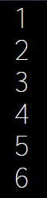
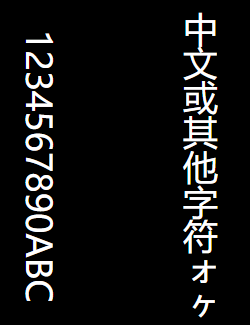
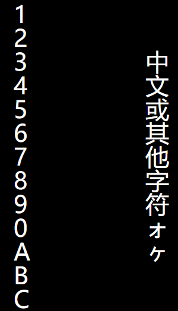
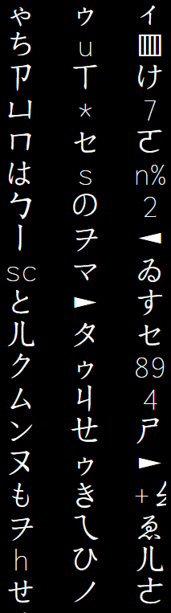
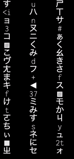
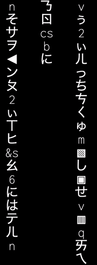
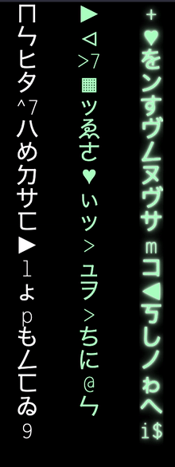
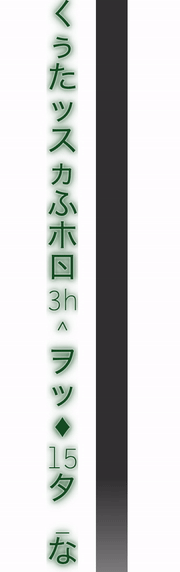
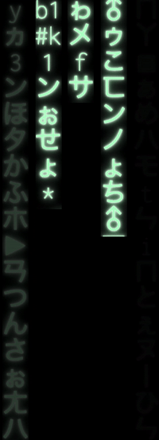

## 文字的竖排

首先第一步，就是需要实现文字的竖向排列：

[](https://user-images.githubusercontent.com/8554143/127499568-7c191914-9f61-4991-a17b-3fa281aba7a9.png)

这一步非常的简单，可能方法也很多，这里我简单罗列一下：

1. 使用控制文本排列的属性 `writing-mode` 进行控制，可以通过 `writing-mode: vertical-lr` 等将文字进行竖向排列，但是对于数字和英文，将会旋转 90° 展示：

```html
<p>1234567890ABC</p>
<p>中文或其他字符ォヶ</p>
```

```css
p {
  writing-mode: vertical-lr;
}
```

[](https://user-images.githubusercontent.com/8554143/127500324-49465301-0d68-4f6c-a148-50dfe083b5eb.png)

当然这种情况下，英文字符的展示不太满足我们的需求。

1. 控制容器的宽度，控制每行只能展示 1 个中文字符。

这个方法算是最简单便捷的方法了，但是由于英文的特殊性，要让连续的长字符串自然的换行，我们还需要配合 `word-break: break-all` ：

```css
p {
  width: 12px;
  font-size: 10px;
  word-break: break-all;
}
```

效果如下，满足需求：

[](https://user-images.githubusercontent.com/8554143/127501293-9c1f3050-1d6a-4d02-a410-ada079fc61d3.png)

## 使用 CSS 实现随机字符串的选取

为了让我们的效果更加自然。每一行的字符的选取最好是随机的。

但是要让 CSS 实现随机生成每一行的字符可太难了。所以这里我们请出 CSS 预处理器 SASS/LESS 。

而且由于不太可能利用 CSS 给单个标签内，譬如 `<p>` 标签插入字符，所以我们把标签内的字符展示，放在每个 `<p>` 元素的伪元素 `::before` 的 `content` 当中。

我们可以提前设置好一组字符串，然后利用 SASS function 随机生成每一次元素内的 `content`，伪代码如下：

```css
<div>
    <p></p>
    <p></p>
    <p></p>
</div>
```

```css
$str: 'ぁぃぅぇぉかきくけこんさしすせそた◁▣▤▥▦▧♂♀♥☻►◄▧▨♦ちつってとゐなにぬねのはひふへほゑまみむめもゃゅょゎをァィゥヴェォカヵキクケヶコサシスセソタチツッテトヰンナニヌネノハヒフヘホヱマミムメモャュョヮヲㄅㄉㄓㄚㄞㄢㄦㄆㄊㄍㄐㄔㄗㄧㄛㄟㄣㄇㄋㄎㄑㄕㄘㄨㄜㄠㄤㄈㄏㄒㄖㄙㄩㄝㄡㄥabcdefghigklmnopqrstuvwxyz123456789%@#$<>^&*_+';
$length: str-length($str);

@function randomChar() {
  $r: random($length);
  @return str-slice($str, $r, $r);
}

@function randomChars($number) {
  $value: '';

  @if $number > 0 {
    @for $i from 1 through $number {
      $value: $value + randomChar();
    }
  }
  @return $value;
}

p:nth-child(1)::before {
  content: randomChars(25);
}
p:nth-child(2)::before {
  content: randomChars(25);
}
p:nth-child(3)::before {
  content: randomChars(25);
}
```

简单解释下上面的代码：

1. `$str` 定义了一串随机字符串，`$length` 表示字符串的长度
2. randomChar() 中利用了 SASS 的 `random()` 方法，每次随机选取一个 0 - `$length` 的整形数，记为 `$r`，再利用 SASS 的 `str-slice` 方法，每次从 `$str` 中选取一个下标为 `$r` 的随机字符
3. randomChars() 就是循环调用 randomChar() 方法，从 `$str` 中随机生成一串字符串，长度为传进去的参数 `$number`

这样，每一列的字符，每次都是不一样的：

[](https://user-images.githubusercontent.com/8554143/127503139-c1c19761-c847-4292-93ac-c615a0043fb5.png)

> 当然，上述的方法我认为不是最好的，CSS 的伪元素的 `content` 是支持字符编码的，譬如 `content: '\3066';` 会被渲染成字符 `て`，这样，通过设定字符区间，配合 SASS function 可以更好的生成随机字符，但是我尝试了非常久，SASS function 生成的最终产物会在 `\` 和 `3066` 这样的数字间添加上空格，无法最终通过字符编码转换成字符，最终放弃...

## 使用 CSS 实现打字效果

OK，继续，接下来我们要使用 CSS 实现打字效果，就是让字符一个一个的出现，像是这样：

[](https://user-images.githubusercontent.com/8554143/127505113-4fb3ced9-3d7f-4d71-a1b8-a40accc4e862.gif)

这里借助了 animation 的 `steps` 的特性实现，也就是逐帧动画。

从左向右和从上向下原理是一样的，以从左向右为例，假设我们有 26 个英文字符，我们已知 26 个英文字符组成的字符串的长度，那么我们只需要设定一个动画，让它的宽度变化从 `0 - 100%` 经历 26 帧即可，配合 `overflow: hidden`，steps 的每一帧即可展出一个字符。

当然，这里需要利用一些小技巧，我们如何通过字符的数量知道字符串的长度呢？

划重点：**通过等宽字体的特性，配合 CSS 中的 `ch` 单位**。

> 如果不了解什么是等宽字体族，可以看看我的这篇文章 -- [《你该知道的字体 font-family》](https://github.com/chokcoco/iCSS/issues/6)。

CSS 中，`ch` 单位表示数字 “0” 的宽度。如果字体恰巧又是等宽字体，即每个字符的宽度是一样的，此时 `ch` 就能变成每个英文字符的宽度，那么 `26ch` 其实也就是整个字符串的长度。

利用这个特性，配合 animation 的 `steps`，我们可以轻松的利用 CSS 实现打字动画效果：

```html
<h1>Pure CSS Typing animation.</h1>
```

```css
h1 {
  font-family: monospace;
  width: 26ch;
  white-space: nowrap;
  overflow: hidden;
  animation: typing 3s steps(26, end);
}

@keyframes typing {
  0 {
    width: 0;
  }
  100% {
    width: 26ch;
  }
}
```

就可以得到如下结果啦：

[](https://user-images.githubusercontent.com/8554143/127505113-4fb3ced9-3d7f-4d71-a1b8-a40accc4e862.gif)

完整的代码你可以戳这里：

<iframe height="300" style="width: 100%;" scrolling="no" title="纯 CSS 实现文字输入效果" src="https://codepen.io/mafqla/embed/poYBxdw?default-tab=html%2Cresult&editable=true&theme-id=light" frameborder="no" loading="lazy" allowtransparency="true" allowfullscreen="true">
  See the Pen <a href="https://codepen.io/mafqla/pen/poYBxdw">
  纯 CSS 实现文字输入效果</a> by mafqla (<a href="https://codepen.io/mafqla">@mafqla</a>)
  on <a href="https://codepen.io">CodePen</a>.
</iframe>

### 改造成竖向打字效果

接下来，我们就运用上述技巧，改造一下。将一个横向的打字效果改造成竖向的打字效果。

核心的伪代码如下：

```html
<div>
  <p></p>
  <p></p>
  <p></p>
</div>
```

```css
$str: 'ぁぃぅぇぉかきくけこんさしすせそた◁▣▤▥▦▧♂♀♥☻►◄▧▨♦ちつってとゐなにぬねのはひふへほゑまみむめもゃゅょゎをァィゥヴェォカヵキクケヶコサシスセソタチツッテトヰンナニヌネノハヒフヘホヱマミムメモャュョヮヲㄅㄉㄓㄚㄞㄢㄦㄆㄊㄍㄐㄔㄗㄧㄛㄟㄣㄇㄋㄎㄑㄕㄘㄨㄜㄠㄤㄈㄏㄒㄖㄙㄩㄝㄡㄥabcdefghigklmnopqrstuvwxyz123456789%@#$<>^&*_+';
$length: str-length($str);

@function randomChar() {
  $r: random($length);
  @return str-slice($str, $r, $r);
}

@function randomChars($number) {
  $value: '';

  @if $number > 0 {
    @for $i from 1 through $number {
      $value: $value + randomChar();
    }
  }
  @return $value;
}

p {
  width: 12px;
  font-size: 10px;
  word-break: break-all;
}

p::before {
  content: randomChars(20);
  color: #fff;
  animation: typing 4s steps(20, end) infinite;
}

@keyframes typing {
  0% {
    height: 0;
  }
  25% {
    height: 100%;
  }
  100% {
    height: 100%;
  }
}
```

这样，我们就实现了竖向的打字效果：

[](https://user-images.githubusercontent.com/8554143/127733965-1661ca1f-81ae-431a-950c-e83c274c74f0.gif)

当然，这样看上去比较整齐划一，缺少了一定的随机，也就缺少了一定的美感。

基于此，我们进行 2 点改造：

1. 基于动画的时长 `animation-time`、和动画的延迟 `animation-delay`，增加一定幅度内的随机
2. 在每次动画的末尾或者过程中，重新替换伪元素的 `content`，也就是重新生成一份 `content`

可以借助 SASS 非常轻松的实现这一点，核心的 SASS 代码如下：

```css
$n: 3;
$animationTime: 3;
$perColumnNums: 20;

@for $i from 0 through $n {
  $content: randomChars($perColumnNums);
  $contentNext: randomChars($perColumnNums);
  $delay: random($n);
  $randomAnimationTine: #{$animationTime + random(20) / 10 - 1}s;

  p:nth-child(#{$i})::before {
    content: $content;
    color: #fff;
    animation: typing-#{$i}
      $randomAnimationTine
      steps(20, end)
      #{$delay *
      0.1s *
      -1}
      infinite;
  }

  @keyframes typing-#{$i} {
    0% {
      height: 0;
    }
    25% {
      height: 100%;
    }
    100% {
      height: 100%;
      content: $contentNext;
    }
  }
}
```

看看效果，已经有不错的改观：

[](https://user-images.githubusercontent.com/8554143/127734113-37703e90-67fc-477d-995f-478267447e80.gif)

当然，上述由横向打字转变为竖向打字效果其实是有一些不一样的。在现有的竖向排列规则下，无法通过 ch 配合字符数拿到实际的竖向高度。所以这里有一定的取舍，实际放慢动画来看，没个字的现出不一定是完整的。

当然，在快速的动画效果下几乎是察觉不到的。

## 增加光影与透明度变化

最后一步，就是增加光影及透明度的变化。

最佳的效果是要让每个新出现的字符保持亮度最大，同时已经出现过的字符亮度慢慢减弱。

但是由于这里我们无法精细操控每一个字符，只能操控每一行字符，所以在实现方式上必须另辟蹊径。

最终的方式是借用了另外一个伪元素进行同步的遮罩以实现最终的效果。下面我们就来一步一步看看过程。

### 给文字增添亮色及高光

第一步就是给文字增添亮色及高光，这点非常容易，就是选取一个黑色底色下的亮色，并且借助 `text-shadow` 让文字发光。

```css
p::before {
  color: rgb(179, 255, 199);
  text-shadow: 0 0 1px #fff, 0 0 2px #fff, 0 0 5px currentColor, 0 0 10px
      currentColor;
}
```

看看效果，左边是白色字符，中间是改变字符颜色，右边是改变了字体颜色并且添加了字体阴影的效果：

[](https://user-images.githubusercontent.com/8554143/127734393-9783ed9d-5137-468e-8e9c-dd83ded97fbf.gif)

### 给文字添加同步遮罩

接下来，就是在文字动画的行进过程中，同步添加一个黑色到透明的遮罩，尽量还原让每个新出现的字符保持亮度最大，同时已经出现过的字符亮度慢慢减弱。

这个效果的示意图大概是这样的，这里我将文字层和遮罩层分开，并且底色从黑色改为白色，方便理解：

[](https://user-images.githubusercontent.com/8554143/127735480-e7df1317-e0f2-4b84-8a22-59ea76a9d775.gif)

大概的遮罩的层的伪代码如下，用到了元素的另外一个伪元素：

```css
p::after {
  content: '';
  background: linear-gradient(rgba(0, 0, 0, 0.9), transparent 75%, transparent);
  background-size: 100% 220%;
  background-repeat: no-repeat;
  animation: mask 4s infinite linear;
}

@keyframes mask {
  0% {
    background-position: 0 220%;
  }
  30% {
    background-position: 0 0%;
  }
  100% {
    background-position: 0 0%;
  }
}
```

好，合在一起的最终效果大概就是这样：

[](https://user-images.githubusercontent.com/8554143/127735820-9ac92c0a-8f83-4b65-ba14-3ab7c51586a5.gif)

通过调整 `@keyframes mask` 的一些参数，可以得到不一样的字符渐隐效果，需要一定的调试。

## 完整代码及效果

OK，拆解了一下主要的步骤，最后上一下完整代码，应用了 Pug 模板引擎和 SASS 语法。

完整代码加起来不过 100 行。

```css
.g-container -for(var i=0; i<50; i++) p;
```

```css
@import url('https://fonts.googleapis.com/css2?family=Inconsolata:wght@200&display=swap');

$str: 'ぁぃぅぇぉかきくけこんさしすせそた◁▣▤▥▦▧♂♀♥☻►◄▧▨♦ちつってとゐなにぬねのはひふへほゑまみむめもゃゅょゎをァィゥヴェォカヵキクケヶコサシスセソタチツッテトヰンナニヌネノハヒフヘホヱマミムメモャュョヮヲㄅㄉㄓㄚㄞㄢㄦㄆㄊㄍㄐㄔㄗㄧㄛㄟㄣㄇㄋㄎㄑㄕㄘㄨㄜㄠㄤㄈㄏㄒㄖㄙㄩㄝㄡㄥabcdefghigklmnopqrstuvwxyz123456789%@#$<>^&*_+';
$length: str-length($str);
$n: 50;
$animationTime: 4;
$perColumnNums: 25;

@function randomChar() {
  $r: random($length);
  @return str-slice($str, $r, $r);
}

@function randomChars($number) {
  $value: '';

  @if $number > 0 {
    @for $i from 1 through $number {
      $value: $value + randomChar();
    }
  }
  @return $value;
}

body,
html {
  width: 100%;
  height: 100%;
  background: #000;
  display: flex;
  overflow: hidden;
}

.g-container {
  width: 100vw;
  display: flex;
  justify-content: space-between;
  flex-wrap: nowrap;
  flex-direction: row;
  font-family: 'Inconsolata', monospace, sans-serif;
}

p {
  position: relative;
  width: 5vh;
  height: 100vh;
  text-align: center;
  font-size: 5vh;
  word-break: break-all;
  white-space: pre-wrap;

  &::before,
  &::after {
    position: absolute;
    top: 0;
    left: 0;
    right: 0;
    height: 100%;
    overflow: hidden;
  }
}

@for $i from 0 through $n {
  $content: randomChars($perColumnNums);
  $contentNext: randomChars($perColumnNums);
  $delay: random($n);
  $randomAnimationTine: #{$animationTime + random(20) / 10 - 1}s;

  p:nth-child(#{$i})::before {
    content: $content;
    color: rgb(179, 255, 199);
    text-shadow: 0 0 1px #fff, 0 0 2px #fff, 0 0 5px currentColor, 0 0 10px currentColor;
    animation: typing-#{$i}
      $randomAnimationTine
      steps(20, end)
      #{$delay *
      0.1s *
      -1}
      infinite;
    z-index: 1;
  }

  p:nth-child(#{$i})::after {
    $alpha: random(40) / 100 + 0.6;
    content: '';
    background: linear-gradient(
      rgba(0, 0, 0, $alpha),
      rgba(0, 0, 0, $alpha),
      rgba(0, 0, 0, $alpha),
      transparent 75%,
      transparent
    );
    background-size: 100% 220%;
    background-repeat: no-repeat;
    animation: mask
      $randomAnimationTine
      infinite
      #{($delay - 2) *
      0.1s *
      -1}
      linear;
    z-index: 2;
  }

  @keyframes typing-#{$i} {
    0% {
      height: 0;
    }
    25% {
      height: 100%;
    }
    100% {
      height: 100%;
      content: $contentNext;
    }
  }
}

@keyframes mask {
  0% {
    background-position: 0 220%;
  }
  30% {
    background-position: 0 0%;
  }
  100% {
    background-position: 0 0%;
  }
}
```

最终效果也就是题图所示：

<iframe height="300" style="width: 100%;" scrolling="no" title="Digital Char Rain Animation" src="https://codepen.io/mafqla/embed/dyrLgZr?default-tab=html%2Cresult&editable=true&theme-id=light" frameborder="no" loading="lazy" allowtransparency="true" allowfullscreen="true">
  See the Pen <a href="https://codepen.io/mafqla/pen/dyrLgZr">
  Digital Char Rain Animation</a> by mafqla (<a href="https://codepen.io/mafqla">@mafqla</a>)
  on <a href="https://codepen.io">CodePen</a>.
</iframe>
