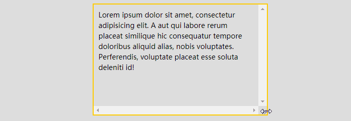
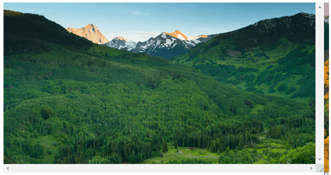
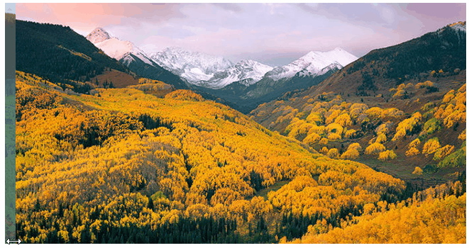

## 思路

首先，要实现这样一个效果如果不要求可以拖拽，其实有非常多的办法。

1. 将两张图片叠加在一起
2. 改变上层图片的宽度，或者使用 mask， 改变 mask 的透明度区间变化

两种方式都简单示意一下。

假设我们的结构如下，分别使用 `background` 展示两张图片：

```html
<div class="g-outer">
    <div class="g-inner"></div>
</div>
```


方法一，改变上层图片的宽度的方式：

```css
.g-outer {
    width: 650px;
    height: 340px;
    background-image: url(image1.png);
    overflow: hidden;
}
.g-inner {
    height: 340px;
    background: url(image2.png);
    animation: widthchange 3s infinite alternate linear;
}
@keyframes widthchange {
    0% {
        width: 650px;
    }
    100% {
        width: 0px;
    }
}
```


效果如下：

[](https://user-images.githubusercontent.com/8554143/129582629-9919a138-8e70-44e2-818e-c70a06503fff.gif)

当然，使用 `mask` 遮罩的方式也非常轻松的可以实现类似的效果：

```css
.g-outer {
    background-image: url(https://images.cnblogs.com/cnblogs_com/coco1s/881614/o_21081614180122.png);
}
.g-inner {
    background: url(https://images.cnblogs.com/cnblogs_com/coco1s/881614/o_21081614175811.png);
    mask: linear-gradient(90deg, #fff 0%, #fff 50%, transparent 50%, transparent 100%);
    mask-size: 200% 100%;
    animation: maskChange 2s infinite alternate linear;
}
@keyframes maskChange {
    0% {
        mask-position: -100% 0;
    }
    100% {
        mask-position: 0 0;
    }
}
```


<iframe height="300" style="width: 100%;" scrolling="no" title="Switch Picture" src="https://codepen.io/mafqla/embed/poYmePX?default-tab=html%2Cresult&editable=true&theme-id=light" frameborder="no" loading="lazy" allowtransparency="true" allowfullscreen="true">
  See the Pen <a href="https://codepen.io/mafqla/pen/poYmePX">
  Switch Picture</a> by mafqla (<a href="https://codepen.io/mafqla">@mafqla</a>)
  on <a href="https://codepen.io">CodePen</a>.
</iframe>


## 使用 resize 实现拖拽功能

下一步则是最核心，最关键的一步，巧妙的使用 CSS `resize` 属性，实现拖拽控制元素的宽度。

### 什么是 `resize` ？

`resize`：该属性允许你控制一个元素的大小

语法如下：

```css
{
/* Keyword values */
  resize: none;
  resize: both;
  resize: horizontal;
  resize: vertical;
  resize: block;
  resize: inline;
}
```


看一个最简单的 DEMO：

```html
<p>Lorem ipsum dolor sit amet, consectetur adipisicing elit. A aut qui labore rerum placeat similique hic consequatur tempore doloribus aliquid alias, nobis voluptates. Perferendis, voluptate placeat esse soluta deleniti id!</p>
```


```css
p {
    width: 200px;
    height: 200px;
    resize: horizontal;
    overflow: scroll;
}
```


这里，我们设置了一个长宽为 `200px` 的 `<p>` 为横向可拖拽改变宽度。效果如下：

[](https://user-images.githubusercontent.com/8554143/129585745-d004bbf8-5760-44ab-b4a2-65cbae64ab27.gif)

简单总结一些小技巧：

- `resize` 的生效，需要配合 `overflow: scroll`，当然，准确的说法是，`overflow` 不是 `visible`，或者可以直接作用于替换元素譬如图像、`<video>` 及 `<iframe>`、`<textarea>` 等
- 我们可以通过 `resize` 的 `horizontal`、`vertical`、`both` 来设置横向拖动、纵向拖动、横向纵向皆可拖动。
- 可以配合容器的 `max-width`、`min-width`、`max-height`、`min-height` 限制可拖拽改变的一个范围

### 将 resize 运用于图片拖拽切换

OK，接下来，我们将 resize 运用于图片拖拽切换。

首先，还是上述的代码，我们将 resize 作用于子元素试试：

```html
<div class="g-outer">
    <div class="g-inner width-change"></div>
</div>
```


```css
.g-outer {
    width: 650px;
    height: 340px;
    background-image: url(image1.png);
    overflow: hidden;
}

.g-inner {
    height: 340px;
    background: url(image2.png);
    resize: horizontal;
    overflow: scroll;
    max-width: 640px;
    min-width: 10px;
}
```


可以看到，`g-inner` 设置了 `resize: horizontal`，将允许被横向拖动，实际的效果如下：

[](https://user-images.githubusercontent.com/8554143/129587044-c6977b4d-0c8a-475a-a3df-91dd4ea63007.gif)

嗯，非常接近了，因为需要配合 `overflow: scroll`，所以出现了恼人的滚动条，非常的不美观，我们得想办法干掉滚动条。

### 借助多一层嵌套及绝对定位实现隐藏滚动条

隐藏滚动条的方式有很多，这里我们介绍其中一种巧妙的方式，我们对我们的结构进行一下改造，再叠加多一层 div：

```html
<div class="g-outer">
    <div class="g-inner">
        <div class="g-resize"></div>
    </div>
</div>
```


我们将控制拖拽这个功能交给 `g-resize`，它负责改变元素的宽度，而 `g-inner` 改为绝对定位，当 `g-resize` 的宽度增大时，其父元素 `g-inner` 也会随之增大，最后设置 `g-resize` 的 `opacity` 为 0 即可隐藏滚动条。

核心代码如下：

```css
.g-outer {
    position: relative;
    width: 650px;
    height: 340px;
    background-image: url(image1.png);
    overflow: hidden;
}
.g-inner {
    position: absolute;
    top: 0;
    left: 0;
    min-width: 0;
    max-width: 650px;
    height: 340px;
    background-image: url(image2.png);
}
.g-resize {
    position: relative;
    resize: horizontal;
    overflow: scroll;
    width: 0;
    height: 340px;
    max-width: 650px;
    min-width: 15px;
    animation: opacityChange 3s infinite alternate linear;
}
@keyframes opacityChange {
    0% {
        opacity: 0;
    }
    100% {
        opacity: 1;
    }
}
```


这里，为了方便示意，我将 `opacity` 设置了一个渐隐渐现的动画效果，方便示意：

[](https://user-images.githubusercontent.com/8554143/129590484-f7730867-3627-4209-b06d-7e394884fa92.gif)

### 借助伪元素，显示拖拽条

最后一步，由于完全隐藏了滚动条，用户也就不知道可以拖拽了，所以我们还需要绘制一个更为好看的拖拽条，这里延续上述的布局，给 `.g-inner` 再添加一个伪元素，绝对定位在元素最后即可：

```css
.g-inner:before {
    content: "↔";
    position: absolute;
    background: rgba(0, 0, 0, 0.5);
    top: 0;
    right: 0;
    height: 100%;
    line-height: 340px;
}
```


最终完美达成效果：

<iframe height="300" style="width: 100%;" scrolling="no" title="PURE CSS SWITCH PIUTURE" src="https://codepen.io/mafqla/embed/GReaWEd?default-tab=html%2Cresult&editable=true&theme-id=light" frameborder="no" loading="lazy" allowtransparency="true" allowfullscreen="true">
  See the Pen <a href="https://codepen.io/mafqla/pen/GReaWEd">
  PURE CSS SWITCH PIUTURE</a> by mafqla (<a href="https://codepen.io/mafqla">@mafqla</a>)
  on <a href="https://codepen.io">CodePen</a>.
</iframe>

