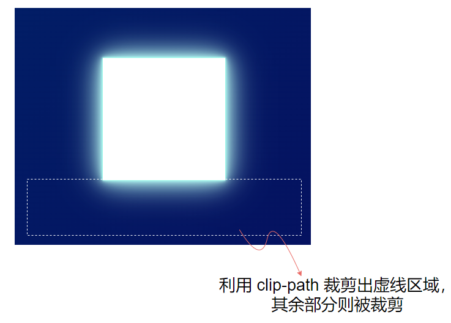

## 实现

这个效果想利用 CSS 完全复制是比较困难的。CSS 模拟出来的光效阴影相对会 Low 一点，只能说是尽量还原。

其实每组光都基本是一样的，所以我们只需要实现其中一组，就几乎能实现了整个效果。

观察这个效果：

[](https://user-images.githubusercontent.com/8554143/141610390-280ebf12-4ce8-426b-865f-586df4789361.png)

它的核心其实就是**角向渐变** -- `conic-gradient()`，利用角向渐变，我们可以大致实现这样一个效果：

```html
<div></div>
```


```css
div {
    width: 1000px;
    height: 600px;
    background:
        conic-gradient(
            from -45deg at 400px 300px,
            hsla(170deg, 100%, 70%, .7),
            transparent 50%,
            transparent),
            linear-gradient(-45deg, #060d5e, #002268);
}
```


看看效果：

[](https://user-images.githubusercontent.com/8554143/141610538-fd6acd08-f90c-4c03-a65b-8e0b5c8cf4f6.png)

有点那意思了。当然，仔细观察，渐变的颜色并非是由一种颜色到透明就结束了，而是颜色 A -- 透明 -- 颜色 B，这样，光源的另一半并非就不会那么生硬，改造后的 CSS 代码：

```css
div {
    width: 1000px;
    height: 600px;
    background:
        conic-gradient(
            from -45deg at 400px 300px,
            hsla(170deg, 100%, 70%, .7),
            transparent 50%,
            hsla(219deg, 90%, 80%, .5) 100%),
            linear-gradient(-45deg, #060d5e, #002268);
}
```


我们在角向渐变的最后多加了一种颜色，得到观感更好的一种效果：

[](https://user-images.githubusercontent.com/8554143/141610609-d05a86d2-fe89-4e3d-8e96-2e749ce1fbbb.png)

emm，到这里，我们会发现，仅仅是**角向渐变** `conic-gradient()` 是不够的，它无法模拟出光源阴影的效果，所以必须再借助其他属性实现光源阴影的效果。

这里，我们会很自然的想到 `box-shadow`。这里有个技巧，利用多重 `box-shadow`， 实现 Neon 灯的效果。

我们再加个 div，通过它实现光源阴影：

```html
<div class="shadow"></div>
```


```css
.shadow {
    width: 200px;
    height: 200px;
    background: #fff;
    box-shadow: 
        0px 0 .5px hsla(170deg, 95%, 80%, 1),
        0px 0 1px hsla(170deg, 91%, 80%, .95),
        0px 0 2px hsla(171deg, 91%, 80%, .95),
        0px 0 3px hsla(171deg, 91%, 80%, .95),
        0px 0 4px hsla(171deg, 91%, 82%, .9),
        0px 0 5px hsla(172deg, 91%, 82%, .9),
        0px 0 10px hsla(173deg, 91%, 84%, .9),
        0px 0 20px hsla(174deg, 91%, 86%, .85),
        0px 0 40px hsla(175deg, 91%, 86%, .85),
        0px 0 60px hsla(175deg, 91%, 86%, .85);
}
```


[](https://user-images.githubusercontent.com/8554143/141610800-e69f8366-cb3b-49ca-9bd1-d23f7e72f092.png)

OK，光是有了，但问题是我们只需要一侧的光，怎么办呢？裁剪的方式很多，这里，我介绍一种利用 `clip-path` 进行对元素任意空间进行裁切的方法：

```css
.shadow {
    width: 200px;
    height: 200px;
    background: #fff;
    box-shadow: .....;
    clip-path: polygon(-100% 100%, 200% 100%, 200% 500%, -100% 500%);
}
```


原理是这样的：

[](https://user-images.githubusercontent.com/8554143/141611122-fc3c2e5b-695b-4af8-9966-a756727e3238.png)

这样，我们就得到了一侧的光：

[](https://user-images.githubusercontent.com/8554143/141610945-dbb69dba-b03e-4414-9b8b-6587270c31bf.png)


接下来，就是**利用定位、旋转**等方式，将上述单侧光和角向渐变重叠起来，我们就可以得到这样的效果：

[](https://user-images.githubusercontent.com/8554143/141611173-5396a182-9b4c-49e1-b3fc-96e3ba9a86af.png)

这会，已经挺像了。接下来要做的就是让整个图案，动起来。这里技巧也挺多的，核心还是利用了 CSS [@Property](https://github.com/Property)，实现了角向渐变的动画，并且让光动画和角向渐变重叠起来。

我们需要利用 CSS [@Property](https://github.com/Property) 对代码渐变进行改造，核心代码如下：

```html
<div class="wrap">
    <div class="shadow"></div>
</div>
```


```css
@property --xPoint {
  syntax: '<length>';
  inherits: false;
  initial-value: 400px;
}
@property --yPoint {
  syntax: '<length>';
  inherits: false;
  initial-value: 300px;
}

.wrap {
    position: relative;
    margin: auto;
    width: 1000px;
    height: 600px;
    background:
        conic-gradient(
            from -45deg at var(--xPoint) var(--yPoint),
            hsla(170deg, 100%, 70%, .7),
            transparent 50%,
            hsla(219deg, 90%, 80%, .5) 100%),
            linear-gradient(-45deg, #060d5e, #002268);
    animation: pointMove 2.5s infinite alternate linear;
}

.shadow {
    position: absolute;
    top: -300px;
    left: -330px;
    width: 430px;
    height: 300px;
    background: #fff;
    transform-origin: 100% 100%;
    transform: rotate(225deg);
    clip-path: polygon(-100% 100%, 200% 100%, 200% 500%, -100% 500%);
    box-shadow: ... 此处省略大量阴影代码;
    animation: scale 2.5s infinite alternate linear;
}
 
@keyframes scale {
    50%,
    100% {
        transform: rotate(225deg) scale(0);
    }
}

@keyframes pointMove {
    100% {
        --xPoint: 100px;
        --yPoint: 0;
    }
}
```


这样，我们就实现了完整的一处光的动画：

[](https://user-images.githubusercontent.com/8554143/141611334-3354b102-d736-4462-87a9-91643f67812e.gif)

我们重新梳理一下，实现这样一个动画的步骤：

1. 利用角向渐变 `conic-gradient` 搭出基本框架，并且，这里也利用了多重渐变，角向渐变的背后是深色背景色；
2. 利用多重 `box-shadow` 实现光及阴影的效果（又称为 Neon 效果）
3. 利用 `clip-path` 对元素进行任意区域的裁剪
4. 利用 CSS [@Property](https://github.com/Property) 实现渐变的动画效果

剩下的工作，就是重复上述的步骤，补充其他渐变和光源，调试动画，最终，我们就可以得到这样一个简单的模拟效果：

[](https://user-images.githubusercontent.com/8554143/141610035-3754f606-1574-4681-b4ed-12cace3dacc2.gif)

由于原效果是 `.mp4`，无法拿到其中的准确颜色，无法拿到阴影的参数，其中颜色是直接用的色板取色，阴影则比较随意的模拟了下，如果有源文件，准确参数，可以模拟的更逼真。

<iframe height="300" style="width: 100%;" scrolling="no" title="iPhone 13 Pro Gradient" src="https://codepen.io/mafqla/embed/GReVLjN?default-tab=html%2Cresult&editable=true&theme-id=light" frameborder="no" loading="lazy" allowtransparency="true" allowfullscreen="true">
  See the Pen <a href="https://codepen.io/mafqla/pen/GReVLjN">
  iPhone 13 Pro Gradient</a> by mafqla (<a href="https://codepen.io/mafqla">@mafqla</a>)
  on <a href="https://codepen.io">CodePen</a>.
</iframe>

