## 矩形与圆角按钮

正常而言，我们遇到的按钮就这两种 -- 矩形和圆角：

[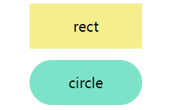](https://user-images.githubusercontent.com/8554143/142719125-5e33f52b-fc68-4117-a958-1aa252dc5e00.png)

它们非常的简单，宽高和圆角和背景色。

```html
<div class="btn rect">rect</div>
<div class="btn circle">circle</div>
```

```css
.btn {
  margin: 8px auto;
  flex-shrink: 0;
  width: 160px;
  height: 64px;
}
.rect {
  background: #f6ed8d;
}

.circle {
  border-radius: 64px;
  background: #7de3c8;
}
```

## 梯形与平行四边形

接下来，基于矩形的变形，经常会出现**梯形与平行四边形**的按钮。

实现它们主要使用 `transform` 即可，但是要注意一点，使用了 `transform` 之后，标签内的文字也会同样的变形，所以，我们通常使用元素的伪元素去实现造型，这样可以做到不影响按钮内的文字。

### 平行四边形

使用 `transform: skewX()` 即可，注意上述说的，利用元素的伪元素实现平行四边形，做到不影响内部的文字。

```html
<div class="btn parallelogram">Parallelogram</div>
```

```scss
.parallelogram {
  position: relative;
  width: 160px;
  height: 64px;

  &::before {
    content: '';
    position: absolute;
    top: 0;
    left: 0;
    bottom: 0;
    right: 0;
    background: #03f463;
    transform: skewX(15deg);
  }
}
```

[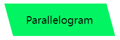](https://user-images.githubusercontent.com/8554143/142719342-d63230e1-166a-4e83-8187-be759f4497d1.png)

如果不想使用伪元素，除了 `transform: skewX()`，平行四边形使用渐变也是可以实现的。

大概就是这样：

```css
 {
  background: linear-gradient(
    45deg,
    transparent 22%,
    #04e6fb 22%,
    #9006fb 78%,
    transparent 0
  );
}
```

### 梯形

梯形比平行四边形稍微复杂一点，它多借助了 `perspective`，其实是利用了一定的 3D 变换。原理就是一个矩形，绕着 X 轴旋转，像是这样：

[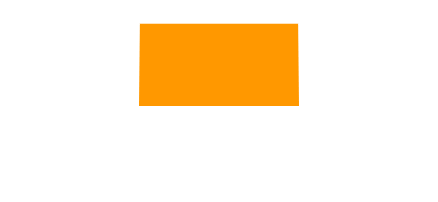](https://user-images.githubusercontent.com/8554143/142719470-cb6f723a-cde7-4321-8eae-996395491323.gif)

使用 `perspective` 和 `transform: rotateX()` 即可，当然，它们可以合在一起写：

```html
<div class="btn trapezoid">Trapezoid</div>
```

```scss
.parallelogram {
  position: relative;
  width: 160px;
  height: 64px;

  &::after {
    content: '';
    position: absolute;
    top: 0;
    right: 0;
    bottom: 0;
    left: 0;
    transform: perspective(40px) rotateX(10deg);
    transform-origin: bottom;
    background: #ff9800;
  }
}
```

[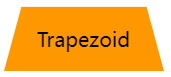](https://user-images.githubusercontent.com/8554143/142719494-d8603f2b-e535-4ddc-a85f-9f52b9042ab8.png)

## 切角 -- 纯色背景与渐变色背景

接下来是切角图形，最常见的方法主要是借助渐变 `linear-gradient` 实现，来看这样一个图形

```html
<div></div>
```

```css
.notching {
  background: linear-gradient(135deg, transparent 10px, #ff1493 0);
  background-repeat: no-repeat;
}
```

结果如下，

[](https://user-images.githubusercontent.com/8554143/142719594-cdce4273-6a4c-48d1-8122-cf1ed9200fd0.png)

基于此，我们只需要利用多重渐变，实现 4 个这样的图形即可，并且，利用 `background-position` 定位到四个角：

```html
<div class="notching">notching</div>
```

```css
.notching {
  background: linear-gradient(135deg, transparent 10px, #ff1493 0) top left, linear-gradient(
        -135deg,
        transparent 10px,
        #ff1493 0
      ) top right,
    linear-gradient(-45deg, transparent 10px, #ff1493 0) bottom right, linear-gradient(
        45deg,
        transparent 10px,
        #ff1493 0
      ) bottom left;
  background-size: 50% 50%;
  background-repeat: no-repeat;
}
```

[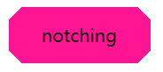](https://user-images.githubusercontent.com/8554143/142719656-342f03d5-509b-445c-b456-27126c9202fc.png)

### 利用 clip-path 实现渐变背景的切角图形

当然，这个技巧有个问题，当要求底色是渐变色的时候，这个方法就比较笨拙了。

好在，我们还有另外一种方式，借助 `clip-path` 切出一个切角图形，这样，背景色可以是任意定制的颜色，无论是渐变还是纯色都不在话下：

```html
<div class="clip-notching">notching</div>
```

```scss
.clip-notching {
  background: linear-gradient(45deg, #f9d9e7, #ff1493);
  clip-path: polygon(
    15px 0,
    calc(100% - 15px) 0,
    100% 15px,
    100% calc(100% - 15px),
    calc(100% - 15px) 100%,
    15px 100%,
    0 calc(100% - 15px),
    0 15px
  );
}
```

简单的实现一个渐变背景，接着核心就是，在渐变矩形图形的基础上，利用 `clip-path: polygon()` 切出我们想要的形状（一个 8 边形）：

[](https://user-images.githubusercontent.com/8554143/142719746-5dad4f13-2248-49c0-9161-b1181babcbf9.png)

当然，上述代码非常容易联想到下述这种 6 边形，使用渐变和 `clip-path` 都可以轻松得到：

[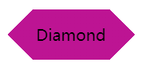](https://user-images.githubusercontent.com/8554143/142732457-06c39b9b-4fc1-40bf-82bc-9ffe8eefc0f9.png)

## 箭头按钮

接下来是箭头按钮，仔细观察上面的切角按钮，当两边的角被切掉的足够多的时候，就变成了一个箭头的形状。

我们可以利用两重渐变，实现一个单箭头按钮：

```html
<div class="arrow">arrow</div>
```

```scss
&.arrow {
  background: linear-gradient(
        -135deg,
        transparent 22px,
        #04e6fb 22px,
        #65ff9a 100%
      ) top right, linear-gradient(
        -45deg,
        transparent 22px,
        #04e6fb 22px,
        #65ff9a 100%
      ) bottom right;
  background-size: 100% 50%;
  background-repeat: no-repeat;
}
```

一个箭头就出来了：

[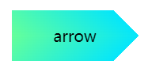](https://user-images.githubusercontent.com/8554143/142719915-4e1741dd-e093-4ed8-9662-0336daada106.png)

它是由上下两个渐变块组合得到的，换个颜色立马就能明白：

[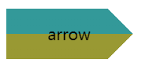](https://user-images.githubusercontent.com/8554143/142719978-5d01a043-7aa8-4715-a731-d25ec6a314cc.png)

那如果是这样一个箭头造型呢？

[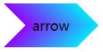](https://user-images.githubusercontent.com/8554143/142720100-c3bd8d97-5e17-4251-bcbc-fcacb1fa949f.png)

一样的，它也是两个渐变的叠加，渐变的颜色是**透明 --> 颜色 A --> 颜色 B --> 透明**。当然，同样在这里也可以使用 `clip-path`：

这里给出 `clip-path` 的解法：

```css
 {
  background: linear-gradient(45deg, #04e6fb, #65ff9a);
  clip-path: polygon(
    0 0,
    30px 50%,
    0 100%,
    calc(100% - 30px) 100%,
    100% 50%,
    calc(100% - 30px) 0
  );
}
```

## 内切圆角

下面这个按钮形状，多出现于优惠券，最常见的解法，也是使用渐变，当然，与切角不同，这里使用的径向渐变。

首先，看这样一个简单的例子：

```html
<div></div>
```

```css
div {
  background-image: radial-gradient(
    circle at 100% 100%,
    transparent 0,
    transparent 12px,
    #2179f5 12px
  );
}
```

可以得到这样一个图形：

[](https://user-images.githubusercontent.com/8554143/142732698-27c3c8b7-e536-4697-8832-5fe069253752.png)

所以，只需控制下 `background-size`，在 4 个角实现 4 个这样的图形即可：

```html
<div class="inset-circle">inset-circle</div>
```

```scss
&.inset-circle {
  background-size: 70% 70%;
  background-image: radial-gradient(
      circle at 100% 100%,
      transparent 0,
      transparent 12px,
      #2179f5 13px
    ), radial-gradient(
      circle at 0 0,
      transparent 0,
      transparent 12px,
      #2179f5 13px
    ), radial-gradient(
      circle at 100% 0,
      transparent 0,
      transparent 12px,
      #2179f5 13px
    ), radial-gradient(circle at 0 100%, transparent 0, transparent 12px, #2179f5
        13px);
  background-repeat: no-repeat;
  background-position: right bottom, left top, right top, left bottom;
}
```

[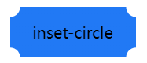](https://user-images.githubusercontent.com/8554143/142732720-56a4bad7-b2ba-4786-9dc3-4c5e790e9bca.png)

### 借助 mask 实现渐变的内切圆角按钮

如果背景色要求渐变怎么办呢？

假设我们有一张矩形背景图案，我们只需要使用 `mask` 实现一层遮罩，利用 `mask` 的特性，把 4 个角给遮住即可。

`mask` 的代码和上述的圆角切角代码非常类似，简单改造下即可得到渐变的内切圆角按钮：

```html
<div class="mask-inset-circle">inset-circle</div>
```

```scss
.mask-inset-circle {
  background: linear-gradient(45deg, #2179f5, #e91e63);
  mask: radial-gradient(
      circle at 100% 100%,
      transparent 0,
      transparent 12px,
      #2179f5 13px
    ), radial-gradient(
      circle at 0 0,
      transparent 0,
      transparent 12px,
      #2179f5 13px
    ), radial-gradient(
      circle at 100% 0,
      transparent 0,
      transparent 12px,
      #2179f5 13px
    ), radial-gradient(circle at 0 100%, transparent 0, transparent 12px, #2179f5
        13px);
  mask-repeat: no-repeat;
  mask-position: right bottom, left top, right top, left bottom;
  mask-size: 70% 70%;
}
```

这样，我们就得到了这样一个图形：

[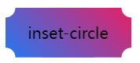](https://user-images.githubusercontent.com/8554143/142732828-9edb0483-8812-4e88-be94-5acec2db9a07.png)

## 圆角不规则矩形

下面这个按钮形状，也是最近被问到最多的，先来看看它的造型：

[](https://user-images.githubusercontent.com/8554143/142733070-cb9ae24c-0567-4b81-b15c-75c8846b0ff8.png)

不太好给它起名，一侧是规则的带圆角直角，另外一侧则是带圆角的斜边。

其实，它就是由**圆角矩形** + **圆角平行四边形组成**：

[](https://user-images.githubusercontent.com/8554143/142733206-198bead7-be29-44ea-a12e-d9f73d5cf4b2.gif)

所以，借助两个伪元素，可以轻松的实现它们：

```html
<div class="skew">Skew</div>
```

```scss
.skew {
  position: relative;
  width: 120px;

  &::after {
    content: '';
    position: absolute;
    top: 0;
    left: 0;
    right: 0;
    bottom: 0;
    border-radius: 10px;
    background: orange;
    transform: skewX(15deg);
  }
  &::before {
    content: '';
    position: absolute;
    top: 0;
    right: -13px;
    width: 100px;
    height: 64px;
    border-radius: 10px;
    background: orange;
  }
}
```

[](https://user-images.githubusercontent.com/8554143/142733265-dc126911-18cf-4f4e-bdee-6dc26c37802b.png)

由于一个伪元素叠加在另外一个之上，所以对其中一个使用渐变，一个则是纯色，其颜色是可以完美衔接在一起的，这样就实现了渐变色的该图形：

[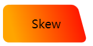](https://user-images.githubusercontent.com/8554143/142733298-f7f55e3b-3640-4114-b154-f751391b7753.png)

## 外圆角按钮

接下来这个按钮形状，常见于 Tab 页上，类似于 Chrome 的分页：

[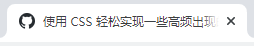](https://user-images.githubusercontent.com/8554143/142733913-c5f9b300-7730-4d43-8ae8-131b576f8fdf.png)

我们对这个按钮形状拆解一下，这里其实是 3 块的叠加：

[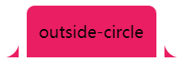](https://user-images.githubusercontent.com/8554143/142733971-cd760cf6-e315-4c50-8b58-b3338fddbb78.png)

只需要想清楚如何实现两侧的弧形三角即可。这里还是借助了渐变 -- **径向渐变**，其实他是这样，如下图所示，我们只需要把黑色部分替换为透明即可，使用两个伪元素即可：

[](https://user-images.githubusercontent.com/8554143/142734032-2f71e5f4-72a0-47fc-9260-67af78875a6e.png)

代码如下：

```html
<div class="outside-circle">outside-circle</div>
```

```scss
.outside-circle {
  position: relative;
  background: #e91e63;
  border-radius: 10px 10px 0 0;

  &::before {
    content: '';
    position: absolute;
    width: 20px;
    height: 20px;
    left: -20px;
    bottom: 0;
    background: #000;
    background: radial-gradient(circle at 0 0, transparent 20px, #e91e63 21px);
  }
  &::after {
    content: '';
    position: absolute;
    width: 20px;
    height: 20px;
    right: -20px;
    bottom: 0;
    background: #000;
    background: radial-gradient(
      circle at 100% 0,
      transparent 20px,
      #e91e63 21px
    );
  }
}
```

即可得到：

[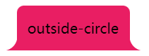](https://user-images.githubusercontent.com/8554143/142734069-7d61c44e-e383-4a33-ac91-ab23766ff5ed.png)

上述的所有图形的完整代码，你可以在这里看到：

<iframe height="300" style="width: 100%;" scrolling="no" title="CSS Various Button Shapes | CSS 各种造型按钮" src="https://codepen.io/mafqla/embed/XWGvQjO?default-tab=html%2Cresult&editable=true&theme-id=light" frameborder="no" loading="lazy" allowtransparency="true" allowfullscreen="true">
  See the Pen <a href="https://codepen.io/mafqla/pen/XWGvQjO">
  CSS Various Button Shapes | CSS 各种造型按钮</a> by mafqla (<a href="https://codepen.io/mafqla">@mafqla</a>)
  on <a href="https://codepen.io">CodePen</a>.
</iframe>
