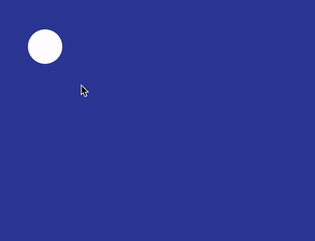
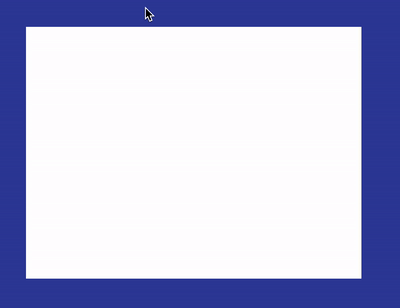
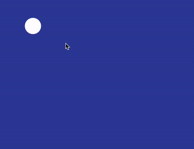

## 如何实现这样一个类似的效果？

首先，想一想，如果让你去实现上面的效果，你会怎么做呢？

这里我简单罗列一些可能的办法：

1. 阴影 box-shadow
2. 渐变 radial-gradient
3. 缩放 transform: scale()

快速的一个一个过一下。

### 使用 box-shadow 实现

如果使用 `box-shadow`，代码大致如下：

```html
<div class="g-container">
  <div class="g-item"></div>
</div>
```

```css
.g-container {
  position: relative;
  width: 400px;
  height: 300px;
  overflow: hidden;
}

.g-item {
  position: absolute;
  width: 48px;
  height: 48px;
  border-radius: 50%;
  background: #fff;
  top: 20px;
  left: 20px;
  box-shadow: 0 0 0 0 #fff;
  transition: box-shadow 0.3s linear;

  &:hover {
    box-shadow: 0 0 0 420px #fff;
  }
}
```

核心就在于：

1. 外层一个设置了 `overflow: hideen` 的遮罩
2. 内层元素 hover 的时候，实现一个 `box-shadow: 0 0 0 0 #fff` 到 `box-shadow: 0 0 0 420px #fff` 的变化

效果如下：

[](https://user-images.githubusercontent.com/8554143/142867358-3bf0594b-7f69-4b78-929f-46fafe4bcead.gif)

整体的动画是模拟出来了，但是它最致命的问题有两个：

1. 当我们的鼠标离开圆形的时候，整个动画就开始反向进行了，白色区域开始消失，如果我们要进行按钮操作，是无法完成的
2. 隐藏在动画展开后的矩形内的元素，不容易放置

所以，`box-shadow` 看着虽好，但是只能放弃。

### 使用渐变 radial-gradient 实现

下面我们使用径向渐变 `radial-gradient` 加上 CSS [@Property](https://github.com/Property)，也可以还原上述效果：

```html
<div class="g-container"></div>
```

```scss
@property --size {
  syntax: '<length>';
  inherits: false;
  initial-value: 24px;
}

.g-container {
  position: relative;
  width: 400px;
  height: 300px;
  overflow: hidden;
  background: radial-gradient(
    circle at 44px 44px,
    #fff 0,
    #fff var(--size),
    transparent var(--size),
    transparent 0
  );
  transition: --size 0.3s linear;

  &:hover {
    --size: 450px;
  }
}
```

我们通过控制径向渐变的动画效果，在 hover 的时候，让原本只是一个小圆背景，变成一个大圆背景，效果如下：

[](https://user-images.githubusercontent.com/8554143/142868467-65bf4358-b41f-46d3-9e54-1d7889b7a5b8.gif)

emmm，效果确实是还原了，问题也很致命：

1. 由于是背景的变化，所以鼠标不需要 hover 到小圆上，只需要进入 div 的范围，动画就会开始，这显然是不对的
2. 和第一种 `box-shadow` 的方法类似，隐藏在白色之下的导航元素的 DOM 不好放置

emmm，还有一种方法，通过缩放 `transform: scale()`，也会存一定问题，这里不继续展开。

所以到这里，想实现上述的效果，核心在于：

1. 鼠标要 hover 到圆上，才能开始动画，并且，鼠标可以在展开后的范围内自由移动，且不会收回动画效果
2. 动画展开后，里面的 DOM 的放置，不能太麻烦，能不借助 Javascript 去控制里面内容的显示隐藏最好

## 利用 clip-path 实现动态区域裁剪

所以，这里，我们其实是需要一个**动态的区域裁剪**。

利用 `clip-path`，可以非常好的实现，动态裁剪的功能，并且，代码也非常简单：

```html
<div class="g-container"></div>
```

```scss
.g-container {
  position: relative;
  width: 400px;
  height: 300px;
  overflow: hidden;
  transition: clip-path 0.3s linear;
  clip-path: circle(20px at 44px 44px);
  background: #fff;

  &:hover {
    clip-path: circle(460px at 44px 44px);
  }
}
```

我们只需要利用 `clip-path`，在最开始的时候，将一个矩形 div，利用 `clip-path: circle(20px at 44px 44px)` 裁剪成一个圆，当 hover 的时候，扩大裁剪圆的半径到整个矩形范围即可。

效果如下：

[](https://user-images.githubusercontent.com/8554143/142870082-77b867e4-e2f2-4441-9c5d-5676880c2b4b.gif)

这样，我们就能完美的实现题图的效果，并且，内置的 DOM 元素，直接写进这个 div 内部即可。

```html
<div class="g-container">
  <ul>
    <li>11111</li>
    <li>22222</li>
    <li>33333</li>
    <li>44444</li>
  </ul>
</div>
```

效果如下：

<iframe height="300" style="width: 100%;" scrolling="no" title="clip-path zoom in animation" src="https://codepen.io/mafqla/embed/BabXEWd?default-tab=html%2Cresult&editable=true&theme-id=light" frameborder="no" loading="lazy" allowtransparency="true" allowfullscreen="true">
  See the Pen <a href="https://codepen.io/mafqla/pen/BabXEWd">
  clip-path zoom in animation</a> by mafqla (<a href="https://codepen.io/mafqla">@mafqla</a>)
  on <a href="https://codepen.io">CodePen</a>.
</iframe>
