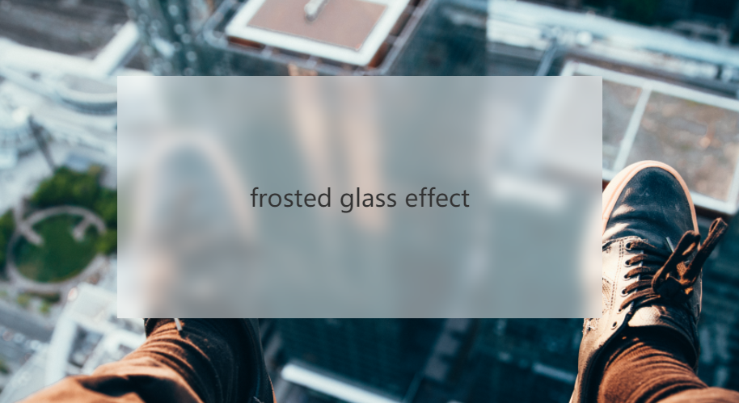
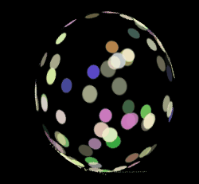

## `filter` VS `backdrop-filter`

在 CSS 中，有两个和滤镜相关的属性 -- `filter` 和 `backdrop-filter`。

> [backdrop-filter](https://drafts.fxtf.org/filter-effects-2/#BackdropFilterProperty) 是更为新的规范推出的新属性，可以点击查看 Filter Effects Module Level 2。

- `filter`：该属性将模糊或颜色偏移等图形效果应用于元素。
- `backdrop-filter`： 该属性可以让你为一个元素后面区域添加图形效果（如模糊或颜色偏移）。 它适用于元素背后的所有元素，为了看到效果，必须使元素或其背景至少部分透明。

注意两者之间的差异，`filter` 是作用于元素本身，而 `backdrop-filter` 是作用于元素背后的区域所覆盖的所有元素。

它们所支持的滤镜种类：

|             | filter | backdrop-filter | 备注                      |
| ----------- | ------ | --------------- | ------------------------- |
| url         | √      | √               | 获取指向 SVG 过滤器的 URI |
| blur        | √      | √               | 高斯模糊滤镜              |
| brightness  | √      | √               | 图像明亮度的滤镜          |
| contrast    | √      | √               | 图像的对比度滤镜          |
| drop-shadow | √      | √               | 图像的阴影滤镜            |
| grayscale   | √      | √               | 图像灰度滤镜              |
| hue-rotate  | √      | √               | 图像色相滤镜              |
| invert      | √      | √               | 反转滤镜                  |
| opacity     | √      | √               | 透明度滤镜                |
| sepia       | √      | √               | 深褐色滤镜                |
| saturate    | √      | √               | 图像饱和度滤镜            |

可以看到，两者所支持的滤镜种类是一模一样的。

也就是说，它们必然存在诸多差异，下面就让我们逐一探讨。

## 作用对象的差异

`backdrop-filter` 最常用的功能，就是用于实现毛玻璃效果。

我们通过实现毛玻璃效果来理解 `filter` 和 `backdrop-filter` 使用上的一些差异。

在 `backdrop-filter` 没有诞生前，我们想实现这样一个毛玻璃效果，是比较困难的：

[](https://user-images.githubusercontent.com/8554143/123500228-1b242680-d66f-11eb-8743-14a522730447.png)

有了它，实现毛玻璃效果就非常 Easy 了，看这样一段代码：

```html
<div class="bg">
  <div>Normal</div>
  <div class="g-filter">filter</div>
  <div class="g-backdrop-filter">backdrop-filter</div>
</div>
```

```scss
.bg {
  background: url(image.png);

  & > div {
    width: 300px;
    height: 200px;
    background: rgba(255, 255, 255, 0.7);
  }
  .g-filter {
    filter: blur(6px);
  }
  .g-backdrop-filter {
    backdrop-filter: blur(6px);
  }
}
```

<iframe height="300" style="width: 100%;" scrolling="no" title="filter 与 backdrop-filter 对比" src="https://codepen.io/mafqla/embed/yLrLNMr?default-tab=html%2Cresult&editable=true&theme-id=light" frameborder="no" loading="lazy" allowtransparency="true" allowfullscreen="true">
  See the Pen <a href="https://codepen.io/mafqla/pen/yLrLNMr">
  filter 与 backdrop-filter 对比</a> by mafqla (<a href="https://codepen.io/mafqla">@mafqla</a>)
  on <a href="https://codepen.io">CodePen</a>.
</iframe>

`filter` 和 `backdrop-filter` 使用上最明显的差异在于：

- `filter` 作用于当前元素，并且它的后代元素也会继承这个属性
- `backdrop-filter` 作用于元素背后的所有元素

仔细区分理解，一个是**当前元素和它的后代元素**，一个是**元素背后的所有元素**。

理解了这个，就能够明白为什么有了 `filter`，还会有 `backdrop-filter`。

## 效果上的差异

下面来看一些实际使用上，效果的差异。

譬如，我们想实现这样一个图片的蒙版 Hover 效果：

[](https://user-images.githubusercontent.com/8554143/140598990-6421640c-4f94-4b0f-a570-bda31102ce2f.gif)

使用 `backdrop-filter` 可以轻松的胜任，因为它就是用于产生蒙版，作用于蒙版背后的元素，其核心伪代码如下：

```html
<div></div>
```

```css
div {
  position: relative;
  background: url(https://www.wptunnel.com/wp-content/uploads/2021/07/wptunnel-hd-beautiful-wallpaper-4.jpg);
}

div::before {
  content: '';
  position: absolute;
  top: 0;
  left: 0;
  bottom: 0;
  right: 0;
  backdrop-filter: grayscale(100%);
  transition: 0.3s transform;
}

div:hover::before {
  transform: translate(100%, 0);
}
```

思考如果使用 `filter`，如何实现上述的效果呢？比较麻烦，因为 `filter` 是作用于元素上的，所以，它只能是实现类似于这样的 Hover 效果：

<iframe height="300" style="width: 100%;" scrolling="no" title="filter VS backdrop-filter" src="https://codepen.io/mafqla/embed/zYXYGwG?default-tab=html%2Cresult&editable=true&theme-id=light" frameborder="no" loading="lazy" allowtransparency="true" allowfullscreen="true">
  See the Pen <a href="https://codepen.io/mafqla/pen/zYXYGwG">
  filter VS backdrop-filter</a> by mafqla (<a href="https://codepen.io/mafqla">@mafqla</a>)
  on <a href="https://codepen.io">CodePen</a>.
</iframe>

核心代码：

```css
div {
  filter: grayscale(100%);
  transition: 0.3s filter;
}
div:hover {
  filter: grayscale(0);
}
```

通过这个例子，应该可以更好的理解它们之间的差异。

## 性能的差异

最早想写这篇文章的初衷，是因为认为 `filter` 和 `backdrop-filter` 可能实际存在性能上的差异。

但是随着我使用多个 DEMO 验证， 利用 `filter` 和 `backdrop-filter` 实现相同的动画效果，获取在动画期间的页面的帧率变化。

> 除了 Chrome 自带的页面帧率控制面板，还有一种利用 rAF 近似计算页面帧率的方案，可以戳这里 -- [Web 动画帧率（FPS）计算](https://github.com/chokcoco/cnblogsArticle/issues/17)

实际对比之后，发现其实两者并无多大性能上的差异。（当然，也可能是我的实验不够严谨。欢迎有更为准确的数据的同学指出）。

因此，如果利用 `filter` 和 `backdrop-filter` 都可以实现同一个效果，仅仅是性能这个角度，两者在性能上其实不会有多大差异，二者选其一即可。

## Backdrop Root

接下来这一点很有意思。有必要再好好讲一讲。

当然，这一点 `filter` 和 `backdrop-filter` 都一样，那就是作用了 `filter` 和 `backdrop-filter` 的元素（值不为 `none`），都会生成 `Backdrop Root`。

什么是 `Backdrop Root` 呢？也就是我们常说的，生成了自己的堆叠上下文（Stacking Context）。

我们直接来看，它会造成什么问题：

### 生成了 `Backdrop Root` 的元素会使 CSS 3D 失效

我之前写过一个 3D 球的旋转动画，大概是这样：

<iframe height="300" style="width: 100%;" scrolling="no" title="3D ball" src="https://codepen.io/mafqla/embed/vYMYOmJ?default-tab=html%2Cresult&editable=true&theme-id=light" frameborder="no" loading="lazy" allowtransparency="true" allowfullscreen="true">
  See the Pen <a href="https://codepen.io/mafqla/pen/vYMYOmJ">
  3D ball</a> by mafqla (<a href="https://codepen.io/mafqla">@mafqla</a>)
  on <a href="https://codepen.io">CodePen</a>.
</iframe>

然而，如果我们给上述动画的容器，添加一个 `filter` 或者 `backdrop-filter`：

```css
 {
  filter: blur(1px);
}
```

整个 3D 动画就会坍缩为 2D 动画：



### 作用了 `filter` 和 `backdrop-filter` 的元素会使内部的 fixed 定位失效

另外这个问题也是比较常见的问题。

我们都知道，CSS 中 `position: fixed` 是相对于屏幕视口进行定位的。

然而，作用了 `filter` 和 `backdrop-filter` 的元素的元素会使得其内部的 `position: fixed` 元素不再相对于屏幕视口进行定位，而是相对这个 `Backdrop Root` 元素进行定位，其表现就是 `position: fixed` 定位的元素退化为了 `position: absolute`。

当然，除了 `filter` 和 `backdrop-filter` 之外，在 CSS 中目前一共有 7 种方式可以让元素内部的 `position: fixed` 基于该元素定位：

1. `transform` 属性值不为 none 的元素
2. 设置了 `transform-style`: preserve-3d 的元素
3. `perspective` 值不为 none 的元素
4. 在 `will-change` 中指定了任意 CSS 属性
5. 设置了 `contain: paint`
6. filter 值不为 `none` 的元素
7. backdrop-filter 值不为 `none`的元素
