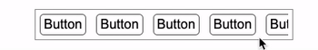
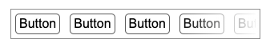
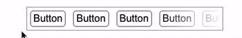
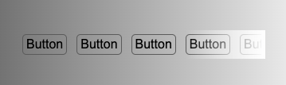
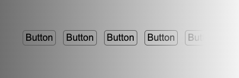

## 渐变配合 pointer-event

第一种方式，比较容易想到。使用渐变配合 `pointer-event` 实现。

简单模拟一下场景，假设我们有如下一个 `ul` 列表，超出可以滚动：

```html
<div class="g-container">
  <ul>
    <li>Button</li>
    <li>Button</li>
    <li>Button</li>
    <li>Button</li>
    <li>Button</li>
    <li>Button</li>
  </ul>
</div>
```

```css
ul {
  width: 300px;
  display: flex;
  flex-wrap: nowrap;
  border: 1px solid #999;
  padding: 5px;
  overflow-x: scroll;
}
```

像是这样：

[](https://user-images.githubusercontent.com/8554143/154478226-dc1ae7db-d8e8-449a-bb76-1b32a3cb23af.gif)

首先，我们需要实现右侧的渐变消失的遮罩效果，这个最常见的，就是通过叠加一个**从透明到白色的**渐变层实现。

这个简单，我们借助元素的伪元素，绝对定位到右侧即可：

```scss
.g-container {
  ... &::before {
    content: '';
    position: absolute;
    right: 0;
    bottom: 0;
    top: 0;
    width: 100px;
    background: linear-gradient(90deg, transparent, #fff);
  }
}
```

效果如下：

[](https://user-images.githubusercontent.com/8554143/154478732-5671a142-69d1-4614-91c1-244c436761b1.png)

这样遮罩就解决了，唯一的问题在于，叠加的这一层，确实遮挡住了其下方的按钮点击：

[](https://user-images.githubusercontent.com/8554143/154479128-eccf2fd6-96d8-4f3d-9c34-74b0311504dd.gif)

这个其实也好解决，只需要给叠加的这一层，添加一个 `pointer-event: none` 即可。

> `pointer-event`：CSS 属性指定在什么情况下 (如果有) 某个特定的图形元素可以成为鼠标事件的 [target](https://developer.mozilla.org/en-US/docs/Web/API/Event/target)。当值为 `none` 时，元素永远不会成为鼠标事件的 target，也就是我们常说的，**实现了鼠标点击穿透**。

代码如下：

```scss
.g-container {
  ... &::before {
    content: '';
    position: absolute;
    right: 0;
    bottom: 0;
    top: 0;
    width: 100px;
    background: linear-gradient(90deg, transparent, #fff);
    pointer-event: none;
  }
}
```

如此一来，就能完美实现此效果，有遮罩，且遮罩不会遮挡住下方内容：

<iframe height="300" style="width: 100%;" scrolling="no" title="Linear Gradient Mask &amp; Pointer-event" src="https://codepen.io/mafqla/embed/GRLpBBQ?default-tab=html%2Cresult&editable=true&theme-id=light" frameborder="no" loading="lazy" allowtransparency="true" allowfullscreen="true">
  See the Pen <a href="https://codepen.io/mafqla/pen/GRLpBBQ">
  Linear Gradient Mask &amp; Pointer-event</a> by mafqla (<a href="https://codepen.io/mafqla">@mafqla</a>)
  on <a href="https://codepen.io">CodePen</a>.
</iframe>

## 使用 mask 实现更完美的遮罩

但是，上述方法不是最完美的。

假设我们的背景，不是纯色，而是渐变色的话，效果会是这样：

[](https://user-images.githubusercontent.com/8554143/154481493-b7033eea-ae71-478c-91e5-272aa5eb89a9.png)

我们希望，内容是真的逐渐消失，而不是通过遮罩遮挡住。所以，我们期待的结果，应该是这样：

[](https://user-images.githubusercontent.com/8554143/154481567-0b9ae31e-c4f9-4651-a29a-9864f332d38e.png)

即便是渐变背景，内容仍然可以逐渐消失。

为了解决解决这个问题，CSS 有一个专门的属性来处理这个问题，也就是 -- mask。

> [`mask`](https://developer.mozilla.org/zh-CN/docs/Web/CSS/mask)：属性允许使用者通过遮罩或者裁切特定区域的图片的方式来隐藏一个元素的部分或者全部可见区域。

使用 `mask` 后，代码非常简单，也不需要 `pointer-event`：

```html
<ul>
  <li>Button</li>
  <li>Button</li>
  <li>Button</li>
  <li>Button</li>
  <li>Button</li>
  <li>Button</li>
</ul>
```

```css
ul {
  width: 300px;
  display: flex;
  flex-wrap: nowrap;
  overflow-x: scroll;
  mask: linear-gradient(90deg, #000 70%, transparent);
}
```

由于不存在遮挡物，也就不再需要 `pointer-event` 了，所有内容都是可以直接点击的：

<iframe height="300" style="width: 100%;" scrolling="no" title="Linear Gradient Mask" src="https://codepen.io/mafqla/embed/WNWQKKL?default-tab=html%2Cresult&editable=true&theme-id=light" frameborder="no" loading="lazy" allowtransparency="true" allowfullscreen="true">
  See the Pen <a href="https://codepen.io/mafqla/pen/WNWQKKL">
  Linear Gradient Mask</a> by mafqla (<a href="https://codepen.io/mafqla">@mafqla</a>)
  on <a href="https://codepen.io">CodePen</a>.
</iframe>
