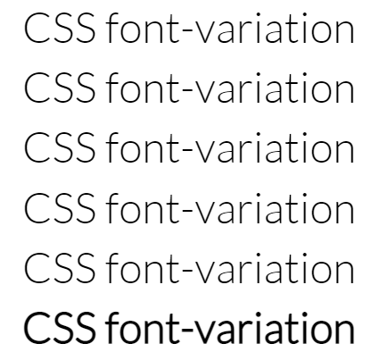
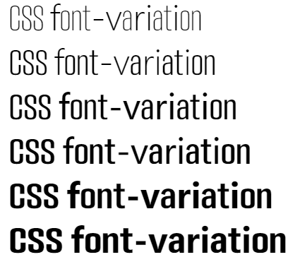
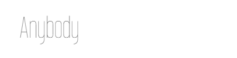
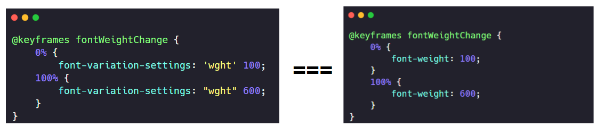
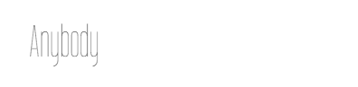
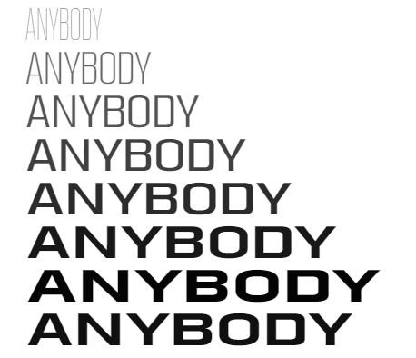
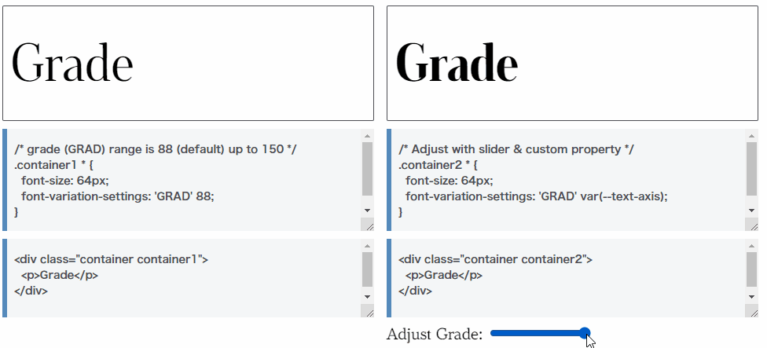

## 什么是 CSS font-variation，可变字体？

根据 [MDN -- Variable fonts](https://developer.mozilla.org/zh-CN/docs/Web/CSS/CSS_Fonts/Variable_Fonts_Guide)，**可变字体**（Variable fonts）是 OpenType 字体规范上的演进，它允许将同一字体的多个变体统合进单独的字体文件中。从而无需再将不同字宽、字重或不同样式的字体分割成不同的字体文件。我们只需通过 CSS 与一行 [@font-face](https://developer.mozilla.org/zh-CN/docs/Web/CSS/@font-face) 引用，即可获取包含在这个单一文件中的各种字体变体。

emm，概念有点难理解，简单解释一下。

与可变字体对应的，是[标准（静态）字体](https://developer.mozilla.org/zh-CN/docs/Web/CSS/CSS_Fonts/Variable_Fonts_Guide#标准（静态）字体)。

**标准（静态）字体就是只代表字体的某一特定的宽度/字重/样式的组合的字体文件**，通常我们在页面引入的字体文件都是这种，只代表这个字体的某一特定的宽度/字重/样式的组合。

而如果我们想引入一个字体家族（譬如 Roboto 字体族），它可能包含了 “Roboto Regular”(常规字重)、“Roboto Bold”（粗体），或是 “Roboto Bold Italic”（粗体+斜体） 等一系列字体文件。这意味着我们可能需要 20 或 30 个不同的字体文件才能算是有了一整个字体家族（对于有着不同宽度的大型字体来说，这个数量还要翻上几倍）。

而可变字体 -- `font-variation`，可以将它理解为 `all in one`，通过使用可变字体，所有字重、字宽、斜体等情况的排列组合都可以被装进一个文件中。当然，这个文件可能比常规的单个字体文件大一些。

### 静态字体的局限性

举个例子，在 [Google Font](https://fonts.google.com/)，我随便选取一个标准静态字体，实现一个字体 `font-weight` 的变化动画：

```html
<p>CSS font-variation</p>
<p>CSS font-variation</p>
<p>CSS font-variation</p>
<p>CSS font-variation</p>
<p>CSS font-variation</p>
<p>CSS font-variation</p>
```

```css
@import url('https://fonts.googleapis.com/css2?family=Lato:wght@300&display=swap');
p {
  font-family: 'Lato', sans-serif;
  font-size: 48px;
}
p:nth-child(1) {
  font-weight: 100;
}
p:nth-child(2) {
  font-weight: 200;
}
p:nth-child(3) {
  font-weight: 300;
}
p:nth-child(4) {
  font-weight: 400;
}
p:nth-child(5) {
  font-weight: 500;
}
p:nth-child(6) {
  font-weight: 600;
}
```

看看结果：

[](https://user-images.githubusercontent.com/8554143/154808828-3310b815-9b64-4ec5-ba38-9e3c5ce410b5.png)

并没有我们想象中的，因为字体粗细从 100 到 600，所以字体依次变粗的情况，一共只有两种字重：

1. 当 `font-weight:` 处于 100 - 500 的时候，其实都是 `font-weight: normal`;
2. 当 `font-weight: 600` 的时候，其实是命中了 `font-weight: bold`。

这个也就是传统静态字体的局限性，单一字体文件中，其实是不会有该字体的所有粗细、字宽的类型的。

### 可变字体的多样性

接下来，我们换上可变字体。

加载可变字体的语法与其他 web 字体非常相似，但有一些显著的差异，这些差异是通过对现代浏览器中可用的传统 [@font-face](https://developer.mozilla.org/zh-CN/docs/Web/CSS/@font-face) 语法的升级提供的。

基本语法是相同的，但是字体技术是不一样的，并且可变字体可以提供像对 `font-weight` 和 `font-stretch` 等描述符的允许范围，而不是根据加载的字体文件来命名。

下面，我们将加载一个支持字体粗细从 `100` 到 `900`，字体伸缩变形支持从 `10%` 到 `400%` 的 `AnyBody` 可变字体。

```css
@font-face {
  font-family: 'Anybody';
  src: url('https://s3-us-west-2.amazonaws.com/s.cdpn.io/61488/ETCAnybodyPB.woff2')
    format('woff2-variations');
  font-display: block;
  font-style: normal italic;
  font-weight: 100 900;
  font-stretch: 10% 400%;
}
p {
  font-family: 'Anybody', sans-serif;
  font-size: 48px;
}
p:nth-child(1) {
  font-weight: 100;
}
// ...
p:nth-child(6) {
  font-weight: 600;
}
```

同样是设定字体粗细从 100 - 600，效果如下：

[](https://user-images.githubusercontent.com/8554143/154809192-b83e46ae-aa43-47a1-8651-49b95a98719f.png)

这一次，可以看到，字体有明显的均匀变化，支持 `font-weight: 100` 到 `font-weight: 600` 的逐渐变化。这儿就是可变字体的魅力。

## 理解 font-variation-settings

除了直接通过 `font-weight` 去控制可变字体的粗细，CSS 还提供了一个新的属性 `font-variation-settings` 去同时控制可变字体的多个属性。

可变字体新格式的核心是**可变轴的概念**，其描述了字体设计中某一特性的允许变化范围。

所有可变字体都有至少有 5 个可以通过 `font-variation-settings` 控制的属性轴，它们属于注册轴（registered），能够映射现有的 CSS 属性或者值。

它们是：

- 字重轴 "wght"：对应 `font-weight`，控制字体的粗细
- 宽度轴 "wdth"：对应 `font-stretch`，控制字体的伸缩
- 斜度轴 "slnt" (slant)：对应字体的 `font-style: oblique + angle`，控制字体的倾斜
- 斜体轴 "ital"：对应字体的 `font-style: italic`，控制字体的倾斜（注意，和 `font-style: oblique` 是不一样的倾斜）
- 光学尺寸轴 "opsz"：对应字体的 `font-optical-sizing`，控制字体的光学尺寸

好吧，可能会有一点点懵，没事，通过一个例子马上就能理解什么意思。

还是利用上述的可变字体，我们利用 `font-variation-settings` 实现一个字体粗细的变化的动画：

```html
<p>Anybody</p>
```

```css
@font-face {
  font-family: 'Anybody';
  src: url('https://s3-us-west-2.amazonaws.com/s.cdpn.io/61488/ETCAnybodyPB.woff2')
    format('woff2-variations');
  font-display: block;
  font-style: normal italic;
  font-weight: 100 900;
  font-stretch: 10% 400%;
}
p {
  font-family: 'Anybody';
  font-size: 48px;
  animation: fontWeightChange 2s infinite alternate linear;
}
@keyframes fontWeightChange {
  0% {
    font-variation-settings: 'wght' 100;
  }
  100% {
    font-variation-settings: 'wght' 600;
  }
}
```

效果如下：

[](https://user-images.githubusercontent.com/8554143/154830511-b024b16a-1bf1-4b2c-95ed-8e5c358a4b5c.gif)

其中，其实可以理解为，利用了 `font-variation-settings: "wght"` 的变化的动画，等同于 `font-weight` 变化动画：

[](https://user-images.githubusercontent.com/8554143/154810286-408cd799-8a3c-4979-88c8-c4624ef4b99b.png)

### 利用 font-variation-settings 进行字体的多个特征同时变化

OK，那么如果既然是一样的效果，为什么还要多此一举搞个 `font-variation-settings` 呢？

那是因为 `font-variation-settings` 除了支持字体的粗细变化外，还支持上述说的注册轴设定的多个样式属性变化，以及**自定义轴**的一些字体样式属性变化。

这次，除了字体粗细外，我们再添加上 `"wdth"` 的变化，也就是字体的伸缩。

```html
<p>Anybody</p>
```

```css
@font-face {
  font-family: 'Anybody';
  src: url('https://s3-us-west-2.amazonaws.com/s.cdpn.io/61488/ETCAnybodyPB.woff2')
    format('woff2-variations');
  font-display: block;
  font-style: normal italic;
  font-weight: 100 900;
  font-stretch: 10% 400%;
}
p {
  font-family: 'Anybody';
  font-size: 48px;
  animation: fontWeightChange 2s infinite alternate linear;
}
@keyframes fontWeightChange {
  0% {
    font-variation-settings: 'wght' 100, 'wdth' 60;
  }
  100% {
    font-variation-settings: 'wght' 600, 'wdth' 400;
  }
}
```

这次，进行的是字体粗细从 100 到 600，字体伸缩从 60% 到 400% 的动画效果，效果如下：

[](https://user-images.githubusercontent.com/8554143/154830535-f31a895b-580f-457f-9ee1-4657948930dc.gif)

也就是说，`font-variation-settings` 是同时支持多个字体样式一起变化的，这一点非常重要。

到这里，其实我们已经可以利用这个实现题图所示的效果了，我们简单改造下，添加多行，再给每行设定一个负的动画延迟即可：

```html
<div class="g-container">
  <ul>
    <li>ANYBODY</li>
    <li>ANYBODY</li>
    <li>ANYBODY</li>
    <li>ANYBODY</li>
    <li>ANYBODY</li>
    <li>ANYBODY</li>
    <li>ANYBODY</li>
    <li>ANYBODY</li>
  </ul>
</div>
```

借助 SCSS 简化下代码，下述代码核心就是给每个 `li`，添加一个相同的动画 `font-variation-settings` 动画，并且依次设置了等差的 `animation-delay`：

```css
li {
  animation: change 0.8s infinite linear alternate;
}
@for $i from 1 to 9 {
  li:nth-child(#{$i}) {
    animation-delay: #{($i - 1) * -0.125}s;
  }
}
@keyframes change {
  0% {
    font-variation-settings: 'wdth' 60, 'wght' 100;
    opacity: 0.5;
  }
  100% {
    font-variation-settings: 'wdth' 400, 'wght' 900;
    opacity: 1;
  }
}
```

效果如下：

[](https://user-images.githubusercontent.com/8554143/154830667-e018581a-b9cb-4929-8d3f-89d7a4b6763d.gif)

好，接下来，利用 CSS 3D 简单构造一下 3D 场景即可，完整的 CSS 代码如下：

```css
@font-face {
  font-family: 'Anybody';
  src: url('https://s3-us-west-2.amazonaws.com/s.cdpn.io/61488/ETCAnybodyPB.woff2')
    format('woff2-variations');
  font-display: block;
  font-style: normal italic;
  font-weight: 100 900;
  font-stretch: 10% 400%;
}
.g-container {
  position: relative;
  margin: auto;
  display: flex;
  font-size: 48px;
  font-family: 'Anybody';
  color: #fff;
  transform-style: preserve-3d;
  perspective: 200px;
}
ul {
  background: radial-gradient(
    farthest-side at 110px 0px,
    rgba(255, 255, 255, 0.2) 0%,
    #171717 100%
  );
  padding: 5px;
  transform-style: preserve-3d;
  transform: translateZ(-60px) rotateX(30deg) translateY(-30px);
  animation: move 3s infinite alternate;

  &::before {
    content: '';
    position: absolute;
    left: 0;
    bottom: 0;
    right: 0;
    height: 45px;
    background: #141313;
    transform: rotateX(-230deg);
    transform-origin: 50% 100%;
  }
}
li {
  width: 410px;
  animation: change 0.8s infinite linear alternate;
}
@for $i from 1 to 9 {
  li:nth-child(#{$i}) {
    animation-delay: #{($i - 1) * -0.125}s;
  }
}
@keyframes change {
  0% {
    font-variation-settings: 'wdth' 60, 'wght' 100;
    opacity: 0.5;
  }
  100% {
    font-variation-settings: 'wdth' 400, 'wght' 900;
    opacity: 1;
  }
}
@keyframes move {
  100% {
    transform: translateZ(-60px) rotateX(30deg) translateY(0px);
  }
}
```

效果如下，我们就基本还原了题图的效果：

<iframe height="300" style="width: 100%;" scrolling="no" title="Pure CSS Variable Font Wave" src="https://codepen.io/mafqla/embed/eYoJBze?default-tab=html%2Cresult&editable=true&theme-id=light" frameborder="no" loading="lazy" allowtransparency="true" allowfullscreen="true">
  See the Pen <a href="https://codepen.io/mafqla/pen/eYoJBze">
  Pure CSS Variable Font Wave</a> by mafqla (<a href="https://codepen.io/mafqla">@mafqla</a>)
  on <a href="https://codepen.io">CodePen</a>.
</iframe>

## font-variation 的可变轴 -- 注册轴与自定义轴

回归到可变字体本身。上面提到了可变轴这个概念，它们分为**注册轴**与**自定义轴**，英文是：

- 注册轴 - registered axes
- 自定义轴 - custom axes

可变字体新格式的核心是可变轴的概念，其描述了字体设计中某一特性的允许变化范围。

例如‘字重轴’描述了字体的粗细；“宽度轴”描述了字体的宽窄；“斜体轴”描述是否使用斜体字形并且可相应地开关；等。请注意，轴既可以是范围选择又可以是开关选择。字重可能在 1-999 之间，而斜体可能只是简单的 0 或 1（关闭或打开）。

如规范中所定义，存在两种变形轴，注册轴和自定义轴：

- **注册轴**最为常见，常见到制定规范的作者认为有必要进行标准化。 目前注册的五个轴是字重，宽度，倾斜度，斜体和光学尺寸。

上文其实已经罗列了 5 个注册轴，并且简单介绍了它们的使用。再罗列一次：

1. 字重轴 "wght"：对应 `font-weight`，控制字体的粗细
2. 宽度轴 "wdth"：对应 `font-stretch`，控制字体的伸缩
3. 斜度轴 "slnt" (slant)：对应字体的 `font-style: oblique + angle`，控制字体的倾斜
4. 斜体轴 "ital"：对应字体的 `font-style: italic`，控制字体的倾斜（注意，和 `font-style: oblique` 是不一样的倾斜）
5. 光学尺寸轴 "opsz"：对应字体的 `font-optical-sizing`，控制字体的光学尺寸

- **自定义轴**实际上是无限的：字体设计师可以定义和界定他们喜欢的任何轴，并且只需要给它一个四个字母的标签以在字体文件格式本身中识别它。

我们来看一个 **自定义轴** 的例子：

```html
<p>Grade</p>
```

```css
p {
  font-family: 'Amstelvar VF', serif;
  font-size: 64px;
  font-variation-settings: 'GRAD' 88;
}
```

上述 `font-family: "Amstelvar VF"` 是一个可变字体，而 'GRAD' 属于自定义轴的一个，意为**等级轴**。

- **等级轴** 'GRAD'：“等级”一词指的是字体设计的相对重量或密度，但与传统的“重量”不同之处在于文本占据的物理空间不会改变，因此改变文本等级并不会改变文本或其周围元素的整体布局。 这使得等级成为有用的变化轴，因为它可以变化或动画而不会引起文本本身的回流。

MDN 上有关于改变 'GRAD' 的值，对应字体变化的一个 DEMO，效果如下：

[](https://user-images.githubusercontent.com/8554143/154831476-58186a6a-ff1c-45f5-900e-8b27894aebdb.gif)

值得注意的是，自定义轴可以是字体设计师想象的任何设计变化轴。可能有一些会逐渐变得相当普遍，随着规范的发展甚至演变成注册轴。

## 去哪找可变字体？

OK，如果现在我想在业务中使用一下可变字体，去实现一个效果或者动画，可以上哪里寻找可变字体的资源呢？

这里有一个很不错的网站 -- [Variable Fonts](https://v-fonts.com/)。

上面收集了非常多的 Variable Fonts，并且罗列出了它们在注册轴上支持的字体属性的范围，譬如支持字重从 100 到 700，我们可以自由进行调试预览
