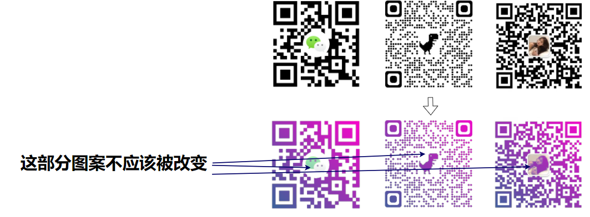

## 强大的混合模式

拥有一张原图，想改变其颜色。在 CSS 中，我们很快可以想到 **滤镜 filter**、或者是 **混合模式 mix-blend-mode**。

这里，我们就需要用到 **混合模式 mix-blend-mode**。混合模式最常见于 photoshop 中，是 PS 中十分强大的功能之一。目前 CSS 已经原生支持了大部分的混合模式。

原理其实非常简单，我们实现一张渐变图形，这张图形通过混合模式中的 `mix-blend-mode: lighten` 与白底黑字的二维码重叠在一起后，**二维码中的白色区域将保持不变，而二维码中的黑色区域将展现为渐变图案中的颜色**。

听起来有点绕，通过一个示意图，一看就懂，我们只需要两层，原二维码为一层，然后将渐变图案叠加在其之上，并且设置 `mix-blend-mode: lighten` 即可：

```html
<div class="g-container">
  
</div>
```

```scss
.g-container {
  position: relative;
  width: 200px;
  height: 200px;

  &::before {
    content: '';
    position: absolute;
    top: 0;
    left: 0;
    bottom: 0;
    right: 0;
    background: linear-gradient(45deg, #673ab7, #ff5722);
    mix-blend-mode: lighten;
  }
}
```

这里，我们用父元素的伪元素节省一个标签，用作渐变图层，实际的重叠效果，我制作了一个动画：

[](https://user-images.githubusercontent.com/8554143/155879637-89db04b8-1e8a-4e00-9f6c-ec6b51688303.gif)

这样，我们可以通过混合模式，将一张黑色的二维码图片，变成了渐变色。

## 二维码中间镂空

当然，这还没完，有的时候，我们的二维码中间还会有一些图案，有一张圆形的或者方形的图片。

如果使用上述方法，会有一些瑕疵：

[](https://user-images.githubusercontent.com/8554143/155880938-e9967a1a-ee1d-42ee-b587-3fe9f7b42afc.png)

那么，我们还需要根据二维码的样式，将渐变图案中间镂空！

有意思的是，二维码中间的图案，还会有**圆形**和**矩形**两种，对于这两种二维码，处理的方式还不太一样。

[](https://user-images.githubusercontent.com/8554143/155881175-afcd7442-316f-47d1-b0c4-959659b218ac.png)

### 渐变图案中心镂空一个圆形

对于中心图案是圆形的二维码，我们只需要实现这样一个渐变再叠加即可：

[](https://user-images.githubusercontent.com/8554143/155881037-96245a95-9ae1-416a-b5d8-b575f66b31c1.png)

这个还是比较简单的，由于原本是一个线性渐变，中间需要镂空一个圆形，最好的方式是使用 `mask`：

```css
div {
  background: linear-gradient(45deg, rgb(51, 102, 153), rgb(255, 0, 204));
  mask: radial-gradient(
    rgba(0, 0, 0, 0),
    rgba(0, 0, 0, 0) 16%,
    rgb(0, 0, 0) 16%
  );
}
```

### 渐变图案中心镂空一个矩形

但是，对于中间是一个矩形的话，就不太好办了，我们需要基于渐变图案实现这样一个图形：

[](https://user-images.githubusercontent.com/8554143/155881204-4a28525f-fa9f-4937-b5b1-c5e98b8298f5.png)

方法其实也有很多，譬如我们把中间透明部分想象成一个 div 的 content 部分，而周围渐变颜色区域是边框区域。

当然，这里我使用了 `clip-path`，使用它，也是可以非常方便的实现镂空的矩形：

```css
div {
  background: linear-gradient(45deg, rgb(51, 102, 153), rgb(255, 0, 204));
  clip-path: polygon(
    0% 0%,
    0% 100%,
    34% 100%,
    34% 34%,
    66% 34%,
    66% 66%,
    34% 66%,
    34% 100%,
    100% 100%,
    100% 0%
  );
}
```

## 制作一个二维码染色工具

基于上面的知识，我们就可以简单的构建一个渐变彩色二维码工具了。

这里我简单实现了一个：

[](https://user-images.githubusercontent.com/8554143/155881331-e3e83737-b12e-4fde-8d99-291431ac8b86.png)

我们通过上传一个普通二维码，通过自定义渐变颜色，选择是否需要镂空，镂空的类型及大小，快速制作一个渐变彩色二维码。

简单演示一下：

<iframe height="300" style="width: 100%;" scrolling="no" title="Make A Gradient QrCode" src="https://codepen.io/mafqla/embed/oNOxKEW?default-tab=html%2Cresult&editable=true&theme-id=light" frameborder="no" loading="lazy" allowtransparency="true" allowfullscreen="true">
  See the Pen <a href="https://codepen.io/mafqla/pen/oNOxKEW">
  Make A Gradient QrCode</a> by mafqla (<a href="https://codepen.io/mafqla">@mafqla</a>)
  on <a href="https://codepen.io">CodePen</a>.
</iframe>
