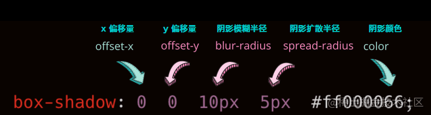

## CSS 阴影基础

CSS 中，明面上可以实现阴影的有三个属性：

- box-shadow - 盒阴影
- text-shadow - 文字阴影
- filter: drop-shaodw() - 滤镜内的阴影

关于它们的基础语法和使用就不过多描述，这一部分大家可以先在 MDN 补齐，贴几张图快速复习一下：

box-shadow - 盒阴影：



text-shadow - 文字阴影：

[img](https://camo.githubusercontent.com/50582d16882b1c2de7dd9f2cbb424e38c28b8a8323a13fa2a970af9a01705b06/68747470733a2f2f70332d6a75656a696e2e62797465696d672e636f6d2f746f732d636e2d692d6b3375316662706663702f61626239366263383363303234353131626637333262353166323662356364397e74706c762d6b3375316662706663702d77617465726d61726b2e696d6167653f)

filter: drop-shaodw() - 滤镜内的阴影：


基本上 3 种阴影大同小异，需要注意的就是：

- `box-shadow` 还区分内阴影，内阴影使用关键字 `inset` 进行描述；
- `box-shadow` 多一个阴影扩散半径参数。

### 长投影

上面提到了通过多层阴影叠加实现文字的立体阴影。运用在 div 这些容器上也是可以的。当然这里还有一种挺有意思的方法。假设我们，有一个矩形元素，希望给他添加一个长投影，像下面这样：


要生成这种长投影，刚刚说的叠加多层阴影可以，再就是借助元素的两个伪元素，其实上面的图是这样的：


关键点在于，我们通过对两个伪元素的 `transform: skew()` 变换以及从实色到透明色的背景色变化，实现了长投影的效果：

<iframe height="300" style="width: 100%;" scrolling="no" title="线性渐变模拟长阴影" src="https://codepen.io/mafqla/embed/XWQjmgY?default-tab=html%2Cresult&editable=true&theme-id=light" frameborder="no" loading="lazy" allowtransparency="true" allowfullscreen="true">
  See the Pen <a href="https://codepen.io/mafqla/pen/XWQjmgY">
  线性渐变模拟长阴影</a> by mafqla (<a href="https://codepen.io/mafqla">@mafqla</a>)
  on <a href="https://codepen.io">CodePen</a>.
</iframe>

### 立体投影

好，我们继续。下一个主题是**立体投影**。

这个说法很奇怪，阴影的出现，本就是为了让原本的元素看起来更加的立体，那这里所谓的立体投影，是个怎么立体法？

这里所谓的立体投影，并不一定是使用了 `box-shadow`、`text-shadow` 或者 `drop-shadow`，而是我们使用其他元素或者属性模拟元素的阴影。而这样做的目的，是为了能够突破 `box-shadow` 这类元素的一些定位局限。**让阴影的位置、大小、模糊度可以更加的灵活**。

OK，让我们来看看，这样一个元素，我们希望通过自定义阴影的位置，让它更加立体：


上图 div 只是带了一个非常浅的 `box-shadow` ，看上去和立体没什么关系，接下来，我们通过 div 的伪元素，给它生成一个和原图边角形状类似的图形，再通过 transform 位移一下，可能是这样：


OK，最后对这个用伪元素生成的元素进行一些虚化效果（filter 或者 box-shadow 都可以），就可以实现一个边角看起来像被撕开的立体效果：


代码非常简单，伪 CSS 代码示意如下：

```css
div {
  position: relative;
  width: 600px;
  height: 100px;
  background: hsl(48, 100%, 50%);
  border-radius: 20px;
}

div::before {
  content: '';
  position: absolute;
  top: 50%;
  left: 5%;
  right: 5%;
  bottom: 0;
  border-radius: 10px;
  background: hsl(48, 100%, 20%);
  transform: translate(0, -15%) rotate(-4deg);
  transform-origin: center center;
  box-shadow: 0 0 20px 15px hsl(48, 100%, 20%);
}
```

所以总结一下：

- 立体投影的关键点在于利于伪元素生成一个大小与父元素相近的元素，然后对其进行 rotate 以及定位到合适位置，再赋于阴影操作
- 颜色的运用也很重要，阴影的颜色通常比本身颜色要更深，这里使用 hsl 表示颜色更容易操作，l 控制颜色的明暗度

还有其他很多场景，都可以用类似的技巧实现：

<iframe height="300" style="width: 100%;" scrolling="no" title="立体投影" src="https://codepen.io/mafqla/embed/qBwaOjg?default-tab=html%2Cresult&editable=true&theme-id=light" frameborder="no" loading="lazy" allowtransparency="true" allowfullscreen="true">
  See the Pen <a href="https://codepen.io/mafqla/pen/qBwaOjg">
  立体投影</a> by mafqla (<a href="https://codepen.io/mafqla">@mafqla</a>)
  on <a href="https://codepen.io">CodePen</a>.
</iframe>

### 浮雕阴影

还有一类立体效果的阴影就是浮雕阴影，它的本质还是 `box-shadow` 和 `text-shadow`，只是需要控制好颜色的配合以及内外阴影的一起使用。核心就是 2 点：

1. 背景色与内容（文本或者盒子颜色）一致
2. **使用两个相反的方向，使用两组对比明显的颜色值，来实现凹凸效果**。

首先，我们来看一个文字版的浮雕效果。

先实现一个凸起的效果，我们需要实现一个背景色和文字色一样的文字：

```html
<div>浮雕阴影</div>
```

```css
body {
  background: #999;
}
p {
  color: #999;
}
```

效果如下，由于背景色和文字色的颜色一样，所以我们什么都看不到。


不过没事，我们给文字添加一个 `1px` x、y 方向的黑色阴影：

```css
p {
  color: #999;
  text-shadow: 1px 1px 1px #000;
}
```

效果如下：


有点感觉了，再反向，也就是 `-1px` x、y 方向添加一个黑色相对，也就白色的阴影：

```css
p {
  color: #999;
  text-shadow: 1px 1px 1px #000, -1px -1px 1px #fff;
}
```

效果如下，这样我们就得到了一个凸起质感的浮雕阴影：


如果我们把颜色对调一下呢？

```css
p {
  color: #999;
  text-shadow: 1px 1px 1px #fff, -1px -1px 1px #000;
}
```

就能很轻松的得到凹下质感的浮雕阴影：

<iframe height="300" style="width: 100%;" scrolling="no" title="Embossed Shadow" src="https://codepen.io/mafqla/embed/GRLjpvJ?default-tab=html%2Cresult&editable=true&theme-id=light" frameborder="no" loading="lazy" allowtransparency="true" allowfullscreen="true">
  See the Pen <a href="https://codepen.io/mafqla/pen/GRLjpvJ">
  Embossed Shadow</a> by mafqla (<a href="https://codepen.io/mafqla">@mafqla</a>)
  on <a href="https://codepen.io">CodePen</a>.
</iframe>

### 新拟态风格阴影

我们将运用在文字上的技巧，扩展延伸到容器上，就能得到最近比较火的拟态风格阴影，其原理也是大同小异。

两个阴影，使用两个相反的方向，使用两组对比明显的颜色值，来实现凹凸效果。**与文字不同的是，这里的凹效果，我们需要使用盒子的内阴影实现**。

```html
<div>浮雕阴影</div>
<div>浮雕阴影</div>
```

```css
div {
  width: 120px;
  height: 120px;
  background: #e9ecef;
  color: #333;
  box-shadow: 7px 7px 12px rgba(0, 0, 0, 0.4), -7px -7px 12px rgba(255, 255, 255, 0.9);
}

div:nth-child(2) {
  box-shadow: inset -7px -7px 12px rgba(255, 255, 255, 0.9), inset 7px 7px 12px
      rgba(0, 0, 0, 0.4);
}
```

这样，就可以得到拟态风格的按钮，如下图所示，左凸右凹：


再通过一个简单的过渡，就可以实现整个点击的交互：

```scss
div {
  transition: 0.2s all;
  box-shadow: 7px 7px 12px rgba(0, 0, 0, 0.4), -7px -7px 12px rgba(255, 255, 255, 0.9),
    inset 0 0 0x rgba(255, 255, 255, 0.9), inset 0 0 0 rgba(0, 0, 0, 0.4);

  &:active {
    box-shadow: 0 0 0 rgba(0, 0, 0, 0.4), 0 0 0 rgba(255, 255, 255, 0.9),
      inset -7px -7px 12px rgba(255, 255, 255, 0.9), inset 7px 7px 12px rgba(0, 0, 0, 0.4);
  }
}
```

看看效果：


### 文字立体投影 / 文字长阴影

上面的立体效果在文字上就完全不适用了，所以对待文字的立体阴影效果，还需要另辟蹊径。

正常而言，我们使用 text-shadow 来生成文字阴影，像这样：

```html
<div>Txt Shadow</div>
----- div { text-shadow: 6px 6px 3px hsla(14, 100%, 30%, 1); }
```


嗯，挺好的，就是不够立体。那么要做到立体文字阴影，最常见的方法就是使用多层文字阴影叠加。

> Tips：和 `box-shadow` 一样，`text-shadow` 是可以叠加多层的！但是对于单个元素而言， `drop-shadow` 的话就只能是一层。

好，上面的文字，我们试着叠加个 50 层文字阴影试一下。额，50 层手写，其实很快的~

好吧，手写真的太慢了，还容易出错，所以这里我们需要借助一下 SASS/LESS 帮忙，写一个生成 50 层阴影的 `function` 就好，我们每向右和向下偏移 1px，生成一层 text-shadow：

```scss
@function makeLongShadow($color) {
  $val: 0px 0px $color;

  @for $i from 1 through 50 {
    $val: #{$val}, #{$i}px #{$i}px #{$color};
  }

  @return $val;
}

div {
  text-shadow: makeLongShadow(hsl(14, 100%, 30%));
}
```

上面的 SCSS 代码。经过编译后，就会生成如下 CSS：

```css
div {
  text-shadow: 0px 0px #992400, 1px 1px #992400, 2px 2px #992400, 3px 3px
      #992400, 4px 4px #992400, 5px 5px #992400, 6px 6px #992400, 7px 7px
      #992400, 8px 8px #992400, 9px 9px #992400, 10px 10px #992400, 11px 11px
      #992400, 12px 12px #992400, 13px 13px #992400, 14px 14px #992400, 15px
      15px #992400, 16px 16px #992400, 17px 17px #992400, 18px 18px #992400, 19px
      19px #992400, 20px 20px #992400, 21px 21px #992400, 22px 22px #992400, 23px
      23px #992400, 24px 24px #992400, 25px 25px #992400, 26px 26px #992400, 27px
      27px #992400, 28px 28px #992400, 29px 29px #992400, 30px 30px #992400, 31px
      31px #992400, 32px 32px #992400, 33px 33px #992400, 34px 34px #992400, 35px
      35px #992400, 36px 36px #992400, 37px 37px #992400, 38px 38px #992400, 39px
      39px #992400, 40px 40px #992400, 41px 41px #992400, 42px 42px #992400, 43px
      43px #992400, 44px 44px #992400, 45px 45px #992400, 46px 46px #992400, 47px
      47px #992400, 48px 48px #992400, 49px 49px #992400, 50px 50px #992400;
}
```

看看效果：


额，很不错，很立体。但是，就是丑，而且说不上来的奇怪。

问题出在哪里呢，阴影其实是存在明暗度和透明度的变化的，所以，对于渐进的每一层文字阴影，明暗度和透明度应该都是不断变化的。这个需求，SASS 可以很好的实现，下面是两个 SASS 颜色函数：

- `fade-out` 改变颜色的透明度，让颜色更加透明
- `desaturate` 改变颜色的饱和度值，让颜色更少的饱和

> 关于 SASS 颜色函数，可以看看这里：[Sass 基础—颜色函数](https://www.w3cplus.com/preprocessor/sass-color-function.html)

我们使用上面两个 SASS 颜色函数修改一下我们的 CSS 代码，主要是修改上面的 `makeLongShadow` function 函数：

```scss
@function makelongrightshadow($color) {
  $val: 0px 0px $color;

  @for $i from 1 through 50 {
    $color: fade-out(desaturate($color, 1%), 0.02);
    $val: #{$val}, #{$i}px #{$i}px #{$color};
  }

  @return $val;
}
```

好，看看最终效果：

<iframe height="300" style="width: 100%;" scrolling="no" title="立体文字阴影" src="https://codepen.io/mafqla/embed/ZEZpbJr?default-tab=html%2Cresult&editable=true&theme-id=light" frameborder="no" loading="lazy" allowtransparency="true" allowfullscreen="true">
  See the Pen <a href="https://codepen.io/mafqla/pen/ZEZpbJr">
  立体文字阴影</a> by mafqla (<a href="https://codepen.io/mafqla">@mafqla</a>)
  on <a href="https://codepen.io">CodePen</a>.
</iframe>

当然，使用 CSS 生成立体文字阴影的方法还有很多，下面再贴出一例，使用了**透明色叠加底色的多重线性渐变**实现的文字立体阴影，感兴趣的同学可以去看看具体实现：

<iframe height="300" style="width: 100%;" scrolling="no" title="线性渐变配合阴影实现条纹立体阴影条纹字" src="https://codepen.io/mafqla/embed/zYXKvdL?default-tab=html%2Cresult&editable=true&theme-id=light" frameborder="no" loading="lazy" allowtransparency="true" allowfullscreen="true">
  See the Pen <a href="https://codepen.io/mafqla/pen/zYXKvdL">
  线性渐变配合阴影实现条纹立体阴影条纹字</a> by mafqla (<a href="https://codepen.io/mafqla">@mafqla</a>)
  on <a href="https://codepen.io">CodePen</a>.
</iframe>
